# 1. 报文格式总结

## 1.1. MAC帧格式
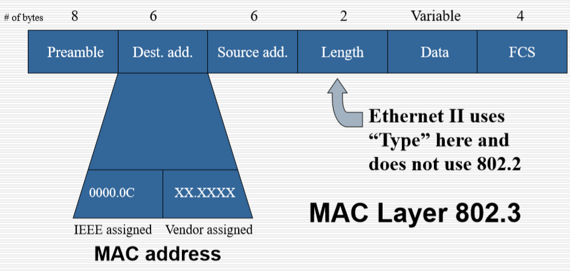

>字节为单位
1. 前同步码:0x10101010|0x10101011
2. 目的地址(48bit)
3. 源地址(48bit)
4. 长度字段(16bit)
5. 数据(不定长)
6. FCS(32bit)

## 1.2. 无线网数据帧
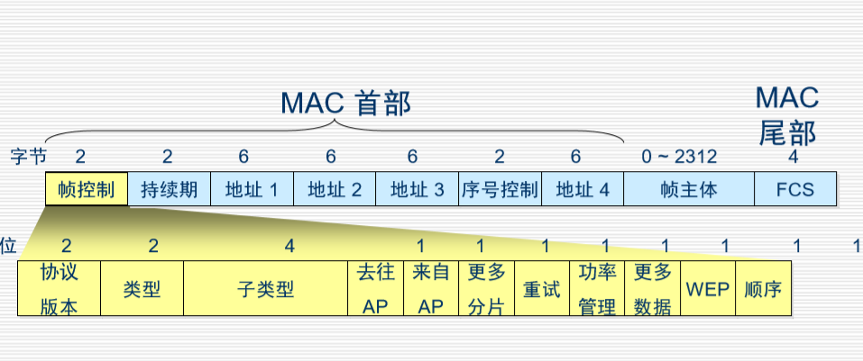
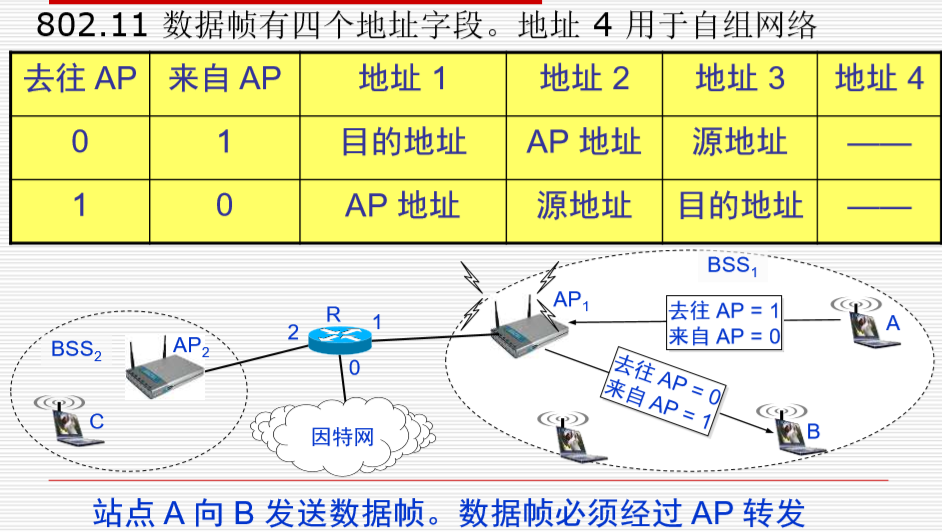

- 有时间窗口，超时重传

## 1.3. Ipv4报文
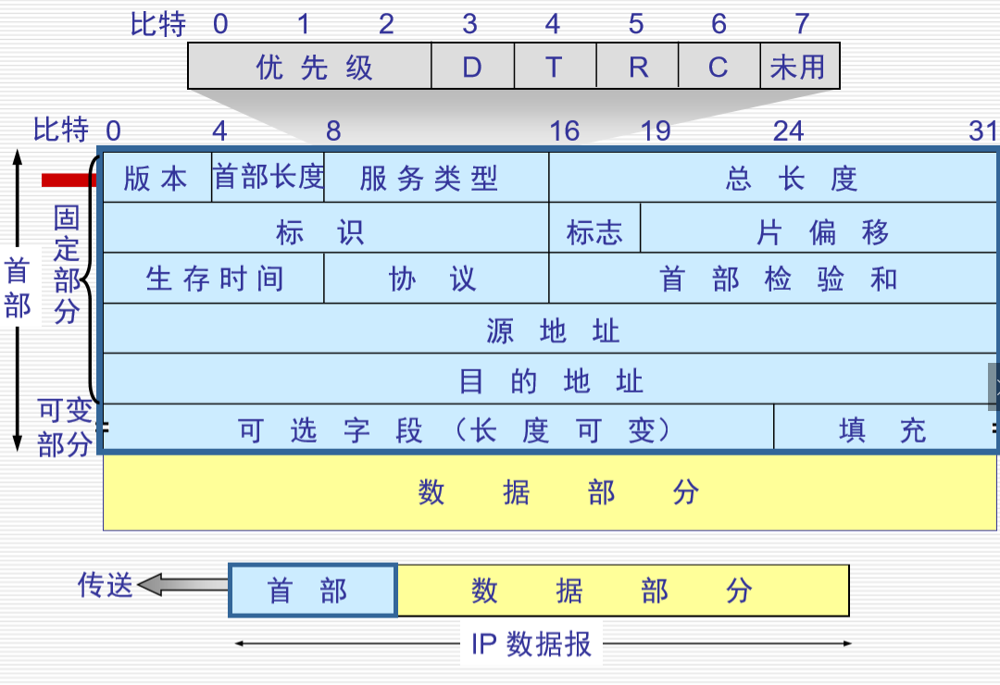

>单位为bit
- 标志
  - DF(Don't fragement):是否允许做分片，0允许做分片,1不允许做分片
  - MF:MF为0表示最后一个分片,1是指后面还有分片
- 偏移：单位：8 bit为一单位

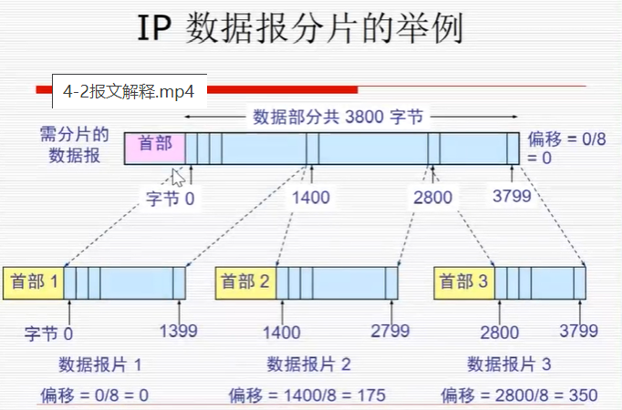

## 1.4. ARP请求
1. ARP Request:

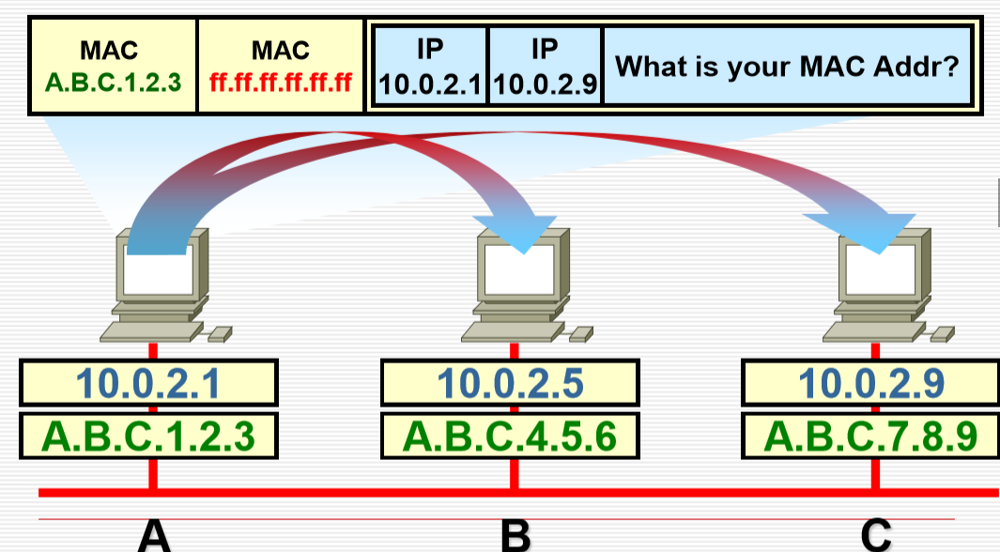

2. ARP Checking:

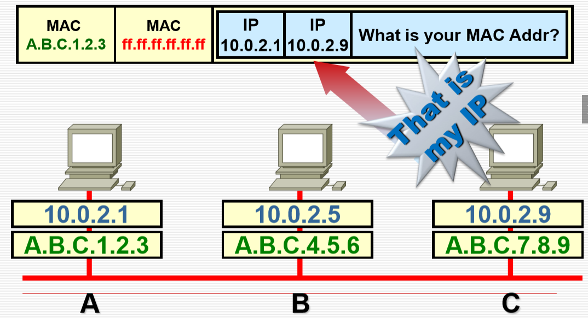

3. ARP Reply:

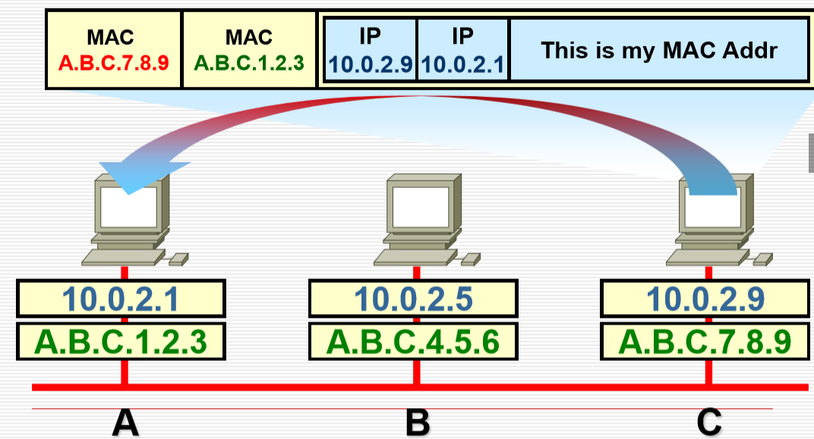

4. ARP Caching:

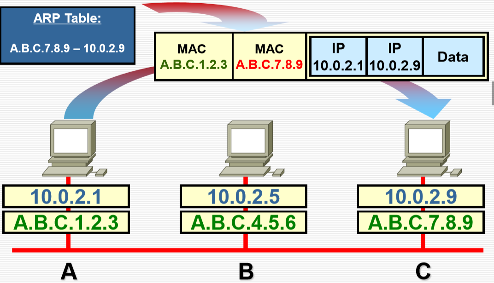

## 1.5. ICMP报文格式
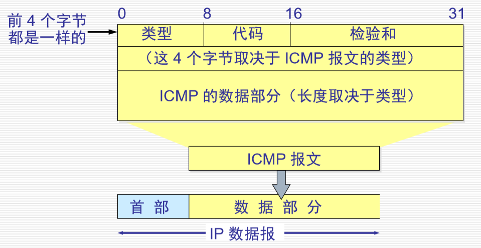

## 1.6. UDP报文格式
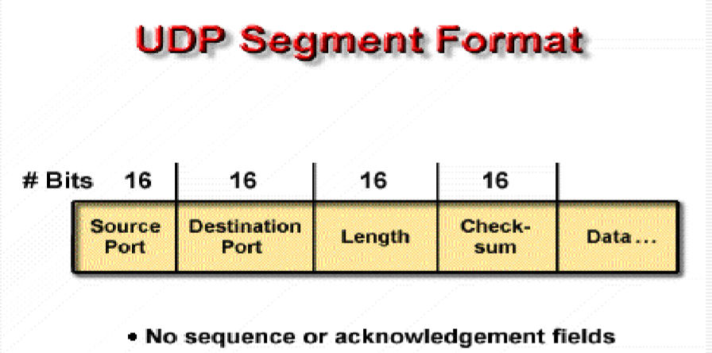

>源端口(16 bit)、目的端口(16 bit)、长度(16 bit)、校验(data)(16 bit)、Data

## 1.7. TCP报文格式
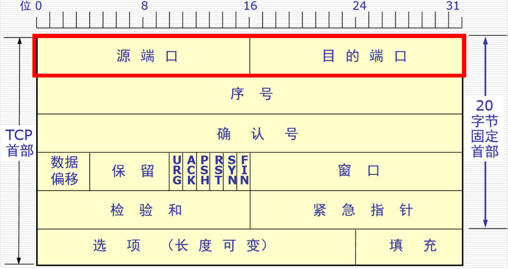

>单位bit

- 固定首部20字节
- 源地址(16 bit)、目的地址(16 bit)
- 确认号：希望下一个数据的序号
- 特殊位
  - URG：1表示紧急，尽快传送
  - ACK：1表示确认号字段有效，反之无效
  - PSH：1表示尽快交付(将缓存部分全部交付)
  - RST：1表示TCP连接中出现严重差错，立即释放连接重建
  - SYN：1同步，表示连接请求
  - FIN：1表示发送端数据发送完毕，释放连接
- 填充字段：保证长度位4字节的倍数

## 1.8. HTTP报文结构
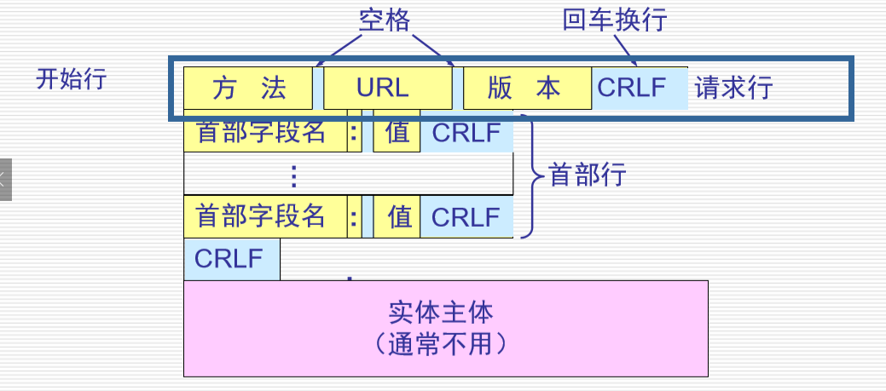

## 1.9. OSPF报文
- Hello报文

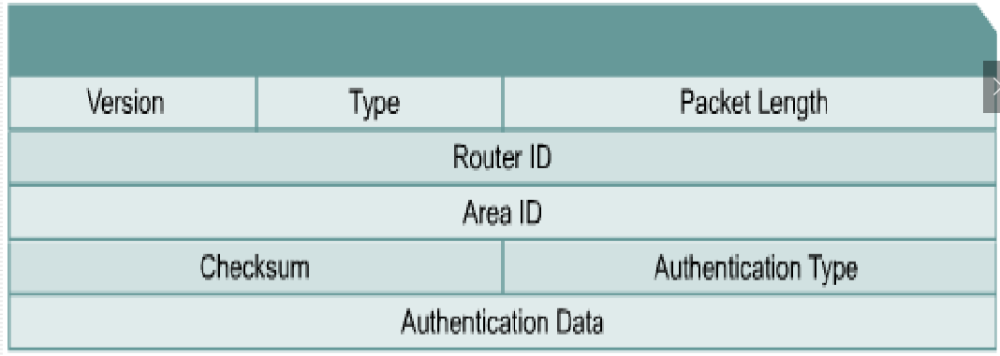
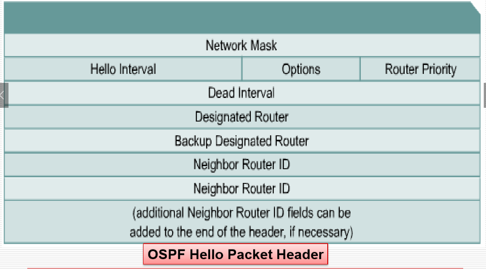

## 1.10. PPP帧格式
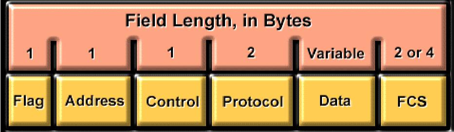

>数字的单位是字节
1. Flag: 01111110 标记：帧的开头或结尾，01111110，一位可能会连续接受到多个帧
2. Address：11111111，广播地址
3. Control：00000011，用户数据作为无序帧传输
4. Protocol: 数据字段中的协议类型
5. Data: 数据报，最大默认值为1500字节
6. FCS: 2或者4字节