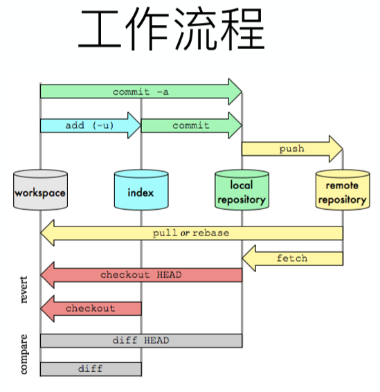
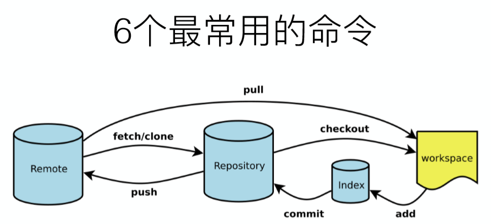

<!-- TOC -->

- [1. git 学习笔记](#1-git-学习笔记)
  - [1.1. git简介](#11-git简介)
  - [1.2. git的使用](#12-git的使用)
  - [1.3. 工作区和暂存区](#13-工作区和暂存区)
  - [1.4. 远程仓库](#14-远程仓库)
  - [1.5. 分支](#15-分支)
  - [1.6. 多人协作](#16-多人协作)
  - [1.7. 标签管理](#17-标签管理)
  - [1.8. github使用](#18-github使用)
  - [1.9. 码云的使用](#19-码云的使用)
  - [1.10. 自定义git](#110-自定义git)
  - [1.11. 搭建git服务器](#111-搭建git服务器)
- [2. 对于Git某些操作的进阶版信息](#2-对于git某些操作的进阶版信息)
  - [2.1. 工作流程理解](#21-工作流程理解)
  - [2.2. 最常用的命令](#22-最常用的命令)
  - [2.3. 分支](#23-分支)
- [3. 查看和删除远程分支](#3-查看和删除远程分支)
- [4. 参考](#4-参考)

<!-- /TOC -->
# 1. git 学习笔记
by stormbroken

## 1.1. git简介
1. 世界上最先进的分布式版本控制系统
2. 保留的版本更新的信息
3. 使用C语言建立的

## 1.2. git的使用
1. 初始化仓库
   1. `git init`：将这个目录底下变成git可以管理的仓库
2. 添加文件进入仓库：
   1. `git add file_name`：添加摸个文档，使用.表示所有修改。
   2. `git commit -m "message"`：使用-m完成对于本次提交的说明
   3. `git push URL`：向远程仓库进行提交
3. 查看结果：
   1. `git status`:用于实施的掌控仓库的状态
   2. `git diff`：用于查看具体修改了什么内容（相比于上次）
4. 版本回退：
   1. `git log`：用于查看历史记录，版本信息等。可以添加`--pretty=oneline`参数来格式化其形式为版本号+注释。
   2. `git reset --hard HEAD^`：  
      1. 用于返回上一个版本
      2. 同时你无法使用`git log`找到原来的版本，但是可以在同一个窗口中，找到版本号回到未来的某个版本
         1. 版本号可以不写全，只要写前几位保证其唯一性就好
         2. 版本回滚依靠HEAD指针
         3. 如果关闭了窗口如何找到版本号->`git reflog`用于记录你的每一个命令
5. 撤销修改：
   + `git checkout file_name`:用于丢弃工作区和暂存区的修改
      + 自修改后还没放到暂存区，撤销回到和版本库一模一样的状态
      + 修改后已经放置到了暂存区，撤销回到添加到暂存区后的状态
      + 总之，回到最近一次`git commit`或`git add`的状态
   + `git reset HEAD <file>`可用于丢弃暂存区的修改
      + 将暂存区的修改回退到工作区
6. 删除文件
   + 删除文件方法
      1. `git rm file_name`:从版本库中删除这个文件
      2. `git commit -m "message"`:提交这次修改
   + 误删文件如何恢复
      + 使用`git checkout file_name`来恢复删除，空格不能少
7. 将git的提交直线化：`rebase`
   + 将你的分叉的提交变成一条直线，通过移动你的提交的位置
   + 主要是为了方便查看

## 1.3. 工作区和暂存区
1. 工作区
   + 你在电脑里能够看到的目录就是一个工作区。
2. 版本库  
   + 隐藏的目录`.git`这个是版本库，其中最重要的就是版本库(stage/index)，还有自动创建的第一个分支master，以及指向master的一个指针HEAD.
   + `git add`将所有的要提交的修改放到暂存区
   + `git commit`一次性把暂存区的所有修改都提交都分支去
   + 这个的先后顺序会影响到第几次的修改被提交。

## 1.4. 远程仓库
1. 设置SSH
   + 防止对方冒充github服务器<a href = "https://help.github.com/en/articles/githubs-ssh-key-fingerprints">详见</a>
2. 添加远程仓库  

命令名称|作用
--|--
`git remote name URL`|添加远程仓库  
`git push -u 仓库名 分支名`|将**分支**推向仓库（第一次需要全部，用于关联，之后可以直接`git push`
`git remote rm 仓库名`|删除远程仓库
`git clone URL`|克隆一个本地仓库

## 1.5. 分支
1. 为什么有分支存在？
      1. 开发新功能的过程中，放置你的未完成的工作给别人的开发造成困难。
      2. 建立自己的分支，可以随时提交自己完成的代码部分，而又不干扰别人的工作。
      3. 完成工作后可以将分支直接合并到主分支上，并且git的分支切换很快、很便捷。
2. 新建分支只要新建一个指针，之后对于这个指针进行操作就行了，最后合并的时候只要把HEAD的指针指向就好了。
3. 分支的相关命令：  
   1. 新建和切换的简单命令：  
   `git checkout -b branch_name`
   2. 新建分支的命令：
   `git branch branch_name`
   3. 切换分支的命令：
   `git checkout branch_name`
   4. 查看分支：如果有-a可以查看所有分支
   `git branch [-a]`
   5. 合并分支：
   `git merge branch_name`
   6. 删除分支：
   `git branch -d branch_name`
4. 解决冲突问题：
   1. 简单的说就是，如果你的分支和你的主分支同时修改了同一个文件，那么会产生冲突
   2. 冲突问题的解决需要我们进行手动解决
   3. `git status`可以用于查看具体冲突的文件是什么和情况
   4. 之后通过手动修改后，将新建的文件重新add、commit后就可以解决。
   5. 可以`git log --graph --pretty=oneline --abbrev-commit`查看分支的合并情况，之后删除分支就可以。
5. 分支管理策略
   1. 合并分支的时候Git如果能的话git会使用Fast forward模式，但是这种模式下删除分支会丢掉分支信息。
   2. 同时使用`git merge --no--ff -m "message" branch_name`中的no--ff来禁用上面那个模式
   3. 基本的分支管理策略：
      + 保证master分支的稳定性，不在上面干活
      + 在其他的分支上干活，在发布版本的时候合并分支即可
6. bug分支
   1. bug分支的命名："issue-number"
   2. 在修复bug的时候如果你正在进行的工作还没法提交的时候
   3. 使用`git stash`将当前的工作现场保存起来
   4. 之后在相应的分支上建立其子分支，之后秀谷并且提交，之后转换到master分支，将相应的bug分支删除
   5. 恢复工作现场：  

   特定的语句|作用
   --|--
   `git stash apply`|用来恢复之前保存的工作不删除
   `git stash drop`|用来在apply之后删除stash的内容
   `git stash list`|查看刚刚保存的工作在哪里
   `git stash pop`|恢复同时删除stash的内容
7. feature 分支
   1. 在软件开发中，向新的软件添加新的功能，需要增开一个feature分支，之后将其合并后，删除原分支。
   2. 如果最后由于种种原因，这个分支必须要删除，同时还没有被合并的分支，使用-D进行删除。

## 1.6. 多人协作
1. 查看远程仓库信息：
   + `git remote`查看远程仓库的名称
   + `git remote -v`查看更加详细的远程仓库的信息。
2. 推送分支：
   + `git push repository_name branch_name`将分支推送到远端仓库
   + 是否推送一个分支
      1. master分支要保证时刻与远程同步
      2. dev开发分支要和远程同步
      3. bug分支在本地修复就好了，没必要推动到远端
      4. feature分支是否推动，取决于你是否和别人合作进行开发
3. 抓取分支：
   + 在另一台电脑上克隆有其他分支的仓库时，默认条件下只能看到master分支。
   + 如果需要clone到dev分支的话需要创建远程的origin的dev分支到本地：`git checkout -b dev origin/dev`,之后先`git pull`一下
   + 之后你就可以在dev上进行修改
   + 这时候的你和你的伙伴的修改发生了冲突，你不能简单的pull，而是需要将你的本地的dev分支与远程origin/dev分支的链接进行指定，`git branch --set-upstream-to=<branch-name> origin/<branch-name>`，这样之后你就可以处理冲突了

## 1.7. 标签管理
1. 标签是一个版本库的快照，为了确定其历史版本
2. tag+版本号和一个commit绑定在一起，来简化交流
3. 创建标签：
    + `git tag name`来添加一个这个分支这个时刻的标签
    + `git tag`用于查看这个分支现在的标签
    + 如何创建之前版本的标签：
       1. 使用命令`git log --pretty=onrline --abbrev-commit`命令查看之前的提交记录和版本信息
       2. 使用命令`git tag name commit_id`来给相应的版本信息打上标签
    + 将标签推送到远端仓库：
       1. 推送某一个标签:`git push origin <tagname>`
       2. 推动全部的标签:`git push origin --tags`推送全部标签
4. 查看一个标签的详细信息`git show <tag_name>`
   + 添加`-a`来指定标签名
   + 添加`-m`来添加说明文字
5. 标签总是和commit挂钩，而不是和分支挂钩
6. 删除标签：
   + 打错的本地标签(未推送到远程仓库):直接删除标签即可`git tag -d name`
   + 如何将远端的标签删除：
       1. 删除本地标签
       2. 从远程删除标签：`git push origin:refs/tags/<tagname>`

## 1.8. github使用
1. 参加别人的开源项目，需要folk这个项目到自己的账号底下，在从自己的账号git，才能够推送修改
2. 强大的CSS框架：https://github.com/twbs/bootstrap

## 1.9. 码云的使用
1. 国内的托管的git服务
2. <a href ="https://www.liaoxuefeng.com/wiki/0013739516305929606dd18361248578c67b8067c8c017b000/00150154460073692d151e784de4d718c67ce836f72c7c4000">详情</a>

## 1.10. 自定义git
1. 设置user.name和user.email
2. 显示颜色：`git config --global color.ui true`
3. 忽略特殊文件：在git工作区的根目录下创建一个特殊的.gitignore，将需要忽略的文件名填进去就会使得git自动的忽略文件。
      1. GitHub为我们准备的所有<a href ="https://github.com/github/gitignore">配置文件</a>，我们在线浏览就可以。
      2. 忽略文件的原则：
            1. 忽略操作系统自动生成的文件，比如缩略图等
            2. 忽略编译产生的中间文件、可执行文件等
            3. 忽略你自己的带有敏感信息的配置文件，比如存放口令的配置文件
      3. 但是在有忽略文件的同时，无法上传文件的排查
            1. 强制进行提交：`-f`强制添加到git
            2. 规则出现问题，可以使用命令`git check-ignore -v filename`来排查是哪一条规则使得这个文件无法进行提交
4. 配置命令的别名
      1. `git config --global alias.st status`
      2. 将命令status设置为st,这个命令未必只有一条字句，只要是一条命令的一部分就可
      3. 可以把lg配置成"log --color --graph --pretty=format:'%Cred%h%Creset -%C(yellow)%d%Creset %s %Cgreen(%cr) %C(bold blue)<%an>%Creset' --abbrev-commit"
      4. 配置文件：  
         + git 的配置文件都位于`.git/config`文件中，别名在alias后面，删除别名直接删除相应行就行。
         + git配置文件放在主目录下一个隐藏文件`.gitconfig`中
         
## 1.11. 搭建git服务器
<a href = "https://www.liaoxuefeng.com/wiki/0013739516305929606dd18361248578c67b8067c8c017b000/00137583770360579bc4b458f044ce7afed3df579123eca000">详见</a>

# 2. 对于Git某些操作的进阶版信息

## 2.1. 工作流程理解

## 2.2. 最常用的命令

## 2.3. 分支
1. 分支的命名限定在以下范围
   + master：线上代码，最稳定的分支，存放的是随时可供在生产环境中部署的代码(Prod环境)
   + develop(dev):保存最新的当前开发成果的分支，只对负责人开放
   + feature：功能特性分支，每个功能特性都有一个feature/分支，开发后自测通过后，合并进入develop分支，可从master或develop中拉出来
   + hotfix:紧急bug分支修复分支，修复上线后，可以直接合并入master
   + release:内部测试发布的分支(Test 环境)
   + fix:修改master之后的分支的bug
2. Commit Message:`<type>(<scope>): <subject>`
   1. feat:新功能
   2. docs(doc):文档
   3. style:格式(不影响代码运行的变动)
   4. refactor:重构
   5. fix:修补bug
   6. test:增加测试
   7. chore:构建过程或辅助工具的变动
   8. perf:提高性能

# 3. 查看和删除远程分支
1. 查看包含远程分支在内的所有分支:`git branch -a`
2. 删除远程分支中对应的分支:`git push origin --delete branch_name`

# 4. 参考
1. 课程《软件工程与计算二》