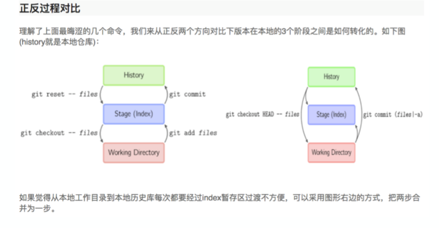

# 1. 添加文件
1. git add [file1]:添加指定文件 成功
2. git add [dir]:添加指定子目录 成功
3. git add .
4. 以上所有的文件都是提交到暂存区

# 2. 代码提交
1. git commit -m [message] 提交全部暂存区 成功
2. git commit [file1] -m [message] 成功
3. git commit [file1] [file2] -m [massage] 成功
4. git commit -a 提交上次commit之后的变化，直接到仓库区
5. git commit -v 提交时显示所有 diff 信息

# 3. 查看状态
1. git status:显示有变更的文件 
2. git log:显示当前分支的版本历史
3. git diff:显示暂存区和工作区的差异

# 4. 撤销
1. git checkout [file] 撤销暂存区的指定文件回到工作区(处理误删除和文件内容)，commit是通过log查看的号。
   1. 可以调整到当前的分支
2. git checkout [commit] [file] 恢复某个commit的指定文件到暂存区和工作区
3. git checkout . 恢复暂存区的所有⽂件到⼯作区 
4. git reset [file] 重置暂存区的指定⽂件，与上⼀次commit保持⼀致，但⼯作区不变(回推添加到暂存区的操作)
5. git reset --hard 重置暂存区与⼯作区，与上⼀次commit保持⼀致
6. git reset [commit] 重置当前分⽀的指针为指定commit，同时重置暂存区，但⼯作区不变 
7. git reset --hard [commit] 重置当前分⽀的HEAD为指定commit，同时重置暂存区和⼯作区，与指定commit⼀致 
8. git reset -- soft 只改变提交点，暂存区和工作目录的记录都不改变
9.  git reset -- mixed 改变提交点，同时改变暂存区的内容，这是默认的回滚方式。
10. git commit --amend 撤销最后一些commit(原地修改，让上一次提交不露痕迹)

# 5. 远程同步
1. git remote -v 显示所有远程仓库
2. git remote show [remote] 显示某个远程仓库的信息
3. git fetch [remote] 下载远程仓库的所有变动
4. git pull [remote] [branch] 取回远程仓库的变化，并与本地分支合并
5. git push [remote] [branch] 上传本地指定分支到远程仓库

# 6. Rebase

# 7. Cherry-pick
1. 复制一个提交点所作的工作，将其完成的应用到当前分支的某个提交点上。

# 8. 正反过程对比
