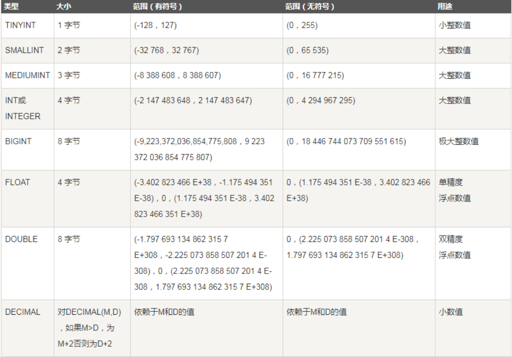
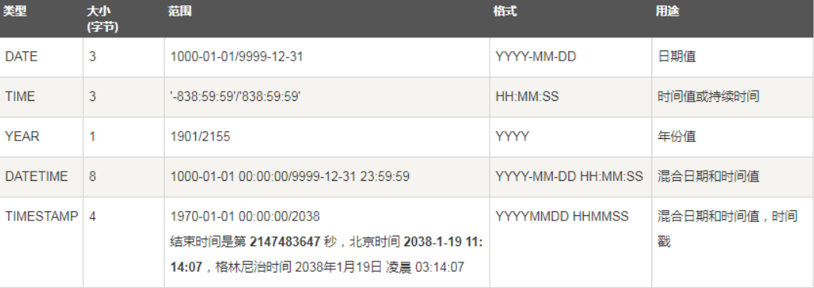
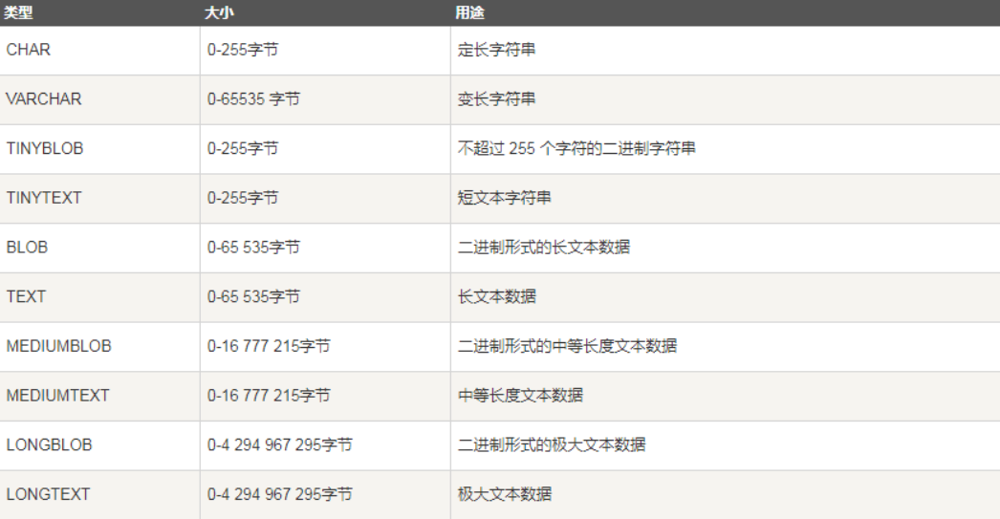

<!-- TOC -->

- [1. SQL 存储过程](#1-sql-存储过程)
  - [1.1. 优缺点](#11-优缺点)
    - [1.1.1. 优点](#111-优点)
    - [1.1.2. 缺点](#112-缺点)
  - [1.2. 存储过程的创建和调用](#12-存储过程的创建和调用)
    - [1.2.1. 创建存储过程](#121-创建存储过程)
    - [1.2.2. 存储过程中的关键语法](#122-存储过程中的关键语法)
    - [1.2.3. 存储过程体](#123-存储过程体)
  - [1.3. 存储过程的参数](#13-存储过程的参数)
  - [1.4. 查询当前的存储过程](#14-查询当前的存储过程)
  - [1.5. 修改存储过程](#15-修改存储过程)
  - [1.6. 删除存储过程](#16-删除存储过程)
  - [1.7. 存储过程的控制语句](#17-存储过程的控制语句)
    - [1.7.1. 变量作用域:](#171-变量作用域)
    - [1.7.2. 条件语句](#172-条件语句)
    - [1.7.3. 循环语句](#173-循环语句)
  - [1.8. 调用过程](#18-调用过程)
- [2. 变量](#2-变量)
  - [2.1. 变量定义](#21-变量定义)
  - [2.2. 数值型变量](#22-数值型变量)
  - [2.3. 日期时间变量](#23-日期时间变量)
  - [2.4. 字符串类型](#24-字符串类型)
  - [2.5. 变量赋值](#25-变量赋值)
  - [2.6. 用户变量](#26-用户变量)
  - [2.7. 注释](#27-注释)
- [3. 触发器](#3-触发器)
  - [3.1. 创建触发器](#31-创建触发器)
  - [3.2. 调用和查看触发器](#32-调用和查看触发器)
- [4. 参考](#4-参考)

<!-- /TOC -->

# 1. SQL 存储过程
1. 硬性要求:MySQL版本至少为5.0.
2. 存储过程是数据库SQL语言层面的代码封装与重用(是数据库中存储复杂过程)
3. 目的:我们为了完成特定功能的SQL语言集，经编译创建并保存在数据库中，用户可通过指定存储过程的名字并给定参数来调用。

## 1.1. 优缺点

### 1.1.1. 优点
1. 存储过程可以封装，隐藏复杂商业逻辑。
2. 存储过程可以传回值，并可以接受参数。
3. 存储过程无法使用select命令来运行
4. 存储过程可以用在数据检验，强制实行商业逻辑。

### 1.1.2. 缺点
1. 存储过程，往往定制化于特定的数据库上，在不同的编程语言的情况删，需要重写存储过程。
2. 存储过程的性能调校与沾些，受限于各种数据库系统。

## 1.2. 存储过程的创建和调用

### 1.2.1. 创建存储过程
```
CREATE
    [DEFINER = { user | CURRENT_USER }]
　PROCEDURE sp_name ([proc_parameter[,...]])
    [characteristic ...] routine_body
 
proc_parameter:
    [ IN | OUT | INOUT ] param_name type
 
characteristic:
    COMMENT 'string'
  | LANGUAGE SQL
  | [NOT] DETERMINISTIC
  | { CONTAINS SQL | NO SQL | READS SQL DATA | MODIFIES SQL DATA }
  | SQL SECURITY { DEFINER | INVOKER }
 
routine_body:
　　Valid SQL routine statement
 
[begin_label:] BEGIN
　　[statement_list]
　　　　……
END [end_label]
```
1. IN:参数的值必须在调用存储过程时指定，在存储过程中修改该参数的值不能被返回，为默认值
2. OUT:该值可在存储过程内部被改变，并可返回
3. INOUT:调用时指定，并且可被改变和返回。

```sql
-- IN 型参数：
DELIMITER &&
    create procedure p_test(IN p_id int)
        begin
            select p_id;
            set p_id = 22;    -- 将 p_id 赋值为 22 
            select p_id;
        end&&
DELIMITER ；

-- OUT 型参数：
DELIMITER &&
    create procedure p_test(OUT p_id int)
        begin
            select p_id;
            set p_id = 22;    -- 将 p_id 赋值为 22 
            select p_id;
        end&&
DELIMITER ；

-- INOUT 型参数：
DELIMITER &&
    create procedure p_test(INTOUT p_id int)
        begin
            select p_id;
            set p_id = 22;    -- 将 p_id 赋值为 22 
            select p_id;
        end&&
DELIMITER ；

-- 调用 p_test()
set @P_id = 100;   -- @p_id 为用户变量，用户可以在后面的代码里引用它
call p_test(@p_id); -- 存储过程的调用
select @p_id;  -- IN型不会影响@p_id 的值，而OUT、INOUT会将@p_id的值改变，具体数值有过程体来定
```

### 1.2.2. 存储过程中的关键语法
1. 声明语句结束符:
    + 这是调整语句的终结符。
```sql
DELIMITER $$
或
DELIMITER //
```
2. 声明存储过程:
```sql
CREATE PROCEDURE demo_in_parameter(IN p_in int)
```
3. 存储过程开始和结束符号:
```sql
BEGIN ... END
```
4. 变量赋值:
```sql
SET @p_in = 1;
```
5. 变量定义:
```sql
DECLARE l_int int unsigned default 4000000;
```
6. 创建mysql过程体:
```sql
CREATE FUNCTION function_name(param);
```

### 1.2.3. 存储过程体
1. 存储过程体中包含了在过程调用时必须执行的语句
2. 过程体格式:以begin开始，以end结束(可嵌套)
3. 可以为语句块贴标签:
    + 增强代码的可读性
    + 在某些语句(leave或者iterate语句)，需要标签。
```sql
[begin_label:] BEGIN
　　[statement_list]
END [end_label]
```

## 1.3. 存储过程的参数
1. 是指在存储过程的定义中的。
```sql
CREATE PROCEDURE 存储过程名([[IN|OUT|INOUT]参数名 数据类形...])
```
2. 不同参数类型:
    1. IN:表示调用者向过程传入值(字面值或变量)
    2. OUT:表示过程向调用者传出值(可以多返回，只能是变量)
    3. INOUT:既表示调用者向过程传入值，又表示过程向调用者传出值。
3. 可能会影响到局部变量和全局变量的问题(in)
    + 详见参考1
4. 调用过程结束后会影响到在过程中的对应变量的修改(out)
5. inout参数就尽量的少用。

## 1.4. 查询当前的存储过程
1. 查询数据库的存储名称:
```sql
select name from mysql.proc where db = 'database_name';
# 或者
select routine_name from information_schema.routines where routine_schema = 'database_name';
# 或者
show procedure status where db = 'database_name';
```
2. 查看存储过程的详细过程:
```sql
SHOW CREATE PROCEDURE 数据库.存储过程名;
```

## 1.5. 修改存储过程
`alter procedure`

## 1.6. 删除存储过程
`drop procedure`

## 1.7. 存储过程的控制语句

### 1.7.1. 变量作用域:
优先内部变量

### 1.7.2. 条件语句
1. if-then-else语句
```sql
if (expression) then
(expression)
else 
(expression)
end if;
```
2. case语句:
```sql
case (var)
when (constant1) then
(expression)
when (constant2) then
(expression)
else
(expression)
end case;
```

### 1.7.3. 循环语句
1. while ... end while
```sql
while 条件 do
-- 循环体
end while
```
2. repeat ... end repea
```sql
repeat 
  --循环体
until 循环条件
end repeat;
```
3. loop ... endloop
```sql
LABLE:loop
(expression)
leave LABLE
end loop;
```
4. ITERATE迭代:通过引用符合语句的标号，来从新开始符合语句
```sql
DELIMITER //;
CREATE PROCEDURE proc10 ()  
begin 
declare v int;  
set v=0;  
LOOP_LABLE:loop  
if v=3 then   
set v=v+1;  
ITERATE LOOP_LABLE;  
end if;  
insert into t values(v);  
set v=v+1;  
if v>=5 then 
leave LOOP_LABLE;  
end if;  
end loop;  
end;  
//;
DELIMITER ;
```

## 1.8. 调用过程
1. 调用:`call procedure_name();`

# 2. 变量

## 2.1. 变量定义
1. 局部变量声明一定要放在存储过程的开始
```sql
DECLARE variable_name [,variable_name...] datatype [DEFAULT value];
```
2. datatype是MySQL的数据类型，如:int、float、date、varchar(length)

## 2.2. 数值型变量 


## 2.3. 日期时间变量


## 2.4. 字符串类型


## 2.5. 变量赋值
```sql
SET var_name = expression [,variable_name = expression ...]
```

## 2.6. 用户变量
1. 感觉上类似全局变量
2. 定义:`SET @var_name`
3. 滥用用户变量会导致程序难以管理

## 2.7. 注释
1. `--`:一般用于单行注释
2. c风格:用于多行注释

# 3. 触发器
1. 触发器是当我们执行一个sql语句的时候，会触发执行另一个我们定义好的sql语句。

## 3.1. 创建触发器
```sql
CREATE TRIGGER testref BEFORE INSERT ON test1
　  FOR EACH ROW BEGIN
　　INSERT INTO test2 SET a2 = NEW.a1;
　　DELETE FROM test3 WHERE a3 = NEW.a1;  
　　UPDATE test4 SET b4 = b4 + 1 WHERE a4 = NEW.a1;
END
```
1. 说明：上述语句的意思是，当我们向test1中插入数据时，会触发执行下面定义好的3条sql语句。 
2. testref是触发器名，begin和end之间可以有多个sql语句 
b3. efore Insert on test1 是指每次向test1插入数据之前，触发 
4. for each row 对test1的每一行都有效

## 3.2. 调用和查看触发器
1. 调用:自动触发，不用手动调用
2. 查看:`show triggers`

# 4. 参考
1. <a href = "https://www.runoob.com/w3cnote/mysql-stored-procedure.html">MySQL 存储过程</a>
2. <a href = "https://www.cnblogs.com/bobi-PHP-blog/p/7501301.html">Mysql过程</a>
3. <a href = "https://www.cnblogs.com/zjoe-life/p/10650378.html">MySQL存储过程（PROCEDURE）（一）</a>