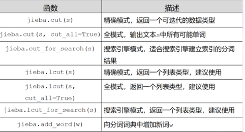

jieba
---

<!-- TOC -->

- [1. 什么是jieba](#1-什么是jieba)
- [2. 安装jieba](#2-安装jieba)
- [3. jieba库常用函数](#3-jieba库常用函数)
  - [3.1. 精准模式](#31-精准模式)
  - [3.2. 全模式](#32-全模式)
  - [3.3. 搜索引擎模式](#33-搜索引擎模式)
  - [3.4. 向分词词典增加新词](#34-向分词词典增加新词)
- [其他具体示例](#其他具体示例)

<!-- /TOC -->

# 1. 什么是jieba
1. jieba是优秀的中文分词的第三方库
2. 中文分词需要通过分词获得单个的词语。

# 2. 安装jieba
1. `pip install jieba`

# 3. jieba库常用函数
1. 分词的三种模式
    1. 精准模式:把文本精准地分开，不存在冗余。
    2. 全模式:把文中所有可能的词语都扫描出来，存在冗余
    3. 搜索引擎模式:在精准模式的基础上，再次对长词进行切分。



## 3.1. 精准模式
```py
>>> import jieba
>>> jieba.lcut("中国是一个伟大的国家")
['中国', '是', '一个', '伟大', '的', '国家']
```

## 3.2. 全模式
```py
>>> jieba.lcut("中国是一个伟大的国家",cut_all=True)
['中国', '国是', '一个', '伟大', '的', '国家']
```

## 3.3. 搜索引擎模式
```py
>>> jieba.lcut_for_search("中华人民共和国是伟大的")
['中华', '华人', '人民', '共和', '共和国', '中华人民共和国', '是', '伟大', '的']
```

## 3.4. 向分词词典增加新词
```py
>>> jieba.add_word("蟒蛇语言")
>>> jieba.lcut("python是蟒蛇语言")
['python', '是', '蟒蛇语言']
```

# 其他具体示例
```py
import jieba
if __name__ == '__main__':
    seg_list = jieba.cut("我来到北京清华大学", cut_all=True) #全模式
    print("Full Mode:" + "/".join(seg_list))
    seg_list = jieba.cut("我来到北京清华大学", cut_all=False) #精确模式
    print("Default Mode:" + "/".join(seg_list))
    seg_list = jieba.cut("他来到了网易杭研大厦", HMM=False) #不使用HMM模型
    print("/".join(seg_list))
    seg_list = jieba.cut("他来到了网易杭研大厦", HMM=True) #使用HMM模型
    print("/".join(seg_list))
    seg_list = jieba.cut_for_search("小明硕士毕业于中国科学院计算所，后在日本京都大学深造", HMM=False) #搜索引擎模式
    print("/".join(seg_list))
    seg_list = jieba.lcut_for_search("小明硕士毕业于中国科学院计算所，后在日本京都大学深造", HMM=True)
    print(seg_list)
```