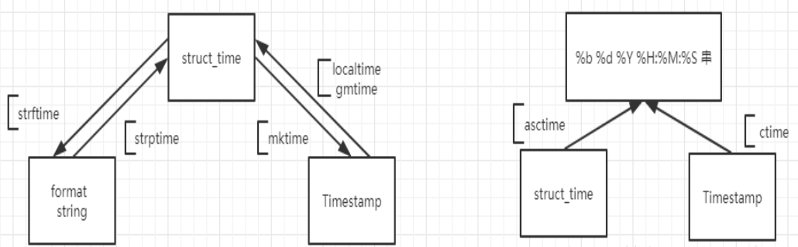

<!-- TOC -->

- [1. time](#1-time)
  - [1.1. 三种时间格式转化](#11-三种时间格式转化)
- [2. 函数](#2-函数)
  - [2.1. time()函数](#21-time函数)
  - [2.2. localtime([secs])函数](#22-localtimesecs函数)
  - [2.3. gmtime([secs])函数](#23-gmtimesecs函数)
  - [2.4. mktime(t)函数](#24-mktimet函数)
  - [2.5. asctime([t])函数](#25-asctimet函数)
  - [2.6. ctime([secs])函数](#26-ctimesecs函数)
  - [2.7. sleep(secs) 函数](#27-sleepsecs-函数)
  - [2.8. clock()函数](#28-clock函数)
  - [2.9. strftime(format[, t])  函数](#29-strftimeformat-t-函数)
  - [2.10. strPtime(string,[,format])函数](#210-strptimestringformat函数)
- [3. 参考](#3-参考)

<!-- /TOC -->

# 1. time

## 1.1. 三种时间格式转化


# 2. 函数

## 2.1. time()函数
1. time()函数用于返回当前时间的时间戳(从1970年1月1日00时00分00秒到现在的浮点秒数)
2. time()函数的语法:`time.time()`

## 2.2. localtime([secs])函数
1. time.localtime( )函数的作用是格式化时间戳为本地时间(struct_time类型）。如果secs参数未传入，就以当前时间为转换标准
2. localtime()方法的语法为:`time.localtime([secs])`
    + 参数secs -- 指转换为  time.struct_time 类型的对象的秒数

## 2.3. gmtime([secs])函数
1. gmtime( )  函数用于将一个时间戳转换为UTC时区(0时区)的 struct_time。可选参数 secs 表示从1970-1-1 到现在的秒数，无参数时默认为本地时间
2. 函数返回 time.struct_time 类型的对象 (struct_time 是在 time 模块中定义的表示时间的对象)
3. 语法为:`gmtime([secs])`
    + secs:指转换为time.struct_time类型的对象的秒数。

## 2.4. mktime(t)函数
1. mktime()函数用于执行与 gmtime()、localtime() 相反的操作，接收 struct_time 对象作为参数，返回用秒数表示时间的浮点数。如果输入的值不是合法时间，就会触发OverflowError或ValueError
2. 语法:`time.mktime(t)`
3. t应当是结构化时间，或者全满九个元素的元组
```py
>>> import time
>>> t = ( 2018,9,8,16,34,30,5,251,0)
>>> time.mktime(t)
1536395670.0
>>> time.mktime(time.localtime())
1536395774.0
```

## 2.5. asctime([t])函数
1. 该函数用于接收一个时间元组并返回一个可读的形式为"Tue Dec 11 18:07:14 2008"（2008年12月11日 周二18时07分14秒）的24个字符的字符串。
2. 语法:`time.asctime([t]))`
    + 参数  t -- 完整的9位元组元素或 struct_time 表示，由 gmtime() 和 localtime() 函数返回的时间的元组。
    + 返回值：此方法返回以下形式的24个字符的字符串： 'Tue Feb 17 23:21:05 2009'.

## 2.6. ctime([secs])函数
1. 用于把一个时间戳转换为time.asctime()的形式。如果未给参数secs或参数为None，就会默认将  time.time()作为参数
2. 语法:`time.ctime([ sec ])`
    + 参数sec -- 这是将被转换成字符串表示的秒数。

## 2.7. sleep(secs) 函数
1. sleep()函数用于推迟调用线程的运行，可通过参数secs指定进程挂起的时间.
2. 语法:`time.sleep(t)`
    + t是暂停执行的秒数。

## 2.8. clock()函数
1. clock()函数用于以浮点数计算的秒数返回当前的  CPU  (处理器)时间。用来衡量不同程序的耗时，比time.time()更有用。
2. 该函数在不同的系统上含义不同。在UNIX系统上，它返回的是"进程时间"(unix系统始终返回全部运行时间)，它是用秒表示的浮点数（时间戳）。而在Windows中，第一次调用，返回的是进程运行的实际时间。而第二次之后的调用是自第一次调用以后到现在的运行时间.
3. 语法:` time.clock()`
    + 返回值：在 win32 系统下，这个函数返回的是真实时间（wall time），而在Unix/Linux下返回的是CPU时间。

## 2.9. strftime(format[, t])  函数
1. strftime()方法用于接收时间元组，并返回以可读字符串表示的当地时间。格式由format参数决定。
2. strftime()只能接受struct_time类型的参数，若提供的是9位元素的时间元组，则需要将其转化为时间戳再转化为struct_time类型的时间元组
3. 如果不提供t(tupletime)，则默认使用localtime()函数返回的当前时间。格式必须是字符串。如果tupletime的任何字段在允许的范围之外，那么异常ValueError将会被引发。
4. 语法:`time.strftime(format[,t])`
    + 参数  t -- 这是要被格式化以秒为单位的时间，为一个可选参数。
    + 参数format -- 这将用于格式化给定时间的指令。
    + 返回值：返回以可读字符串表示的当地时间

## 2.10. strPtime(string,[,format])函数
1. strptime( )函数用于根据format的格式把一个时间字符串解析为时间元组。
2. 语法:`strptime (string [,format] )`
    + 参数：string -- 时间字符串 format  -- 指格式化字符串
    + 返回值：返回  struct_time  对象
```py
import time
struct_time = time.strptime("8 Sep 18", "%d %b %y")
print('returned tuple: ', struct_time)
```

# 3. 参考
1. <a href = "https://blog.csdn.net/qq_41573234/article/details/82533820">time</a>