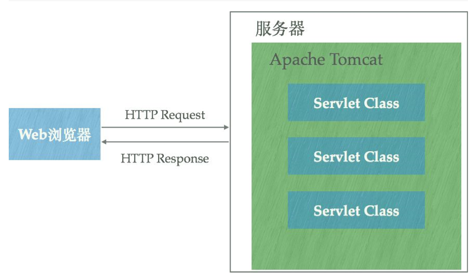
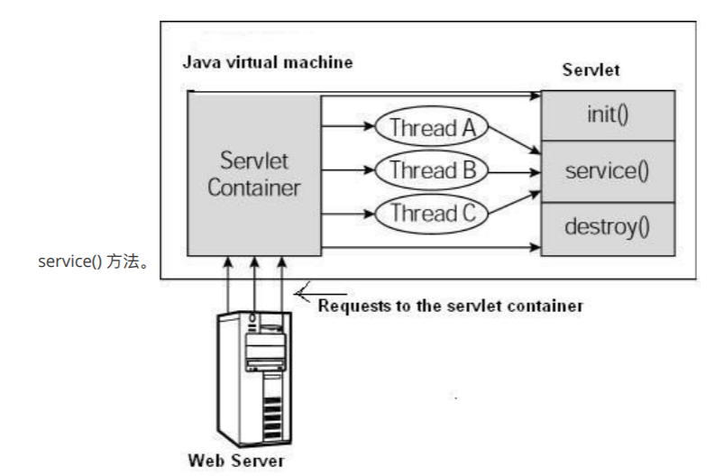
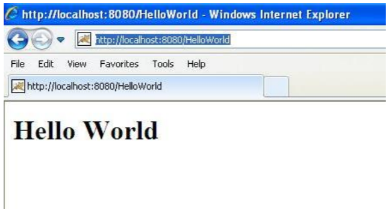

Tomcat 和 Servlet原理
---

<!-- TOC -->

- [1. Tomcat的工作](#1-tomcat的工作)
- [2. Servlet](#2-servlet)
  - [2.1. 声明周期](#21-声明周期)
  - [2.2. service() ⽅法](#22-service-法)
    - [2.2.1. doGet() ⽅法](#221-doget-法)
    - [2.2.2. doPost() ⽅法](#222-dopost-法)
    - [2.2.3. helloworld servlet(Demo)](#223-helloworld-servletdemo)
    - [2.2.4. 编译 Servlet](#224-编译-servlet)
    - [2.2.5. 部署 Servlet](#225-部署-servlet)
    - [2.2.6. 运⾏Servlet](#226-运servlet)
  - [2.3. Servlet Get和Post案例](#23-servlet-get和post案例)
    - [2.3.1. Get 案例](#231-get-案例)
    - [2.3.2. post 案例](#232-post-案例)

<!-- /TOC -->

# 1. Tomcat的工作


1. Tomcat运⾏在JVM之上，它和HTTP服务器⼀样，绑定IP地址并监听TCP端⼝，同时还包含以下指责：
   1. 管理Servlet程序的⽣命周期
   2. 将URL映射到指定的Servlet进⾏处理与Servlet程序合作处理HTTP请求——根据HTTP请求⽣成HttpServletResponse对象并传递给
   3. Servlet进⾏处理，将Servlet中的HttpServletResponse对象⽣成的内容返回给浏览器

# 2. Servlet

## 2.1. 声明周期
1. ⼀个典型的 Servlet ⽣命周期⽅案。
2. 第⼀个到达服务器的 HTTP 请求被委派到 Servlet 容器。
3. Servlet 容器在调⽤ service() ⽅法之前加载 Servlet。
4. 然后 Servlet 容器处理由多个线程产⽣的多个请求，每个线程执⾏⼀个单⼀的 Servlet 实例的service() ⽅法。



## 2.2. service() ⽅法
1. service() ⽅法是执⾏实际任务的主要⽅法。Servlet 容器（即 Web 服务器）调⽤ service() ⽅法来处理来⾃客户端（浏览器）的请求，并把格式化的响应写回给客户端。
2. 每次服务器接收到⼀个 Servlet 请求时，服务器会产⽣⼀个新的线程并调⽤服务。service() ⽅法检查HTTP 请求类型（GET、POST、PUT、DELETE 等），并在适当的时候调⽤ doGet、doPost、doPut，doDelete 等⽅法。
3. 下⾯是该⽅法的特征：
```java
public void service(ServletRequest request,
 ServletResponse response)
 throws ServletException, IOException{
}
```
4. service() ⽅法由容器调⽤，service ⽅法在适当的时候调⽤ doGet、doPost、doPut、doDelete 等⽅法。所以，您不⽤对 service() ⽅法做任何动作，您只需要根据来⾃客户端的请求类型来重写 doGet() 或doPost() 即可。
5. doGet() 和 doPost() ⽅法是每次服务请求中最常⽤的⽅法。下⾯是这两种⽅法的特征。

### 2.2.1. doGet() ⽅法
1. GET 请求来⾃于⼀个 URL 的正常请求，或者来⾃于⼀个未指定 METHOD 的 HTML 表单，它由 doGet()
⽅法处理。
```java
public void doGet(HttpServletRequest request, HttpServletResponse response)
 throws ServletException, IOException {
 // Servlet 代码
}
```

### 2.2.2. doPost() ⽅法
1. POST 请求来⾃于⼀个特别指定了 METHOD 为 POST 的 HTML 表单，它由 doPost() ⽅法处理
```java
public void doPost(HttpServletRequest request, HttpServletResponse response)
 throws ServletException, IOException {
 // Servlet 代码
}
```

### 2.2.3. helloworld servlet(Demo)
```java
// 导⼊必需的 java 库
import java.io.*;
import javax.servlet.*;
import javax.servlet.http.*;
// 扩展 HttpServlet 类
public class HelloWorld extends HttpServlet {
    private String message;
    public void init() throws ServletException{
        // 执⾏必需的初始化
        message = "Hello World";
    }
    public void doGet(HttpServletRequest request, HttpServletResponse response) throws ServletException, IOException{
        // 设置响应内容类型
        response.setContentType("text/html");
        // 实际的逻辑是在这⾥
        PrintWriter out = response.getWriter();
        out.println("<h1>" + message + "</h1>");
    }
    public void destroy(){
        // 什么也不做
    }
}
```

### 2.2.4. 编译 Servlet
```
$ javac HelloWorld.java
```

### 2.2.5. 部署 Servlet
1. 默认情况下，Servlet 应⽤程序位于路径 /webapps/ROOT 下，且类⽂件放在 /webapps/ROOT/WEBINF/classes 中。
2. 如果您有⼀个完全合格的类名称 com.myorg.MyServlet，那么这个 Servlet 类必须位于 WEBINF/classes/com/myorg/MyServlet.class 中。
3. 现在，让我们把 HelloWorld.class 复制到 /webapps/ROOT/WEB-INF/classes 中，并在位于
/webapps/ROOT/WEB-INF/ 的 web.xml ⽂件中创建以下条⽬：(向对应部分声明)
```xml
<web-app>
 <servlet>
    <servlet-name>HelloWorld</servlet-name>
    <servlet-class>HelloWorld</servlet-class>
 </servlet>
<servlet-mapping>
    <servlet-name>HelloWorld</servlet-name>
    <url-pattern>/HelloWorld</url-pattern>
 </servlet-mapping>
</web-app>
```
4. <a href = "https://www.zhihu.com/question/32212996/answer/87524617">参考</a>

### 2.2.6. 运⾏Servlet
启动 tomcat 服务器，最后在浏览器的地址栏中输⼊ http://localhost:8080/HelloWorld。如果⼀切顺
利，您会看到下⾯的结果：


## 2.3. Servlet Get和Post案例

### 2.3.1. Get 案例
1. 是⼀个简单的 URL，将使⽤ GET ⽅法向 HelloForm 程序传递两个值。
2. `http://localhost:8080/TomcatTest/HelloForm?name=菜⻦教程&url=www.runoob.com`
3. 下⾯是处理 Web 浏览器输⼊的 HelloForm.java Servlet 程序。我们将使⽤ getParameter() ⽅法，可以很容易地访问传递的信息：

```java
package com.runoob.test;
import java.io.IOException;
import java.io.PrintWriter;
import javax.servlet.ServletException;
import javax.servlet.annotation.WebServlet;
import javax.servlet.http.HttpServlet;
import javax.servlet.http.HttpServletRequest;
import javax.servlet.http.HttpServletResponse;
/**
* Servlet implementation class HelloForm
*/
@WebServlet("/HelloForm")
public class HelloForm extends HttpServlet {
    private static final long serialVersionUID = 1L;
    /**
    * @see HttpServlet#HttpServlet()
    */
    public HelloForm() {
        super();
        // TODO Auto-generated constructor stub
    }
    /**
    * @see HttpServlet#doGet(HttpServletRequest request, HttpServletResponse
    response)
    */
    protected void doGet(HttpServletRequest request, HttpServletResponse response) throws ServletException, IOException {
        // 设置响应内容类型
        response.setContentType("text/html;charset=UTF-8");
        PrintWriter out = response.getWriter();
        String title = "使⽤ GET ⽅法读取表单数据";
        // 处理中⽂
        String name =new String(request.getParameter("name").getBytes("ISO8859-1"),"UTF-8");
        String docType = "<!DOCTYPE html> \n";
        out.println(docType + 
        "<html>\n" +
        "<head><title>" + title + "</title></head>\n" +
        "<body bgcolor=\"#f0f0f0\">\n" +
        "<h1 align=\"center\">" + title + "</h1>\n" +
        "<ul>\n" +
        " <li><b>站点名</b>："
        + name + "\n" +
        " <li><b>⽹址</b>："
        + request.getParameter("url") + "\n" +
        "</ul>\n" +
        "</body></html>");
    }
    // 处理 POST ⽅法请求的⽅法
    public void doPost(HttpServletRequest request, HttpServletResponse response) throws ServletException, IOException {
        doGet(request, response);
    }
}
```
4. 然后我们在 web.xml ⽂件中创建以下条⽬：
```xml
<?xml version="1.0" encoding="UTF-8"?>
<web-app>
 <servlet>
    <servlet-name>HelloForm</servlet-name>
    <servlet-class>com.runoob.test.HelloForm</servlet-class>
 </servlet>
<servlet-mapping>
    <servlet-name>HelloForm</servlet-name>
    <url-pattern>/TomcatTest/HelloForm</url-pattern>
 </servlet-mapping>
</web-app>
```

5. 结果见Pdf
6. 下⾯是⼀个简单的实例，使⽤ HTML 表单和提交按钮传递两个值。我们将使⽤相同的 Servlet
HelloForm 来处理输⼊。
```html
<!DOCTYPE html>
<html>
<head>
<meta charset="utf-8">
    <title>菜⻦教程(runoob.com)</title>
</head>
<body>
    <form action="HelloForm" method="GET">⽹址名：<input type="text" name="name">
    <br/>
    ⽹址：<input type="text" name="url" />
    <input type="submit" value="提交" />
</form>
</body>
</html>
```

### 2.3.2. post 案例
1. 让我们对上⾯的 Servlet 做⼩⼩的修改，以便它可以处理 GET 和 POST ⽅法。下⾯的 HelloForm.java Servlet 程序使⽤ GET 和 POST ⽅法处理由 Web 浏览器给出的输⼊。
>注意：如果表单提交的数据中有中⽂数据则需要转码：String name =new String(request.getParameter("name").getBytes("ISO8859-
1"),"UTF-8");

```java
package com.runoob.test;
import java.io.IOException;
import java.io.PrintWriter;
import javax.servlet.ServletException;
import javax.servlet.annotation.WebServlet;
import javax.servlet.http.HttpServlet;
import javax.servlet.http.HttpServletRequest;
import javax.servlet.http.HttpServletResponse;
/**
* Servlet implementation class HelloForm
*/
@WebServlet("/HelloForm")
public class HelloForm extends HttpServlet {
    private static final long serialVersionUID = 1L;
    /**
    * @see HttpServlet#HttpServlet()
    */
    public HelloForm() {
        super();
        // TODO Auto-generated constructor stub
    }
    /**
    * @see HttpServlet#doGet(HttpServletRequest request, HttpServletResponse
    response)
    */
    protected void doGet(HttpServletRequest request, HttpServletResponse response) throws ServletException, IOException {
        // 设置响应内容类型
        response.setContentType("text/html;charset=UTF-8");
        PrintWriter out = response.getWriter();
        String title = "使⽤ POST ⽅法读取表单数据";
        // 处理中⽂
        String name =new String(request.getParameter("name").getBytes("ISO8859-1"),"UTF-8");
        String docType = "<!DOCTYPE html> \n";
        out.println(docType + 
        "<html>\n" +
        "<head><title>" + title + "</title></head>\n" +
        "<body bgcolor=\"#f0f0f0\">\n" +
        "<h1 align=\"center\">" + title + "</h1>\n" +
        "<ul>\n" +
        " <li><b>站点名</b>："
        + name + "\n" +
        " <li><b>⽹址</b>："
        + request.getParameter("url") + "\n" +
        "</ul>\n" +
        "</body></html>");
    }
    // 处理 POST ⽅法请求的⽅法
    public void doPost(HttpServletRequest request, HttpServletResponse response) throws ServletException, IOException {
        doGet(request, response);
    }
}
```
2. 现在，编译部署上述的 Servlet，并使⽤带有 POST ⽅法的 hello.html 进⾏测试，如下所示：
```html
<!DOCTYPE html>
<html>
<head>
<meta charset="utf-8">
    <title>菜⻦教程(runoob.com)</title>
</head>
<body>
    <form action="HelloForm" method="POST">⽹址名：<input type="text" name="name">
    <br />
    ⽹址：<input type="text" name="url" />
    <input type="submit" value="提交" />
</form>
</body>
</html>
```

