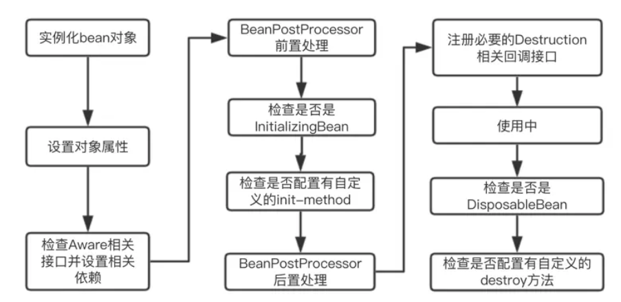
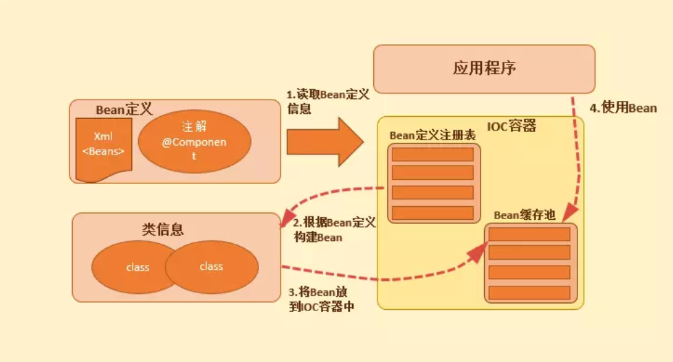

spring Bean
---
1. 本文简单记录了关于Spring中的Bean的实现和使用的部分理解

<!-- TOC -->

- [1. Spring Bean的简单流程](#1-spring-bean的简单流程)
- [2. bean生命周期内的部分实现](#2-bean生命周期内的部分实现)
  - [2.1. 动态注入bean的思路](#21-动态注入bean的思路)
  - [2.2. 实现动态注入的代码](#22-实现动态注入的代码)
  - [2.3. 多次注入同一个bean的情况](#23-多次注入同一个bean的情况)
  - [2.4. 设置Bean的Aware](#24-设置bean的aware)
    - [2.4.1. SmartInitializingSingleton.afterSingletonsInstantiated的调用位置](#241-smartinitializingsingletonaftersingletonsinstantiated的调用位置)
    - [2.4.2. SmartLifecycle.start](#242-smartlifecyclestart)
    - [2.4.3. stop方法](#243-stop方法)
    - [2.4.4. DisposableBean.destroy方法](#244-disposablebeandestroy方法)
    - [Bean声明周期演示以及运行结果](#bean声明周期演示以及运行结果)
  - [2.5. 动态删除Bean](#25-动态删除bean)
- [3. 参考](#3-参考)

<!-- /TOC -->



# 1. Spring Bean的简单流程


1. 实例化【IOC容器寻找Bean的定义信息并将其实例化】
2. 设置bean的Aware 【Aware意指能提前感知的,是spring的一个重要接口,使用依赖注入，spring按照Bean定义信息配置Bean的所有属性】
3. BeanPostProcessor.postProcessBeforeInitialization(Object bean, String beanName)【如果BeanPostProcessor和Bean关联，那么其postProcessBeforeInitialization()方法将被调用，Spring 框架会遍历得到容器中所有的 BeanPostProcessor ，挨个执行】
4. InitializingBean.afterPorpertiesSet 【初始化bean, springboot读取properties文件的过程，默认的application.properties 还有其他方式】
5. BeanPostProcessor.postProcessAfterInitialization(Object bean, String beanName)  【如果有BeanPostProcessor和Bean关联,那么其postProcessAfterInitialization()方法将被调用】
6. SmartInitializingSingleton.afterSingletonsInstantiated
7. martLifecycle.start
8. 运行Bean
9. SmartLifecycle.stop(Runnable callback)  
10. DisposableBean.destroy()【销毁】

# 2. bean生命周期内的部分实现

## 2.1. 动态注入bean的思路
1. `BeanFactory`是 Spring 管理 bean 的对象
   1. 具体是:`DefaultListableBeanFactory`，这个类中有注入Bean的方法:`registerBeanDefinition`，在调用这个方法的时候，需要`BeanDefinition`参数
   2. `BeanDefinition`的参数是通过`BeanDefinitionBuilder`来进行构建。
2. 所以我们动态注入bean的时候，只需要通过`ApplicationContext`对象即获取到上`BeanFactory`。

## 2.2. 实现动态注入的代码
```java
//测试的Service层的一个类
public class TestService {  
    private String name;  
    public String getName() {  
        return name;  
    }  
    public void setName(String name) {  
        this.name = name;  
    }  
    public void print(){  
        System.out.println("动态载入bean,name="+name);  
    } 
}
//获取context.
ApplicationContext ctx =  (ApplicationContext) SpringApplication.run(App.class, args);

//获取BeanFactory  
DefaultListableBeanFactory defaultListableBeanFactory = (DefaultListableBeanFactory) ctx.getAutowireCapableBeanFactory();   

//创建bean信息.  
BeanDefinitionBuilder beanDefinitionBuilder = BeanDefinitionBuilder.genericBeanDefinition(TestService.class);  
//为创建其添加属性
beanDefinitionBuilder.addPropertyValue("name","张三");
//动态注册bean.  
defaultListableBeanFactory.registerBeanDefinition("testService", beanDefinitionBuilder.getBeanDefinition());  
//获取动态注册的bean.  
TestService testService =ctx.getBean(TestService.class);
//打印出爱我们新建的类的属性
testService.print();  
```

## 2.3. 多次注入同一个bean的情况
1. 如果同时注入到同一个bean中，如果beanName不同的话，那么就会产生两个Bean，如果beanName一直的话，后面注入的会覆盖前面的。
```java
//创建第一个Bean
beanDefinitionBuilder = BeanDefinitionBuilder.genericBeanDefinition(TestService.class);
defaultListableBeanFactory.registerBeanDefinition("testService", beanDefinitionBuilder.getBeanDefinition()); 

//创建第二个bean
beanDefinitionBuilder = BeanDefinitionBuilder.genericBeanDefinition(TestService.class);  
defaultListableBeanFactory.registerBeanDefinition("testService1", beanDefinitionBuilder.getBeanDefinition());  

//正常的话，第二段的代码会出现Exception
//主要原因是，不能确定获取哪一个bean
//解决方案,将对应行代码修改成如下代码。
TestService testService =ctx.getBean("testService");
```

## 2.4. 设置Bean的Aware
1. `InitializingBean.afterPorpertiesSet`，`BeanPostProcessor`对bean的加工处理基本上在一块出现。
2. 设置Aware方法顺序:
   1. BeanNameAware
   2. BeanClassLoaderAware
   3. BeanFactoryAware
3. `ApplicationContextAwareProcessor`也会设置Aware：
   1. EnvironmentAware
   2. EmbeddedValueResolverAware
   3. ResourceLoaderAware
   4. ApplicationEventPublisherAware
   5. MessageSourceAware
   6. ApplicationContextAware

```java
protected Object initializeBean(final String beanName, final Object bean, RootBeanDefinition mbd) {
        
      // 设置Aware  
        if (System.getSecurityManager() != null) {
            AccessController.doPrivileged(new PrivilegedAction<Object>() {
                @Override
                public Object run() {
                    invokeAwareMethods(beanName, bean);
                    return null;
                }
            }, getAccessControlContext());
        }
        else {
            invokeAwareMethods(beanName, bean);
        }
        
      //BeanPostProcessor的postProcessBeforeInitialization  
        Object wrappedBean = bean;
        if (mbd == null || !mbd.isSynthetic()) {
            wrappedBean = applyBeanPostProcessorsBeforeInitialization(wrappedBean, beanName);
        }

        try {
           //调用init方法，其判断是否是InitializingBean的实例，然后调用afterPropertiesSet
            invokeInitMethods(beanName, wrappedBean, mbd);
        }
        catch (Throwable ex) {
            throw new BeanCreationException(
                    (mbd != null ? mbd.getResourceDescription() : null),
                    beanName, "Invocation of init method failed", ex);
        }
    
      //BeanPostProcessor的postProcessAfterInitialization  
        if (mbd == null || !mbd.isSynthetic()) {
            wrappedBean = applyBeanPostProcessorsAfterInitialization(wrappedBean, beanName);
        }
        return wrappedBean;
    }
```
### 2.4.1. SmartInitializingSingleton.afterSingletonsInstantiated的调用位置
```java
@Override
public void preInstantiateSingletons() throws BeansException {
    if (this.logger.isDebugEnabled()) {
        this.logger.debug("Pre-instantiating singletons in " + this);
    }
    // Iterate over a copy to allow for init methods which in turn register new bean definitions.
    // While this may not be part of the regular factory bootstrap, it does otherwise work fine.
    List<String> beanNames = new ArrayList<String>(this.beanDefinitionNames);

    // Trigger initialization of all non-lazy singleton beans...
    // 触发实例化所有的非懒加载的单例
    for (String beanName : beanNames) {
       ...
    }

    // Trigger post-initialization callback for all applicable beans...
    // 触发应用bean的post-initialization回调，也就是afterSingletonsInstantiated方法
    for (String beanName : beanNames) {
        Object singletonInstance = getSingleton(beanName);
        if (singletonInstance instanceof SmartInitializingSingleton) {
            final SmartInitializingSingleton smartSingleton = (SmartInitializingSingleton) singletonInstance;
            if (System.getSecurityManager() != null) {
                AccessController.doPrivileged(new PrivilegedAction<Object>() {
                    @Override
                    public Object run() {
                        smartSingleton.afterSingletonsInstantiated();
                        return null;
                    }
                }, getAccessControlContext());
            }else {
                smartSingleton.afterSingletonsInstantiated();
            }
        }
    }
}
```

### 2.4.2. SmartLifecycle.start
1. 在ApplicationContext结束刷新finishRefresh时，getLifecycleProcessor().onRefresh();
2. 判断bean是否为SmartLifecycle并且autoStartup。
3. 位于：DefaultLifecycleProcessor.onRefresh

### 2.4.3. stop方法
1. 在Application.close的时候，调用getLifecycleProcessor().stop()方法仍然在DefaultLifecycleProcessor内部

### 2.4.4. DisposableBean.destroy方法
1. doCreateBean方法中会判断bean是否有销毁相关操作，实现了DisposableBean方法或定义了销毁方法。
2. AbstractAutowireCapableBeanFactory.doCreateBean(final String beanName, final RootBeanDefinition mbd, final Object[] args)

### Bean声明周期演示以及运行结果
```java
public class HelloWorld implements SmartInitializingSingleton,SmartLifecycle,InitializingBean,
        DisposableBean,MyInterface,BeanNameAware,ApplicationContextAware
{

    private final Log logger = LogFactory.getLog(getClass());
    private boolean isRunning;
    

    public HelloWorld() {
        System.out.println("实例化");
    }

    public void sayHello(){
        System.out.println("hello World");
    }

    public void afterSingletonsInstantiated() {
        System.out.println("SmartInitializingSingleton afterSingletonsInstantiated");
    }

    public void start() {
        isRunning = true;
        System.out.println("LifeCycle start");
    }

    public void stop() {
        System.out.println("LifeCycle stop");
    }

    public boolean isRunning() {
        return isRunning;
    }

    public boolean isAutoStartup() {
        return true;
    }

    public void stop(Runnable callback) {
        System.out.println("LifeScycle stop");
        callback.run();
    }

    public int getPhase() {
        return 0;
    }

    public void afterPropertiesSet() throws Exception {
        System.out.println("afterproperties set");
    }

    public void destroy() throws Exception {
        System.out.println("destroy");
    }

    public void my(String str) {
        System.out.println(str);
    }

    public void setBeanName(String name) {
        System.out.println("set bean Name aware");
    }

    public void setApplicationContext(ApplicationContext applicationContext) throws BeansException {
        System.out.println("set Application Aware");
    }
}


//MyInterface接口
public interface MyInterface {
    void my(String str);
}
```
```
//app.xml
<?xml version="1.0" encoding="UTF-8"?>
<beans xmlns="http://www.springframework.org/schema/beans"
        xmlns:xsi="http://www.w3.org/2001/XMLSchema-instance"
        xsi:schemaLocation="http://www.springframework.org/schema/beans http://www.springframework.org/schema/beans/spring-beans.xsd">

    <bean id="porcessor" class="me.aihe.MyBeanPostProcessor" />
    <bean id="hello" class="me.aihe.HelloWorld">

    </bean>
</beans>
```
```java
//SpringApp
public class SpringApp {
    public static void main(String[] args) {
        ClassPathXmlApplicationContext applicationContext = new ClassPathXmlApplicationContext("app.xml");
        HelloWorld hello = (HelloWorld) applicationContext.getBean("hello");
        hello.sayHello();
        applicationContext.close();
    }
}
```

## 2.5. 动态删除Bean
```java
 //删除bean.  
defaultListableBeanFactory.removeBeanDefinition("testService");  
```

# 3. 参考
1. <a href = "https://blog.csdn.net/weixin_33901926/article/details/89613548">Spring Boot轻松理解动态注入，删除bean</a>
2. <a href = "https://www.cnblogs.com/Ronaldo-HD/p/11640608.html">【SpringBoot】SpringBoot的基础，全面理解bean的生命周期</a>
