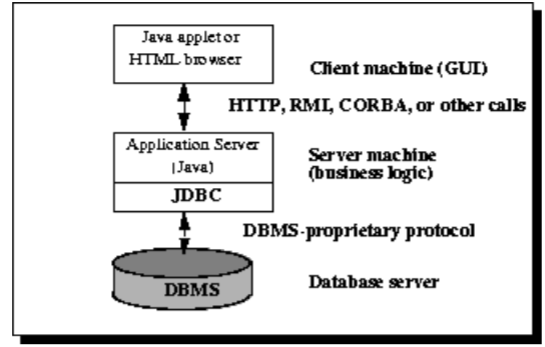
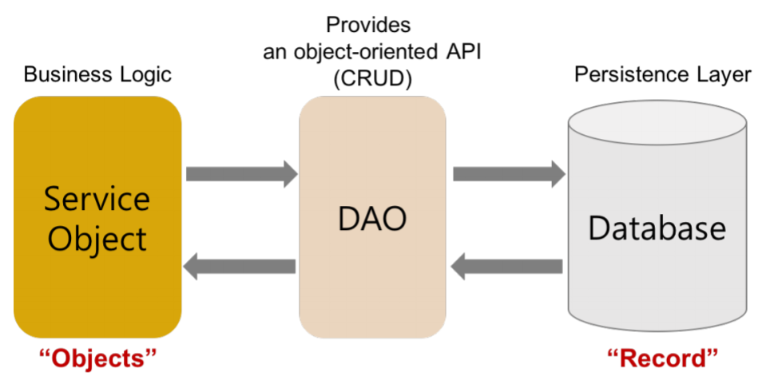
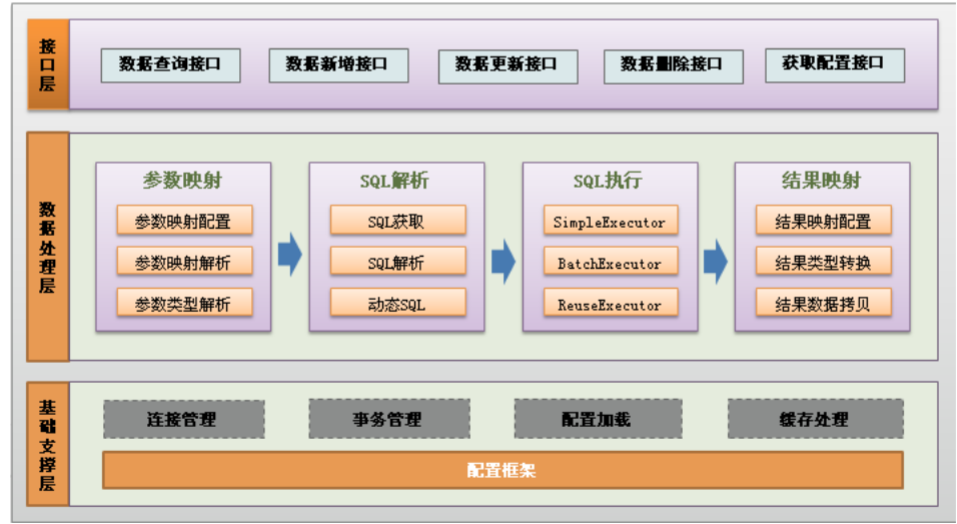

Spring Dao层
---
<!-- TOC -->

- [1. Repository层](#1-repository层)
  - [1.1. JpaRepository](#11-jparepository)
  - [1.2. Jpa](#12-jpa)
  - [1.3. JPA的部分标签情况](#13-jpa的部分标签情况)
  - [1.4. 自定义更新、查询、删除](#14-自定义更新查询删除)
    - [1.4.1. 自定义更新](#141-自定义更新)
- [2. @Mapper注解](#2-mapper注解)
- [3. JDBC](#3-jdbc)
  - [3.1. API](#31-api)
- [4. DAO](#4-dao)
  - [4.1. DAO模式](#41-dao模式)
    - [4.1.1. 对外提供相应的接⼝](#411-对外提供相应的接)
  - [4.2. 组成部分](#42-组成部分)
- [5. Mybatis](#5-mybatis)
  - [5.1. 配置文件](#51-配置文件)
  - [5.2. 实体情况](#52-实体情况)
  - [5.3. 映射的xml文件](#53-映射的xml文件)
  - [5.4. 参考](#54-参考)
- [6. ORM和Mybatis](#6-orm和mybatis)
  - [6.1. ORM](#61-orm)
  - [6.2. 例子](#62-例子)

<!-- /TOC -->

# 1. Repository层
```java
@Repository
public interface StoryDao extends JpaRepository<Story, Integer> {
    @Modifying
    @Query("update Story set posId=posId+1 where posId>:posId")
    void updateCreatePosID(@Param("posId") int posId);
    List<Story> findByTaskIdOrderByPosIdDesc(int taskId);
    List<Story> findByTaskId(int taskId);
}
```
1. @Repository对应数据访问层的Bean。表示Spring容器中会存在StoryDao的bean，当Service需要使用StoryDao的实例时，就可以将Spring创建好的bean注入：在Service只需要声明一个变量storyDao来接收。接收方式如下：
```java
@Service
public class StoryServiceImpl implements StoryService {
    @Autowired
    private StoryDao storyDao;
}
```

## 1.1. JpaRepository
```java
@Repository
public interface StoryDao extends JpaRepository<Story, Integer> {
    @Modifying
    @Query("update Story set posId=posId+1 where posId>:posId")
    void updateCreatePosID(@Param("posId") int posId);
    List<Story> findByTaskIdOrderByPosIdDesc(int taskId);
    List<Story> findByTaskId(int taskId);
}
```
1. JpaRepository实现一组JPA规范相关的方法， StoryDao接口继承了JpaRepository，就具备了通用的数据访问控制层的能力。
2. JpaRepository支持接口规范方法名查询。意思是如果在接口中定义的查询方法符合它的命名规则，就可以不用写实现。比如findByTaskIdOrderByPosIdDesc实现的就是...  Where story.taskId = ?1 order by story.posId desc。
3. 也可以使用@Query自定义查询。 @Query与 @Modifying 两个annotation一起声明，可定义个性化更新操作，例如只涉及某些字段更新时最为常用。
4. 本例的query语句意思是由于各个story有顺序关系，在新插入一个story时需要将它后面的story的位置id加一。

## 1.2. Jpa
1. 全称Java Presistence API,java持久层API
2. 通过将接口Dao层集成JPARepository来完成使用

## 1.3. JPA的部分标签情况
标签名|功能|备注
--|--|--
@Entity|用来表示这个类似实体类，(UserEntity) 默认对应user_entity表|-
@Column|定义将成员属性映射到关系表中的对应列，以及对应列的结构信息|可以包含name、unique、nullable、length、insertable、length、updatetable、columnDefination、secondaryTable
@id|用来标识指定表的逐渐，有多重生成方式|table(使用低层数据表)、SEQUENCE，使用序列生成唯一、INDENTITY使用数据库IDENTITY列保证唯一、AUTO 由容器挑选一个合适的方式保证唯一、NONE 容器不负责主键的生成，有程序完成
@GeneratedValue(strategy = GenerationType.IDENTITY)|用来指定生成的方式|-

## 1.4. 自定义更新、查询、删除

### 1.4.1. 自定义更新
TODO

# 2. @Mapper注解
1. 注解到Dao层的接口:这样子帮助我们自动生成处理

# 3. JDBC
>主要步骤如下
1. 登记并加载JDBC驱动器。 
2. 建⽴与SQL数据库的连接；
3. 传送⼀个SQL操作；
4. 获得数据结果;



## 3.1. API
```java
//1.加载驱动程序
Class.forName("com.mysql.jdbc.Driver");
//2. 获得数据库连接
Connection conn = DriverManager.getConnection(URL, USER, PASSWORD);
//3.操作数据库，实现增删改查
Statement stmt = conn.createStatement();
ResultSet rs = stmt.executeQuery("SELECT user_name, age FROM imooc_goddess");
//如果有数据，rs.next()返回true
while(rs.next()){
    System.out.println(rs.getString("user_name")+" 年龄："+rs.getInt("age"));
}
```

# 4. DAO

## 4.1. DAO模式
1. DAO (Data Access objects 数据存取对象)是指位于业务逻辑和持久化数据之间实现对持久化数据的访问。通俗来讲，就是将数据库操作都封装起来。



### 4.1.1. 对外提供相应的接⼝
1. 在⾯向对象设计过程中，有⼀些"套路”⽤于解决特定问题称为模式。
2. DAO 模式提供了访问关系型数据库系统所需操作的接⼝，将数据访问和业务逻辑分离对上层提供⾯向对象的数据访问接⼝。
3. 从以上 DAO 模式使用可以看出，DAO 模式的优势就在于它实现了两次隔离。
   1. 隔离了**数据访问代码和业务逻辑代码**。业务逻辑代码直接调⽤DAO⽅法即可，完全感觉不到数据库表的存在。分⼯明确，数据访问层代码变化不影响业务逻辑代码,这符合单⼀职能原则，降低了藕合性，提⾼了可复⽤性。
   2. 隔离了**不同数据库实现**。采⽤面向接口编程，如果底层数据库变化，如由 MySQL 变成 Oracle 只要增加 DAO 接⼝的新实现类即可，原有 MySQ 实现不⽤修改。这符合 "开-闭" 原则。该原则降低了代码的藕合性，提⾼了代码扩展性和系统的可移植性。
4. 也就是我们只需要处理对象就行，而对象和数据库之间的交互交给DAO完成

## 4.2. 组成部分
1. DAO接⼝：把对数据库的所有操作定义成抽象方法，可以提供多种实现。
```java
public interface PetDao {
    /**
    * 查询所有宠物
    */
    List<Pet> findAllPets() throws Exception;
}
```
2. DAO 实现类：针对不同数据库给出DAO接⼝定义方法的具体实现。
```java
public class PetDaoImpl extends BaseDao implements PetDao {
    /**
    * 查询所有宠物
    */
    public List<Pet> findAllPets() throws Exception {
        Connection conn=BaseDao.getConnection();
        String sql="select * from pet";
        PreparedStatement stmt= conn.prepareStatement(sql);
        ResultSet rs= stmt.executeQuery();
        List<Pet> petList=new ArrayList<Pet>();
        while(rs.next()) {
            Pet pet=new Pet(
                rs.getInt("id"),
                rs.getInt("owner_id"),
                rs.getInt("store_id"),
                rs.getString("name"),
                rs.getString("type_name"),
                rs.getInt("health"),
                rs.getInt("love"),
                rs.getDate("birthday")
            );
        petList.add(pet);
        }
        BaseDao.closeAll(conn, stmt, rs);
        return petList;
    }
}
```
3. 实体类：⽤于存放与传输对象数据。
```java
public class Pet {
    private Integer id;
    private Integer ownerId; //主⼈ID
    private Integer storeId; //商店ID
    private String name; //姓名
    private String typeName; //类型
    private int health; //健康值
    private int love; //爱⼼值
    private Date birthday; //⽣⽇
}
```

4. 数据库连接和关闭⼯具类： 避免了数据库连接和关闭代码的重复使⽤，⽅便修改

```java
public class BaseDao {
    private static String driver="com.mysql.jdbc.Driver";
    private static String url="jdbc:mysql://127.0.0.1:3306/database_name";
    private static String user="root";
    private static String password="root";
    static {
        try {
            Class.forName(driver);
        } catch (ClassNotFoundException e) {
            e.printStackTrace();
        }
    }
    public static Connection getConnection() throws SQLException {
        return DriverManager.getConnection(url, user, password);
    }
    public static void closeAll(Connection conn,Statement stmt,ResultSet rs) throws SQLException {
        if(rs!=null) {
            rs.close();
        }
        if(stmt!=null) {
            stmt.close();
        }
        if(conn!=null) {
            conn.close();
        }
    }
    
    public int executeSQL(String preparedSql, Object[] param) throws ClassNotFoundException {
        Connection conn = null;
        PreparedStatement pstmt = null;
        /* 处理SQL,执⾏SQL */
        try {
            conn = getConnection(); // 得到数据库连接
            pstmt = conn.prepareStatement(preparedSql); // 得到PreparedStatement对象
            if (param != null) {
                for (int i = 0; i < param.length; i++) {
                    pstmt.setObject(i + 1, param[i]); // 为预编译sql设置参数
                }
            }
            ResultSet num = pstmt.executeQuery(); // 执⾏SQL语句
        } catch (SQLException e) {
            e.printStackTrace(); // 处理SQLException异常
        } finally {
            try {
                BaseDao.closeAll(conn, pstmt, null);
            } catch (SQLException e) {
                e.printStackTrace();
            }
        }
    return 0;
    }
}
```

# 5. Mybatis
1. MyBatis 是⽀持定制化 SQL、存储过程以及⾼级映射的优秀的持久层框架。MyBatis 避免了⼏乎所有的JDBC 代码和⼿动设置参数以及获取结果集。MyBatis 可以对配置和原⽣Map使⽤简单的 XML 或注解，将接⼝和 Java 的 POJOs(Plain Old Java Objects,普通的 Java对象)映射成数据库中的记录。



2. ORM是Object和Relation之间的映射，包括Object->Relation和Relation->Object两⽅⾯。Hibernate是个完整的ORM框架，⽽MyBatis完成的是Relation->Object，也就是其所说的Data Mapper Framework。
3. JPA是ORM框架标准，主流的ORM框架都实现了这个标准。MyBatis没有实现JPA，它和ORM框架的设计思路不完全⼀样。MyBatis是拥抱SQL，⽽ORM则更靠近⾯向对象，不建议写SQL，实在要写，则推荐你⽤框架⾃带的类SQL代替。MyBatis是SQL映射框架⽽不是ORM框架，当然ORM和MyBatis都是持久层框架。
4. 最典型的ORM 框架是Hibernate，它是全⾃动ORM框架，⽽MyBatis是半⾃动的。Hibernate完全可以通过对象关系模型实现对数据库的操作，拥有完整的JavaBean对象与数据库的映射结构来⾃动⽣成SQL。⽽MyBatis仅有基本的字段映射，对象数据以及对象实际关系仍然需要通过⼿写SQL来实现和管理。

## 5.1. 配置文件
```yaml
spring:
    datasource:
        url: jdbc:mysql://localhost:3306/Hotel?
        serverTimezone=CTT&characterEncoding=UTF-8
        username: root
        password: ******
        driver-class-name: com.mysql.cj.jdbc.Driver
        max-active: 200
        max-idle: 20
        min-idle: 10
    thymeleaf:
        cache: false
    jackson:
        time-zone: GMT+8
    mybatis:
        mapper-locations: classpath:dataImpl/*/*Mapper.xml
```

## 5.2. 实体情况
```java
@Mapper
@Repository
public interface AdminMapper {
 int addManager(User user);
 List<User> getAllManagers();
}
public class User { //省略getter、setter
    private Integer id;
    private String email;
    private String password;
    private String userName;
    private String phoneNumber;
    private double credit;
    private UserType userType;
}
```

## 5.3. 映射的xml文件
```xml
<?xml version="1.0" encoding="UTF-8"?>
<!DOCTYPE mapper PUBLIC "-//mybatis.org//DTD Mapper 3.0//EN"
"http://mybatis.org/dtd/mybatis-3-mapper.dtd">
<mapper namespace="com.example.hotel.data.admin.AdminMapper">
    <insert id="addManager" parameterType="com.example.hotel.po.User" useGeneratedKeys="true" keyProperty="id">
        insert into User(email,password,usertype)values(#{email},#{password},#{userType})
    </insert>
    <select id="getAllManagers" resultMap="User">
        select * from User where usertype='HotelManager'
    </select>
    <resultMap id="User" type="com.example.hotel.po.User">
        <id column="id" property="id"></id>
        <result column="email" property="email"></result>
        <result column="password" property="password"></result>
        <result column="username" property="userName"></result>
        <result column="phonenumber" property="phoneNumber"></result>
        <result column="credit" property="credit"></result>
        <result column="usertype" property="userType"></result>
    </resultMap>
</mapper>
```

## 5.4. 参考
1. <a href = "https://pppppkun.github.io/2019/10/11/SpringBoot入门之Mybatis集成/">Spring Boot入门之Mybatis集成</a>

# 6. ORM和Mybatis

## 6.1. ORM
关系型数据库|⾯向对象|
--|--
数据库的表（table）|类（class）
记录（record，⾏数据）|对象（object）
字段（field）|对象的属性（attribute）

## 6.2. 例子
- 举例来说，下⾯是⼀⾏ SQL 语句
```sql
SELECT id, first_name, last_name, phone, birth_date, sex
    FROM persons
    WHERE id = 10
```
- 程序直接运⾏ SQL，操作数据库的写法如下。
```java
res = db.execSql(sql);
name = res[0]["FIRST_NAME"];
```
- 改成 ORM 的写法如下。
```java
p = Person.get(10);
name = p.first_name;
```