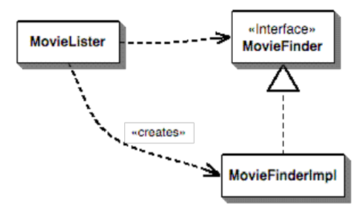
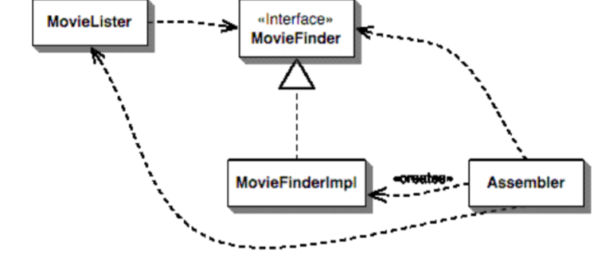
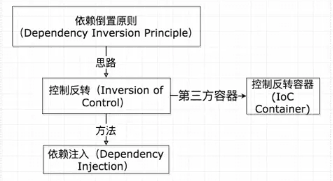
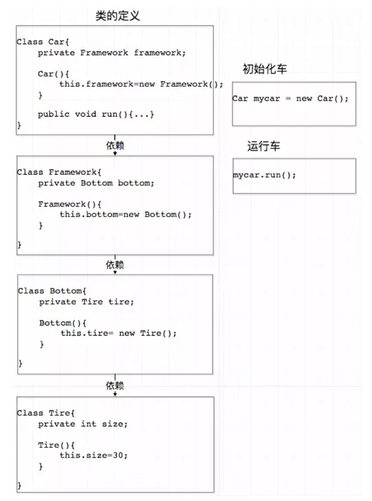
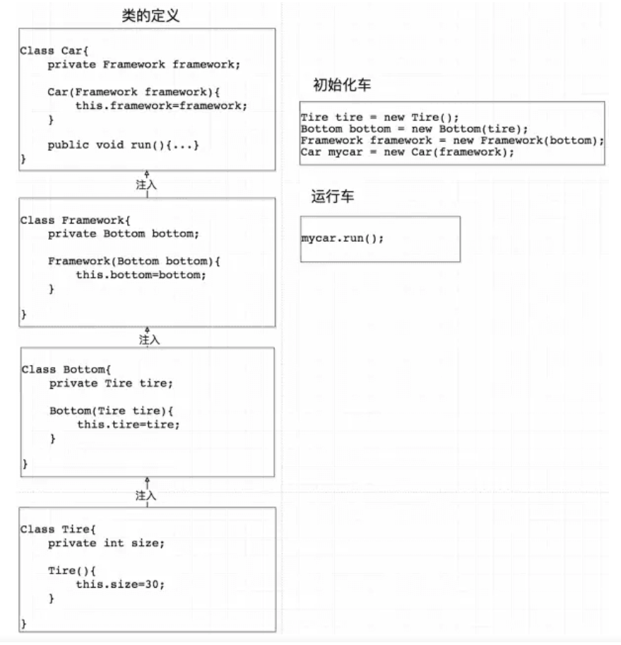
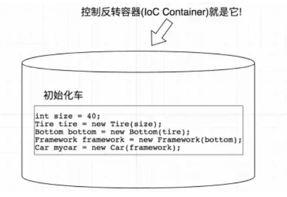
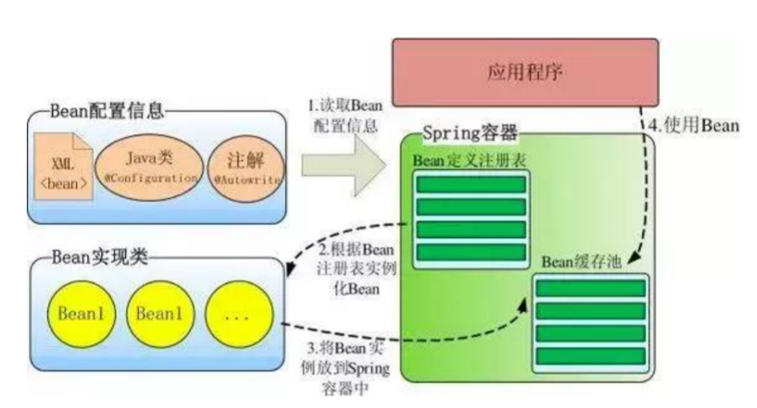

Spring IOC 和 DI
---
<!-- TOC -->

- [1. 什么是IOC(Inversion of Control)](#1-什么是iocinversion-of-control)
  - [1.1. IOC容器的核心问题](#11-ioc容器的核心问题)
  - [1.2. IOC容器的基本功能](#12-ioc容器的基本功能)
  - [1.3. IoC的实例](#13-ioc的实例)
- [2. 控制反转(Inversion of Control)](#2-控制反转inversion-of-control)
- [3. 控制反转容器(IOC Container)](#3-控制反转容器ioc-container)
- [4. DI 依赖注入](#4-di-依赖注入)

<!-- /TOC -->

# 1. 什么是IOC(Inversion of Control)
1. IOC:控制反转,别名:DI(Dependency Injection),就是由Spring IOC容器来负责对象的生命周期和对象之间的关系。
2. 依赖倒置:高层建筑决定需要什么，低层去实现这样的需求，但是高层并不用管理底层如何实现
3. 是spring管理bean的容器

## 1.1. IOC容器的核心问题
1. 谁控制谁
2. 控制什么
3. 为何是反转
4. 哪些方面反转了

## 1.2. IOC容器的基本功能
1. 通过描述管理Bean，包括发布和获取
2. 描述Bean之前的依赖关系

## 1.3. IoC的实例
- 通过接口调用具体实现的⽅法，可以降低耦合。但是始终⽆法消除创建对象时对具体实现的依赖。构造
⽅法没有多态。



- 已然会有create的那一条线来进行依赖(必须要先创建)
- 通过装配器来完成控制反转 IoC（Inversion of Control）。



- 消失一个依赖，出现了三个依赖，值得吗?因为装配器的三个依赖都是单一功能的，业务代码部分就解耦了

# 2. 控制反转(Inversion of Control)



1. 代码解释



2. 上述代码中，上层建筑依赖下层建筑——每一个类的构造函数都直接调用了底层代码的构造函数。
3. 所以我们修改底下的构造函数会引起上层的修改，而这在实际工程项目的修改是不可修改的。
4. 解决方案:底层类作为参数传入到上层类。



5. 此时我们修改轮胎，只需要修改最底层的类即可。
6. 此时我们写对应的单元测试，只需要Mock一下FrameWork类传入Car即可。

# 3. 控制反转容器(IOC Container)
1. 比如在车类进行初始化的那段代码发生的地方，就是控制反转容器。



2. 使用依赖注入会导致，高层对象的初始化过程中就不可避免的会写大量的new。而IOC容器可以帮助我们自动对代码进行初始化。
3. 此外，IOC的功能作用还有就是我们创建实例的时候不需要了解具体细节，由容器帮助你完成。


# 4. DI 依赖注入
1. 依赖注⼊ DI(Dependency Injection)
2. Similarly I define a setter for the filename.
```java
public class MovieLister{
    private MovieFinder finder;
    //setter方法进行注入
    public void setFinder(MovieFinder finder) {
    this.finder = finder;
    }
}
public class ColonMovieFinder{
    public void setFilename(String filename) {
        this.filename = filename;
    }
}
```
3. The third step is to set up the configuration for the files. Spring supports configuration through
XML files and also through code, but XML is the expected way to do it.
```xml
<beans>
    <bean id="MovieLister" class="spring.MovieLister">
        <property name="finder">
            <ref local="MovieFinder"/>
        </property>
    </bean>
    <bean id="MovieFinder" class="spring.ColonMovieFinder">
        <property name="filename">
        <!-->这里就已经有了Finder，由Spring进行调用<!-->
            <value>movies1.txt</value>
        </property>
    </bean>
</beans>
```
4. The test then looks like this.
```java
public void testWithSpring() throws Exception {
    ApplicationContext ctx = new FileSystemXmlApplicationContext("spring.xml");
    MovieLister lister = (MovieLister) ctx.getBean("MovieLister");
    Movie[] movies = lister.moviesDirectedBy("Sergio Leone");
    assertEquals("Once Upon a Time in the West", movies[0].getTitle());
}
```
