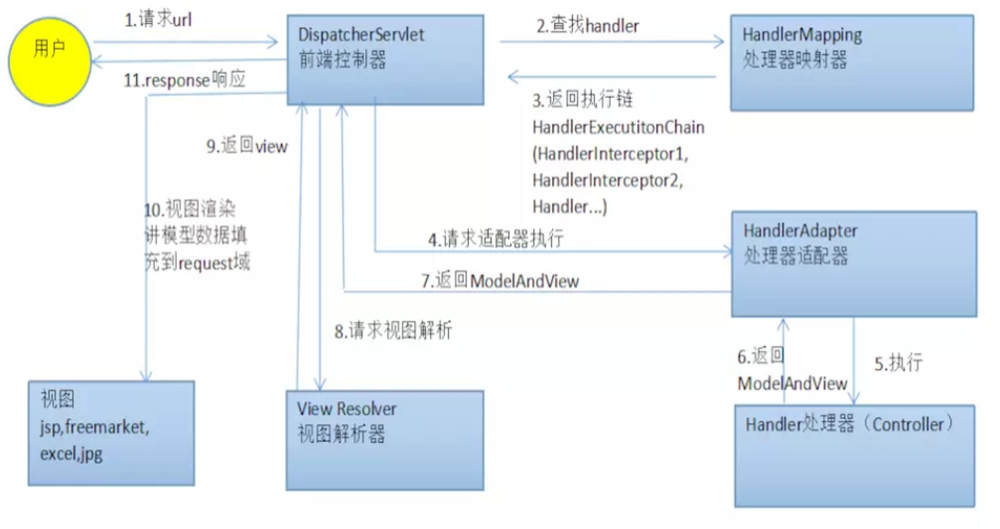

Spring Boot基础
---

<!-- TOC -->

- [1. Spring Boot框架](#1-spring-boot框架)
  - [1.1. Spring入门](#11-spring入门)
  - [1.2. 创建第一个Spring Boot应用](#12-创建第一个spring-boot应用)
    - [1.2.1. 第一种方式:spring boot](#121-第一种方式spring-boot)
    - [1.2.2. 第二种方式：Maven](#122-第二种方式maven)
    - [1.2.3. IDEA创建springboot项目](#123-idea创建springboot项目)
  - [1.3. 需要查询的java部分的相关的类](#13-需要查询的java部分的相关的类)
- [2. 将项目部署到服务器](#2-将项目部署到服务器)
  - [2.1. 打包](#21-打包)
  - [2.2. 上传](#22-上传)
  - [2.3. 运行项目](#23-运行项目)
  - [2.4. 关闭项目服务](#24-关闭项目服务)
- [3. spring boot项目内容](#3-spring-boot项目内容)
  - [3.1. 特性](#31-特性)
  - [3.2. 运行Spring Boot项目的方式](#32-运行spring-boot项目的方式)
  - [3.3. spring MVC执行流程](#33-spring-mvc执行流程)

<!-- /TOC -->
# 1. Spring Boot框架
1. Spring官方网站:<a href = "https://spring.io/projects/spring-boot">https://spring.io/projects/spring-boot</a>
2. GitHub源码:<a href = "https://github.com/spring-projects/spring-boot">https://github.com/spring-projects/spring-boot</a>


## 1.1. Spring入门
1. java Web的应用必须放在servlet容器中
2. Spring是一套java开发框架，主要使用了AOP和IOC容器的思想，其中是利用了Java的反射机制实现的

## 1.2. 创建第一个Spring Boot应用

### 1.2.1. 第一种方式:spring boot
1. 首先安装springboot命令行工具
    1. `brew tap pivotal/tap`
    2. `brew install springboot`
2. 创建应用:`spring init --build maven --groupId com.example --version 0.0.1-SNAPSHOT --java-version 1.8 --dependencies web --name myproject myproject`
3. 之后创建了相应的目录结构
4. 运行默认的实例应用：`mvn spring-boot:run`

### 1.2.2. 第二种方式：Maven
1. 创建Maven工程所需的pom.xml文件
2. 生成Maven工程
3. 编译打包发布
4. 更加详细
    1. 添加依赖
    2. 创建目录和配置文件
    3. 创建启动类
    4. 案例演示
5. 热部署：为了防止我们修改文件和创建文件时，我们需要重新启动项目，热部署可以让项目自动加载变化

### 1.2.3. IDEA创建springboot项目
1. 正常创建java项目即可，需要选择依赖(core)
    + 比如lombok等

## 1.3. 需要查询的java部分的相关的类
1. ResourceUtils
    1. ResourceUtils.geFile("string")
        + 支持带特殊前缀的资源地址
        + 避免了我们和Resource类打交道
2. Paths
    1. Path用于表示文件路径和文件
    2. 获得路径的方式
        1. final类Paths的static方法：`Path path = Paths.get(path);`
        2. final类Paths的static方法：例1
        3. 使用FileSystems构造：`Path path3 = FileSystems.getDefault().getPath("C://","access.log")`
        4. File和Path和URI之间的转换:例2
```java
//例1
URI u = URI.create(path);
Path p = Paths.get(u);
```
```java
//例2
File file = new File("");
Path p1 = file.toPath();
p1.toFile();
file.toURI();
```
3. SimpleDateFormat
    1. 具体的介绍
    标识符|内涵
    --|--
    G|年代标志符
    y|年
    M|月
    d|日
    h|时，12进制，1-12
    H|时，24进制，0-23
    m|分
    s|秒
    S|毫秒
    E|星期
    D|一年中的第几天
    F|一月中第几个星期几
    w|一年中第几个星期
    W|一月中的第几个星期
    a|上午/下午 标记符
    k|时，一天中(1-24)
    K|时，在上午或下午(0-11)
    z|时区
    2. 使用的语句：`SimpleDateFormat a = new SimpleDateFormat("yyyy")`
    3. 转化成为字符串：`a.format(now)`
4. Random()函数
    1. 第一种Random函数：
        1. java.util.Random包
        2. `Math.random()`:随意范围，[0.0,1.0)
    2. 第二种Rnadom函数：
        1. Random():创建一个新的随机数生成器
        2. Random(long seed):使用单个的long种子创建一个新的随机数生成器
        3. 生成伪随机数，seed来确定是什么顺序
        4. <a href = "https://www.cnblogs.com/ningvsban/p/3590722.html">参考相关的网页</a>
5. Date
6. MessageDigest
7. Base64.encodeBase64String()
8. addCorsMappings()重写的接口
9. ApiInfo
10. Docket
11. DocumentationType
12. 还差controller\impl\constant

# 2. 将项目部署到服务器
1. 请务必确认项目本地可以正常运行，无BUG

## 2.1. 打包
1. 在IDEA右侧的Maven里面选择clean项目
2. 之后在同样的地方选择package项目
3. 生成的.jar文件在target文件夹下

## 2.2. 上传
使用Xftp将项目package上传到服务器上

## 2.3. 运行项目
1. 找到.jar上传的目录
2. 运行命令:`java -jar filename.jar`即可

## 2.4. 关闭项目服务
1. 找到占用接口:`lsof -i:8999`
2. 看命令行中的PID值为多少(比如1666)
3. 杀掉进程:`kill 1666`

# 3. spring boot项目内容

## 3.1. 特性
1. 独立运行
    + Spring Boot内嵌了各种servlet容器，Tomcat、Jetty等，不需要打成war包部署到容器中，只要打成一个可执行的jar包就能独立运行，所有的依赖包都在一个jar包内。
2. 简化配置
    + spring-boot-starter-web启动器自动依赖其他组件，减少了maven的配置。
3. 自动配置
    + Spring Boot能根据当前类路径下的类、jar包来自动配置bean，如添加一个spring-boot-starter-web启动器就能拥有web的功能，无需其他配置。
4. 无代码生成和XML配置
    + Spring Boot配置过程中无代码生成，也无需XML配置文件就能完成所有配置工作。
5. 应用监控     
    + Spring Boot 监控核心是 spring-boot-starter-actuator 依赖，增加依赖后， Spring Boot 会默认配置一些通用的监控，比如 jvm 监控、类加载、健康监控等。
5. Springboot的两大特征是IOC和AOP

## 3.2. 运行Spring Boot项目的方式
1. 使用mvn install/gradle bootRepackage 生成项目的jar包，然后运行jar
2. 项目根目录下执行mvn spring-boot:run / gradlew bootRun命令
3. 直接执行 main 方法运行

## 3.3. spring MVC执行流程


