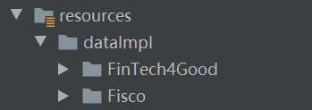

Spring 多源数据库问题
---
1. 在现实中的问题中，我们往往会面对需要多个数据库的问题，本文记录了Spring 2.0+如何通过代码配置完成多源数据库配置。

<!-- TOC -->

- [1. yml文件配置](#1-yml文件配置)
- [2. 第一数据源配置](#2-第一数据源配置)
- [3. 第二数据源配置](#3-第二数据源配置)
- [4. XML文件放置位置](#4-xml文件放置位置)

<!-- /TOC -->

# 1. yml文件配置
```yml
spring:
  datasource:
    # 第一数据源,默认数据源
    fintech4good:
        jdbc-url: jdbc:mysql://localhost:3306/FinTech4Good?serverTimezone=CTT&characterEncoding=UTF-8
        username: xxx
        password: xxx
        driver-class-name: com.mysql.cj.jdbc.Driver
        max-active: 200
        max-idle: 20
        min-idle: 10
    # 第二数据源
    fisco:
        jdbc-url: jdbc:mysql://localhost:3306/ficso?serverTimezone=CTT&characterEncoding=UTF-8
        username: FinTech4Good
        password: 123456789
        driver-class-name: com.mysql.cj.jdbc.Driver
        max-active: 200
        max-idle: 20
        min-idle: 10
```

1. 记录一个遇到的bug:`jdbcUrl is required with driverClassName`
2. 解决方案:`spring.datasource.url`替换成`spring.datasource.jdbc-url`
3. 官方解释:因为连接池的实际类型没有被公开，所以在您的自定义数据源的元数据中没有生成密钥，而且在IDE中没有完成(因为DataSource接口没有暴露属性)。另外，如果您碰巧在类路径上有Hikari，那么这个基本设置就不起作用了，因为Hikari没有url属性(但是确实有一个jdbcUrl属性)。在这种情况下，您必须重写您的配置
4. <a href = "https://www.cnblogs.com/jpfss/p/11083472.html">参考</a>

# 2. 第一数据源配置
```java
/**
 * 配置FinTech4Good,并且作为第一默认数据库
 */
@Configuration
@MapperScan(basePackages = "cn.edu.nju.fintech4good.dao.FinTech4Good", sqlSessionFactoryRef = "FinTech4GoodSessionFactory")
public class FinTech4GoodConfig {
    @Bean(name = "FinTech4GoodDatabase")
    @Primary
    @ConfigurationProperties(prefix = "spring.datasource.fintech4good")
    public DataSource getDateSource() {
        return DataSourceBuilder.create().build();
    }

    @Bean(name = "FinTech4GoodSessionFactory")
    @Primary//表示默认主数据库
    public SqlSessionFactory FinTech4GoodSessionFactory(@Qualifier("FinTech4GoodDatabase") DataSource datasource)
            throws Exception {
        SqlSessionFactoryBean bean = new SqlSessionFactoryBean();
        bean.setDataSource(datasource);
        bean.setVfs(SpringBootVFS.class);//必须配合，要不在上传到服务器会出现问题
        bean.setMapperLocations(
                new PathMatchingResourcePatternResolver().getResources("classpath:dataImpl/FinTech4Good/*Mapper.xml"));
        return bean.getObject();
    }

    @Bean("FinTech4GoodSqlSessionTemplate")
    @Primary
    public SqlSessionTemplate FinTech4GoodSqlSessionTemplate(
            @Qualifier("FinTech4GoodSessionFactory") SqlSessionFactory sessionfactory) {
        return new SqlSessionTemplate(sessionfactory);
    }
}
```

# 3. 第二数据源配置
```java
@Configuration
@MapperScan(basePackages = "cn.edu.nju.fintech4good.dao.Fisco", sqlSessionFactoryRef = "FiscoSessionFactory")
public class FiscoConfig {
    @Bean(name = "FiscoDatabase")
    @ConfigurationProperties(prefix = "spring.datasource.fisco")
    public DataSource getDateSource() {
        return DataSourceBuilder.create().build();
    }

    @Bean(name = "FiscoSessionFactory")
    public SqlSessionFactory FiscoSessionFactory(@Qualifier("FiscoDatabase") DataSource datasource)
            throws Exception {
        SqlSessionFactoryBean bean = new SqlSessionFactoryBean();
        bean.setDataSource(datasource);
        bean.setVfs(SpringBootVFS.class);
        bean.setMapperLocations(
                new PathMatchingResourcePatternResolver().getResources("classpath:dataImpl/Fisco/*Mapper.xml"));
        return bean.getObject();
    }

    @Bean("FiscoSqlSessionTemplate")
    public SqlSessionTemplate FiscoSqlSessionTemplate(
            @Qualifier("FiscoSessionFactory") SqlSessionFactory sessionfactory) {
        return new SqlSessionTemplate(sessionfactory);
    }
}
```

# 4. XML文件放置位置
