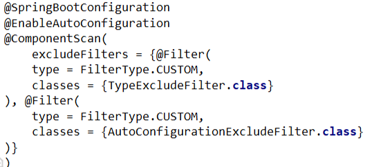
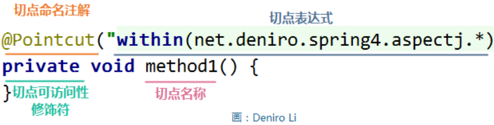

<!-- TOC -->

- [1. 核心注解](#1-核心注解)
- [2. 功能标签](#2-功能标签)
  - [2.1. 参考](#21-参考)
- [3. @Pointcut高级用法](#3-pointcut高级用法)
  - [3.1. 切点命名](#31-切点命名)
  - [3.2. 更多](#32-更多)
- [4. 元注解与实践](#4-元注解与实践)
  - [4.1. 元注解 @Retention](#41-元注解-retention)
  - [4.2. 元注解 @Target](#42-元注解-target)
  - [4.3. 元注解 @Document](#43-元注解-document)
  - [4.4. 元注解 @Inherited](#44-元注解-inherited)
  - [4.5. 元注解 @HandlesTypes](#45-元注解-handlestypes)
    - [4.5.1. 参考](#451-参考)
  - [4.6. 元注解例子](#46-元注解例子)
- [5. 注解 @Slf4j](#5-注解-slf4j)
- [6. 注解 @AutoWired](#6-注解-autowired)
  - [6.1. @Autowired使用地点](#61-autowired使用地点)
  - [6.2. 参数的意义](#62-参数的意义)
  - [6.3. @Autowired的原理](#63-autowired的原理)
  - [6.4. AutowiredAnnotationBeanPostProcessor解析@Autowired](#64-autowiredannotationbeanpostprocessor解析autowired)
  - [6.5. @Autowired的注解应用](#65-autowired的注解应用)
- [7. @Component](#7-component)
- [8. @Bean](#8-bean)
- [9. @Enableduling](#9-enableduling)
  - [9.1. 定时任务的作用](#91-定时任务的作用)
  - [9.2. 代码实现的方法](#92-代码实现的方法)
  - [9.3. fixedDelay](#93-fixeddelay)
  - [9.4. fixedRate](#94-fixedrate)
  - [9.5. initialDelay](#95-initialdelay)
  - [9.6. cron](#96-cron)
  - [9.7. 动态修改cron参数](#97-动态修改cron参数)
- [10. @Transactional](#10-transactional)
  - [10.1. 利用该注解管理事务的实现](#101-利用该注解管理事务的实现)
  - [10.2. Spring的注解方式的事务实现机制](#102-spring的注解方式的事务实现机制)
  - [10.3. 注解方式的事务使用注意事项](#103-注解方式的事务使用注意事项)
    - [10.3.1. 正确配置propagation属性](#1031-正确配置propagation属性)
    - [10.3.2. 正确的设置@Transactional 的 rollbackFor 属性](#1032-正确的设置transactional-的-rollbackfor-属性)
    - [10.3.3. @Transactional 只能应用到 public 方法才有效](#1033-transactional-只能应用到-public-方法才有效)
    - [10.3.4. 避免 Spring 的 AOP 的自调用问题](#1034-避免-spring-的-aop-的自调用问题)
- [11. @ComponentScan](#11-componentscan)
- [12. @EnableAutoConfiguration](#12-enableautoconfiguration)
  - [12.1. @EnableScheduling](#121-enablescheduling)
  - [12.2. @EnableMBeanExport](#122-enablembeanexport)
- [13. @Conditional](#13-conditional)
- [14. @Profile](#14-profile)
  - [14.1. 源码](#141-源码)
  - [14.2. 描述](#142-描述)
- [15. @ResponseBody 和 @ResponseStatus](#15-responsebody-和-responsestatus)
- [16. 参考](#16-参考)

<!-- /TOC -->
# 1. 核心注解
1. 在一个标准的java应用程序的入口处(main)，我们需要核心注解。@SpringBootApplication
    + 它是一个组合注解，包含以下注解

```java
@springBootApplication
public class DemoApplication(){
    public static void main(String[] args){
        SpringApplication.run(DemoApplication.class,args);
    }
}
```
2. @SpringBootConfiguration：组合了 @Configuration 注解，实现配置文件的功能。@Configuration是 Spring 3.0 添加的一个注解，用来代替 applicationContext.xml 配置文件，所有这个配置文件里面能做到的事情都可以通过这个注解所在类来进行注册。
3. @EnableAutoConfiguration：打开自动配置的功能，也可以关闭某个自动配置的选项，如关闭数据源自动配置功能： @SpringBootApplication(exclude = { DataSourceAutoConfiguration.class })。
4. @ComponentScan：用来代替配置文件中的 component-scan 配置，开启组件扫描，即自动扫描包路径下的 @Component 注解进行注册 bean 实例到 context 中。 
5. Spring Boot会扫描主类所在的包路径下的注解。

# 2. 功能标签

标签名|含义
--|--
`@Service`|用于标注业务层组件，service层或者manager层
`@Controller`|用于标注控制层组件，action层
`@Repository`|用于标注数据访问组件，即DAO组件
`@Component`|用于泛指组件，不好归类时，我们选择这种组件

1. 这个标签主要使用于标记这个接口的使用
2. 通过写参数来放置不同组件之间的冲突
3. **必须按照要求标记标签，便于注入框架**
4. **从前端接受的数据必须标记@ResponseBody**

## 2.1. 参考
1. <a href = "https://blog.csdn.net/qq_26125865/article/details/82881481">四种元注释</a>

# 3. @Pointcut高级用法

## 3.1. 切点命名
1. 一般情况下，切点是直接在增强方法处定义，这种切点的声明方法称为匿名切点。
2. 切点命令例子
```java
public class NamePointcut {
    /**
     * 切点被命名为 method1，且该切点只能在本类中使用
     */
    @Pointcut("within(net.deniro.spring4.aspectj.*)")
    private void method1() {
    }
    /**
     * 切点被命名为 method2，且该切点可以在本类或子孙类中使用
     */
    @Pointcut("within(net.deniro.spring4.aspectj.*)")
    protected void method2() {
    }
    /**
     * 切点被命名为 method3，且该切点可以在任何类中使用
     * 这里还使用了复合运算
     */
    @Pointcut("method1() && method2()")
    public void method3() {
    }
}
```


## 3.2. 更多
<a href = "https://blog.csdn.net/deniro_li/article/details/81838197">切点</a>

# 4. 元注解与实践

## 4.1. 元注解 @Retention
1. <a href ="https://blog.csdn.net/u010002184/article/details/79166478">@Retention</a>可以用来修饰注解，是注解的注解，称为元注解。而这个决定注解保留的位置。
2. @Retention的注解中的RetentionPolicy有三个值:
    1. RetentionPolicy.SOURCE：注解只保留在源文件，当Java文件编译成class文件的时候，注解被遗弃；
    2. RetentionPolicy.CLASS：注解被保留到class文件，但jvm加载class文件时候被遗弃，这是默认的生命周期；
    3. RetentionPolicy.RUNTIME：注解不仅被保存到class文件中，jvm加载class文件之后，仍然存在；


## 4.2. 元注解 @Target
1. 注解作用的目标
```java
@Target(ElementType.TYPE)   //接口、类、枚举、注解
@Target(ElementType.FIELD) //字段、枚举的常量
@Target(ElementType.METHOD) //方法
@Target(ElementType.PARAMETER) //方法参数
@Target(ElementType.CONSTRUCTOR)  //构造函数
@Target(ElementType.LOCAL_VARIABLE)//局部变量
@Target(ElementType.ANNOTATION_TYPE)//注解
@Target(ElementType.PACKAGE) ///包   
```

## 4.3. 元注解 @Document
1. 标注这个注解将被包含在<a href ="https://blog.csdn.net/vbirdbest/article/details/80296136">javadoc</a>中

## 4.4. 元注解 @Inherited
1. 说明子类可以继承父类中的该注解

## 4.5. 元注解 @HandlesTypes
1. 作用将注解指定的class对象作为参数传递到onStartup(ServeletContainerInitializer)方法中。
2. 这个注解是留给用户进行扩展的
   1. 其指定的Class对象并没有要继承ServletContainerInitializer
   2. 也没有写入META-INF/services/的文件
3. 问题:没有上述两种操作，Tomcat如何扫描到指定的类呢？
   1. Byte Code Engineering Library(BCEL),这是字节码操纵框架的之一。
   2. webConfig() 在调用`processServletContainerInitializers()`时记录下注解的类名，然后在Step 4和Step 5中都来到`processAnnotationsStream`这个方法，使用BCEL的`ClassParser`在字节码层面读取了/`WEB-INF/classes`和某些jar（应该可以在叫做fragments的概念中指定）中class文件的超类名和实现的接口名，判断是否与记录的注解类名相同，若相同再通过`org.apache.catalina.util.Introspection`类load为Class对象，最后保存起来，于Step 11中交给`org.apache.catalina.core.StandardContext`，也就是tomcat实际调用`ServletContainerInitializer.onStartup()`的地方。

### 4.5.1. 参考
<a href = "https://www.cnblogs.com/feixuefubing/p/11593411.html">Java SPI、servlet3.0与@HandlesTypes源码分析</a>

## 4.6. 元注解例子
```java
@Retention(RetentionPolicy.RUNTIME)
@Target({ElementType.METHOD})
public @interface AnnatDemo{
　　　public int value();
}
```
1. 以上代码定义了@AnnatDemo注解，作用目标是用于对方法注解，并且保留在运行时的环境中，我们可以利用反射获得一个方法上的注解调用定义的方法
```java
//比如@AnnatDemo作用于以下方法：
public interface IClientProtocolEx extends IProtocol {
　　int METHOD_START=0;
　　@AnnatDemo(METHOD_START)
　　public String say(String person);
}
//使用如下代码进行反射
Class ipt=IClientProtocalEx.class;
Method[] mts=ipt.getMethod();
for(Method mt:mts){
　　AnnatDemo ad=mt.getAnnotation(AnnatDemo.class);//如果方法上  没有该注解  则返回null
    int value=ad.value();
　　System.out.println("value:"+value);
}
```

# 5. 注解 @Slf4j
1. 是用来省去打印日志所需要的重复代码
2. 也就是如果不想写:`private final Logger logger = LoggerFactory.getLogger(当前类名.class)`则可以使用注解@Slf4j
3. 前置条件:需要添加lombok的依赖。
4. 之后使用可以直接使用`log.info(str)`来写入日志
5. <a href = "https://www.jianshu.com/p/6e137ee836a1">简述参考</a>

# 6. 注解 @AutoWired

## 6.1. @Autowired使用地点
```java
@Target({ElementType.CONSTRUCTOR, ElementType.METHOD, ElementType.PARAMETER, ElementType.FIELD, ElementType.ANNOTATION_TYPE})
```

## 6.2. 参数的意义
```
require = ture 时，表示解析被标记的字段或方法，一定有对应的bean存在。
require = false 时，表示解析被标记的字段或方法，没有对应的bean存在不会报错。
```

1. 标签接口
```java
public @interface Autowired {
    /**
     * Declares whether the annotated dependency is required.
     * <p>Defaults to {@code true}.
     */
    boolean required() default true;
}
```

## 6.3. @Autowired的原理
1. 添加`AutowiredAnnotationBeanPostProcessor`
2. 首先在执行`AbstractApplicationContext#refresh()`方法时会执行`obtainFreshBeanFactory()`方法，而这个方法执行时，会在
`DefaultListableBeanFactory#beanDefinitionNames`数组中添加`internalAutowiredAnnotationProcessor`。而`internalAutowiredAnnotationProcessor`是和`AutowiredAnnotationBeanPostProcessor`被一起注册到`registerPostProcessor`中

```java
if (!registry.containsBeanDefinition(AUTOWIRED_ANNOTATION_PROCESSOR_BEAN_NAME)) {
    RootBeanDefinition def = new RootBeanDefinition(AutowiredAnnotationBeanPostProcessor.class);
    def.setSource(source);
    beanDefs.add(registerPostProcessor(registry, def, AUTOWIRED_ANNOTATION_PROCESSOR_BEAN_NAME));
}
```

3. 在项目启动的时候，自动执行refresh方法中的`registerBeanPostProcessors(beanFactory)`
```java
protected void registerBeanPostProcessors(ConfigurableListableBeanFactory beanFactory) {
    PostProcessorRegistrationDelegate.registerBeanPostProcessors(beanFactory, this);
}
// 这个方法我们使用委派模式进行委派
public static void registerBeanPostProcessors(ConfigurableListableBeanFactory beanFactory, AbstractApplicationContext applicationContext) {
    String[] postProcessorNames = beanFactory.getBeanNamesForType(BeanPostProcessor.class, true, false);
     ...
    registerBeanPostProcessors(beanFactory, priorityOrderedPostProcessors);
     ...
}
```
4. `getBeanNamesForType` 是对前面加载的`internalAutowiredAnnotationProcessor`进行转换成`AutowiredAnnotationBeanPostProcessor`然后把返回值`postProcessorNames`转为`priorityOrderedPostProcessors`然后注册到`registerBeanPostProcessors`中
```java
private static void registerBeanPostProcessors(
        ConfigurableListableBeanFactory beanFactory, List<BeanPostProcessor> postProcessors) {
    for (BeanPostProcessor postProcessor : postProcessors) {
        beanFactory.addBeanPostProcessor(postProcessor);
    }
}
```
5. AbstractBeanFactory#beanPostProcessors
```java
public void addBeanPostProcessor(BeanPostProcessor beanPostProcessor) {
    Assert.notNull(beanPostProcessor, "BeanPostProcessor must not be null");
    // Remove from old position, if any
    this.beanPostProcessors.remove(beanPostProcessor);
    // Track whether it is instantiation/destruction aware
    if (beanPostProcessor instanceof InstantiationAwareBeanPostProcessor) {
        this.hasInstantiationAwareBeanPostProcessors = true;
    }
    if (beanPostProcessor instanceof DestructionAwareBeanPostProcessor) {
        this.hasDestructionAwareBeanPostProcessors = true;
    }
    // Add to end of list
    this.beanPostProcessors.add(beanPostProcessor);
}
```

## 6.4. AutowiredAnnotationBeanPostProcessor解析@Autowired
1. refresh()执行完registerBeanPostProcessors 方法后，继续执行finishBeanFactoryInitialization(beanFactory);

```java
protected void finishBeanFactoryInitialization(ConfigurableListableBeanFactory beanFactory) {
    ...
    // Instantiate all remaining (non-lazy-init) singletons.
    beanFactory.preInstantiateSingletons();
}
```

2. 这里spring会创建需要的bean，一般在controller层中引入的service也会在此时依赖加载和创建
```java
public void preInstantiateSingletons() throws BeansException {
    if (logger.isTraceEnabled()) {
        logger.trace("Pre-instantiating singletons in " + this);
    }
    for (String beanName : beanNames) {
        RootBeanDefinition bd = getMergedLocalBeanDefinition(beanName);
                   ...
        getBean(beanName);
                   ...
    }
}
```

3. 在自定义的controller层时，会在getBean中执行autowire解析
```java
public Object getBean(String name) throws BeansException {
    return doGetBean(name, null, null, false);
}
protected <T> T doGetBean(final String name, @Nullable final Class<T> requiredType,
    @Nullable final Object[] args, boolean typeCheckOnly) throws BeansException {
    return createBean(beanName, mbd, args);
}
protected Object createBean(String beanName, RootBeanDefinition mbd, @Nullable Object[] args)
            throws BeanCreationException {
      ...
      doCreateBean(beanName, mbdToUse, args);
      ...
}
```
4. doCreateBean是真正的bean实现，在创建的时候调用了`applyMergedBeanDefinitionPostProcessors(mbd, beanType, beanName);`
```java
protected Object doCreateBean(final String beanName, final RootBeanDefinition mbd, final @Nullable Object[] args)
            throws BeanCreationException {
              ...
    applyMergedBeanDefinitionPostProcessors(mbd, beanType, beanName);
            ...
    }

//
protected void applyMergedBeanDefinitionPostProcessors(RootBeanDefinition mbd, Class<?> beanType, String beanName) {
    for (BeanPostProcessor bp : getBeanPostProcessors()) {
        if (bp instanceof MergedBeanDefinitionPostProcessor) {
            MergedBeanDefinitionPostProcessor bdp = (MergedBeanDefinitionPostProcessor) bp;
            bdp.postProcessMergedBeanDefinition(mbd, beanType, beanName);
        }
    }
}
```

5. `getBeanPostProcessors`方法获取的就是上文中添加的`AutowiredAnnotationBeanPostProcessor`的集合`beanPostProcessors`。
则执行我们的想看到的`AutowiredAnnotationBeanPostProcessor#postProcessMergedBeanDefinition`。

```java
public void postProcessMergedBeanDefinition(RootBeanDefinition beanDefinition, Class<?> beanType, String beanName) {
    InjectionMetadata metadata = findAutowiringMetadata(beanName, beanType, null);
    metadata.checkConfigMembers(beanDefinition);
}
```

6. findAutowiringMetadata查询这个beanName中，是否有
```java
private InjectionMetadata findAutowiringMetadata(String beanName, Class<?> clazz, @Nullable PropertyValues pvs) {
    ...
    metadata = buildAutowiringMetadata(clazz);
    ...
}
//有点小问题
private InjectionMetadata buildAutowiringMetadata(final Class<?> clazz) {
    List<InjectionMetadata.InjectedElement> elements = new ArrayList<>();
    Class<?> targetClass = clazz;
    AnnotationAttributes ann = findAutowiredAnnotation(bridgedMethod);
    if (ann != null && method.equals(ClassUtils.getMostSpecificMethod(method, clazz))) {
        boolean required = determineRequiredStatus(ann);
        PropertyDescriptor pd = BeanUtils.findPropertyForMethod(bridgedMethod, clazz);
        currElements.add(new AutowiredMethodElement(method, required, pd));
    }
    elements.addAll(0, currElements);
    targetClass = targetClass.getSuperclass();
    return new InjectionMetadata(clazz, elements);
}
```
7. `findAutowiredAnnotation(bridgedMethod)`找到这个类的autowire注解的类，添加到InjectionMetadata对象中。然后在checkConfigMembers方法中又注册到beanDefinition中。
```java
@Override
public void postProcessMergedBeanDefinition(RootBeanDefinition beanDefinition, Class<?> beanType, String beanName) {
    InjectionMetadata metadata = findAutowiringMetadata(beanName, beanType, null);
    metadata.checkConfigMembers(beanDefinition);
}
public void checkConfigMembers(RootBeanDefinition beanDefinition) {
    Set<InjectedElement> checkedElements = new LinkedHashSet<>(this.injectedElements.size());
    for (InjectedElement element : this.injectedElements) {
        Member member = element.getMember();
        if (!beanDefinition.isExternallyManagedConfigMember(member)) {
            beanDefinition.registerExternallyManagedConfigMember(member);
            checkedElements.add(element);
            if (logger.isTraceEnabled()) {
                logger.trace("Registered injected element on class [" + this.targetClass.getName() + "]: " + element);
            }
        }
    }
    this.checkedElements = checkedElements;
}
```

## 6.5. @Autowired的注解应用
1. 主要是使得其能够自动装配
```java
private TbPositionDAO positionMapper;
	@Autowired
	public PositionServiceImpl(TbPositionDAO tbPositionDAO) {
		this.positionMapper = tbPositionDAO;
	}
```

# 7. @Component
1. @Component注解表明一个类会作为组件类，并告知spring要为这个类创建bean


# 8. @Bean
1. @Bean注解告诉Spring对象这个方法将会返回一个组成到Spring应用上下文中的bean，通常方法体中包含了最终产生bean实例的逻辑。
```java
//Component和Bean可以通用的
public class WireThirdLibClass {
    @Bean
    public ThirdLibClass getThirdLibClass() {
        return new ThirdLibClass();
    }
}
//只能使用Bean
@Bean
public OneService getService(status) {
    case (status)  {
        when 1:
                return new serviceImpl1();
        when 2:
                return new serviceImpl2();
        when 3:
                return new serviceImpl3();
    }
}
```

# 9. @Enableduling

## 9.1. 定时任务的作用
1. 定时任务相当于闹钟，在什么时间做什么事情

## 9.2. 代码实现的方法
1. 启动类里面使用@EnableScheduling注解开启功能，自动扫描
```java
@SpringBootApplication
@EnableScheduling //开启定时任务
public class MainApplication {

    public static void main(String[] args) {
        SpringApplication.run(MainApplication.class, args);
    }
}
```
1. 不同的注解的含义
```java
//表示上一个方法结束后5秒
@Scheduled(fixedDelay = 5000)
//表示每隔3秒
@Scheduled(fixedRate = 3000)
//表示每天8时30分0秒执行
@Scheduled(cron = "0 0,30 0,8 ? * ? ")
```

## 9.3. fixedDelay
1. 单位毫秒，指等业务结束之后在对应时间后执行

## 9.4. fixedRate
1. 单位毫秒，指每多少毫秒执行一次

## 9.5. initialDelay
1. 表示一个初识延迟时间，第一次被调用前延迟的时间

## 9.6. cron
1. 比如你要设置每天什么时候执行，就可以用它，特殊的语法可以去查。
```
* 第一位，表示秒，取值0-59
* 第二位，表示分，取值0-59
* 第三位，表示小时，取值0-23
* 第四位，日期天/日，取值1-31
* 第五位，日期月份，取值1-12
* 第六位，星期，取值1-7，星期一，星期二...，注：不是第1周，第二周的意思
          另外：1表示星期天，2表示星期一。
* 第7为，年份，可以留空，取值1970-2099
```
2. 部分的特殊时间
```
(*)星号：可以理解为每的意思，每秒，每分，每天，每月，每年...
(?)问号：问号只能出现在日期和星期这两个位置。
(-)减号：表达一个范围，如在小时字段中使用“10-12”，则表示从10到12点，即10,11,12
(,)逗号：表达一个列表值，如在星期字段中使用“1,2,4”，则表示星期一，星期二，星期四
(/)斜杠：如：x/y，x是开始值，y是步长，比如在第一位（秒） 0/15就是，从0秒开始，每15秒，最后就是0，15，30，45，60    另：*/y，等同于0/y
```
3. 实例:
```
0 0 3 * * ?     每天3点执行
0 5 3 * * ?     每天3点5分执行
0 5 3 ? * *     每天3点5分执行，与上面作用相同
0 5/10 3 * * ?  每天3点的 5分，15分，25分，35分，45分，55分这几个时间点执行
0 10 3 ? * 1    每周星期天，3点10分 执行，注：1表示星期天    
0 10 3 ? * 1#3  每个月的第三个星期，星期天 执行，#号只能出现在星期的位置
```

## 9.7. 动态修改cron参数
```java
@Component
@EnableScheduling
@Transactional
public class ReleasedTask implements SchedulingConfigurer{
	private Logger log = Logger.getLogger(getClass());
	private TradeConfigMapper tradeConfigMapper;
	@Autowired
	private TradeConfigService configService;
	@Autowired
	private UserAccountService accountService;
	@Autowired
	private UserAccountDetailService accountDetailService;
	private String cron;
	
	@Autowired
	public ReleasedTask(TradeConfigMapper tradeConfigMapper) {
		// 获取每几天释放一次参数(单位：天)
		this.tradeConfigMapper = tradeConfigMapper;
		String interval = tradeConfigMapper.getTimeInterval().getConfigValue();
		this.cron = "0 0 3 */" + interval + " * ?";
		//cron = "*/10 * * * * ?";
	}  
	
	@Override
	public void configureTasks(ScheduledTaskRegistrar taskRegistrar) {
		taskRegistrar.addTriggerTask(new Runnable() {  
            @Override  
            public void run() {  
            	//是否执行自动释放
            	String autoRelease = configService.getConfig(TradeConstants.TRADE_CONFIG_AUTO_RELEASE);
            	if (autoRelease.equals("1")) {
            		// 任务逻辑  
                	log.info("任务执行---------");
            		log.info("任务执行完---------");
				}
            }  
        }, new Trigger() {
            @Override  
            public Date nextExecutionTime(TriggerContext triggerContext) {  
                // 任务触发，可修改任务的执行周期  
                CronTrigger trigger = new CronTrigger(cron);  
                Date nextExec = trigger.nextExecutionTime(triggerContext);  
                return nextExec;  
            }  
        });  
	}
}
```

# 10. @Transactional
1. 声明式事务有两种方式
   1. 在配置文件xml中做相关的事务规则声明
   2. 基于@Transactional注解来进行事务的声明

## 10.1. 利用该注解管理事务的实现
1. 首先在xml配置文件中添加相应的事务配置信息，@EnableTransactionManagement注解来启用事务管理功能。

```xml
<tx:annotation-driven />
<bean id="transactionManager"
class="org.springframework.jdbc.datasource.DataSourceTransactionManager">
<property name="dataSource" ref="dataSource" />
</bean>
```
2. 第二步:将@Transactional注解添加到合适的方法上，并设置合适的属性信息。
   1. 当然这个注解也可以被添加到类上

```java
@Transactional(propagation= Propagation.SUPPORTS,readOnly=true)
@Service(value ="employeeService")
public class EmployeeService
```

属性名|说明
--|--
name|当在配置文件中有多个 TransactionManager , 可以用该属性指定选择哪个事务管理器。
propagation|事务的传播行为，默认值为 REQUIRED。
isolation|事务的隔离度，默认值采用 DEFAULT。
timeout|事务的超时时间，默认值为-1。如果超过该时间限制但事务还没有完成，则自动回滚事务。
read-only|指定事务是否为只读事务，默认值为 false；为了忽略那些不需要事务的方法，比如读取数据，可以设置 read-only 为 true。
rollback-for|用于指定能够触发事务回滚的异常类型，如果有多个异常类型需要指定，各类型之间可以通过逗号分隔。
no-rollback- for|抛出 no-rollback-for 指定的异常类型，不回滚事务。

## 10.2. Spring的注解方式的事务实现机制
1. Spring Framework默认使用AOP代理，根据@Transaction的属性配置信息，决定是否由拦截器TransactionInterceptor来使用拦截
2. 如果触发拦截，那么会在目标方法开始执行前创建并加入事务，并且执行目标方法的逻辑，最后根据执行情况是否出现异常，利用抽象事务管理器AbstracPlatformTransactionManager操作数据源DataSourse提交或回滚事务。
3. 详细的具体图解参照参考

## 10.3. 注解方式的事务使用注意事项

### 10.3.1. 正确配置propagation属性
1. 需要注意下面三种 propagation 可以不启动事务。本来期望目标方法进行事务管理，但若是错误的配置这三种 propagation，事务将不会发生回滚。
   1. TransactionDefinition.PROPAGATION_SUPPORTS：如果当前存在事务，则加入该事务；如果当前没有事务，则以非事务的方式继续运行。
   2. TransactionDefinition.PROPAGATION_NOT_SUPPORTED：以非事务方式运行，如果当前存在事务，则把当前事务挂起。
   3. TransactionDefinition.PROPAGATION_NEVER：以非事务方式运行，如果当前存在事务，则抛出异常。

### 10.3.2. 正确的设置@Transactional 的 rollbackFor 属性
1. 默认情况下，如果在事务中抛出了未检查异常（继承自 RuntimeException 的异常）或者 Error，则 Spring 将回滚事务；除此之外，Spring 不会回滚事务。
2. 如果在事务中抛出其他类型的异常，并期望 Spring 能够回滚事务，可以指定 rollbackFor。例：
    + @Transactional(propagation= Propagation.REQUIRED,rollbackFor= MyException.class)
3. 通过分析 Spring 源码可以知道，若在目标方法中抛出的异常是 rollbackFor 指定的异常的子类，事务同样会回滚。

### 10.3.3. @Transactional 只能应用到 public 方法才有效
1. 只有@Transactional 注解应用到 public 方法，才能进行事务管理。这是因为在使用 Spring AOP 代理时，Spring 在调用在图 1 中的 TransactionInterceptor 在目标方法执行前后进行拦截之前，DynamicAdvisedInterceptor（CglibAopProxy 的内部类）的的 intercept 方法或 JdkDynamicAopProxy 的 invoke 方法会间接调用 AbstractFallbackTransactionAttributeSource（Spring 通过这个类获取表 1. @Transactional 注解的事务属性配置属性信息）的 computeTransactionAttribute 方法。

### 10.3.4. 避免 Spring 的 AOP 的自调用问题
1. 在 Spring 的 AOP 代理下，只有目标方法由外部调用，目标方法才由 Spring 生成的代理对象来管理，这会造成自调用问题。若同一类中的其他没有@Transactional 注解的方法内部调用有@Transactional 注解的方法，有@Transactional 注解的方法的事务被忽略，不会发生回滚。见清单 5 举例代码展示。

# 11. @ComponentScan
1. Spring容器会扫描@ComponentScan配置的包路径，找到其中的@Component注解的类加入到Spring容器中

# 12. @EnableAutoConfiguration
1. 就是借助@Import的支持，收集和注册特定场景相关的Bean定义
```java
//@EnableAutoConfiguration的复合注解情况
@SuppressWarnings("deprecation")
@Target(ElementType.TYPE)
@Retention(RetentionPolicy.RUNTIME)
@Documented
@Inherited
@AutoConfigurationPackage
@Import(EnableAutoConfigurationImportSelector.class)
public @interface EnableAutoConfiguration {
    ...
}
```

## 12.1. @EnableScheduling
1. 通过@Import将Spring调度框架相关的bean定义都加载到IoC容器。

## 12.2. @EnableMBeanExport
1. 通过@Import将JMX相关的bean定义加载到IoC容器。

# 13. @Conditional
1. `@Conditional`这个注解表示只有在所有指定条件匹配时, 组件才有资格进行注册。
2. `@Conditional`可以通过以下任何方式使用： 
   1. 在任何直接或间接使用`@Component`和`@Configuration`的类上作为一个类型注解使用 
   2. 作为元注解 
   3. 作为任何`@Bean`方法的方法级注解
3. 如果使用`@Conditional`标记`@Configuration`类, 则与该类关联的所有`@Bean`方法, `@Import`注解和`@ComponentScan`注解都将受条件限制。


# 14. @Profile

## 14.1. 源码
```java
@Target({ElementType.TYPE, ElementType.METHOD})
@Retention(RetentionPolicy.RUNTIME)
@Documented
@Conditional(ProfileCondition.class)
public @interface Profile {
    String[] value();
}
//profileCondtion.class
class ProfileCondition implements Condition {
    @Override
    public boolean matches(ConditionContext context, AnnotatedTypeMetadata metadata 这个玩意) {
        // metadata 这个玩意是你以注解方式配置的Spring的、尚未被IOC容器处理的内容 (又分AnnotationMetadata和MethodMetadata 说多了)   
        MultiValueMap<String, Object> attrs = metadata.getAllAnnotationAttributes(Profile.class.getName());
        if (attrs != null) {
            for (Object value : attrs.get("value")) {
                if (context.getEnvironment().acceptsProfiles(Profiles.of((String[]) value))) {
                    return true;
                }
            }
            return false;
        }
        return true;
    }
}
```

1. 在上面的matches类中:获取你以`@Profile`注解配置的方法/类, 然后解析其中的`value`值形成一个`MultiValueMap`结构。
2. 如果任何一个值通过`acceptsProfiles`的验证, 则`@Conditional(ProfileCondition.class)`成立
可通过`applicationContext.getEnvironment().setActiveProfiles("chinese")`;设置配置, 也可以通过注解`@ActiveProfiles(..)`设置。
```java
@Configuration
public class AppConfig {
    @Profile("english")
    @Bean
    public English getEnglish() { return new English(); }

    @Profile("chinese")
    @Bean
    public Chinese getChinese() { return new Chinese(); }
}

class Chinese { }

class English { }

// 测试类
public class Test {
    public static void main(String[] args) {
        AnnotationConfigApplicationContext applicationContext = new AnnotationConfigApplicationContext();
        applicationContext.getEnvironment().setActiveProfiles("chinese");
        applicationContext.register(AppConfig.class);
        applicationContext.refresh();
        String[] beanDefinitionNames = applicationContext.getBeanDefinitionNames();
        for (String beanDefinitionName : beanDefinitionNames) {
            System.out.println(beanDefinitionName); // 这里你可以看看打印的bean是否和你想的一样
        }
    }
}
```

4. 如果要定义具有不通过Profile条件的备用bean，需要指定方法名
```java
//TODO
@Configuration
public class ProfileDatabaseConfig {
    @Bean("dataSource")
    @Profile("development")
    public DataSource embeddedDatabase() { ... }

    @Bean("dataSource")
    @Profile("production")
    public DataSource productionDatabase() { ... }
}
```

## 14.2. 描述
1. @Profile:Spring提供给我们根据当前的环境，动态的激活和切换一系列组件的功能
2. 这个指定组件在哪个环境下才会被注册到容器中，不指定，任何环境下都能注册这个组件

环境|名称|数据源
开发环境|develop|/dev
测试环境|test|/test
生产环境|master|/master

3. 加了环境标识的bean，只有在对应环境下才能被激活，默认为default环境
4. 写在配置类上，只有是指定的环境，整个配置类里面的所有配置才能开始生效。
5. profile表达式支持一下操作符:
   1. ! 非
   2. & 并
   3. | 或


# 15. @ResponseBody 和 @ResponseStatus
1. @ResponseBody：典型spring mvc应用，请求点通常返回html页面。有时我们仅需要实际数据，如使用ajax请求。这时我们能通过@ResponseBody注解标记请求处理方法，审批人能够处理方法结果值作为http响应体。
2. @ResponseStatus:当请求点成功返回，spring提供http 200(ok)相应。如果请求点抛出异常，spring查找异常处理器，由其返回相应的http状态码。对这些方法增加@ResponseStatus注解，spring会返回自定义http状态码。

# 16. 参考
1. <a href = "https://www.jianshu.com/p/3fbfbb843b63">Spring中@Component与@Bean的区别</a>
2. <a href = "https://www.jianshu.com/p/2ad7969fdcb8">Springboot中@Autowired的原理解析</a>
3. <a href = "https://www.jianshu.com/p/9d18039c0f08">SpringBoot定时任务@EnableScheduling</a>
4. <a href = "https://blog.csdn.net/qq_41899174/article/details/89857259">spring的定时任务，超级简单好用</a>
5. <a href = "https://blog.csdn.net/qq_34845394/article/details/86351317?depth_1-utm_source=distribute.pc_relevant.none-task&utm_source=distribute.pc_relevant.none-task">两种定时器的实现</a>
6. <a href = "https://www.cnblogs.com/xd502djj/p/10940627.html">透彻的掌握 Spring 中@transactional 的使用</a>
7. <a href = "https://blog.csdn.net/ysl19910806/article/details/91646554">@Profile注解详解</a>
8. <a href = "https://www.jianshu.com/p/75de79fba705">Spring @Profile 注解介绍</a>