Lec04-Devops与测试 
---

# 1. 技术路线图
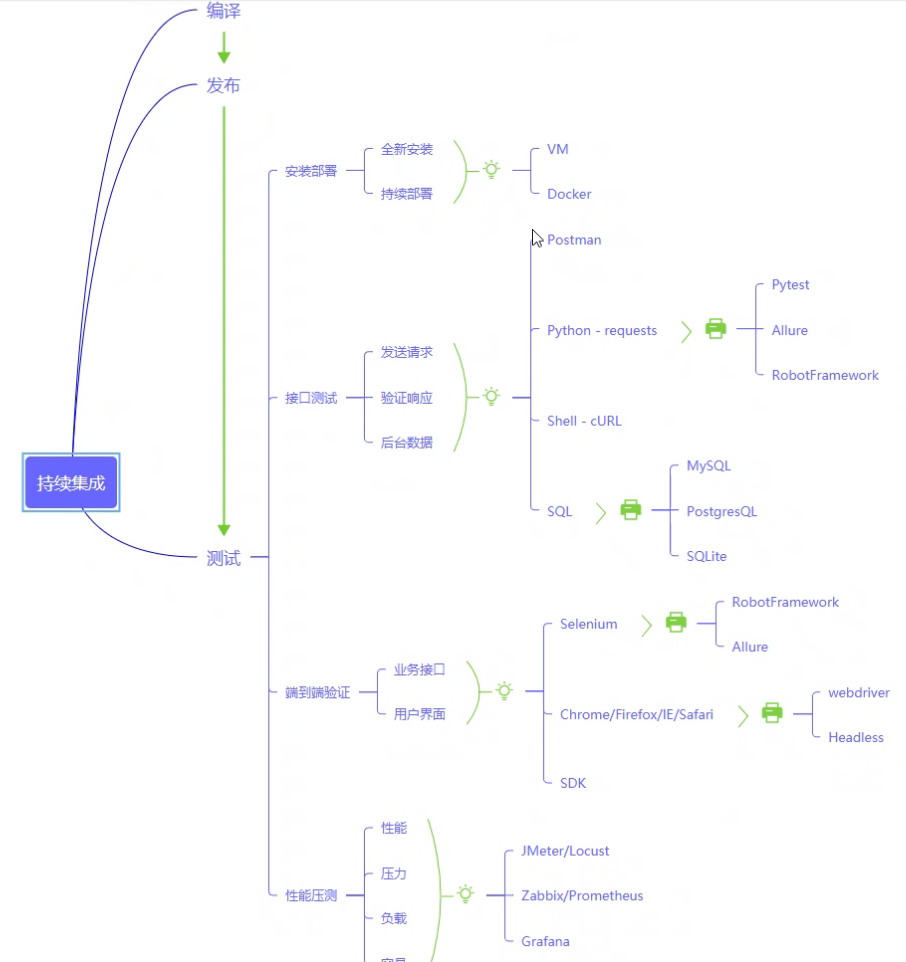

1. PMP和ScrumMaster认证

# 2. 自动化测试
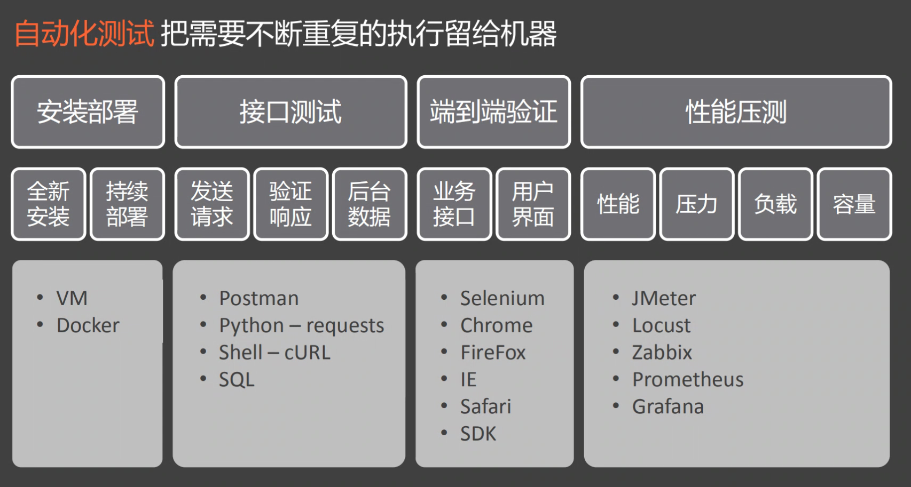

1. 企业级虚拟机
2. Shell:要求比较高
3. 测试工具会封装一些SDK，因为有的接口所有信息全是加密的
4. 什么是压测?有的在生产环境压测
   1. 性能压测:保证性能的前提下，进行测试
   2. 压力压测:慢慢逐渐增加，适当持续，到崩了的时候
   3. 负载:大概80%左右，持续的运行较长的时间
5. 内部测100万，可能对外交付声明的是50万
  
## 2.1. 自动测试软件
1. Zabbix和Prometheus用来检测一些硬件指标，检查微服务是否正常
2. 在快速部署发布的条件下，如何进行高效测试是一个问题

## 2.2. UI测试自动化
1. 测试自动化的成本太高
2. 每次迭代，主流程若无太大变化，可考虑自动化方案
3. 太早进行是不好的(往往1.x版本是不稳定的)

## 2.3. 为什么选择Selenium?
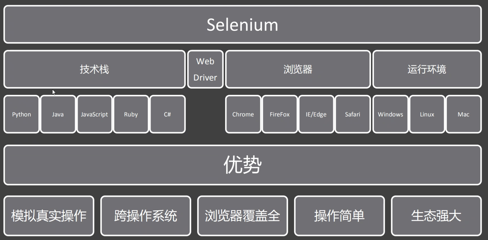

1. 基本上支持大部分的浏览器和技术栈
2. Selenium模拟了用户操作，但是速度受限
3. 本身通过JS完成实现
4. WebDriver是代替人去操作的核心

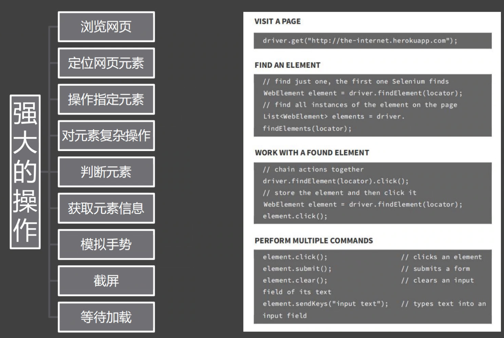

## 2.4. RobotFrameWork
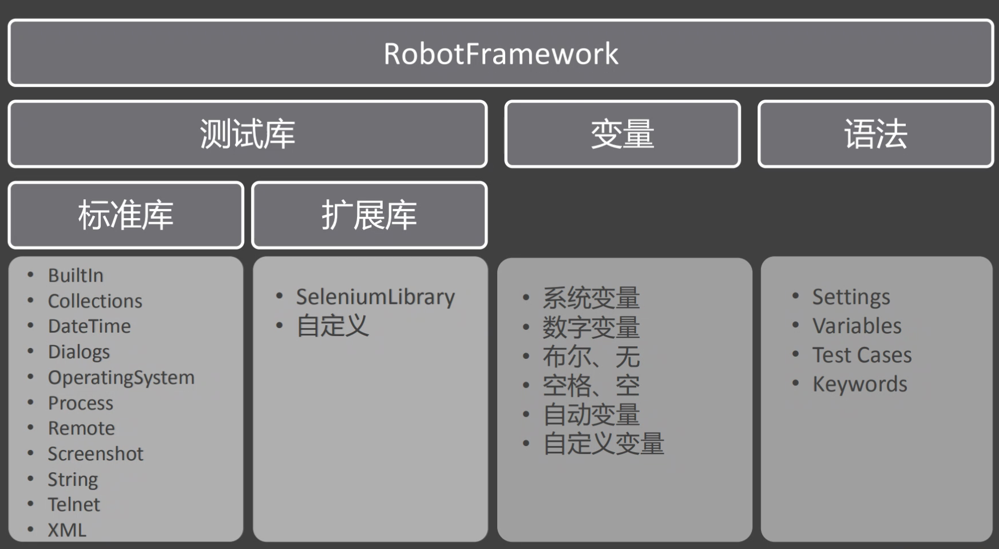
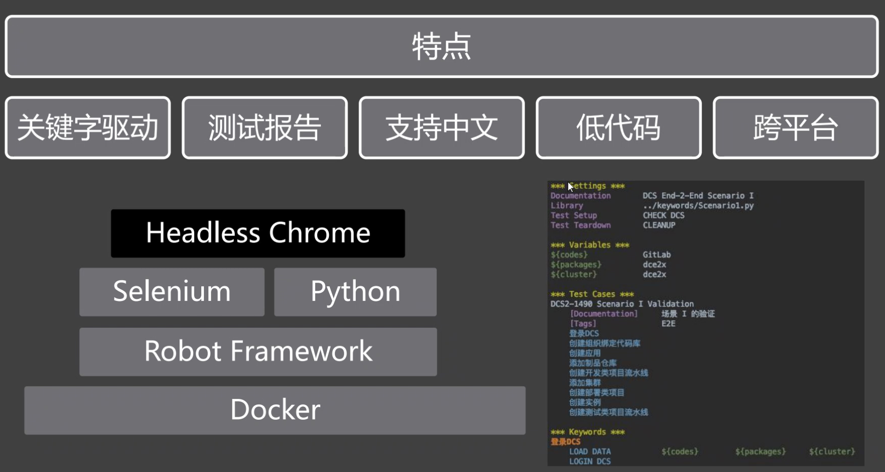

## 2.5. 测试过程
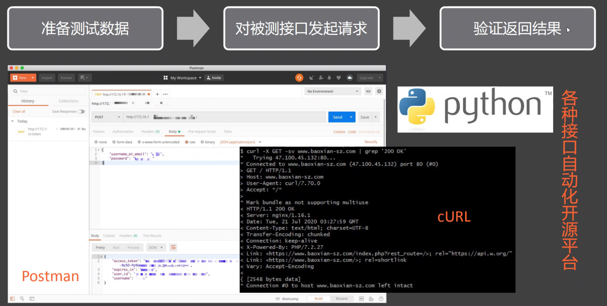
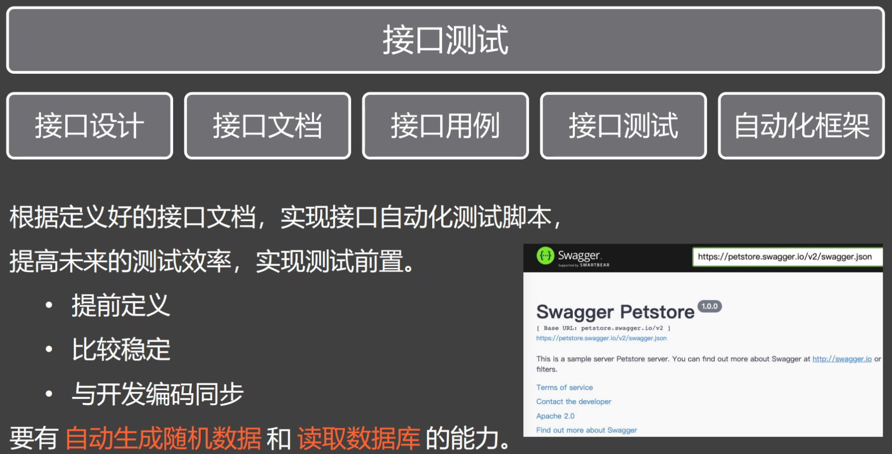

## 2.6. JMeter和Locast怎么选择？
1. JMeter使用的更多

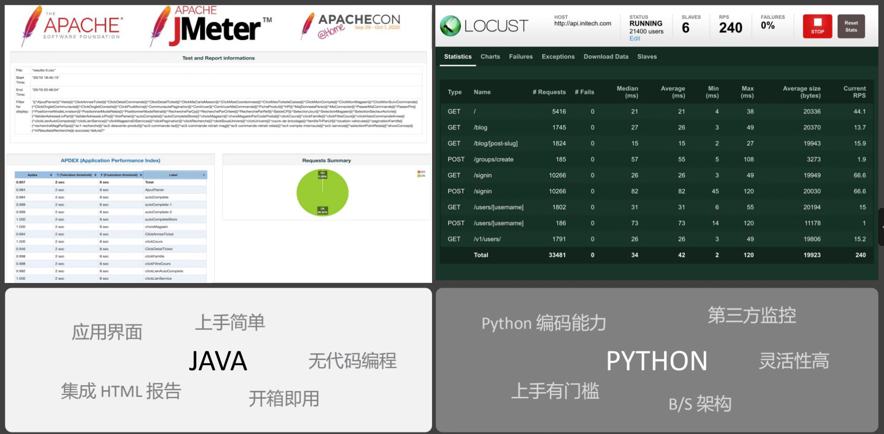

2. Locast支持定制，JMeter则不支持

# 3. Devops全链条
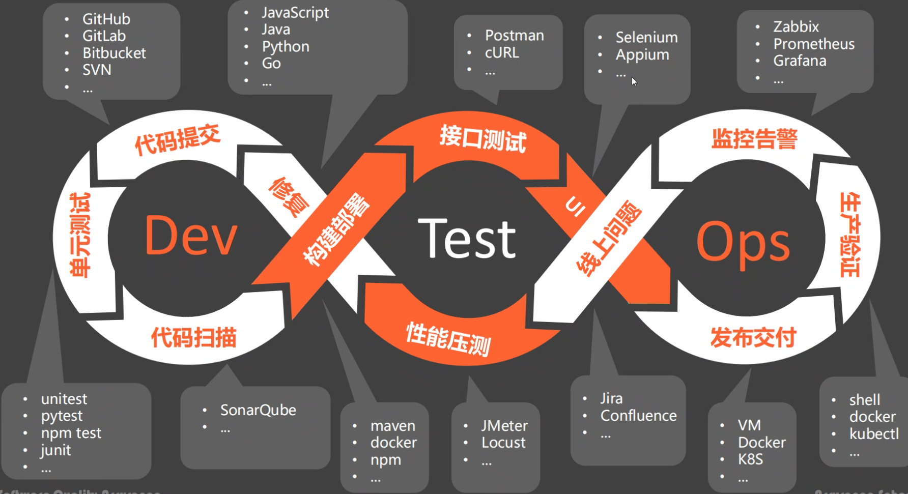

## 3.1. CI/CD工具
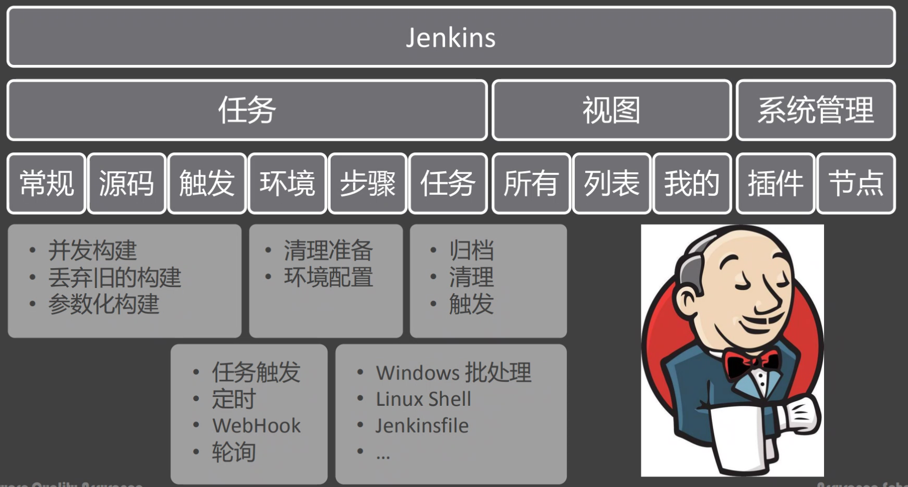

1. Jerkins的插件非常多