Lec02-Docker&Kubernetes
---
1. Kubernetes:简称K8S
2. <a href = "https://devs.wiki/slides/docker/intro2h/">课件</a>

# 1. Docker部分

## 1.1. Docker的前世今生
1. 2013 年 3 月 15 日，在加利福尼亚州圣克拉拉召开的 Python 开发者大会上， dotCloud 的创始人兼首席执行官 Solomon Hvkes 在一场仅五分钟的微型演讲中， 首次提出了 Docker 这一概念。当时，仅约 40 人（除 dotCloud 内部人员）获得了使用 Docker 的机会。

### 1.1.1. Docker是什么
1. 开发人员角度
    1. 提供了一种“全新”的应用发布模式
    2. 自带了Provision工具
    3. 提供了一致的打包方式
    4. 存储分层，增量式修改
2. 运维人员角度
    1. “轻量级”的虚拟机
    2. 像管理“app”一样管理后端服务
    3. 一种独立进程管理方案
    4. 可以对指定的进程设定限制
3. Docker 是一种 Linux 容器管理引擎
4. Docker 是最火热的开源容器化项目之一
5. Docker 是一种实现打包、输送、运行任意应用的容器解决方案
6. docker实际是对应了一种现代的虚拟化技术。
7. 如果你依旧不清楚docker是什么，我们可以先把它当成一种轻量级“虚拟机”（尽管这么说是不对的）

### 1.1.2. Docker和VM的区别
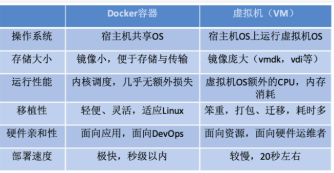

1. Docker相当于启动一个进程

## 1.2. Docker快速体验

### 1.2.1. 安装Docker
参考课件和Tec02

### 1.2.2. 上手
1. `docker run hello-world`
    - 本地找不到的话，会从docker-hub上拉取
    - 更多参见课件

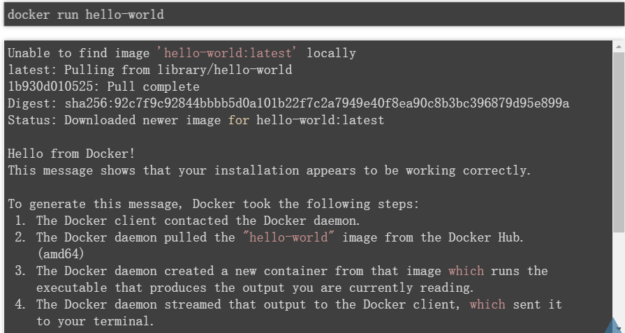

2. image:类比Win10，container:运行Win10的进程
3. `docker run -d -P daocloud.io/daocloud/dao-2048`
   1. `docker ps`:查看所有的镜像:如果比较多的话用下面的
   2. `docker ps | grep -i daocloud`:找到端口

### 1.2.3. 部分命令的注解(思考)
1. `-p`是容器内部端口绑定到指定的主机端口。
2. `-i`:以交互模式运行容器，通常与 -t 同时使用；
3. `-t`:为容器重新分配一个伪输入终端，通常与 -i 同时使用；
4. `-d`:后台运行容器，并返回容器ID；
5. `-P`是容器内部端口随机映射到主机的高端口。

## 1.3. Docker的架构设计
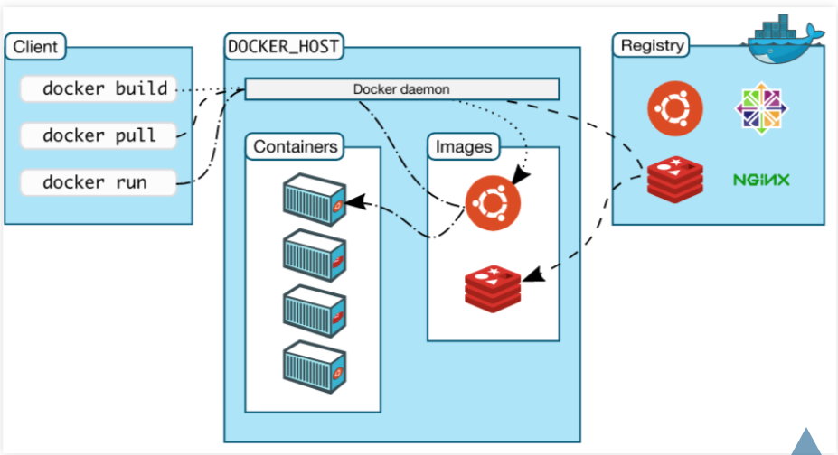

- client:客户端
- DOCKER_HOST:(daemon)
  - Images:Ubuntu + Redis(本地没有从Registry拉取)
  - Containers
- registry:镜像仓库，制品仓库(类似Win 10中的诸恶表)
- client和HOST:可以分布在不同的机器上，我们用的是一台机器
- objects：Images + Containers

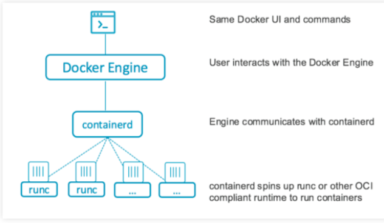

- 上图是细节的架构图(Docker Daemon里面)
- Docker Engineer: 编译器
- containerd：Python的supervisor
- runc: container

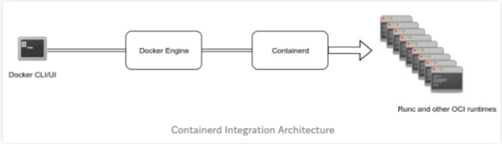

- containerd是一个容器运行时，它可以管理完整的容器生命周期-从映像传输/存储到容器执行，监督和联网。
- container-shim处理无头容器，这意味着一旦runc初始化容器，它将退出，将容器移交给充当中间人的container-shim。
- runc是轻型通用运行时容器，符合OCI规范。 容器使用runc根据OCI规范生成和运行容器。 这也是libcontainer的重新打包。
- grpc用于容器和docker-engine之间的通信。
- OCI维护运行时和映像的OCI规范。当前的docker版本支持OCI映像和运行时规范。

## 1.4. 通过Dockerfile的编写
1. 让我们尝试着编写一个简单的python的app, 并运行发布

### 1.4.1. 编写Demo程序及Dockerfile
```py
from flask import Flask

app = Flask(__name__) # 必须现制定一个APP

@app.route("/<name>") # 指定路由地址，<>尖括号完成参数对应
def hello(name):
    html = "<h3>Hello {name}!</h3>" 
    return html.format(name=name)

if __name__ == "__main__":
    app.run(host='0.0.0.0', port=5000)
```
```sh
python app.py
```

### 1.4.2. 打包镜像
```dockerfile
# 首先指定环境镜像
FROM python:3.7-slim
# 指定工作环境
WORKDIR /app
# 拷贝环境
COPY . /app
# 下载flask框架
RUN pip install flask -i https://mirrors.aliyun.com/pypi/simple  --trusted-host mirrors.aliyun.com 
# 暴露端口
EXPOSE 5000
# 执行的方式
CMD ["python", "app.py"]
```

### 1.4.3. 构建镜像
```sh
docker build -t hello:v1 .
```

### 1.4.4. Docker运行过程
```dockerfile
Sending build context to Docker daemon  3.072kB
Step 1/6 : FROM python:3.7-slim
 ---> 69afd9568c9d
Step 2/6 : WORKDIR /app
 ---> Using cache
 ---> 61a1e95188ad
Step 3/6 : COPY . /app
 ---> a5f20600c77d
Step 4/6 : RUN pip install flask -i https://mirrors.aliyun.com/pypi/simple  --trusted-host mirrors.aliyun.com
 ---> Running in e8184595f2df
Looking in indexes: https://mirrors.aliyun.com/pypi/simple
Collecting flask
  Downloading https://mirrors.aliyun.com/pypi/packages/9b/93/628509b8d5dc749656a9641f4caf13540e2cdec85276964ff8f43bbb1d3b/Flask-1.1.1-py2.py3-none-any.whl (94 kB)
Collecting itsdangerous>=0.24
  Downloading https://mirrors.aliyun.com/pypi/packages/76/ae/44b03b253d6fade317f32c24d100b3b35c2239807046a4c953c7b89fa49e/itsdangerous-1.1.0-py2.py3-none-any.whl (16 kB)
Collecting Werkzeug>=0.15
  Downloading https://mirrors.aliyun.com/pypi/packages/ba/a5/d6f8a6e71f15364d35678a4ec8a0186f980b3bd2545f40ad51dd26a87fb1/Werkzeug-1.0.0-py2.py3-none-any.whl (298 kB)
Collecting Jinja2>=2.10.1
  Downloading https://mirrors.aliyun.com/pypi/packages/27/24/4f35961e5c669e96f6559760042a55b9bcfcdb82b9bdb3c8753dbe042e35/Jinja2-2.11.1-py2.py3-none-any.whl (126 kB)
Collecting click>=5.1
  Downloading https://mirrors.aliyun.com/pypi/packages/dd/c0/4d8f43a9b16e289f36478422031b8a63b54b6ac3b1ba605d602f10dd54d6/click-7.1.1-py2.py3-none-any.whl (82 kB)
Collecting MarkupSafe>=0.23
  Downloading https://mirrors.aliyun.com/pypi/packages/98/7b/ff284bd8c80654e471b769062a9b43cc5d03e7a615048d96f4619df8d420/MarkupSafe-1.1.1-cp37-cp37m-manylinux1_x86_64.whl (27 kB)
Installing collected packages: itsdangerous, Werkzeug, MarkupSafe, Jinja2, click, flask
Successfully installed Jinja2-2.11.1 MarkupSafe-1.1.1 Werkzeug-1.0.0 click-7.1.1 flask-1.1.1 itsdangerous-1.1.0
Removing intermediate container e8184595f2df
 ---> 354a6ac60bcb
Step 5/6 : EXPOSE 5000
 ---> Running in 499ce816b0d7
Removing intermediate container 499ce816b0d7
 ---> 5cabf0b15a0f
Step 6/6 : CMD ["python", "app.py"]
 ---> Running in e93f62dde208
Removing intermediate container e93f62dde208
 ---> be93e0d65731
Successfully built be93e0d65731
Successfully tagged hello:v1
docker run  --rm --name flask -p 32777:5000 hello:v1
 * Serving Flask app "app" (lazy loading)
 * Environment: production
   WARNING: This is a development server. Do not use it in a production deployment.
   Use a production WSGI server instead.
 * Debug mode: off
 * Running on http://0.0.0.0:5000/ (Press CTRL+C to quit)
```

### 1.4.5. Java Spring的Docker操作顺序
```
[Pipeline] sh
+ docker build -t 172.19.51.9:18082/608c6b16126240a78cc9f80aeae6cd5d-80:18 --build-arg JAR_FILE=target/hotel-1.1.jar --build-arg CONFIG_FILE=app-config.yml .
Sending build context to Docker daemon 479.4MB
Step 1/10 : FROM fabric8/java-alpine-openjdk8-jre
---> 6383f0513235
Step 2/10 : VOLUME /tmp
---> Running in d8eaf14dc104
Removing intermediate container d8eaf14dc104
---> e140d0e2b2be
Step 3/10 : ARG JAR_FILE=target/*jar
---> Running in c8f0cc95a9f7
Removing intermediate container c8f0cc95a9f7
---> cfe560db0a50
Step 4/10 : ARG CONFIG_FILE
---> Running in f4e2cb3632bf
Removing intermediate container f4e2cb3632bf
---> 4b27b9080179
Step 5/10 : ARG DEPENDENCY=target/dependency
---> Running in 1e8084b34c84
Removing intermediate container 1e8084b34c84
---> 495b83a0e142
Step 6/10 : ARG LIB=target/lib/*
---> Running in d7fe3248a624
Removing intermediate container d7fe3248a624
---> 0159a2ad546d
Step 7/10 : COPY ${JAR_FILE} /app/app.jar
---> 20cf5c8a41f5
Step 8/10 : COPY ${CONFIG_FILE} /app/app-config.yml
---> 874bf8e5a879
Step 9/10 : EXPOSE 8081
---> Running in a7ec656b5c64
Removing intermediate container a7ec656b5c64
---> 07e200ce43c3
Step 10/10 : ENTRYPOINT ["java","-jar","/app/app.jar","--spring.config.location=classpath:application.yml,/app/app-config.yml"]
---> Running in d21f032c13b7
Removing intermediate container d21f032c13b7
---> 0245e27b5eb1
Successfully built 0245e27b5eb1
Successfully tagged 172.19.51.9:18082/608c6b16126240a78cc9f80aeae6cd5d-80:18
[Pipeline] echo
```

### 1.4.6. Java 启动Docker
```
//32777映射给5000(nginx)
docker run  --rm --name flask -p 32777:5000 hello:v1
//result
* Serving Flask app "app" (lazy loading)
* Environment: production
   WARNING: This is a development server. Do not use it in a production deployment.
   Use a production WSGI server instead.
* Debug mode: off
* Running on http://0.0.0.0:5000/ (Press CTRL+C to quit)
```

- 之后通过127.0.0.1:32777/world来访问
- 搭建Registry(一般都用v2)

```
docker run -d -p 5000:5000 --name registry registry:2
```

### 1.4.7. 上传镜像
- Tag机制完成发布:127.16.100.1(本机的IP地址)
- 7000的端口应该和上满的Registry的端口(这里应该是5000)
```
docker tag hello 172.16.100.1:7000/hello:v1
docker push 172.16.100.1:7000/hello:v1
```

### 1.4.8. 拉取镜像并发布
- Tag机制完成拉取

```
docker pull 172.16.100.1:7000/hello:v1
docker run -d -p 32777:5000 172.16.100.1:7000/hello:v1
```

## 1.5. Docker的幕后技术

### 1.5.1. Namespace
1. Linux提供的一种内核级别环境隔离的方法
2. 下面的程序在使用clone创建线程时, 使用了新的UTS空间和IPC空间

```c++
#define _GNU_SOURCE
#include <sys/types.h>
#include <sys/wait.h>
#include <stdio.h>
#include <sched.h>
#include <signal.h>
#include <unistd.h>

#define STACK_SIZE (1024 * 1024)
static char container_stack[STACK_SIZE];

char* const container_args[] = {
    "/bin/bash",
    NULL
};

int container_main(void* arg) {
    printf("Container - inside the container!\n");
    execv(container_args[0], container_args); 
    printf("Something's wrong!\n");
    return 1;
}

int main() {
    printf("Parent - start a container!\n");
    int container_pid = clone(container_main, container_stack+STACK_SIZE,  
                              CLONE_NEWUTS | CLONE_NEWIPC  | SIGCHLD, NULL);
    //传入标志位
    waitpid(container_pid, NULL, 0);
    printf("Parent - container stopped!\n");
    return 0;
}
```
1. 不同的隔离方式
   1. Mount namespaces | CLONE_NEWNS
   2. UTS namespaces | CLONE_NEWUTS
   3. IPC namespaces | CLONE_NEWIPC
   4. PID namespaces | CLONE_NEWPID(注:ps查看会有区别)
   5. Network namespaces | CLONE_NEWNET
   6. User namespaces | CLONE_NEWUSER

### 1.5.2. Control Group
1. 系统管理员可以更具体地控制对系统资源的分配、优先顺序、拒绝、管理和监控

2. cpu
```c++
int main(void) {
    int i = 0;
    for(;;) i++;
    return 0;
}
```
```
PID USER      PR  NI    VIRT    RES    SHR S %CPU %MEM     TIME+ COMMAND     
3189 root      20   0    4196    736    656 R 99.6  0.1   0:23.13 deadloop
```

- 限制CPU的消耗
```
/sys/fs/cgroup/cpu/cpu.cfs_period_us 100000
/sys/fs/cgroup/cpu/cpu.cfs_quota_us -1
```
- CPU的占用不会超过20000/100000 = 20%
```
echo 20000 > /sys/fs/cgroup/cpu/cpu.cfs_quota_us
echo 3189 >> /sys/fs/cgroup/cpu/tasks
PID USER      PR  NI    VIRT    RES    SHR S %CPU %MEM     TIME+ COMMAND     
3189 root      20   0    4196    736    656 R 19.9  0.1   8:06.11 deadloop
```
2. memory
3. disk

### 1.5.3. Union file systems
1. 分层的文件系统

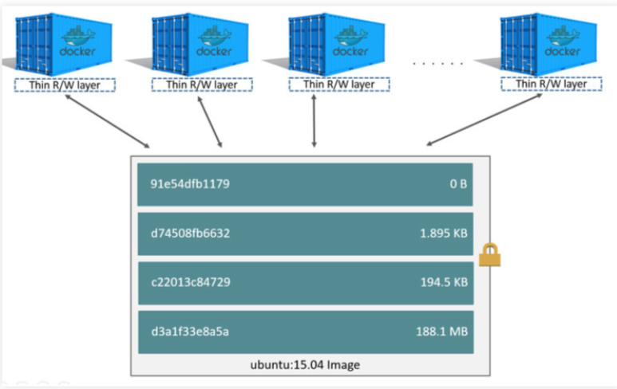

### 1.5.4. Container format
1. libcontainer/runc

# 2. KUBERNETES(K8S)
1. 一个一个微服务需要交互的时候如何编排

## 2.1. KUBERNETES的由来
1. Kubernetes（在希腊语意为“舵手”或“驾驶员”）由Joe Beda、Brendan Burns和Craig McLuckie创立，并由其他谷歌工程师，包括Brian Grant和Tim Hockin等进行加盟创作，并由谷歌在2014年首次对外宣布 。该系统的开发和设计都深受谷歌的Borg系统的影响，其许多顶级贡献者之前也是Borg系统的开发者。在谷歌内部，Kubernetes的原始代号曾经是Seven，即星际迷航中的Borg(博格人)。Kubernetes标识中舵轮有七个轮辐就是对该项目代号的致意。
2. KUBERNETES的图标有七个辐条，现实中的是8个辐条

### 2.1.1. 什么是KUBERNETES
1. Kubernetes（常简称为K8s）是用于自动部署、扩展和管理容器化（containerized）应用程序的开源系统。
2. 该系统由Google设计并捐赠给Cloud Native Computing Foundation（今属Linux基金会）来使用。
3. 它旨在提供“跨主机集群的自动部署、扩展以及运行应用程序容器的平台”。
4. 它支持一系列容器工具, 包括Docker等。

### 2.1.2. K8S的发展及演进
1. docker的困局
2. 多容器:容器规模到达一定规模，就需要这些容器编排技术了
3. 跨主机
4. 调度和分发
5. 网络场景
6. 存储

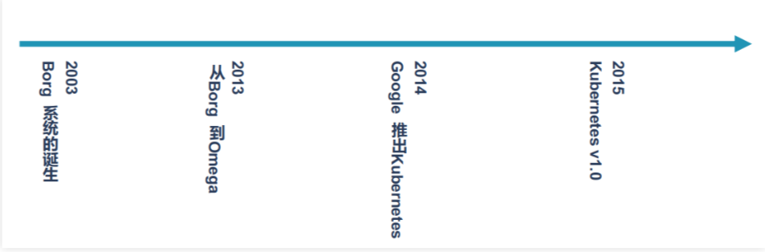
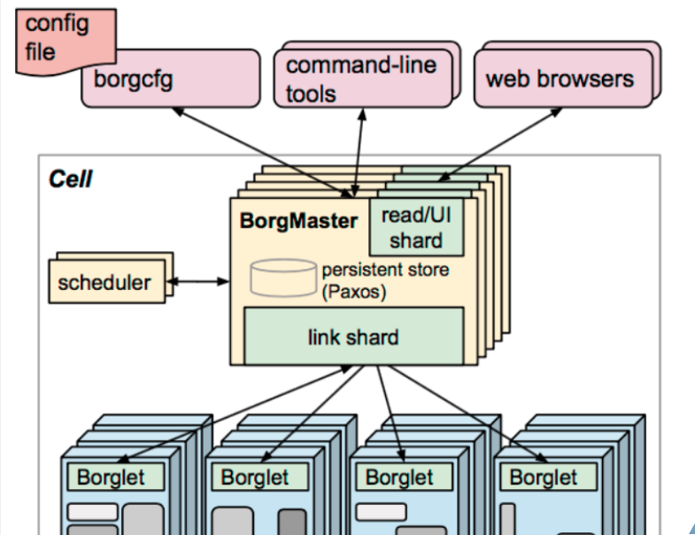

1. BorgMaster:控制平面

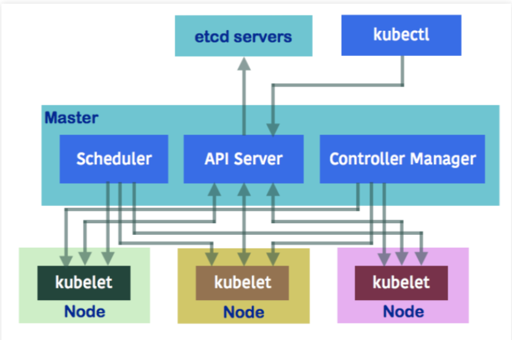

- 目前的架构平面
- Master节点
  - Scheduler:进行编排
  - API Server:负责下发命令
- Node节点
  - Kuberlet

## 2.2. K8S架构描述
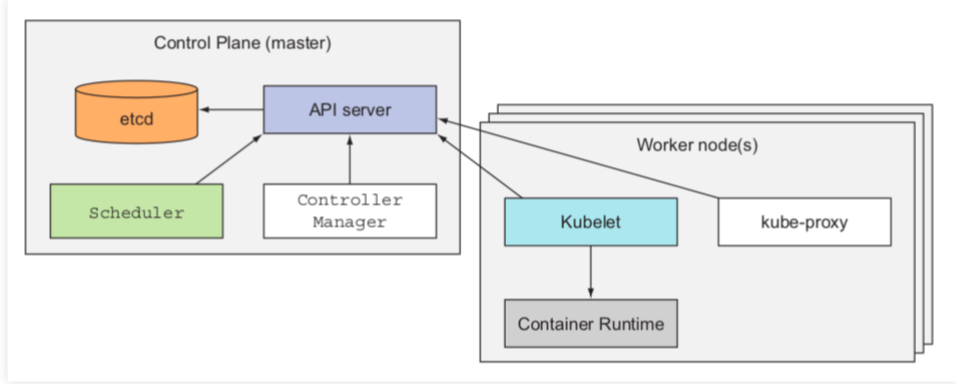

- master会依赖于etcd
- kube-proxy:一些信息通信(服务层的网络转发，利用)

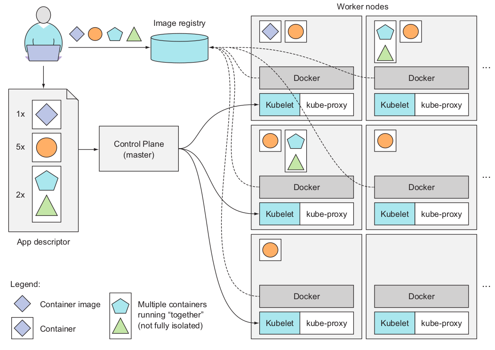

- 左下角我们可以将三角和五边形分别理解成前端和后端(不妥，其实不应该在一个POD中)
- 用户准备启动APP descriptor
- 将文件告诉Controller Plane
- 然后master节点发送给适当节点的Kuberlet
- Node从Image Registry拉取镜像
- 多容器配置交给KUBERNETES，分步到整个集群上去(比如MYSQL + Python + Redis的多应用)
- 同时Master会监视节点，如果挂了则会换一个节点部署


- 正常一个POD只放一个主要业务，剩下放的是监视/日志等等

### 2.2.1. Master组件
1. etcd*:分布式存储, 存储配置(包括网络信息)
2. api server api 入口, 各个组件之间的桥梁
3. controller manager 控制器管理器, 协同管理各个控制器中组件 (通过apiserver监控etcd,处罚处理逻辑)
4. scheduler 调度器, 资源任务分配(比如pod分配到哪个节点)

### 2.2.2. Node组件
1. runtime docker你懂的
2. kubelet 一个agent, 接收指令并执行
3. kube-proxy  一个agent, 接收指令并执行

## 2.3. K8S的基本概念
1. Phippy and Friends


- 去动物园


- 蓝色的小东西:松鼠(POD)

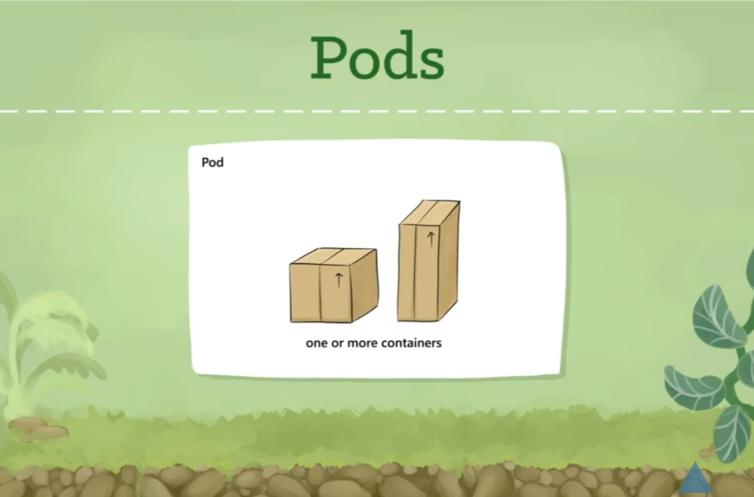

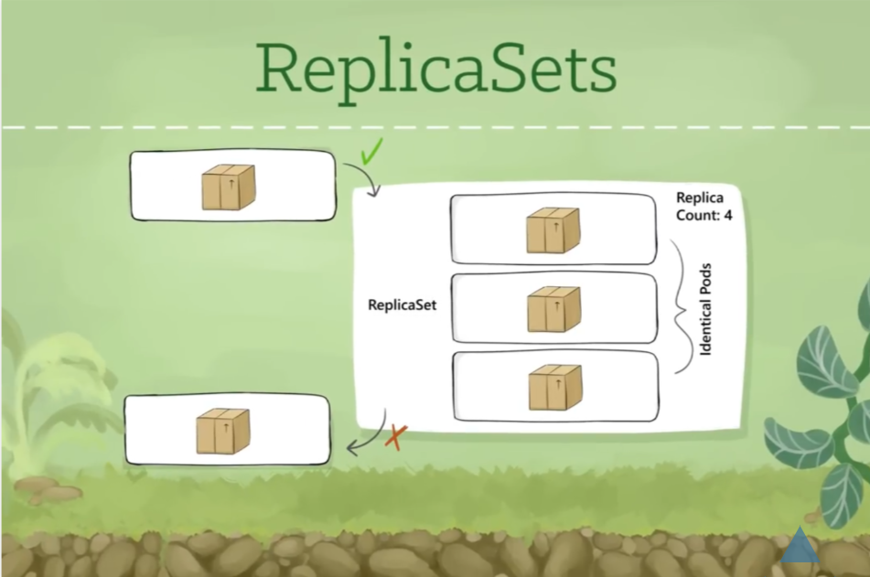

- 如果失败了，会帮助回复


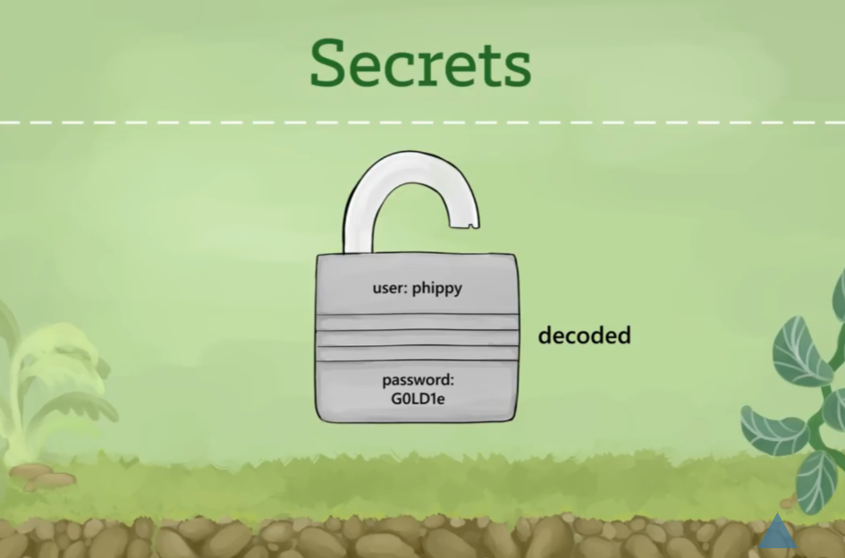

- 涉密的通过Secrets存储


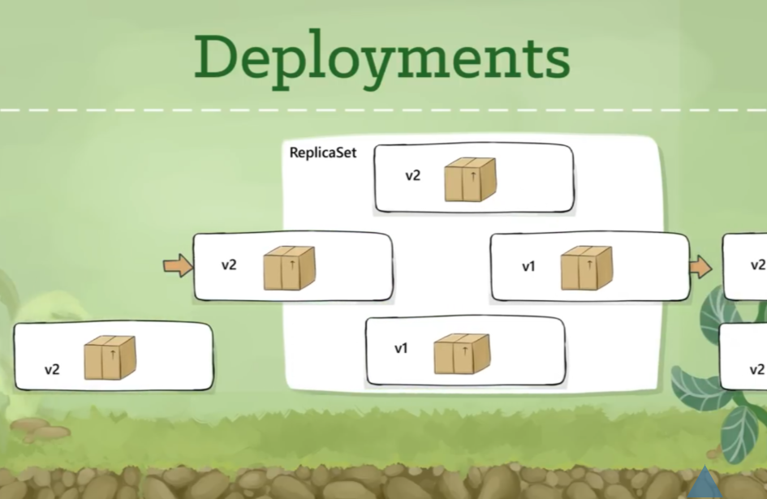

- Deployment来恢复失败的部分
- 滚动更新和发布


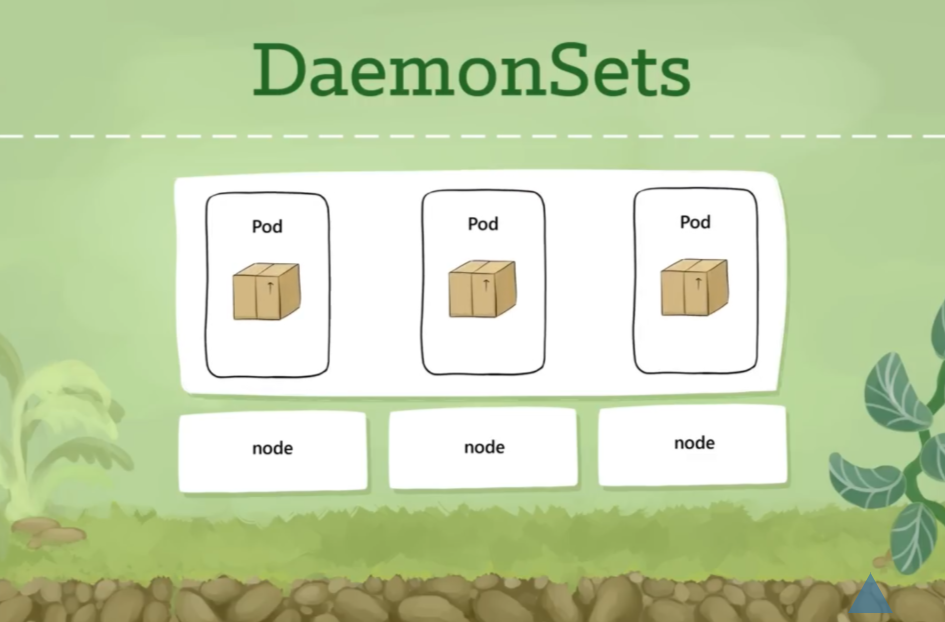

- 秃鹫:DaemonSets(一对一，POD-node)


- 需要流量分流的时候:Ingresses


- CronJobs:定时任务(某一个时刻启动任务然后再干掉)


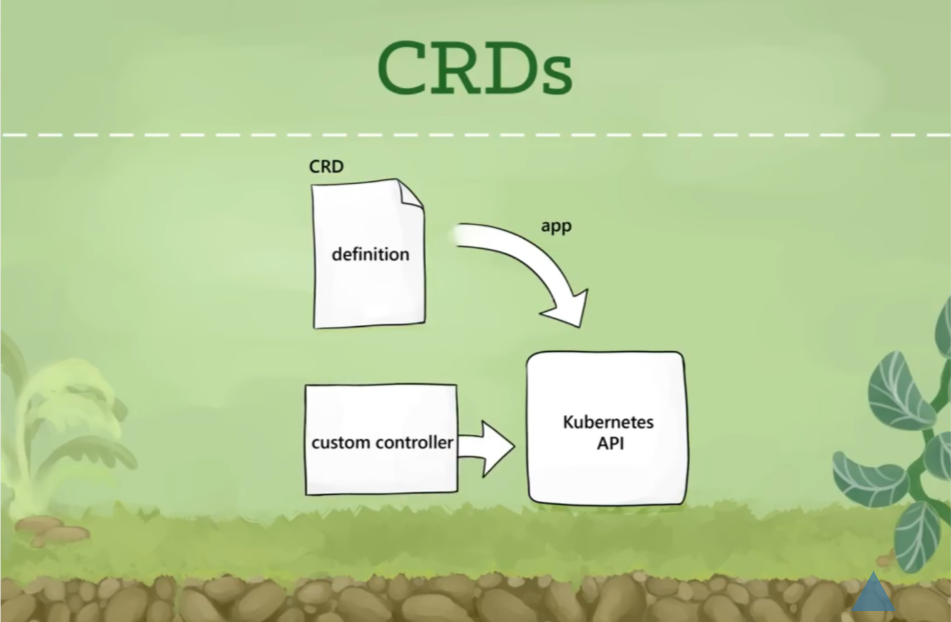

- 自定义(CRD)：对KUBERNETES的扩展

## 2.4. K8S快速上手
```
kubectl run nginx --image=luksa/kubia --port=8080
```

- 不同版本参数可能启动的是不同deployment或pod

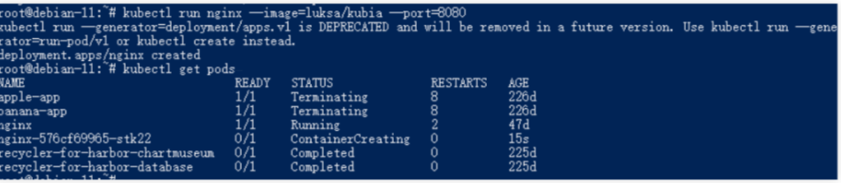

```
kubectl get pod
kubectl get deployment
kubectl get daemonset
kubectl get deploy nginx -o yaml//查看状态信息
```

- describe查看具体信息

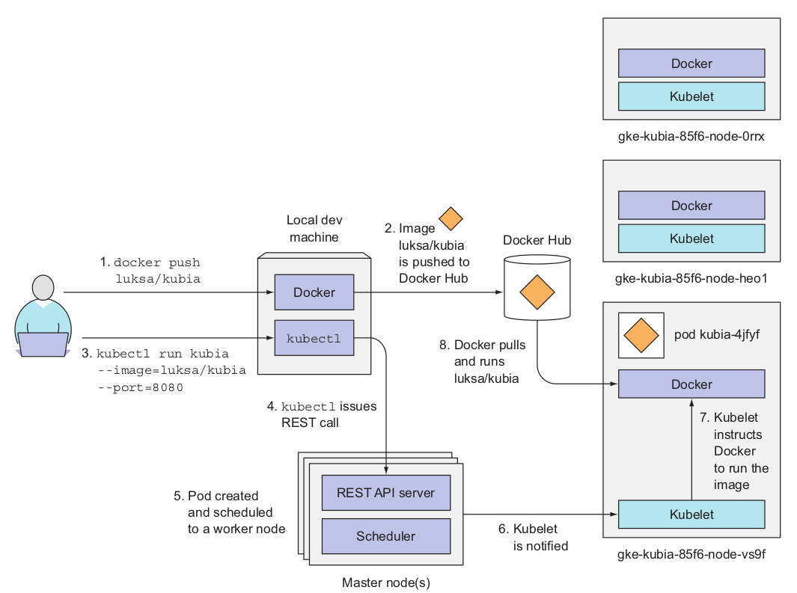

- 操作和运行过程:见图

## 2.5. 安装K8S
具体参考文件Tec03-Kubernetes安装

## 2.6. KUBECTL 小技巧

### 2.6.1. 查看组件信息
```
kubectl get componentstatuses
NAME                 STATUS    MESSAGE             ERROR
controller-manager   Healthy   ok                  
scheduler            Healthy   ok                  
etcd-0               Healthy   {"health":"true"}
```

### 2.6.2. 查看资源类型
```
kubectl api-resources
```

### 2.6.3. 查看api版本
```
kubectl api-versions
```

### 2.6.4. 具体解释资源的特性
```
kubectl explain pods
```

### 2.6.5. 使用jsonpath的方式层级解析
```
kubectl explain pods.metadata
```

## 2.7. 部署应用的三种方式
1. Using Generators (Run, Expose)
2. Using Imperative way (Create)
3. Using Declarative way (Apply)

### 2.7.1. generator 方式
```
kubectl run  --generator=run-pod/v1  nginx --image=nginx
kubectl run  --generator=run-pod/v1  nginx --image=nginx --image-pull-policy=IfNotPresent
kubectl run --help
```

### 2.7.2. imperative 方式
```
kubectl create deployment --image=nginx  nginx
kubectl create --help
```

### 2.7.3. declarative 方式
1. deployment.yaml(课件，认真设置)
2. 比较常用的
3. 支持本地/远程

```
kubectl apply -f https://k8s.io/examples/application/deployment.yaml
kubectl apply --help
```

## 2.8. POD的访问

### 2.8.1. 使用proxy访问
```
kubectl proxy
显示:Starting to serve on 127.0.0.1:8001
```

### 2.8.2. 使用命令访问
```
//下面命令有问题
curl http://localhost:8001/api/v1/namespaces/default/pods/nginx/proxy/
kubctl proxy --help//查看提示，
//正确命令
kubectl proxy --address=0.0.0.0
```

### 2.8.3. 端口forward
```
kubectl port-forward nginx-765d459796-258hz friend-dfb76fcc-xqnwr 31080:80
kubectl port-forward --help
kubectl port-forward friend-dfb76fcc-xqnwr 31010:5000 --address 0.0.0.0
```

### 2.8.4. 比较简单：端口expose
1. 本机一定要指定成Node-Port
```
kubectl expose deployment nginx --port=80 --type=NodePort
kubectl expose --help
```

```yaml
# 例子
apiVersion: v1
kind: Service
metadata:
  name: nginx
spec:
  type: NodePort
  ports:
  - port: 80
    targetPort: 8080
    nodePort: 30123
  selector:
    app: nginx
```

# 3. 完整的例子
1. 构建friendlyhello: v4

## 3.1. Python源代码
```py
# app.py
from flask import Flask
from redis import Redis, RedisError
import os
import socket

# Connect to Redis
redis = Redis(host="redis", db=0, socket_connect_timeout=2, socket_timeout=2)

app = Flask(__name__)

@app.route("/")
def hello():
    try:
        visits = redis.incr("counter")
    except RedisError:
        visits = "<i>cannot connect to Redis, counter disabled</i>"

    html = "<b>HostName:</b> {host_name}<br/>" \
           "<b>Hostname:</b> {hostname}<br/>" \
           "<b>Visits:</b> {visits}"
    return html.format(host_name=os.getenv("HOSTNAME", "UNKNOWN"),
                       hostname=socket.gethostname(), visits=visits)

if __name__ == "__main__":
    app.run(host='0.0.0.0', port=5000)
```


## 3.2. dockerfile内容
```DockerFile
FROM python:3.7-slim

WORKDIR /app

COPY . /app

RUN pip install flask redis -i https://mirrors.aliyun.com/pypi/simple  --trusted-host mirrors.aliyun.com 
EXPOSE 5000

CMD ["python", "app.py"]
```

## 3.3. 打包镜像
```Docker
docker build -t friendlyhello:v4
```

## 3.4. K8S配置文件
```yaml
apiVersion: apps/v1 
kind: Deployment
metadata:
  name: nginx-deployment
spec:
  selector:
    matchLabels:
      app: nginx
  replicas: 2 
  template:
    metadata:
      labels:
        app: nginx
    spec:
      containers:
      - name: nginx
        image: nginx
        imagePullPolicy: IfNotPresent
        ports:
        - containerPort: 80
```