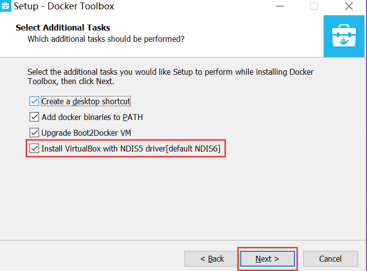
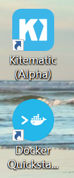
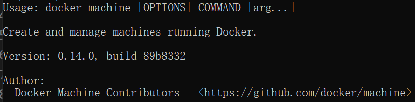
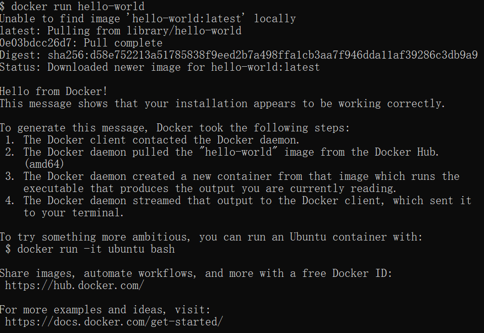
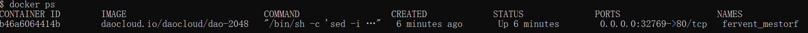

Windows安装Docker
---

# 1. 下载Docker安装程序
1. <a href = "https://www.docker.com/products/docker-toolbox">Docker官网</a>
2. <a href = "https://docs.docker.com/toolbox/toolbox_install_windows/">Docker Doc</a>

# 2. 进行下载
1. 双击进行下载
2. 过程中注意

3. 安装成功后的界面：
   1. 图形界面:Kitematic (Alpha)
   2. 命令界面:Docker Quickstart Terminal

# 3. 查看安装情况
1. cmd界面输入:`docker-machine`，出现详情界面

# 4. 其他配置
1. 调整盘符+使用镜像都详见参考1

# 5. Hello-world

# 6. 游戏:2048
1. 下载命令:`docker run -d -P daocloud.io/daocloud/dao-2048`
2. 查看运行中容器:`docker ps`

3. 然后查看目前虚拟机的IP地址，结合ps信息中的端口号进行访问，本例则为IP/32789

# 7. 参考
1. <a href = "https://blog.csdn.net/doubleguy/article/details/96318126?ops_request_misc=%257B%2522request%255Fid%2522%253A%2522159393616819726869017311%2522%252C%2522scm%2522%253A%252220140713.130102334..%2522%257D&request_id=159393616819726869017311&biz_id=0&utm_medium=distribute.pc_search_result.none-task-blog-2~all~first_rank_ecpm_v3~pc_rank_v2-1-96318126.first_rank_ecpm_v3_pc_rank_v2&utm_term=windows+%E5%AE%89%E8%A3%85docker">Windows安装Docker</a>