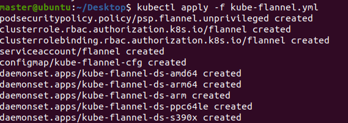
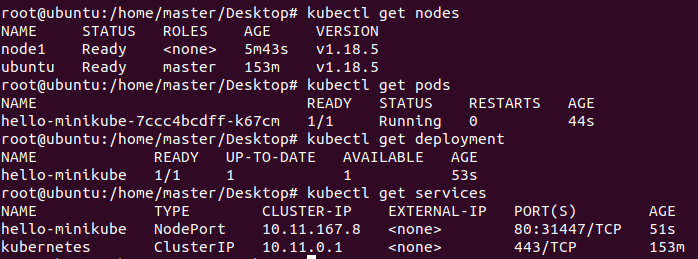

Kubernetes集群安装
---
1. 包含安装Docker
2. 包含安装Kubernetes_master和Kubernetes_node
  
# 1. Kubernetes集群的基本配置
1. master节点 内存2核3G(最小2G)，至少**20G**磁盘
2. node节点 内存2核2G，至少**20G**磁盘

# 2. 硬件配置情况
| 主机名 | IP地址          | CPU核数 | 内存大小 | 硬盘大小 | 操作系统版本 |
| ------ | --------------- | ------- | -------- | -------- | ------------ |
| ubuntu | 192.168.28.128 | 2核     | 3G       | 20G      | Ubuntu20.04T |
| node1 | 192.168.28.129 | 2核     | 2G       | 20G      | Ubuntu20.04T |
| node2 | 192.168.28.130 | 2核     | 2G       | 20G      | Ubuntu20.04T |


# 3. 节点虚拟机通用配置
1. 一台master节点和两台node节点
2. 温馨提示一定要在操作前留一个镜像哟！

## 3.1. 配置root账户信息
1. `sudo passwd root`:用来设置root账户密码
2. `su root`:转向root账户，输入刚刚设置的密码

## 3.2. 调整虚拟机字体大小(可选)
1. 终端输入`apt install gnome-tweaks`:安装桌面优化工具
2. 打开终端优化工具:alt+F2:输入`gnome-tweaks`
3. 注销重启即可

## 3.3. 查看IP地址
1. 安装网络相关组件:`apt install net-tools`
2. 使用命令:`ifconfig`(warning:not ipconfig)查看inet

## 3.4. 安装vim工具
`apt install vim` 

## 3.5. 添加清华镜像源
1. 输入`vim /etc/apt/sources.list`
2. 根据https://mirrors.tuna.tsinghua.edu.cn/help/ubuntu/ 上的对应版本Ubuntu系统的资源拷贝到上面的文件并保存
3. 以Ubuntu20.04为例
```
# 默认注释了源码镜像以提高 apt update 速度，如有需要可自行取消注释
deb https://mirrors.tuna.tsinghua.edu.cn/ubuntu/ focal main restricted universe multiverse
# deb-src https://mirrors.tuna.tsinghua.edu.cn/ubuntu/ focal main restricted universe multiverse
deb https://mirrors.tuna.tsinghua.edu.cn/ubuntu/ focal-updates main restricted universe multiverse
# deb-src https://mirrors.tuna.tsinghua.edu.cn/ubuntu/ focal-updates main restricted universe multiverse
deb https://mirrors.tuna.tsinghua.edu.cn/ubuntu/ focal-backports main restricted universe multiverse
# deb-src https://mirrors.tuna.tsinghua.edu.cn/ubuntu/ focal-backports main restricted universe multiverse
deb https://mirrors.tuna.tsinghua.edu.cn/ubuntu/ focal-security main restricted universe multiverse
# deb-src https://mirrors.tuna.tsinghua.edu.cn/ubuntu/ focal-security main restricted universe multiverse
```

## 3.6. 关闭SELinux(可选)
1. 各节点执行：关闭 `SELinux`，否则 `kubelet` 挂载目录时可能报错 `Permission denied`，可以设置为`permissive`或`disabled`，`permissive` 会提示warn信息

```
apt install selinux-utils
setenforce 0
sed -i 's/^SELINUX=.*/SELINUX=disabled/' /etc/selinux/config
```

## 3.7. 设置和同步系统时间(可选)
```
timedatectl set-timezone Asia/Shanghai
systemctl enable --now chronyd
```

1. 查看同步情况:`timedatectl status`
     1. `System clock synchronized: yes`，表示时钟已同步；
     2. `NTP service: active`，表示开启了时钟同步服务；

# 4. Kubernetes前置-基本设置和Docker安装
  
## 4.1. 安装开启SSH
```
apt install openssh-server
vim /etc/ssh/sshd_config
```

1. 在`vim /etc/ssh/sshd_config`加入`PermitRootLogin yes`

## 4.2. 开启IPv4
1. `vim /etc/sysctl.conf`，在文件中加入`net.ipv4.ip_forward=1`
2. 刷新权限:`sysctl --system`

## 4.3. 关闭swap分区
1. `swapoff -a`:关闭swap分区
2. `vim /etc/fstab`:注释全部swap相关的行
```yaml
#
# /etc/fstab
# Created by anaconda on Tue Mar 31 22:44:34 2020
#
# Accessible filesystems, by reference, are maintained under '/dev/disk/'.
# See man pages fstab(5), findfs(8), mount(8) and/or blkid(8) for more info.
#
# After editing this file, run 'systemctl daemon-reload' to update systemd
# units generated from this file.
#
/dev/mapper/cl-root     /                       xfs     defaults        0 0
UUID=5fecb240-379b-4331-ba04-f41338e81a6e /boot                   ext4    defaults        1 2
/dev/mapper/cl-home     /home                   xfs     defaults        0 0
#/dev/mapper/cl-swap     swap                    swap    defaults        0 0
```
  
### 4.3.1. 防火墙
1. 不是很熟悉可以关闭防火墙:`systemctl disable --now firewalld`

## 4.4. 开始安装

### 4.4.1. 安装Docker
1. 安装需要使用的部分软件:
```
apt install \
    apt-transport-https \
    ca-certificates \
    curl \
    gnupg-agent \
    software-properties-common
```

2. 添加docker官方GPG秘钥:`curl -fsSL https://download.docker.com/linux/ubuntu/gpg | apt-key add -`
3. 更新apt:`apt update`
4. 配置源:
```
add-apt-repository \
   "deb [arch=amd64] https://download.docker.com/linux/ubuntu \
   $(lsb_release -cs) \
   stable"
```
5. 查看更新情况并更新表单:`apt-get update`
6. 安装docker:`apt-get install docker-ce docker-ce-cli containerd.io`
      1. 问题:`docker安装报错“Package 'docker-ce' has no installation candidate”`
      2. 尝试:`apt-get update`和`apt-get upgrade`(用时较长，慎用)
7. 为当前用户授权:
```
groupadd username
usermod -aG username $USER
```

### 4.4.2. 修改Docker的配置
1. 修改docker的配置文件:`vim /etc/docker/daemon.json`,并添加如下内容

```yaml
{
"registry-mirrors": [
    "https://registry.docker-cn.com", 
    "http://hub-mirror.c.163.com",
    "https://docker.mirrors.ustc.edu.cn",
    "https://reg-mirror.qiniu.com",
    "https://quay.azk8s.cn",
    "https://gcr.azk8s.cn",
    "https://dockerhub.azk8s.cn"
],
  "exec-opts": ["native.cgroupdriver=systemd"],
  "log-driver": "json-file",
  "log-opts": {
    "max-size": "100m"
},
  "insecure-registries": ["0.0.0.0/0"],
  "storage-driver": "overlay2"
}
```

2. 重启Docker:`service docker restart`

### 4.4.3. 使用 kubeadm 安装 control plane
1. 安装Kubeadm
```
apt-get update && apt-get install -y apt-transport-https

curl https://mirrors.aliyun.com/kubernetes/apt/doc/apt-key.gpg | apt-key add - 

cat <<EOF >/etc/apt/sources.list.d/kubernetes.list
deb https://mirrors.aliyun.com/kubernetes/apt/ kubernetes-xenial main
EOF

apt-get update
apt-get install -y kubelet kubeadm kubectl
```

2. Kubeadm的帮助(检查安装情况):`kubeadm --help`

# 5. Kubernetes安装

## 5.1. Master节点的安装

### 5.1.1. 准备操作
1. 完成上文中的基本配置
2. 安装好docker并测试

### 5.1.2. 配置/etc/hosts文件
1. 注意:非root用户使用sudo，不然权限不足
2. 命令`vim /etc/hosts`
3. 添加具体的信息如下

```
192.168.199.134 ubuntu
192.168.199.135 node1
0.0.0.0 ubuntu3
```
2. 分发SSH公钥TODO

### 5.1.3. 使用dry-try来避免环境污染
1. 以下指定了APIServer的IP(master分支的IP地址)和定义了Service网段+POD网段
2. 本教程默认安装的Kubernetes的版本号是v1.18.5
3. --dry-run保证只有反馈，不会出现安装失败污染环境的问题

```
kubeadm init --pod-network-cidr=10.244.0.0/16 --service-cidr 10.11.0.0/16 --kubernetes-version=v1.18.3 --dry-run
```

### 5.1.4. 正常安装集群
1. 执行初始化集群:`kubeadm init --pod-network-cidr=10.244.0.0/16 --service-cidr 10.11.0.0/16 --kubernetes-version=v1.18.3`会发现在`kubeadm config images pull`这一步上卡死(Ctrl+Z退出线程)
2. 解决问题:编写脚本(版本更新通过`kubeadm config images list`查看)并bash运行:写文章的时候最新版本是v1.18.5，但是国内没有镜像可以拉取
```sh
# images.sh
images=(  
    kube-apiserver:v1.18.3
    kube-controller-manager:v1.18.3
    kube-scheduler:v1.18.3
    kube-proxy:v1.18.3
    pause:3.2
    etcd:3.4.3-0
    coredns:1.6.7
)

for imageName in ${images[@]} ; do
    docker pull registry.cn-hangzhou.aliyuncs.com/google_containers/$imageName
    docker tag registry.cn-hangzhou.aliyuncs.com/google_containers/$imageName k8s.gcr.io/$imageName
    docker rmi registry.cn-hangzhou.aliyuncs.com/google_containers/$imageName
done
```

### 5.1.5. 正确的输出
1. 先修改一下主机名:`hostname master`
2. 再次执行:`kubeadm init --pod-network-cidr=10.244.0.0/16 --service-cidr 10.11.0.0/16 --kubernetes-version=v1.18.3`
3. 如果提示swap分区没有关闭，请根据上面的情况，进行关闭
4. 至少要保存一下Kubeam join的信息(关于公钥和密码的问题)
```
To start using your cluster, you need to run the following as a regular user:

  mkdir -p $HOME/.kube
  sudo cp -i /etc/kubernetes/admin.conf $HOME/.kube/config
  sudo chown $(id -u):$(id -g) $HOME/.kube/config

You should now deploy a pod network to the cluster.
Run "kubectl apply -f [podnetwork].yaml" with one of the options listed at:
  https://kubernetes.io/docs/concepts/cluster-administration/addons/

Then you can join any number of worker nodes by running the following on each as root:

kubeadm join 192.168.28.128:6443 --token 8pilmw.eetcie3q1crl5lc4 \
    --discovery-token-ca-cert-hash sha256:dbdbf7e69ba0cc8ca07536b7f29fd6f9aad25d31673056dbbd02507d4b730233 
```
2. 对于需要使用kubernetes的用户我们应该执行以下命令群进行授权:
```
mkdir -p $HOME/.kube
sudo cp -i /etc/kubernetes/admin.conf $HOME/.kube/config
sudo chown $(id -u):$(id -g) $HOME/.kube/config
```
3. 通过Kubectl来检查配置的有效性:`kubectl get nodes`，正确输出
```
NAME     STATUS     ROLES    AGE     VERSION
ubuntu   NotReady   master   3m10s   v1.18.5
```
4. 为什么会NotReady呢?
  1. 使用Describe查看:`kubectl describe node ubuntu`没有大问题
  2. 查看Kubectl日志:`journalctl -u kubelet -f`:发现问题(关于cni)
  3. 可以看到是 CNI 的问题，注意: CNI是Conatiner Network Interface, CSI则是Storage的Interface

### 5.1.6. 问题解决:网络安装
1. 我们这里使用性能一般,但却简单稳定的flannel网络
2. 首先下载好`flannel.yaml`文件:`wget https://raw.githubusercontent.com/coreos/flannel/master/Documentation/kube-flannel.yml`(科学上网)
3. 安装:`kubectl apply -f kube-flannel.yml`,结果如下



4. 如果`kubectl get nodes`STATUS提示NotReady，可以通过`kubectl describe node node_name`查看具体的描述信息，性能差的服务器到达Ready状态时间会长些

### 5.1.7. 部分pod拉取失败的问题
1. 查看全部pod:`kubectl get pods -n kube-system`
2. 检查具体的pod的状态和情况:`kubectl describe pod pod_name -n kube-system`
3. 然后根据具体pod拉取失败的情况去国内寻找镜像
4. 以flannel为例:找到镜像下载后伪装即可
```
docker pull quay-mirror.qiniu.com/coreos/flannel:v0.11.0
docker tag quay-mirror.qiniu.com/coreos/flannel:v0.11.0 quay.io/coreos/flannel:v0.11.0-amd64
```

## 5.2. node节点的安装

### 5.2.1. 准备操作
1. 安装好上述操作
2. 安装好Docker并测试

### 5.2.2. 检查网络问题
1. ping master节点查看ICMP报文

### 5.2.3. 安装需要的基本操作部分
1. 和master同理可以运行脚本即可(同样你也可以参考上面的脚本文件，多安装一些东西也是没有问题的)
```sh
# images.sh
images=(  
    kube-proxy:v1.18.3
    pause:3.2
    etcd:3.4.3-0
    coredns:1.6.7
)

for imageName in ${images[@]} ; do
    docker pull registry.cn-hangzhou.aliyuncs.com/google_containers/$imageName
    docker tag registry.cn-hangzhou.aliyuncs.com/google_containers/$imageName k8s.gcr.io/$imageName
    docker rmi registry.cn-hangzhou.aliyuncs.com/google_containers/$imageName
done
```

### 5.2.4. 加入集群
1. 使用之前初始化集群给出的命令(注意，保证master节点的主机也在运行中)
2. 注:最好先用--dry-run来检测
```
kubeadm join 192.168.28.128:6443 --token 8pilmw.eetcie3q1crl5lc4 \
    --discovery-token-ca-cert-hash sha256:dbdbf7e69ba0cc8ca07536b7f29fd6f9aad25d31673056dbbd02507d4b730233
```
2. 如果报错node重名:通过修改主机名的方式来避免:`hostname your_name`
3. 如果出现失败运行，则使用rm命令删除对应文件接口

### 5.2.5. 查看加入集群情况
1. 在master节点上查看:`kubectl get nodes`

## 5.3. 安装完成后的集群测试
1. 我们使用daocloud提供的2048作为例子
2. 首先我们拉取镜像并创建pods:`kubectl create deployment hello-kubernetes --image=daocloud.io/daocloud/dao-2048:latest`
3. 然后我们暴露其端口并运行：`kubectl expose deployment hello-kubernetes --type=NodePort --port=80`
4. 查看其运行信息:
      1. 查看pod:`kubectl get pods`
      2. 查看deployment:`kubectl get deployment`
      3. 查看service:`kubectl get services`
      4. 结果如下图(下图中的hello-minikube等同于hello-kubernetes)



5. 两种访问方式:
      1. Cluster-IP:内部访问，本情况下为10.11.167.8
      2. Master-IP + port:外部访问，本情况下192.168.199.134:31447

# 6. 参考文件
1. <a href = "https://www.cnblogs.com/hellxz/p/use-kubeadm-init-kubernetes-cluster.html">安装v1.8.5的Kubernetes</a>