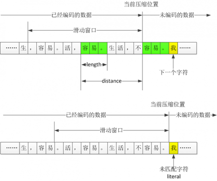
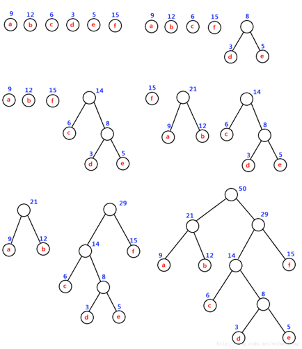
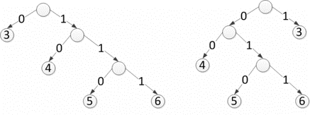
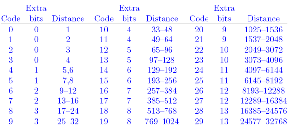
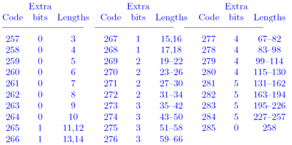
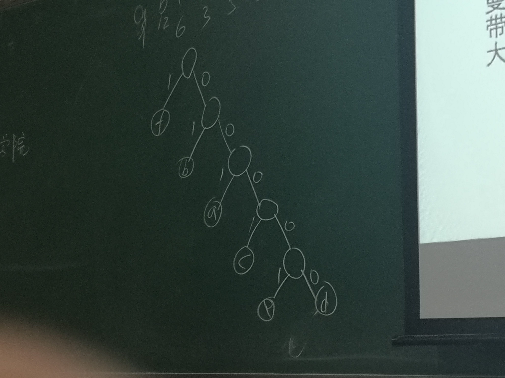
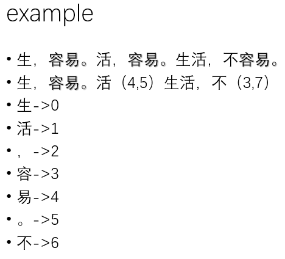
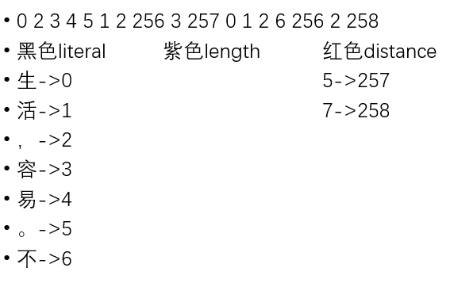

<!-- TOC -->

- [1. ZIP](#1-zip)
- [2. LZ编码](#2-lz编码)
  - [2.1. Sliding-Window Compression](#21-sliding-window-compression)
- [3. Huffman树](#3-huffman树)
  - [3.1. Deflate树](#31-deflate树)
  - [3.2. 码表](#32-码表)
    - [3.2.1. 介绍码表](#321-介绍码表)
    - [3.2.2. 格式](#322-格式)
- [4. Huffman树](#4-huffman树)
- [5. 压缩结果解码](#5-压缩结果解码)

<!-- /TOC -->

# 1. ZIP
1. ZIP是无损压缩方法。其压缩格式教唆Deflate，采用了LZ编码思想，使用了Huffman树的结构。
2. ZIP经历了两次压缩，第一次基于LZ，第二次基于Huffman

# 2. LZ编码
1. LZ77(sliding-window compression)滑动窗口
2. LZ78(dictionary)
3. LZW(Lempel–Ziv–Welch)
4. LZMA(Lempel-Ziv Markov chain Algorithm)

## 2.1. Sliding-Window Compression
1. length
2. diatance
3. literal(计入没见过的部分)
    + 0-255代表256个不同的literal
    + 256代表literal的结束
    + 从257开始代表长度
4. 滑动一遍后就已经生成了
    + ,容易。这四个字符进行存储
    + 这就是第一部分压缩
5. Eg. 生`，容易。`活`，容易。`生活，不`容易`。
6. ZIP中设置的滑动窗口是32KB

# 3. Huffman树
1. 给定N个权值作为N个叶子结点，构造一棵二叉树，若该树的带权路径长度达到最小，称这样的二叉树为最优二叉树，也称为哈夫曼树(Huffman Tree)。哈夫曼树是带权路径长度最短的树，权值较大的结点离根较近。

## 3.1. Deflate树

## 3.2. 码表
1. 对distance进行编码，其范围为1-32768
2. 如果1-32768都出现过且频率相同，如何编码？
    + 无符号原码
    + 15位
    + 如果只出现了其中的100个数，共出现200次，则需3000位
3. 频率不同:使用Huffman树进行编码

### 3.2.1. 介绍码表
1. 历史遗留问题，PK把distance又分成了30分。
他把distance划分成多个区间，每个区间当做一个整数来看，这个整数称为**Distance Code**。
2. deflate可以看作Huffman基础之上的一种编码
3. 对literal和length编码
    + length最小值认为是3
    + literal和length二者合二为一，共用一套码表
4. 0-255代表256个不同的literal
5. 256代表literal结束
6. 从**257开始代表**length

### 3.2.2. 格式
1. Code + Extra bits + Distance
2. Code只要有一个即可，所以不存在
3. Extra bits:表示有2Extra bits的可能

# 4. Huffman树
1. 最优二叉树
2. 表示这些token需要每个3位，就是常用的值短一点，不常用的值长一点。
    + 插入手机图片
3. 数字上面的值是这个token出现的次数。

# 5. 压缩结果解码
1. 当解码器接收到一个比特流的时候，首先可以按照literal/length这个码表来解码，如果解出来是0-255，就表示未匹配字符，如果是256，那自然就结束，如果是257-285之间，则表示length，把后面扩展比特加上形成length后，后面的比特流肯定就表示distance，因此，实际上通过一个Huffman码表，对各类情况进行了统一，而不是通过加一个什么标志来区分到底是literal还是重复字符串。
2. (4,5)解码容易，(3,7)解码已经解码的(4,5)
    + 2代表3，根据之前的图，先读到256，然后读到length和从哪里找，2->3.
    + distance根据Extra bits来进行确定是对应哪个
    + 从头计算一次
3. Eg.

