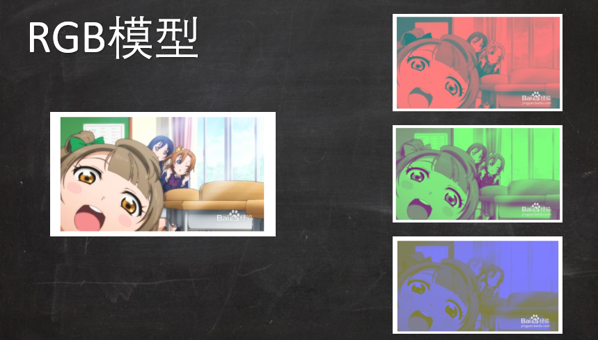
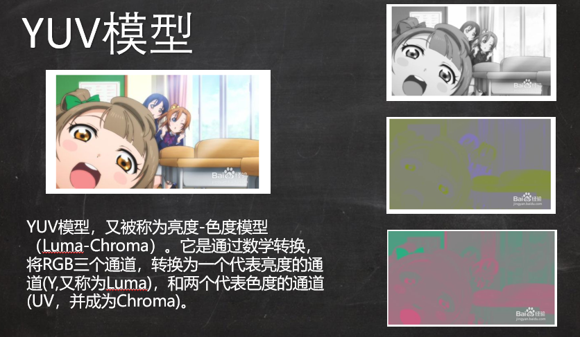

<!-- TOC -->

- [1. 图像简介](#1-图像简介)
  - [1.1. 图像的基本结构](#11-图像的基本结构)
    - [1.1.1. RGB模型](#111-rgb模型)
    - [1.1.2. YUV模型](#112-yuv模型)
    - [1.1.3. 查看图片的相关信息](#113-查看图片的相关信息)
    - [1.1.4. 图片通道编码的分离和合并](#114-图片通道编码的分离和合并)
  - [1.2. 像素的32位对齐](#12-像素的32位对齐)
  - [1.3. 图像压缩](#13-图像压缩)
    - [1.3.1. 各种文件存储(存储)格式](#131-各种文件存储存储格式)
  - [zip & rar通用算法](#zip--rar通用算法)
  - [jpg & png格式](#jpg--png格式)
  - [jpeg格式](#jpeg格式)
  - [BMP格式](#bmp格式)
- [2. png格式](#2-png格式)
  - [2.1. 文件头](#21-文件头)
  - [2.2. 数据块结构](#22-数据块结构)
    - [2.2.1. 不同的数据块类型](#221-不同的数据块类型)
    - [2.2.2. 标准数据块的格式](#222-标准数据块的格式)
    - [2.2.3. 像素格式](#223-像素格式)
  - [2.3. 压缩算法](#23-压缩算法)
    - [2.3.1. 过滤](#231-过滤)
  - [一维条件下的差分编码](#一维条件下的差分编码)
  - [二维条件下的差分编码](#二维条件下的差分编码)
  - [PNG允许的5种不同的推断算法](#png允许的5种不同的推断算法)
  - [处理的对象](#处理的对象)
    - [2.3.2. 压缩](#232-压缩)
  - [Deflate算法](#deflate算法)
  - [Deflate算法参考资料](#deflate算法参考资料)
- [3. jpeg格式](#3-jpeg格式)
- [4. 参考](#4-参考)

<!-- /TOC -->

# 1. 图像简介

## 1.1. 图像的基本结构
1. 在计算计算机中，图像是由一个个像素点(也称颜色点)组成。

### 1.1.1. RGB模型
1. 颜色最简单的显示方式:RGB或RGBA表示
    + 其中R通道是指蓝颜色通道
    + 其中G通道是指绿颜色通道
    + 其中B通道是指蓝颜色通道
    + 其中A通道是指这个图像可以有透明效果
    + 三个分量一般是用一个字节(8位)来表示
2. 示意图



### 1.1.2. YUV模型
1. YUV模型:又被称为亮色-色度模型(Luma-Chroma)。它是通过数学变换，将RGB三个通道转换成为一个代表亮度的通道(Y,又称Luma)，和两个代表色度的通道(UV,又称Chroma)

2. 好处:
    1. 好处：人眼对亮度的敏感度远高于色度，因此人眼看到的有效信息主要来自于亮度。YUV模型可以将绝大多数的有效信息分配到Y通道。UV通道相对记录的信息少的多。相对于RGB模型较为平均的分配，YUV模型将多数有效信息集中在Y通道，不但减少了冗余信息量，还为压缩提供了便利；
    2. 保持了对黑白显示设备的向下兼容；
    3. 图像编辑中，调节亮度和颜色饱和度，在YUV模型下更方便。

3. 示意图



### 1.1.3. 查看图片的相关信息
```py
from PIL import Image
image = Image.open('test.png')
print(image.size)# 图片的长*宽
print(image.format)# image的图片类型，此例中未png
print(image.mode)# image的颜色显示类型
```


### 1.1.4. 图片通道编码的分离和合并
```py
from PIL import Image # 导入
import random
def getRandom(situation,ob1,ob2,ob3):
    if(situation == "0"):
        return ob1
    elif(situation == "1"):
        return ob2
    elif(situation == "2"):
        return ob3
    print("Wrong!")
    return ob1
# 导入的数据图都是RGBA，暂未做适配
im1 = Image.open('test.png')
im2 = Image.open('test1.png')
im3 = Image.open('test2.png')
# 调整图片大小
im1 = im1.resize((1500,1000))
im2 = im2.resize((1500,1000))
im3 = im3.resize((1500,1000))
# 在通道合并前需要保证图片大小相同
r0, g0, b0, c0 = im1.split()
r1, g1, b1, c1 = im2.split()
r2, g2, b2, c2 = im3.split()
temp_1 = str(random.randint(0, 2))
temp_2 = str(random.randint(0, 2))
temp_3 = str(random.randint(0, 2))
temp_4 = str(random.randint(0, 2))
result = Image.merge("RGBA", [getRandom(temp_1,r0,r1,r2),
                              getRandom(temp_2,g0,g1,g2),
                              getRandom(temp_3,b0,b1,b2),
                              getRandom(temp_4,c0,c1,c2)])
result.save("result.png")
```

## 1.2. 像素的32位对齐
1. 如果是RGB24位图，会存在一个32位对齐的问题
    + 在x86体系下，cpu一次性处理32倍数的数据会更快。
2. 24位图，宽度不是4的倍数，其行字结束将不是32整数倍。这时候我们可以采取在行尾添加冗余数据的方式，使其字节数为32的倍数。
    + `byteNum = ((width * 24 + 31) & ~31)>>3;`这个公式可以计算出来32位对齐后每行应该占的字节数。
3. Eg.图像像素宽为5像素，不做32位对齐时，行尾数为120，相对于最近向上取整的32的倍数是128，也就是我们只要添加一字节的冗余数据即可。

## 1.3. 图像压缩
1. 为什么要对图片用一定的格式进行压缩？
    + 因为如果按照图像原始格式直接存储到文件中将会非常大。
2. Eg. 5000 * 5000 24位图，其大小为5000 * 5000 * 3字节 = 71.5MB

### 1.3.1. 各种文件存储(存储)格式

zip & rar通用算法
---
我们如果选用zip或者rar之类的通用算法来压缩像素数据，得到的压缩比例通常不会太高,大概也是因为它是一个通用算法的缘故。

jpg & png格式
---
jpg和png都是针对图形的不同图像压缩算法
1. 后面的部分

jpeg格式
---
jpeg格式是有损压缩格式，将像素信息用jpeg保存成文件再读取出来，其中某些像素值会有所变化
+ 保存质量参数:决定图片保真的情况。

BMP格式
---
1. BMP格式没有压缩过像素格式。
    + 其存储格式:文件头 + 图像头 + 像素数据
    + 其存储特点:颠倒存储
2. bmp格式也可以进行压缩

# 2. png格式
1. 是一种**无损压缩**的位图片形格式。
    + 压缩过的文件可以还原出原图。
2. PNG使用从LZ777派生的无损数据压缩算法，一般应用于JAVA程序，压缩比高，生成文件体积小。
3. 标准的PNG文件结构:PNG文件标志 + PNG数据块 + ... + PNG数据块
    + 确保系统不会误识别为文本文件。

## 2.1. 文件头
1. 文件头是有位固定的字节来进行描述的

## 2.2. 数据块结构
1. PNG图像格式文件(或者成为数据流)由一个8字节的PNG文件署名域(PNG file signature)和按照特定结构组织的三个以上的数据块(chunk)组成。

### 2.2.1. 不同的数据块类型
1. 关键数据块(ctritical chunk),这是必需的数据块。
    + 定义了4个标准数据块，每个PNG文件都必须包含它们，PNG读写软件也必须支持这些数据块。
2. 辅助数据块(ancillary chunks),这是可选的数据块。

### 2.2.2. 标准数据块的格式
每个数据块都由四个域组成
1. 长度(Length):
    + 一个4字节的无符号整数，给出数据块的数据字段的长度(以字节计)。长度只计算数据域。为了兼容一些不支持无符号的语言，所以长度被限制在(2<sup>31</sup>-1)字节且不能**达到**
2. 数据块类型码(Chunk Type Code):
    + 一个4字节的块类型代码。为了便于描述和检查PNG文件，类型代码仅限于大写和小写的ASCII字母。然而编码器和解码器必须把代码作为固定的二进制值而非字符串来处理。
3. 数据域(Chunk Data):
    + 数据块的数据域，存储按照数据块类型码指定的数据。该字段可以是长度为0
4. 循环冗余检测(CRC):
    + 一个4字节的CRC(循环冗余校验)计算，在所述块的前面的字节，包括该块类型的代码和数据块的数据字段，但是不包括长度字段，CRC始终存在。

### 2.2.3. 像素格式
PNG也支持很多种类型的像素格式
1. Indexed(索引色) = 1个频道，可以为1,2,4,8 bpc
2. Grayscale(灰度) = 1个频道，可以为1，2，4，8，16 bpc
3. Gray+Alpha(带透明通道的灰度) = 2个频道，可以为8或16 bpc
4. Truecolor(RGB 真彩色) = 3个频道，可以为8或16 bpc
5. RGBA(RGBA 带透明通道的真彩色) = 4个频道，可以为8或16 bpc


## 2.3. 压缩算法
1. png可以有透明效果
2. png比较适合矢量图、几何图
3. png图片压缩的过程:推断(过滤)和压缩

### 2.3.1. 过滤
1. 差分编码(Dleta encoding)是数字压缩法之一。

一维条件下的差分编码
---
1. 原理:根据前一个数据的值将后面一个数据替换成其他值
2. Eg.[2,3,4,5,6,7,8]->[2,1,1,1,1,1,1](线性相关)

二维条件下的差分编码
---
1. 原理:对于每一行的像素，一个像素都跟它的左边像素、上边的像素和左上角的像素有关系。

2. Eg. X - (A+B)/2

PNG允许的5种不同的推断算法
---
1. 过滤
2. X-A
3. X-B
4. X-(A+B)/2
5. Paeth推断*

处理的对象
---
1. 过滤器都是对每一行像素起作用而不是单个像素，也就是说过滤器会对每一行的红色的像素起作用，再分别对蓝色的像素对作用。
2. 对于调色板的图像和8位的灰色图就不要过滤。
3. 对于其他图片，就选择那种最大限度地减少绝对差异总和的过滤器。

### 2.3.2. 压缩
1. 在一行像素被过滤后，就会执行DEFLATE压缩(LZ77延伸出来的算法)，这种算法结合了LZ77编码和和夫曼编码。

Deflate算法
---
1. Deflate只能匹配3到258个之间符号，所以最大的压缩比只能到1035:1
2. 如果匹配到的符号小于3，那么会产生额外的开销来表示这些符号。
3. 这也就意味着我们的图片大小会受到每一行像素的匹配程度影响。

Deflate算法参考资料
---
1. <a href = "https://blog.csdn.net/blues1021/article/details/45165777/">deflate算法总结</a>
2. <a href = "https://blog.csdn.net/gohuge/article/details/80652274">Deflate算法解读</a>


# 3. jpeg格式
1. VC<sub>r</sub>C<sub>b</sub>：亮度灰度色度
2. 最敏感的是亮度
3. [R,G,B]<sup>T</sup>->[V,C<sub>r</sub>,C<sub>b</sub>]
4. 第一次压缩:
    + 就是我们把每一个位点的三个指标进行稀疏化操作。就是有的只保留亮度，有的保留色度和灰度。
5. 首先对图形进行分块8*8，使用DCT
    + V:F(x,y)
    + C<sub>r</sub>:G(x,y)
    + C<sub>b</sub>:H(x,y)
    + 对以上进行傅里叶展开
6. 因为视觉暂留，所以高频的信息对人的影响是比较小的，所以我们可以降低在傅里叶展开后的高次项的部分。
    + 对于像素点数据，我们想要保留低频次部分，而降低高频次部分的比例，这样我们就要使用一个**相应的矩阵(DCT结果的系数矩阵)**来进行对对应矩阵进行放缩。
    + 那个相应的矩阵是我们解码需要的东西
    + 处理频率表格的时候，我们使用zip-zag来将4*4的部分按照相应的顺序(一般保证是大数字优先)来排成一串的向量(1*16)，可以进行截断。
    + 之后对于之后处理的行向量的结果来进行Huffman数来进行处理。
7. 格式:TAG + DATA格式
    + TAG开头会有一个0x00 + TAG:不同TAG表示不同的内容，比如相应的那个矩阵，在最后的部分砍去了多少
    + 0x00是否在数据里面，如果对照上的内容，我们可以使用0x00为数据，否则为截断。
8. 对于存储矩阵，左上角的数据的频率最小，而右下角最大。
9. 操作单元是8*8的形式，分别处理，然后进行拼接即可。
10. 其他详见jpeg_in

# 4. 参考
1. 百度百科
2. <a href = "https://blog.csdn.net/woniuye/article/details/89218461">各种图片编码格式详解（bmp,jpg,png）</a>
3. <a href = "https://blog.csdn.net/asdzheng/article/details/51476818">PNG格式图片原理</a>
4. <a href = "https://blog.csdn.net/hherima/article/details/45847043">《PNG文件格式》（二）PNG文件格式分析</a>