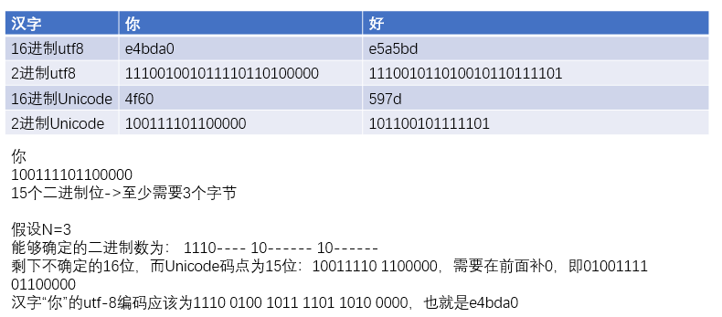
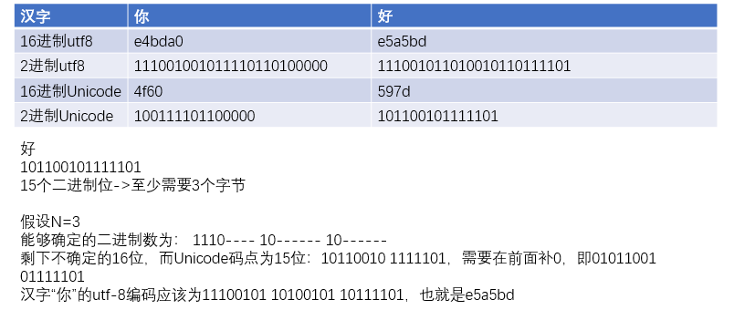

字符类型编码
---

<!-- TOC -->

- [1. utf-8(Universal Character Set/Unicode Transformation Format – 8 bits)](#1-utf-8universal-character-setunicode-transformation-format--8-bits)
  - [1.1. 处理字符](#11-处理字符)
  - [1.2. UTF-8 & python 7 chardet](#12-utf-8--python-7-chardet)
- [2. Unicode](#2-unicode)
- [3. txt(txt file)](#3-txttxt-file)
  - [3.1. 特点](#31-特点)
- [4. 什么是GB2312](#4-什么是gb2312)
- [5. GB2312和UTF-8、GBK之间的关系](#5-gb2312和utf-8gbk之间的关系)
- [6. GB2312的汉字表示方法](#6-gb2312的汉字表示方法)
  - [6.1. 分区表示](#61-分区表示)
  - [6.2. 字节结构](#62-字节结构)
  - [6.3. 区位码、国标码和计算机机内码的关系](#63-区位码国标码和计算机机内码的关系)
- [7. EUC存储方式](#7-euc存储方式)
  - [GB2312(EUC-CN)](#gb2312euc-cn)
- [8. 参考](#8-参考)

<!-- /TOC -->

# 1. utf-8(Universal Character Set/Unicode Transformation Format – 8 bits)
1. UTF-8（8-bit Unicode Transformation Format）是一种针对Unicode的可变长度字符编码，又称万国码，由Ken Thompson于1992年创建。现在已经标准化为RFC 3629。UTF-8用1到6个字节编码Unicode字符。用在网页上可以统一页面显示中文简体繁体及其它语言（如英文，日文，韩文）。
2. 为什么叫utf-8?
    + 因为最小的一个字节是8位。
3. 如果python检测到输出是ANSII的二进制，Python会直接显示结果。

## 1.1. 处理字符
1. ANSII是只有一位的。
2. 对于单个字节的字符，第一位设为0，后面的7位对应这个字符的unicode码点。因此，对于英文中的0-127号字符，与ASCII码完全相同。这意味着ASCII码那个年代的文档用utf-8编码打开完全没有问题。
3.对于需要使用N个字节来表示的字符（N>1），第一个字节的前N位都设为1，第N+1位设为0，剩余的N-1个字节的前两位都设位10，剩下的二进制位则使用这个字符的Unicode码点来填充，如果位数多了，在前面补0。
4. 编码是不可以出现歧义的
5. Eg.



## 1.2. UTF-8 & python 7 chardet
1. 检查字符的编码形式
```py
import chardet
with open('example','w') as f:
    f.write('hello world')
with open('example','rb') as f:
    data = f.read()
print (chardet.detect(data)["encoding"])# ascii
with open('example.txt','w') as f:
    f.write('你好')
with open('example.txt','rb') as f:
    data = f.read()
print (chardet.detect(data)["encoding"])# utf-8
```
2. 文件输入输出检测
```py
with open('example','w') as f:
    f.write('hello world') 
with open('example','rb') as f:
    print(f.read())
# b'hello world'
with codecs.open('example','w','utf-8') as f:
    f.write('你好')
with open('example','rb') as f:
    print(f.read())
# b'\xe4\xbd\xa0\xe5\xa5\xbd’
#当python检测到文本文件的内容无法转译为ascii码时，就会用\x的标示提醒你这是一个十六进制数。
```

# 2. Unicode
1. Unicode（统一码、万国码、单一码）是计算机科学领域里的一项业界标准，包括字符集、编码方案等。Unicode 是为了解决传统的字符编码方案的局限而产生的，它为每种语言中的每个字符设定了统一并且唯一的二进制编码，以满足跨语言、跨平台进行文本转换、处理的要求。1990年开始研发，1994年正式公布。
2. Unicode是在ASCII的基础之上的。
3. Unicode是不定长的。
4. 当然，还有一些细节问题，例如我们应该把常用的字符排在前面，把比较生僻的排在后面，这样可以相对的节省空间。

# 3. txt(txt file)
1. txt是微软在操作系统上附带的一种文本格式，是**最常见**的一种文件格式 ，早在DOS时代应用就很多，主要存文本信息，即为文字信息，现在的操作系统大多使用记事本等程序保存，大多数软件可以查看，如**记事本，浏览器**等等。
2. .txt是包含**极少格式**信息的文字文件的扩展名。.txt格式并没有明确的定义，它通常是指那些能够被系统终端或者简单的文本编辑器接受的格式。任何能读取文字的程序都能读取带有.txt扩展名的文件，因此，通常认为这种文件是**通用的、跨平台**的。

## 3.1. 特点
1. txt的默认编码格式在不同的机器上不同
2. 经过试验，在win10上的默认编码格式是windows-1252。在MacOs和一部分linux机器上的默认编码格式是utf-8
4. MacOs机器会在文本的末尾添加0a，也就是换行，但是windows不会


# 4. 什么是GB2312
1. GB2312是一种字符编码类型，GB2312编码适用于汉字处理、汉字通信等系统之间的信息交换。
2. 其基本集合供收入汉字6763个和非汉字图形字符682个。

# 5. GB2312和UTF-8、GBK之间的关系
1. UTF-8(Unicode TransformationFormat-8bit)包含全世界所有国家需要用到的字符，是国际编码，通用性比较强。
2. GB2312在之前已经介绍过了。
3. GBK是国家标准GB2312基础上扩展后兼容GB2312的标准。
    + GBK包含全部中文字符，无论中、英文字符均使用双字节来表示。为了区分中文，其最高位全部为1。
4. 三者之间的转换必须都通过Unicode编码才能相互转换

# 6. GB2312的汉字表示方法

## 6.1. 分区表示
1. 每个区含有94个汉字/符号。这种表示方式也称为区位码。
    + 01-09区为特殊符号
    + 16-55区为一级汉字，按拼音排序
    + 56-87区为二级汉字，按拼音/笔画排序
    + 10-15以及88-94区则未有编码
2. 每个区有94个位。

## 6.2. 字节结构
1. 采用**EUC存储方法**，以便兼容于ASCII。
2. 每个汉字以及符号用两个字节来表示。第一个字节称为“高位字节”(区字节)，第二个字节称为“低位字节”(位字节)
    + 高位字节用了0xA1-0xF7
    + 低位字节使用了0xA1-0xFE
    + 占用的码位72*94=6768，其中空位为D7FA-D7FE
3. 区位码 = 区字节 + 位字节

## 6.3. 区位码、国标码和计算机机内码的关系
1. 换算成十六进制的区位码 + 2020H = 国标码
2. 国标码 + 8080H = 计算机机内码

# 7. EUC存储方式
1. EUC全称Extended Unix Code，是一个使用8位编码来表示字符的方法。EUC最初是针对Unix系统，在1991年被标准化。
2. EUC定义了4个单独的码集。
    + 码集0 —— 7位的ASCII，编码为单字节
    + 码集1,2,3 —— G1空间的值
    + 码集1 —— 未修饰的字符，编码为1-3字节
    + 码集2 —— 以0x8E(SS2)为第一字节，编码为至少2字节。
    + 码集3 —— 以0x8F(SS3)为第一字节，编码为至少2字节。

GB2312(EUC-CN)
---
1. EUC-CN是GB2312最常用的表示方法。
2. GB2312使用了EUC中定义的码集0和码集1

# 8. 参考
1. 百度百科
2. <a href = "www.divcss5.com/html/h53.shtml">UTF-8 GBK UTF8 GB2312之间的区别和关系</a>
3. <a href = "https://my.oschina.net/dubenju/blog/501350">字符编码--第3章 字符的存储--EUC（1991年）</a>