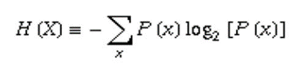

文件编码格式
---

<!-- TOC -->

- [1. 总体文件格式](#1-总体文件格式)
  - [1.1. 后缀名和编码格式](#11-后缀名和编码格式)
  - [1.2. 为什么需要编码？](#12-为什么需要编码)
  - [1.3. 存储资源的冲突](#13-存储资源的冲突)
- [2. 计算资源的冲突](#2-计算资源的冲突)

<!-- /TOC -->

# 1. 总体文件格式

ASCII|UTF-8|Unicode|GB2312
--|--|--|--
RGB|CMYK(Cyan Magenta Yellow blacK)|-|-
.txt|.doc|.md|-
.jpg|.png|.ai|-
.wav|.mp3|-|-
.avi|.mp4|.flv|-

1. Unicode是字符集而不是编码集
2. CYMK(Cyan magenta yellow black)是一种彩色打印格式。
    + 为什么不仅仅是三原色?合成出来的黑色是不合适的。

## 1.1. 后缀名和编码格式
1. 你修改文件的后缀名只是让操作系统用什么软件来进行解码，而并没有修改文件的后缀名。

## 1.2. 为什么需要编码？
1. 矛盾:有限的存储资源和无限的需求之间的矛盾。
    + 有限的**存储资源**和不断增长的**存储**需求
    + 有限的**计算资源**和不断增长的**时间**需求

## 1.3. 存储资源的冲突
1. 想让单位**存储空间**存储的信息量更大
2. 信息熵更大:

3. 编码的好处
    + 节省磁盘空间
    + 易于转移、上传
    + 安全
        + 有些编码可以在一定的破坏后依旧正常显示（二维码，图像压缩）
        + 如果没有特定的解码方式或解码器，无法打开文件（rar）

# 2. 计算资源的冲突
1. 目的:我们想要文件的编码和解码速度更快。
2. 具体问题
    + 压缩视频
    + 压缩音频(.zip .7z)
    + 安装软件(.dmg .pkg tar.gz)