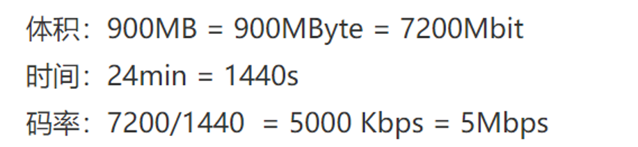
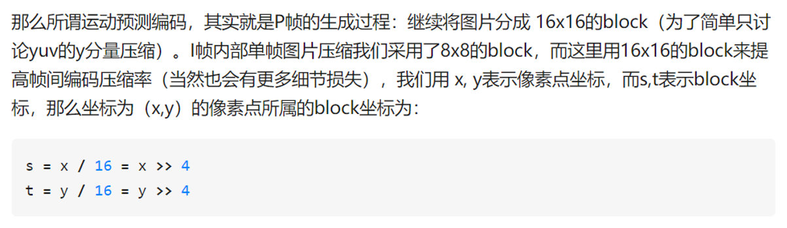
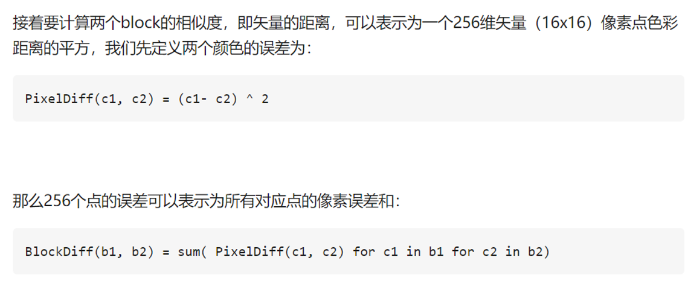
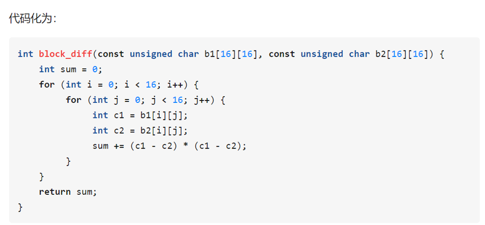
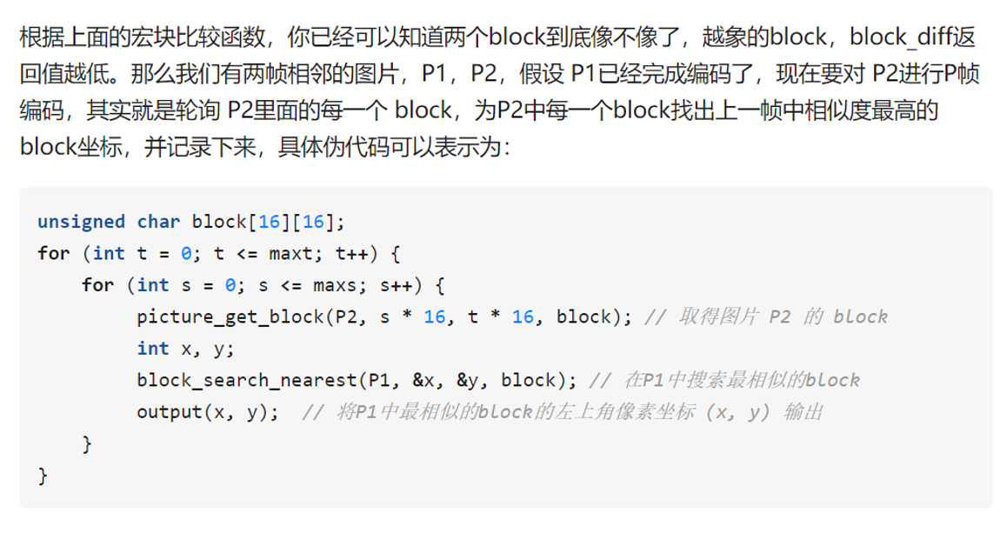
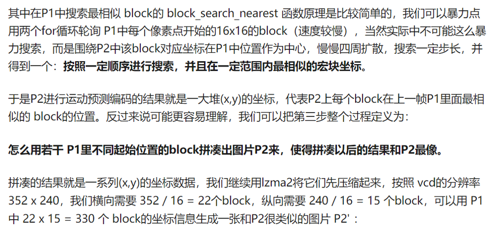
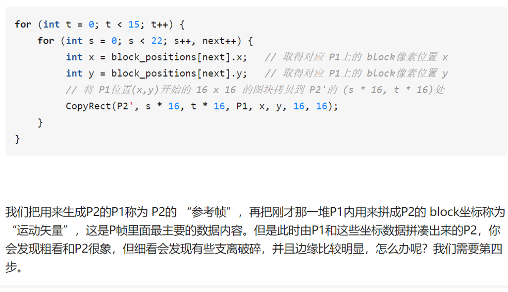
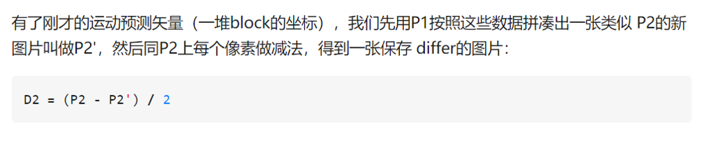
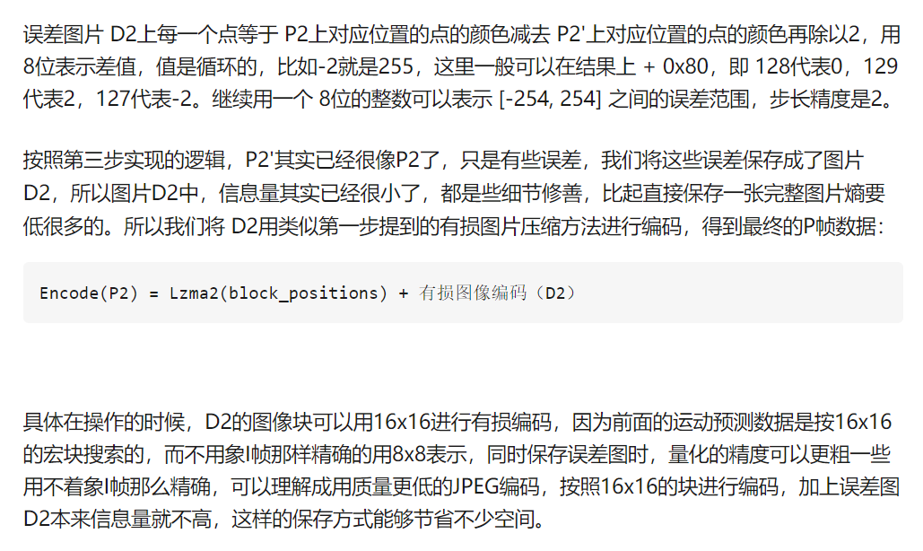
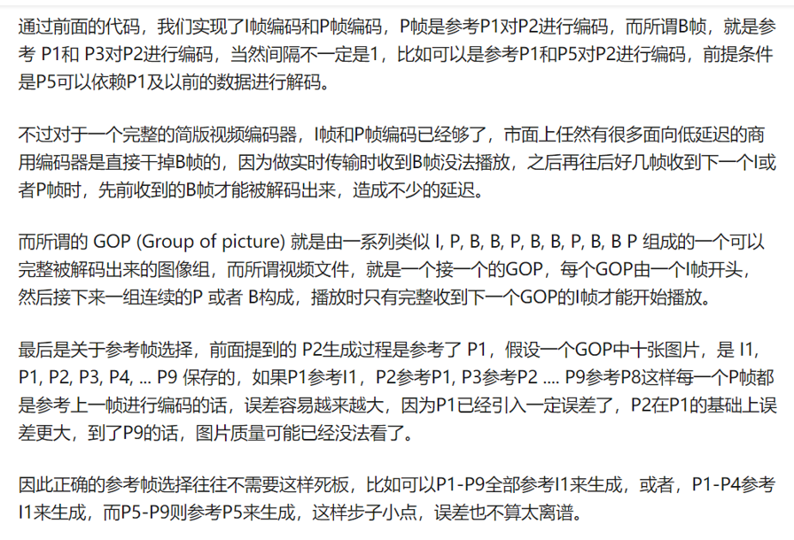

视频
---

<!-- TOC -->

- [1. MP4](#1-mp4)
  - [1.1. 什么是MP4](#11-什么是mp4)
  - [1.2. 视频编码方式](#12-视频编码方式)
  - [1.3. 视频编码方式的必然性](#13-视频编码方式的必然性)
  - [1.4. 视频部分基本概念](#14-视频部分基本概念)
    - [1.4.1. 分辨率](#141-分辨率)
    - [1.4.2. 帧率](#142-帧率)
    - [1.4.3. 码率](#143-码率)
  - [1.5. 压缩MP4大小](#15-压缩mp4大小)
    - [1.5.1. 实现有损图像压缩和解压](#151-实现有损图像压缩和解压)
    - [1.5.2. 实现宏块误差计算](#152-实现宏块误差计算)
  - [运动预测编码](#运动预测编码)
  - [块间相似度](#块间相似度)
  - [寻找具体实现块](#寻找具体实现块)
    - [1.5.3. 实现运动编码预测](#153-实现运动编码预测)
    - [1.5.4. 实现P帧编码](#154-实现p帧编码)
    - [1.5.5. 实现GOP生成](#155-实现gop生成)
  - [1.6. 其他备注](#16-其他备注)

<!-- /TOC -->

# 1. MP4

## 1.1. 什么是MP4
1. MP4是一套用于音频、视频信息的压缩编码标准， 由国际标准化组织（ISO）和国际电工委员会（IEC）下属的“动态图像专家组”（Moving Picture Experts Group, 即MPEG）制定。

## 1.2. 视频编码方式
1. 视频编码方式是指通过压缩技术，将原始视频格式的文件转换成另一种视频格式文件的方式。
2. 目标:减少占用空间
3. 方式:消除连续图像之间的冗余信息，抛弃一下与视频相关的信息，在解压缩进行回访时，创建原始的近似值。

## 1.3. 视频编码方式的必然性
1. 使通过互联网传输视频变得更加容易
2. 兼容性更强
3. 视频是连续的图像序列，由连续的帧组成，一帧借我一幅图像。由于人眼的视觉暂留效应，当帧序列以一定的速率进行播放的时候，我们看到的就是连续的视频。为了便于储存传输，我们需要对原始的视频进行编码压缩，以去除空间、时间的冗余

## 1.4. 视频部分基本概念

### 1.4.1. 分辨率
视频是由连续的图像构成的。每一张图像，我们称为一帧。图像则是由像素构成的，而一个图像有多少个像素，称为这个图像的分辨率。

### 1.4.2. 帧率
一个视频，每一秒由多少图像构成，称为这个视频的帧率。

### 1.4.3. 码率
码率 = 体积 / 时间

## 1.5. 压缩MP4大小

### 1.5.1. 实现有损图像压缩和解压
1. 帧的类型:
    1. I帧也称为关键帧，这是视频的全帧图像。创建i帧的次数越多，所需的空间就越多。
    2. P帧预测帧的缩写，这是一个仅包含部分图像的增量帧。它将向后看向i帧或另一个p帧，以查看图像的一部分是否相同。如果是这样，将排除该部分以节省空间。
    3. B帧双向预测帧的缩写，这是一个三角帧，也只包含一些图像。然而，这与p帧之间的区别在于，当选择在另一帧中存在的细节时，它可以向后或向前看其他delta帧或i帧。因此，B帧提供了改进的压缩，而不会影响观看体验。但是，它们确实需要更高的编码配置文件。

### 1.5.2. 实现宏块误差计算
运动预测编码
---

块间相似度
---

寻找具体实现块
---

### 1.5.3. 实现运动编码预测

### 1.5.4. 实现P帧编码

### 1.5.5. 实现GOP生成

## 1.6. 其他备注
1. 对一个部分的图片的关键帧中找到相应的块，然后生成运动矢量。
2. 差分图:运动矢量计算出来的图片和真实的相应的图片的
3. 关键帧:数据S全部存储(I帧)
    + 其他的帧
4. 预测帧:保存相应的运行矢量即可。(P帧)
5. 双向预测帧:(B帧)
6. 如果预测加起来第一个帧的部分，如果大于之后体积，则选择为关键帧。
7. 比较相似度:就是通过做差，然后求和判断是否是一个相似的部分。
    + 两个图片进行做差
    + 以一个为中心进行四周扩展
    + 差分图如果差的比较多，那么从头开始进行变换，不然就是从上一个进行变换。
    