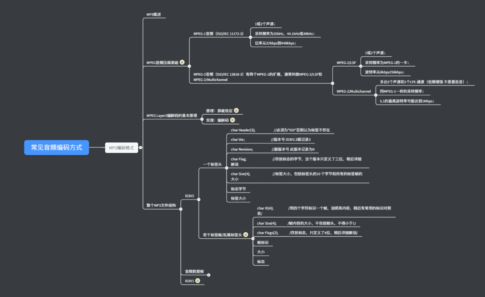

<!-- TOC -->

- [1. mp3](#1-mp3)
  - [1.1. mp3概述](#11-mp3概述)
  - [1.2. MPEG  Layer3解编码的基本原理](#12-mpeg-layer3解编码的基本原理)
  - [1.3. 文件格式](#13-文件格式)
    - [1.3.1. ID3V2](#131-id3v2)
    - [1.3.2. 音频数据帧](#132-音频数据帧)
    - [1.3.3. ID3V1](#133-id3v1)
- [2. MPEG](#2-mpeg)
  - [2.1. MPEG音频压缩基础](#21-mpeg音频压缩基础)
    - [2.1.1. MPEG-1音频](#211-mpeg-1音频)
    - [2.1.2. MPEG-2音频](#212-mpeg-2音频)
- [3. 思维导图](#3-思维导图)
- [4. 参考](#4-参考)

<!-- /TOC -->

# 1. mp3
1. mp3的进阶新版本是ACC

## 1.1. mp3概述
1. mp3动态影像专家压缩标准音频层面3
2. MP3是由帧(frame)构成
3. 有损压缩形式，压缩比例高(10:1)

## 1.2. MPEG  Layer3解编码的基本原理
通常情况下，MP3压缩器将原始声音通过FFT（快速傅立叶变换）变化到频域，然后通过一定的算法算出何种频率声音可以携带更多的信息。而在还原时解码器所需要做的仅仅是将其从频域再变换回来。

## 1.3. 文件格式
### 1.3.1. ID3V2
### 1.3.2. 音频数据帧
### 1.3.3. ID3V1
1. 比较固定，限制了标签必须包含艺术家、标题、唱片集等

# 2. MPEG
1. MPEG音频文件是MPEG1标准中的声音部分，根据压缩质量和编码复杂程度划分为三层，分别为layout1、layout2、layout3,其中第三层Layout3是mp3

## 2.1. MPEG音频压缩基础

### 2.1.1. MPEG-1音频
1. 1-2个声道
2. 采样频率
3. 位率

### 2.1.2. MPEG-2音频
1. 有1-2个MPEG-1的扩展

# 3. 思维导图

# 4. 参考
1. <a href = "https://blog.csdn.net/houxiaoni01/article/details/78810674">常见音频编码格式解析</a>