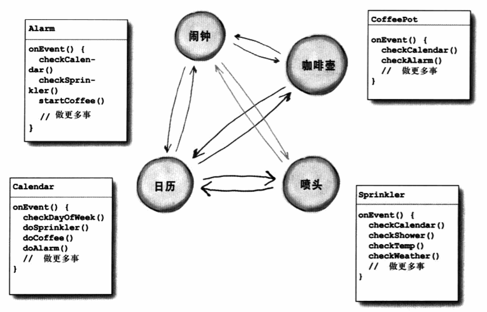
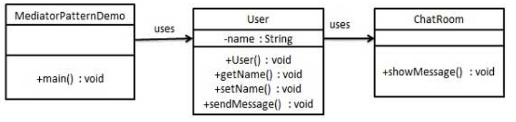

中介者模式
---

<!-- TOC -->

- [1. 中介者模式](#1-中介者模式)
  - [1.1. 解决的问题](#11-解决的问题)
  - [1.2. 应用场景](#12-应用场景)
  - [1.3. 解决和关键代码](#13-解决和关键代码)
  - [1.4. 中介类对象特征](#14-中介类对象特征)
  - [1.5. 类图](#15-类图)
  - [1.6. 优点](#16-优点)
  - [1.7. 缺点](#17-缺点)
  - [1.8. 使用场景](#18-使用场景)
  - [1.9. 应用实例](#19-应用实例)
- [2. 代码示例](#2-代码示例)
  - [2.1. 实现](#21-实现)
    - [2.1.1. 类图](#211-类图)
    - [代码实现](#代码实现)

<!-- /TOC -->

# 1. 中介者模式
1. 中介者模式是用来降低多个对象和类之间的通信复杂性。属于行为型模式。
2. 模式提供了一个中介类，这个类通常处理不同类之间的通信，并支持松耦合。

## 1.1. 解决的问题
1. 对象与对象之间存在大量的关联关系，这样势必导致系统的结构变得很复杂，同时若一个对象发生改变，我们也需要跟踪与之相关联的对象，同时做出相应的处理。

## 1.2. 应用场景
1. 多个类相互耦合，形成了网状结构

## 1.3. 解决和关键代码
1. 解决:将网状的对象结构分离成为星状结构
2. 关键代码:对象之间的的通信被封装到一个类中单独处理。

## 1.4. 中介类对象特征
1. 所有的对象会在自己状态改变的时候告诉中介者，所有的对象会对中介者的请求作出回应。
1. 中介者包含了整个系统的控制逻辑。

## 1.5. 类图


## 1.6. 优点
1. 通过将对象彼此解耦，可以增加对象的复用性。 
2. 通过将控制逻辑集中，可以简化系统维护。
3. 可以让对象之间所传递的信息变得简单而且大幅减少。

## 1.7. 缺点
1. 如果设计不当，那么其中介对象本身会变得过于复杂。

## 1.8. 使用场景
1. 系统中对象之间存在比较复杂的引用关系，导致它们之间的依赖关系混乱而造成难以复用。
2. 想要通过一个中间类来封装多个类中的行为，而又不想生成太多的子类。

## 1.9. 应用实例
1. 中国加入 WTO 之前是各个国家相互贸易，结构复杂，现在是各个国家通过 WTO 来互相贸易。
2. 机场调度系统。
3. MVC 框架，其中C（控制器）就是 M（模型）和 V（视图）的中介者。

# 2. 代码示例

## 2.1. 实现
- 我们通过聊天室实例来演示中介者模式。实例中，多个用户可以向聊天室发送消息，聊天室向所有的用户显示消息。我们将创建两个类 ChatRoom 和 User。User 对象使用 ChatRoom 方法来分享他们的消息。
- MediatorPatternDemo，我们的演示类使用 User 对象来显示他们之间的通信。

### 2.1.1. 类图


### 代码实现
1. 创建中介类。
```java
import java.util.Date;
public class ChatRoom {
    public static void showMessage(User user, String message){
        System.out.println(new Date().toString()
            + " [" + user.getName() +"] : " + message);
    }
}
```
2. 创建 user 类。
```java
public class User {
    private String name;
    public String getName() {
        return name;
    }
    public void setName(String name) {
        this.name = name;
    }
    public User(String name){
        this.name  = name;
    }
    public void sendMessage(String message){
        ChatRoom.showMessage(this,message);
    }
}
```
3. 使用 User 对象来显示他们之间的通信。
```java
public class MediatorPatternDemo {
    public static void main(String[] args) {
        User robert = new User("Robert");
        User john = new User("John");
    
        robert.sendMessage("Hi! John!");
        john.sendMessage("Hello! Robert!");
    }
}
```