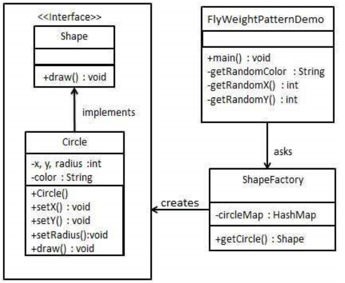

享元模式
---
1. 享元模式主要用于减少创建对象的数量，以减少内存占用和提高性能。属于结构型模式。
2. 提供了减少对象数量从而改善应用所需的对象结构的方式。
3. 享元模式尝试重用现有的同类对象，如果没有找到匹配的对象，则创建新的对象。

<!-- TOC -->

- [1. 享元模式](#1-享元模式)
  - [1.1. 使用情况](#11-使用情况)
  - [1.2. 解决方案](#12-解决方案)
  - [1.3. 关键代码](#13-关键代码)
  - [1.4. 应用实例](#14-应用实例)
  - [1.5. 优点](#15-优点)
  - [1.6. 缺点](#16-缺点)
- [2. 代码实现](#2-代码实现)
  - [2.1. 代码实现类图](#21-代码实现类图)
  - [2.2. 代码实现](#22-代码实现)

<!-- /TOC -->

# 1. 享元模式
1. 意图:利用共享技术有效地支持大量细粒度的对象。
2. 解决问题:在有大量对象时，有可能造成内存溢出，我们将其中共同的部分抽象出来，如果有相同的业务请求，直接返回在内存中已有的对象，避免重复创建。

## 1.1. 使用情况
1. 系统中有大量对象。
2. 这些对象消耗大量内存。
3. 这些对象的状态大部分可以外部化。
4. 这些对象可以按照内蕴状态分为很多组，当把外蕴对象从对象中剔除出来时，每一组对象都可以用一个对象来代替。
5. 系统不依赖于这些对象身份，这些对象是不可分辨的。

## 1.2. 解决方案
1. 用唯一标识码判断，如果在内存中有，则返回这个唯一标识码所标识的对象。

## 1.3. 关键代码
1. 通过HashMap存储对象

## 1.4. 应用实例
1. JAVA 中的 String，如果有则返回，如果没有则创建一个字符串保存在字符串缓存池里面。
2. 数据库的数据池。 

## 1.5. 优点
1. 大量减少对象的创建，降低系统的内存，使效率提高

## 1.6. 缺点
1. 提高了系统的复杂度，需要分离出来外部状态和内部状态，而且外部状态具有固有化的性质，不应该随着内部状态的变化而变化，否则会导致系统的混乱。

# 2. 代码实现
- 我们将创建一个 Shape 接口和实现了 Shape 接口的实体类 Circle。下一步是定义工厂类 ShapeFactory。
- ShapeFactory 有一个 Circle 的 HashMap，其中键名为 Circle 对象的颜色。无论何时接收到请求，都会创建一个特定颜色的圆。ShapeFactory 检查它的 HashMap 中的 circle 对象，如果找到 Circle 对象，则返回该对象，否则将创建一个存储在 hashmap 中以备后续使用的新对象，并把该对象返回到客户端。
- FlyWeightPatternDemo，我们的演示类使用 ShapeFactory 来获取 Shape 对象。它将向 ShapeFactory 传递信息（red / green / blue/ black / white），以便获取它所需对象的颜色。

## 2.1. 代码实现类图


## 2.2. 代码实现
1. 创建一个接口。
```java
public interface Shape {
    void draw();
}
```
2. 创建实现接口的实体类。
```java
public class Circle implements Shape {
    private String color;
    private int x;
    private int y;
    private int radius;
    public Circle(String color){
        this.color = color;     
    }
    public void setX(int x) {
        this.x = x;
    }
    public void setY(int y) {
        this.y = y;
    }
    public void setRadius(int radius) {
        this.radius = radius;
    }
    @Override
    public void draw() {
        System.out.println("Circle: Draw() [Color : " + color 
            +", x : " + x +", y :" + y +", radius :" + radius);
    }
}
```
3. 创建一个工厂，生成基于给定信息的实体类的对象。
```java
import java.util.HashMap;
public class ShapeFactory {
    private static final HashMap<String, Shape> circleMap = new HashMap<>();
    
    public static Shape getCircle(String color) {
        Circle circle = (Circle)circleMap.get(color);
    
        if(circle == null) {
            circle = new Circle(color);
            circleMap.put(color, circle);
            System.out.println("Creating circle of color : " + color);
        }
        return circle;
    }
}
```
4. 使用该工厂，通过传递颜色信息来获取实体类的对象。
```java
public class FlyweightPatternDemo {
    private static final String colors[] = 
        { "Red", "Green", "Blue", "White", "Black" };
    public static void main(String[] args) {
    
        for(int i=0; i < 20; ++i) {
            Circle circle = 
                (Circle)ShapeFactory.getCircle(getRandomColor());
            circle.setX(getRandomX());
            circle.setY(getRandomY());
            circle.setRadius(100);
            circle.draw();
        }
    }
    private static String getRandomColor() {
        return colors[(int)(Math.random()*colors.length)];
    }
    private static int getRandomX() {
        return (int)(Math.random()*100 );
    }
    private static int getRandomY() {
        return (int)(Math.random()*100);
    }
}
```