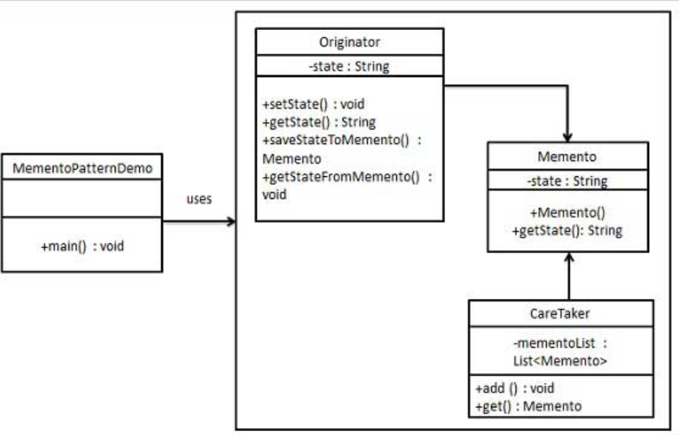

备忘录
---
1. 备忘录模式保存一个对象的某个状态，以便在适当的时候恢复对象。属于行为型模式。

<!-- TOC -->

- [1. 备忘录模式](#1-备忘录模式)
  - [1.1. 解决方案和代码实现](#11-解决方案和代码实现)
  - [1.2. 应用实例](#12-应用实例)
  - [1.3. 优点](#13-优点)
  - [1.4. 缺点](#14-缺点)
  - [1.5. 用途](#15-用途)
- [2. 备忘录模式的实现](#2-备忘录模式的实现)
  - [2.1. 类图](#21-类图)
  - [2.2. 代码实现](#22-代码实现)

<!-- /TOC -->

# 1. 备忘录模式
- 意图:在不破坏封装性的前提下，捕获一个对象的内部状态，并在该对象之外保存这个状态，以便能够在之后恢复
- 使用场景:很多时候我们需要记录一个对象的内部状态，为保证用户取消不确定或者错误的操作的时候，能够恢复到他之前的状态。

## 1.1. 解决方案和代码实现
- 解决方案:通过一个备忘录类专门存储对象状态
- 关键代码:客户不与备忘录类耦合，与备忘录管理类耦合。

## 1.2. 应用实例
1. 后悔药。
2. 打游戏时的存档。
3. Windows 里的 ctri + z。
4. IE 中的后退。
5. 数据库的事务管理。 

## 1.3. 优点
1. 将被储存的状态放在外面，不要和关键对象混在一起，这可以帮助维护内聚。
2. 保持关键对象的数据封装。
3. 提供了容易实现的恢复能力。

## 1.4. 缺点
1. 储存和恢复状态可能会相当耗时。
2. 消耗资源。如果类的成员变量过多，势必会占用比较大的资源，而且每一次保存都会消耗一定的内存。

## 1.5. 用途
1. 用于储存状态。
2. 在Java中，我们使用序列化机制储存系统的状态。

# 2. 备忘录模式的实现
- 备忘录模式使用三个类 Memento、Originator 和 CareTaker。
    - Memento 包含了要被恢复的对象的状态。
    - Originator 创建并在 Memento 对象中存储状态。
    - Caretaker 对象负责从 Memento 中恢复对象的状态。
- MementoPatternDemo，我们的演示类使用 CareTaker 和 Originator 对象来显示对象的状态恢复。

## 2.1. 类图


## 2.2. 代码实现
1. 创建 Memento 类。
```java
public class Memento {
    private String state;
    public Memento(String state){
        this.state = state;
    }
    public String getState(){
        return state;
    }  
}
```
2. 创建 Originator 类。
```java
public class Originator {
    private String state;
    public void setState(String state){
        this.state = state;
    }
    public String getState(){
        return state;
    }
    public Memento saveStateToMemento(){
        return new Memento(state);
    }
    public void getStateFromMemento(Memento Memento){
        state = Memento.getState();
    }
}
```
3. 创建 CareTaker 类。
```java
import java.util.ArrayList;
import java.util.List;
public class CareTaker {
    private List<Memento> mementoList = new ArrayList<Memento>();
    public void add(Memento state){
        mementoList.add(state);
    }
    public Memento get(int index){
        return mementoList.get(index);
    }
}
```
4. 使用 CareTaker 和 Originator 对象。
```java
public class MementoPatternDemo {
    public static void main(String[] args) {
        Originator originator = new Originator();
        CareTaker careTaker = new CareTaker();
        originator.setState("State #1");
        originator.setState("State #2");
        careTaker.add(originator.saveStateToMemento());
        originator.setState("State #3");
        careTaker.add(originator.saveStateToMemento());
        originator.setState("State #4");
    
        System.out.println("Current State: " + originator.getState());    
        originator.getStateFromMemento(careTaker.get(0));
        System.out.println("First saved State: " + originator.getState());
        originator.getStateFromMemento(careTaker.get(1));
        System.out.println("Second saved State: " + originator.getState());
    }
}
```