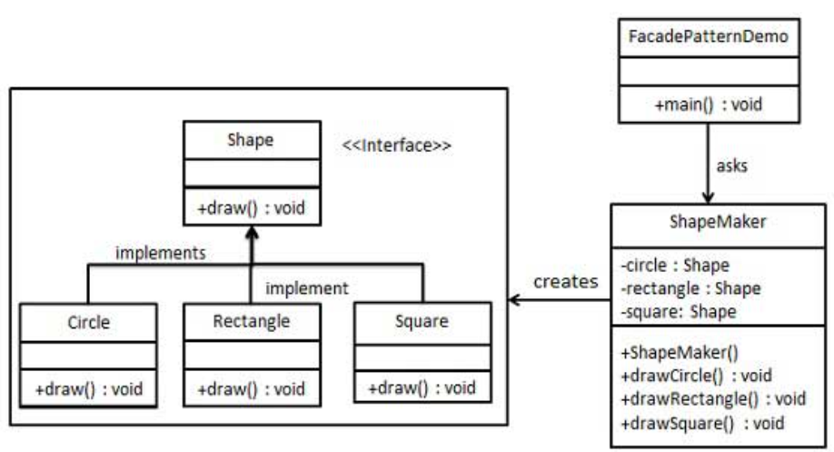

外观模式
---
1. 隐藏系统的复杂性，并向客户端提供了一个客户端可以访问系统的接口。属于结构性模式。
2. 涉及一个单一的类，这个类提供了客户端请求的简化方法和现有系统类方法的托管调用。

<!-- TOC -->

- [1. 外观模式](#1-外观模式)
  - [1.1. 解决方案](#11-解决方案)
  - [1.2. 关键代码](#12-关键代码)
  - [1.3. 使用场景](#13-使用场景)
  - [1.4. 优点](#14-优点)
  - [1.5. 缺点](#15-缺点)
- [2. 代码实现](#2-代码实现)
  - [2.1. 实例一:Shape](#21-实例一shape)
    - [2.1.1. Shape的类图](#211-shape的类图)
    - [2.1.2. 代码实现](#212-代码实现)
  - [2.2. 实例二:家庭影院](#22-实例二家庭影院)
    - [2.2.1. 问题解决](#221-问题解决)
    - [2.2.2. 影院问题的解决](#222-影院问题的解决)

<!-- /TOC -->

# 1. 外观模式
1. 模式定义:外观模式提供了一个统一的接口，用来访问子系统中一群接口。
2. 外观定义了一个高层接口，让子系统更容易使用。

## 1.1. 解决方案
- 客户端不与系统耦合
- 外观类与系统耦合

## 1.2. 关键代码
- 在客户端和复杂系统之间再加一层，这一层将调用顺序、依赖关系等处理好。

## 1.3. 使用场景
1. 为复杂的模块或子系统提供外界访问的模块:系统只需要一个“接待员”
2. 子系统相对独立:Java的三层开发模式
3. 预防低水平人员带来的风险

## 1.4. 优点
1. 减少系统互相依赖
2. 提高灵活性

## 1.5. 缺点
1. 不符合开闭原则，修改困难，继承和重写都不合适。

# 2. 代码实现

## 2.1. 实例一:Shape
- 我们将创建一个 Shape 接口和实现了 Shape 接口的实体类。下一步是定义一个外观类 ShapeMaker。
- ShapeMaker 类使用实体类来代表用户对这些类的调用。FacadePatternDemo，我们的演示类使用 ShapeMaker 类来显示结果。

### 2.1.1. Shape的类图


### 2.1.2. 代码实现
1. 创建一个接口。
```java
public interface Shape {
    void draw();
}
```
2. 创建实现接口的实体类。
```java
public class Rectangle implements Shape {
    @Override
    public void draw() {
        System.out.println("Rectangle::draw()");
    }
}
public class Square implements Shape {
    @Override
    public void draw() {
        System.out.println("Square::draw()");
    }
}
public class Circle implements Shape {
    @Override
    public void draw() {
        System.out.println("Circle::draw()");
    }
}
```
3. 创建一个外观类。
```java
public class ShapeMaker {
    private Shape circle;
    private Shape rectangle;
    private Shape square;
    public ShapeMaker() {
        circle = new Circle();
        rectangle = new Rectangle();
        square = new Square();
    }
    public void drawCircle(){
        circle.draw();
    }
    public void drawRectangle(){
        rectangle.draw();
    }
    public void drawSquare(){
        square.draw();
    }
}
```
4. 使用该外观类画出各种类型的形状。
```java
public class FacadePatternDemo {
    public static void main(String[] args) {
        ShapeMaker shapeMaker = new ShapeMaker();
    
        shapeMaker.drawCircle();
        shapeMaker.drawRectangle();
        shapeMaker.drawSquare();      
    }
}
```

## 2.2. 实例二:家庭影院
1. 当你装好了家庭影院之后，在观赏电影之前还要做很多的前置工作。
2. 在你看完电影后，你还要逐一关闭。
3. 以上是一个重复机械化的

### 2.2.1. 问题解决
1. 你要将一个复杂的子系统变得更加容易使用，也就是简化复杂系统。


1. 外观模式提供了直接的操作，将子系统进行隔离。

### 2.2.2. 影院问题的解决
1. 创建一个外观类，持有所有子系统，然后有相应的需要的方法可以极大精简客户端的代码数量。
