工厂模式
---

<!-- TOC -->

- [1. 工厂引入:关于对象的创建](#1-工厂引入关于对象的创建)
  - [1.1. 上面的解决方案的问题](#11-上面的解决方案的问题)
  - [1.2. 用"工厂"来解决](#12-用工厂来解决)
  - [1.3. 简单工厂的问题](#13-简单工厂的问题)
  - [1.4. 进一步设计分析](#14-进一步设计分析)
- [2. 工厂](#2-工厂)
  - [2.1. 工厂方法](#21-工厂方法)
  - [2.2. 允许子类做决定](#22-允许子类做决定)
- [3. 简单工厂模式](#3-简单工厂模式)
  - [3.1. 简单工厂模式例子:加减乘除](#31-简单工厂模式例子加减乘除)
  - [3.2. 优缺点](#32-优缺点)
    - [3.2.1. 优点](#321-优点)
    - [3.2.2. 缺点](#322-缺点)
- [4. 工厂模式](#4-工厂模式)
  - [4.1. 简单工厂模式的例子:加减乘除在工厂模式下的实现](#41-简单工厂模式的例子加减乘除在工厂模式下的实现)
  - [4.2. 工厂模式的类型爆炸](#42-工厂模式的类型爆炸)
- [5. 设计原则:](#5-设计原则)
  - [5.1. 依赖倒置原则带来的思维变化](#51-依赖倒置原则带来的思维变化)
  - [5.2. 关于依赖倒置原则的指导方针](#52-关于依赖倒置原则的指导方针)
  - [5.3. 其他工厂模式例子](#53-其他工厂模式例子)
    - [5.3.1. 工厂模式例子一:画图](#531-工厂模式例子一画图)
    - [5.3.2. 工厂模式例子二:数据库存储](#532-工厂模式例子二数据库存储)
- [6. 抽象工厂模式](#6-抽象工厂模式)
  - [6.1. 抽象工厂模式优点:](#61-抽象工厂模式优点)
  - [6.2. 抽象工厂模式的缺点](#62-抽象工厂模式的缺点)
  - [6.3. 抽象工厂模式的类图](#63-抽象工厂模式的类图)
  - [6.4. 抽象工厂模式参与者](#64-抽象工厂模式参与者)
    - [6.4.1. 抽象工厂的协作](#641-抽象工厂的协作)
  - [6.5. 应用场景](#65-应用场景)
  - [6.6. 应用注意点](#66-应用注意点)
  - [6.7. 简单工厂和抽象工厂相结合](#67-简单工厂和抽象工厂相结合)
  - [6.8. 抽象工厂的改进:反射 + 简单工厂](#68-抽象工厂的改进反射--简单工厂)
  - [6.9. 抽象工厂的改进:反射 + 配置文件 + 简单工厂](#69-抽象工厂的改进反射--配置文件--简单工厂)
  - [6.10. 抽象工厂模式类图](#610-抽象工厂模式类图)
    - [6.10.1. 类图](#6101-类图)
    - [6.10.2. 类图细节](#6102-类图细节)
  - [6.11. 工厂方法和抽象工厂比较](#611-工厂方法和抽象工厂比较)
  - [6.12. 抽象工厂模式的例子](#612-抽象工厂模式的例子)
- [7. 推荐书籍](#7-推荐书籍)

<!-- /TOC -->

# 1. 工厂引入:关于对象的创建
1. 目标的具体类的实现可以在运行时决定。
2. 使用简单的if语句进行 条件判断实例化对象，会降低系统的可维护性。
3. 我们应当针对接口编程，保证尽量对修改关闭(开闭原则)，想用具体类型来扩展代码必须重新打开它。
4. 在软件系统中，对象的创建往往是一个比较复杂而且比较特殊的事情。往往我们会需要根据不同类型的对象。如果是普通的方法，我们可以通过多态的形式来体现不同的行为实现。而构造方法却无法多态。

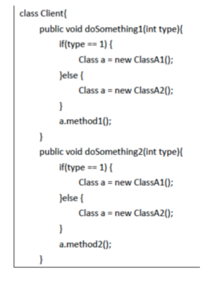

- 最初的想法:if...else判断或者switch判断

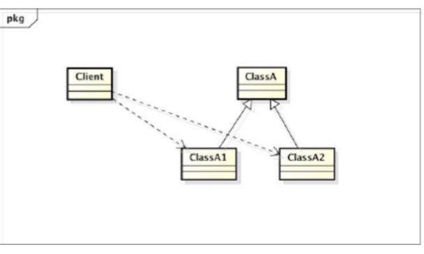

- 对于IF ELSE的判断部分和Switch的类图

## 1.1. 上面的解决方案的问题
1. 如图所示，Client严重依赖着具体类ClassA1和 ClassA2。
2. Client代码中到处分布着创建A对象的复杂判断。
3. 当我们A的子类发生改变，或者创建对象的复杂逻辑发生改变，都会对Client代码造成很复杂的修改。

## 1.2. 用"工厂"来解决
1. 我们需要依赖一个专门类 — 工厂的创建方法。工 模式就是为对象的创建提供一个接口，将具体创建的实现封装在接口之下，这样具体创建的实现的改变就不会对客户代码Client类产生影响。从而降低了Client类和ClassA1等多个具体类的耦合。

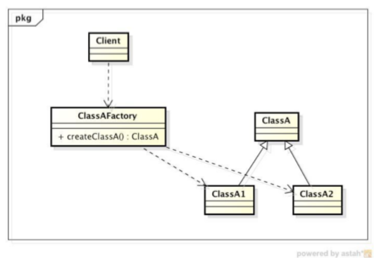

- 用工厂进行解耦合(避免客户端直接依赖具体的类)

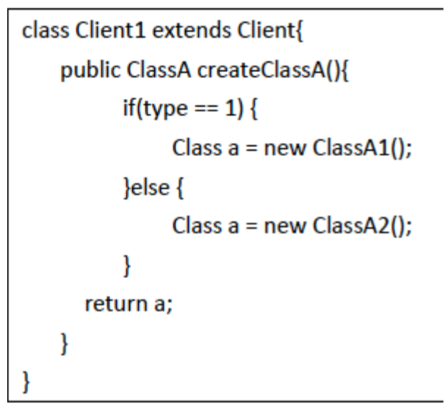

## 1.3. 简单工厂的问题
1. 在软件系统中，经常面临着“多种对象”的创建工作，由于需求的变化，多种对象的具体实现有时候需要灵活组合。
2. 比如汽车由引擎、轮胎、车身、车门等各部件组成。而每一部件都有很多种。一个汽车装配车间会依赖不同种的各个部件装配出不同型号的车。如果这时候我们为每一型号的车根据工厂模式创建一个工厂，由于部件的组合关系，我们就会遇到“组合爆炸“问题，对这个装配车间需要创建“无数”个工厂。这就对工厂模式提出更高要求。

## 1.4. 进一步设计分析
1. 分析具体的需求，我们可以发现，对客户Client来说需要同时实现工厂的灵活性和产品的灵活性。所以，我们提供了两套接口：
   1. 一是表现出稳定的工厂行为（创建不同的对象）的工厂接口
   2. 二是表现出稳定产品行为的产品接口。
2. 实现了工厂多态和产品多态。
3. 工厂接口既使得原本分布于代码各处的多种对象的实例化，现在变为集中到具体的工厂内部，又隔离了“对象实例化的组合”的变化。
4. 客户Client通过抽象工厂接口的方法得到ProductA和ProductB的实例，再利用产品接口来灵活使用具体的产品。

# 2. 工厂
1. 工厂持有创建对象的细节。
2. 保证了各部分之间的耦合程度，增强了原系统的复用性，保证了整个系统的可修改性。
3. 保证主体对象持有一个factory，并且需要在构造方法中传入。

```java
//简单工厂
public class PizzaStore{
    Factory factory;
    public PizzaStore(Factory factory){
        this.factory = factory;
    }
    //构造一个持有一个factory的store
}
```

## 2.1. 工厂方法
1. 工厂方法用来处理对象的创建，将这样的行为封装在子类中。如此，客户程序中关于超类的代码和子类对象创建代码解耦成功。
2. 实例:`abstract Product factoryMethod(String type)`

## 2.2. 允许子类做决定
1. 在超类PizzaStore中实现orderPizza()而设立createPizza()的接口，将制作过程下放到相应的子类
2. 解耦:一个方法知道要做什么，但是不知道具体到底做了什么。具体做什么由具体调用的子类来决定(根据规约来进行计算和实现)

# 3. 简单工厂模式

## 3.1. 简单工厂模式例子:加减乘除
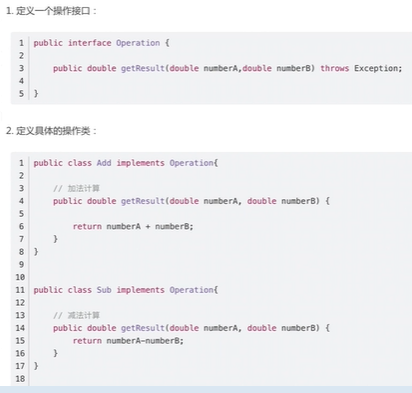
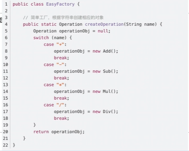
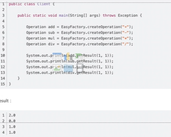

## 3.2. 优缺点

### 3.2.1. 优点
1. 无需提供具体的子类类名
2. 只需要提供一个字符串就可以得到相应的实例对象。
3. 当子类的类名更换或者增加子类时我们都无需修改客户端代码。

### 3.2.2. 缺点
1. 如果需要在方法里面写很多与对象创建相关的业务代码，并且需要创建的对象还不少的话，这个简单工厂中会有很多代码
2. 每次增加子类或者删除子类对象的创建都需要打开这简单工厂类进行修改。
3. 导致简单工厂类会很庞大、高耦合性，并且增加、删除某个子类对象的创建都需要打开简单工厂类来进行修改代码违反了开闭原则。

# 4. 工厂模式
1. **工厂模式**定义为一个创建对象的**接口**，但由子类决定实例化的类是哪一个，工厂让类把实例化推迟到子类。所有工厂模式都用来封装对象的创建。属于创建型模式。
   1. 工厂方法和创建者可以不是抽象的
   2. 可以通过Java的Enum避免运行时编译错误。
   3. 一个子类对应一个工厂类(拆分降低了简单工厂模式的高耦合性，类似策略模式)。
2. 意图:
   1. 让子类决定该创建的对象是什么，来达到将对象创建的过程封装的目的。
3. 何时使用:我们明确地计划不同条件下创建不同实例
4. 模式优点:
   1. 把简单工厂的内部逻辑判断转移到了客户端代码来进行
   2. 克服了简单工厂会违反开闭原则的缺点，又保持了对封装对象创建过程的优点
5. 模式缺点:
   1. 系统复杂度和对系统具体类的依赖增加
   2. 每次增加或删除子类对象的创建都需要打开简单工厂类来进行修改
   3. 增加一个产品类，就需要增加一个对应的工厂类
6. 使用场景:
   1. 日志记录器：记录可能记录到本地硬盘、系统事件、远程服务器等，用户可以选择记录日志到什么地方。
   2. 数据库访问，当用户不知道最后系统采用哪一类数据库，以及数据库可能有变化时。
   3. 设计一个连接服务器的框架，需要三个协议，"POP3"、"IMAP"、"HTTP"，可以把这三个作为产品类，共同实现一个接口。

## 4.1. 简单工厂模式的例子:加减乘除在工厂模式下的实现
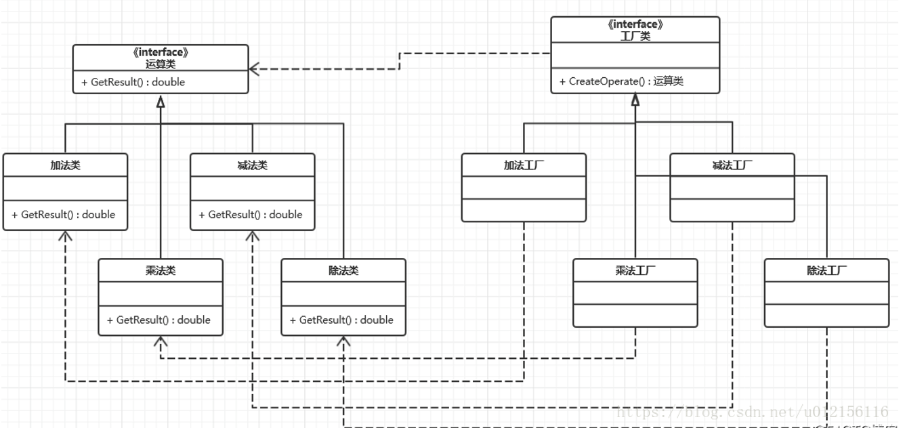
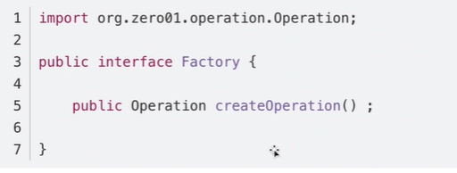
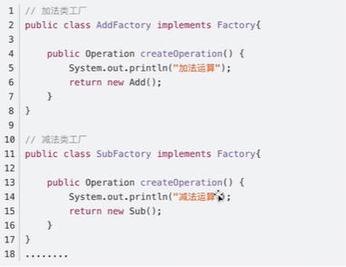
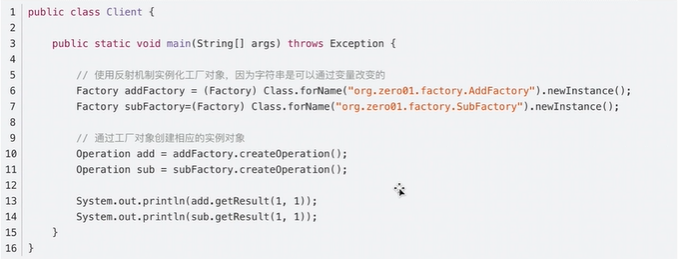

1. 反射来生成工厂

## 4.2. 工厂模式的类型爆炸
1. 一个抽象产品对应一个抽象工厂，这样的情况叫做类型爆炸

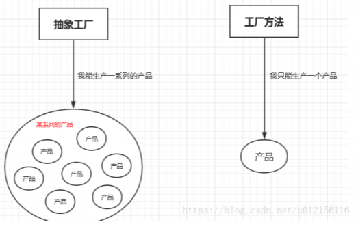

2. 工厂模式只能生产一个产品
3. 抽象工厂可以生成多个产品，例如MysqlFactory可以生产MysqlUser以及MysqlLogin两个产品，他们是一个系列的。

# 5. 设计原则:
1. 依赖倒置原则通则:要依赖抽象，不要依赖具体类。
2. 进一步解释:不能让高层组件依赖于低层组件，而且不管高层或低层组件，“两者”都应该依赖于抽象。
3. 工厂模式并不是依赖倒置原则的唯一技巧，但是是最有威力的技巧之一。

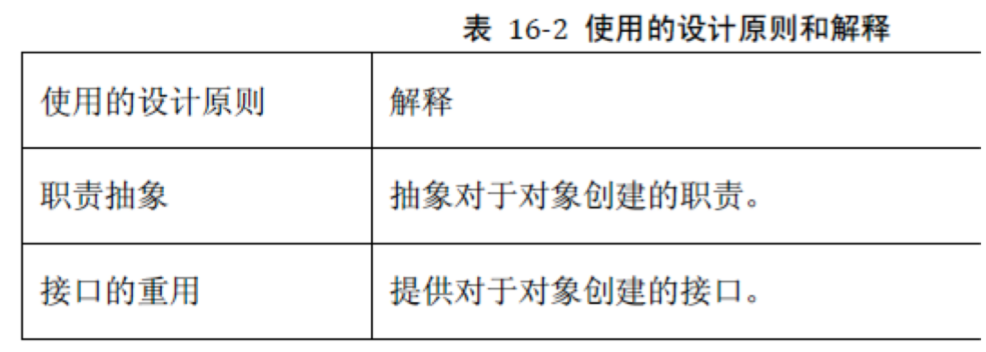

## 5.1. 依赖倒置原则带来的思维变化
1. 以pizza为例，正常的思维是思考具体有什么Pizza，而现在的思维应该是我们想象有Pizza，在回头思考如何设计Pizza店(工厂)。

## 5.2. 关于依赖倒置原则的指导方针
1. 变量不可以持有具体类的引用。
2. 不要派生自具体类。
3. 不要覆盖基类中已实现的方法。
4. 应当尽量做到依赖倒置原则，而不是随时都要遵守这个原则。

## 5.3. 其他工厂模式例子

### 5.3.1. 工厂模式例子一:画图
```java
public interface Shape {
    void draw();
}
public class Rectangle implements Shape {
    @Override
    public void draw() {
        System.out.println("Inside Rectangle::draw() method.");
    }
}
public class Square implements Shape {
    @Override
    public void draw() {
        System.out.println("Inside Square::draw() method.");
    }
}
public interface Color {
    void fill();
}
public class Red implements Color {
    @Override
    public void fill() {
        System.out.println("Inside Red::fill() method.");
    }
}
public class Green implements Color {
    @Override
    public void fill() {
        System.out.println("Inside Green::fill() method.");
    }
}
public abstract class AbstractFactory {
    public abstract Color getColor(String color);
    public abstract Shape getShape(String shape);
}
public class ShapeFactory extends AbstractFactory {
    @Override
    public Shape getShape(String shapeType){
        if(shapeType == null){
            return null;
        }        
        if(shapeType.equalsIgnoreCase("CIRCLE")){
            return new Circle();
        } else if(shapeType.equalsIgnoreCase("RECTANGLE")){
            return new Rectangle();
        } else if(shapeType.equalsIgnoreCase("SQUARE")){
            return new Square();
        }
        return null;
    }
    @Override
    public Color getColor(String color) {
        return null;
    }
}
public class ColorFactory extends AbstractFactory {
    @Override
    public Shape getShape(String shapeType){
        return null;
    }
    
    @Override
    public Color getColor(String color) {
        if(color == null){
            return null;
        }        
        if(color.equalsIgnoreCase("RED")){
            return new Red();
        } else if(color.equalsIgnoreCase("GREEN")){
            return new Green();
        } else if(color.equalsIgnoreCase("BLUE")){
            return new Blue();
        }
        return null;
    }
}
```

### 5.3.2. 工厂模式例子二:数据库存储
1. DatabaseFactory是抽象工厂。 DatabaseFactoryTxtFileImpl和 DatabaseFactorySeriablizableImpl是具体的工厂，即实现了抽象工厂的接口DatabaseFactoryTxtFileImpl实现中利用了DatabaseServiceTxtFileImpl来创建不同的数据库表格，而提供DatabaseService的服务。对于客户SalesDataServiceImpl来说，利用DatabaseFactory提供的接口创建不同的各式各样的数据库，对每个数据库享用DatabaseService提供的服务，从而达到很好的灵活性。

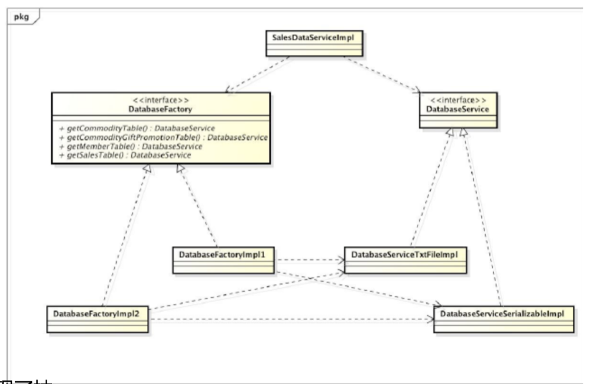
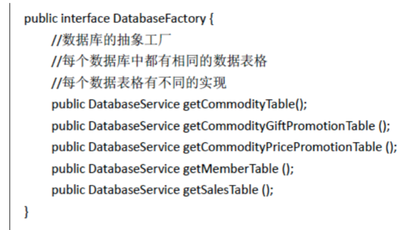
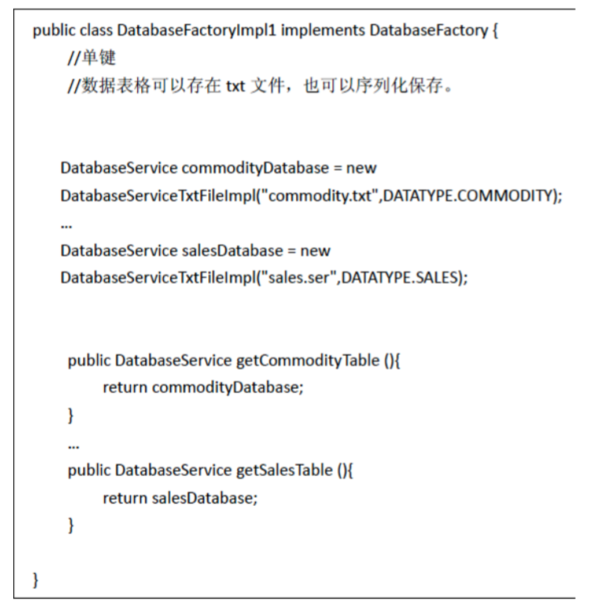
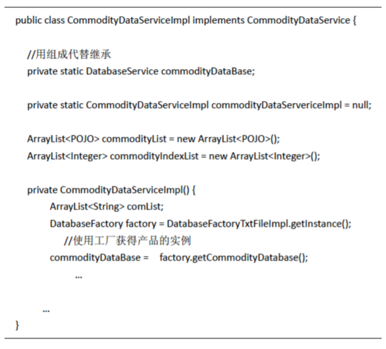

- 现在使用MYSQL，需要迁移到Oracle数据库

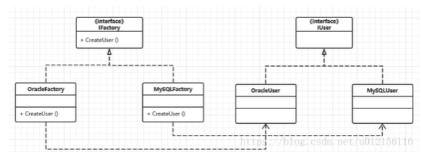
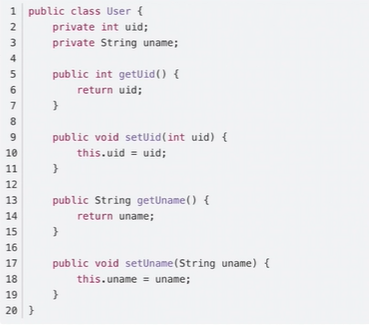
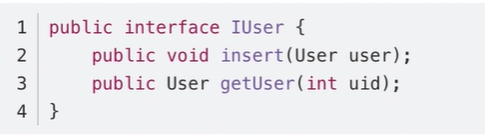
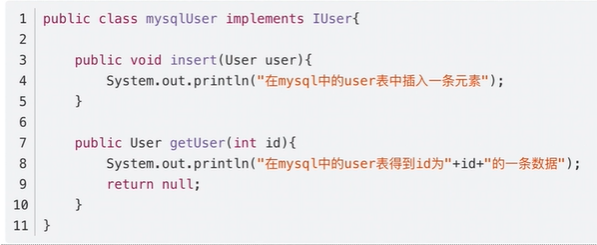
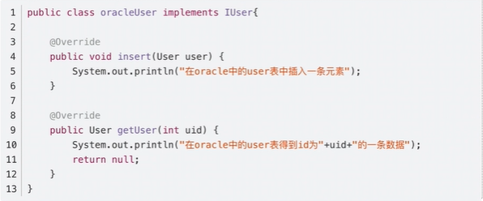
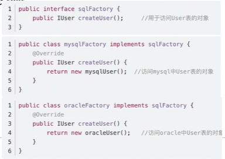
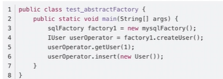

# 6. 抽象工厂模式
1. 抽象工厂模式:一个超级工厂创建其他工厂(规格化工厂)。属于创建型模式。
2. 具体描述:提供一个接口，用于创建相关或依赖对象的家族，而不需要明确指定具体类。所有工厂都必须实现实现这个接口
3. 主要解决:接口选择问题
4. 使用时机:系统的产品有多于一个的产品族，而系统只消费其中某一族的产品
5. 解决方案:在一个产品组里面定义多个产品。

## 6.1. 抽象工厂模式优点:
1. 保证客户端只持有某一个产品族中的对象。
2. 实现具体的创建实例过程与客户端分离。客户端是通过它们抽象接口来操作接口操作实例。

## 6.2. 抽象工厂模式的缺点
1. 产品组的扩展是困难的。(Login修改会修改一系列东西)
2. 大量的更改，客户端程序不止一个，每次都要声明sqlFactory factory = new MysqlFactory()。

## 6.3. 抽象工厂模式的类图
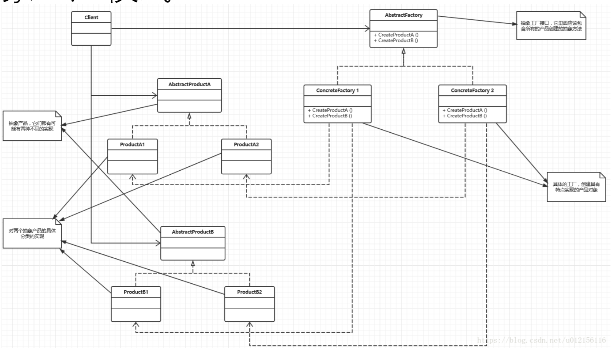

## 6.4. 抽象工厂模式参与者
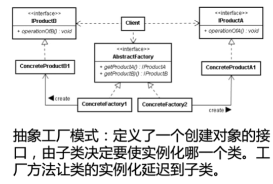

1. 抽象工厂（AbstractFactory）声明了创建抽象产品的各个接口。
2. 具体工厂（ConcreteFactory）实现了对具体产品的创建。
3. 抽象产品（AbstractProduct）声明了一种产品的接口。
4. 具体产品（ConcreteProduct）定义了具体工厂中创建出来的具体产品，实现了抽象产品的接口。
5. 客户（Client）使用抽象工厂和抽象产品的类。使用抽象工厂的方法来创建产品。

### 6.4.1. 抽象工厂的协作
1. 通常情况下，只有一个具体的工厂的实例被创建。这个具体工厂对于创建产品这个事情本身有具体的实现。对于创建不同的产品对象，客户应该用不同的具体工厂。
2. 抽象工厂转移了产品的创建到其子类具体工厂类中间去。

## 6.5. 应用场景
1. 抽象工厂模式可以帮助系统独立于如何对产品的创建、构成、表现。
2. 抽象工厂模式可以让系统灵活配置拥有某多个产品族中的某一个。
3. 一个产品族的产品应该被一起使用，抽象工厂模式可以强调这个限制。
4. 如果你想提供一个产品的库，抽象工厂模式可以帮助暴露该库的接口，而不是实现。

## 6.6. 应用注意点
1. 隔离了客户和具体实现。客户可见的都是抽象的接口。
2. 使得对产品的配置变得更加灵活。
3. 可以使得产品之间有一定一致性。同一类产品可以很容易一起使用。
4. 但是限制是对于新的产品的类型的支持是比较困难。抽象工厂的接口一旦定义好，就不容易变更了。
5. 而这个场景的“代价”，或者是“限制”，是一个工厂中具体产品的种类是稳定的。

## 6.7. 简单工厂和抽象工厂相结合


## 6.8. 抽象工厂的改进:反射 + 简单工厂


## 6.9. 抽象工厂的改进:反射 + 配置文件 + 简单工厂
```json
{
    "packName":"DesignPattern.abstractFactory",
    "DB":"Mysql"
}
```

## 6.10. 抽象工厂模式类图

### 6.10.1. 类图


### 6.10.2. 类图细节


## 6.11. 工厂方法和抽象工厂比较


## 6.12. 抽象工厂模式的例子
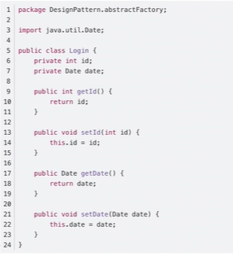
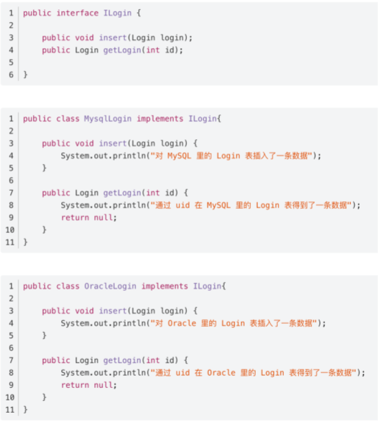
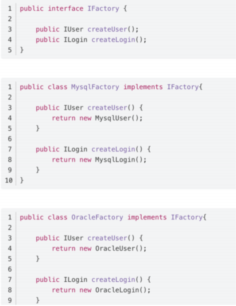
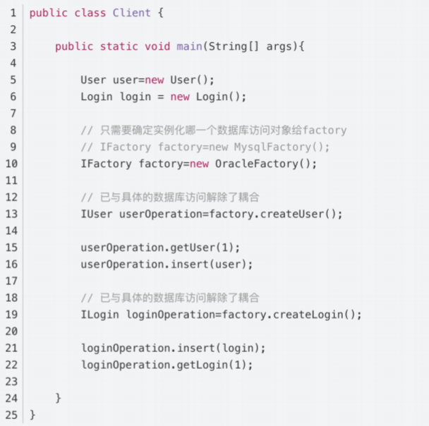


# 7. 推荐书籍
1. 《反射 重构》


