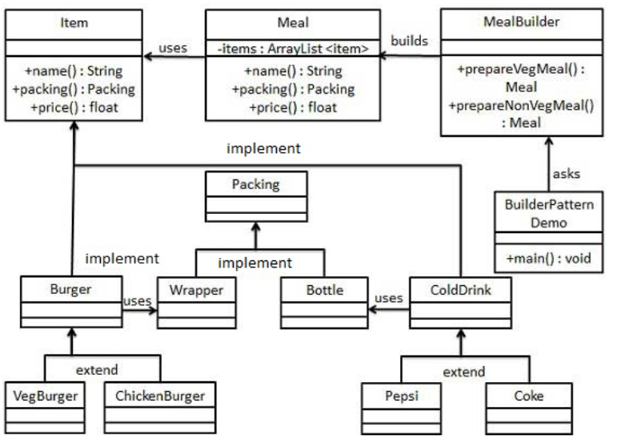

建造者模式
---
1. 使用多个简单的对象一步一步构建一个复杂的对象。属于创建型模式
2. 比如Builder对象

<!-- TOC -->

- [1. 建造者模式的细节](#1-建造者模式的细节)
  - [1.1. 具体实例](#11-具体实例)
  - [1.2. 具体实例的实现](#12-具体实例的实现)
  - [1.3. 应用](#13-应用)
- [2. 和工厂模式的不同](#2-和工厂模式的不同)
- [3. 参考](#3-参考)

<!-- /TOC -->

# 1. 建造者模式的细节
1. 意图:将一个复杂的构建与其表示相分离，使得同样的构建过程可以创建不同的表示。
2. 解决问题:在软件系统中，有时候面临这“一个复杂对象”的创建工作，其通常由各个部分的子对象用一定算法构成，由于需求的变化，复杂对象的各个部分变化剧烈，但是将它们组合一起的算法相对稳定。
3. 使用情况:
   1. 需要生成的对象具有复杂的内部结构。
   2. 需要生成的对象内部属性本身相互依赖。 
4. 关键代码:建造者:创建和提供实例，导演:管理建造出来的实例的依赖关系。
5. 模式优点:
   1. 建造者独立，易扩展
   2. 便于控制细节风险
6. 模式缺点:
   1. 产品必须有共同点，范围限制
   2. 如果内部变化复杂会有很多建造类

## 1.1. 具体实例
1. 我们假设一个快餐店的商业案例，其中，一个典型的套餐可以是一个汉堡（Burger）和一杯冷饮（Cold drink）。
2. 汉堡（Burger）可以是素食汉堡（Veg Burger）或鸡肉汉堡（Chicken Burger），它们是包在纸盒中。
3. 冷饮（Cold drink）可以是可口可乐（coke）或百事可乐（pepsi），它们是装在瓶子中。
4. 我们将创建一个表示食物条目（比如汉堡和冷饮）的 Item 接口和实现 Item 接口的实体类，以及一个表示食物包装的 Packing 接口和实现 Packing 接口的实体类，汉堡是包在纸盒中，冷饮是装在瓶子中。
5. 然后我们创建一个 Meal 类，带有 Item 的 ArrayList 和一个通过结合 Item 来创建不同类型的 Meal 对象的 MealBuilder。BuilderPatternDemo，我们的演示类使用 MealBuilder 来创建一个 Meal。



## 1.2. 具体实例的实现
1. 创建一个表示食物条目和食物包装的接口。
```java
public interface Item {
    public String name();
    public Packing packing();
    public float price();    
}
public interface Packing {
    public String pack();
}
```
2. 创建实现 Packing 接口的实体类。
```java
public class Wrapper implements Packing {
    @Override
    public String pack() {
        return "Wrapper";
    }
}
    public class Bottle implements Packing {
    @Override
    public String pack() {
        return "Bottle";
    }
}
```
3. 创建实现 Item 接口的抽象类，该类提供了默认的功能。
```java
public abstract class Burger implements Item {
    @Override
    public Packing packing() {
        return new Wrapper();
    }
    @Override
    public abstract float price();
}
public abstract class ColdDrink implements Item {
    @Override
    public Packing packing() {
       return new Bottle();
    }
    @Override
    public abstract float price();
}
```
4. 创建扩展了 Burger 和 ColdDrink 的实体类。
```java
public class VegBurger extends Burger {
    @Override
    public float price() {
        return 25.0f;
    }
    @Override
    public String name() {
        return "Veg Burger";
    }
}
public class ChickenBurger extends Burger {
    @Override
    public float price() {
        return 50.5f;
    }
    @Override
    public String name() {
        return "Chicken Burger";
    }
}
public class Coke extends ColdDrink {
    @Override
    public float price() {
        return 30.0f;
    }
    @Override
    public String name() {
        return "Coke";
    }
}
public class Pepsi extends ColdDrink {
    @Override
    public float price() {
        return 35.0f;
    }
    @Override
    public String name() {
        return "Pepsi";
    }
}
```
5. 创建一个Meal类，含有Item
```java
import java.util.ArrayList;
import java.util.List;
 
public class Meal {
    private List<Item> items = new ArrayList<Item>();    
    
    public void addItem(Item item){
        items.add(item);
    }
    
    public float getCost(){
        float cost = 0.0f;
        for (Item item : items) {
            cost += item.price();
        }        
        return cost;
    }
    
    public void showItems(){
        for (Item item : items) {
            System.out.print("Item : "+item.name());
            System.out.print(", Packing : "+item.packing().pack());
            System.out.println(", Price : "+item.price());
        }        
    }    
}
```
6. 创建一个MealBuilder类，创建Meal对象
```java
public class MealBuilder {
    public Meal prepareVegMeal (){
        Meal meal = new Meal();
        meal.addItem(new VegBurger());
        meal.addItem(new Coke());
        return meal;
    }   
    public Meal prepareNonVegMeal (){
        Meal meal = new Meal();
        meal.addItem(new ChickenBurger());
        meal.addItem(new Pepsi());
        return meal;
    }
}
```
7. 使用建造者模式
```java
public class BuilderPatternDemo {
    public static void main(String[] args) {
        MealBuilder mealBuilder = new MealBuilder();
    
        Meal vegMeal = mealBuilder.prepareVegMeal();
        System.out.println("Veg Meal");
        vegMeal.showItems();
        System.out.println("Total Cost: " +vegMeal.getCost());
    
        Meal nonVegMeal = mealBuilder.prepareNonVegMeal();
        System.out.println("\n\nNon-Veg Meal");
        nonVegMeal.showItems();
        System.out.println("Total Cost: " +nonVegMeal.getCost());
    }
}
```

## 1.3. 应用
1. 去肯德基，汉堡、可乐、薯条、炸鸡翅等是不变的，而其组合是经常变化的，生成出所谓的"套餐"。
2. JAVA 中的 StringBuilder。

# 2. 和工厂模式的不同
1. 建造者模式更加关心与零件装配的顺序

# 3. 参考
1. <a href = "https://www.runoob.com/design-pattern/builder-pattern.html">建造者模式</a>