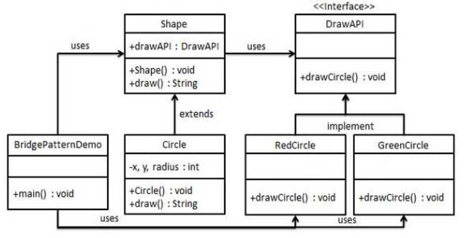

桥接模式(Bridge Pattern)
---
1. 使用桥接模式不只改变你的实现，也改变你的抽象。
2. 在实际生产过程中，我们可能不仅仅会改变用户界面，还需要改变用户实现。
3. 通过将实现和抽象在两个不同的类层次中而使它们可以独立改变。

<!-- TOC -->

- [1. 桥接模式](#1-桥接模式)
  - [1.1. 优点](#11-优点)
  - [1.2. 缺点](#12-缺点)
- [2. @ 2. 应用实例](#2--2-应用实例)
  - [2.1. 使用场景](#21-使用场景)
- [3. 类图](#3-类图)
- [4. 代码示例](#4-代码示例)

<!-- /TOC -->

# 1. 桥接模式
1. 桥接是用于把抽象化与实现化解耦，使得二者可以独立变化。属于结构型模式。
2. 设计到一个座位桥接的接口，使得实体类的功能独立于接口实现类。这两种类型的类课被结构化改变而互不影响。
3. 意图:将抽象部分与实现部分分离，使得他们都可以独立的变化。
4. 解决的问题:在有多种可能变化的情况下，继承会导致类爆炸问题，扩展起来不灵活。
5. 使用情况:实现系统可能有多个角度分类，每一种角度都可能变化。
6. 解决的方案:把多角度分类分离出来，让它们独立变化，减少它们之间耦合。
7. 关键代码:抽象类依赖实现类

## 1.1. 优点
1. 将实现予以解耦，让它和界面之间不再永久绑定。
2. 抽象和实现可以独立扩展，不会影响到对方。
3. 对于"具体的抽象类"做出的改变，不会影响到客户。

## 1.2. 缺点
1. 增加了系统的复杂度。

# 2. @ 2. 应用实例
1. 墙上的开关，可以看到的开关是抽象的，不必管里面具体怎么实现的。
2. 适用使用在需要跨越多个平台的图形和窗口系统上。
3. 当需要用不同的方式改变接口和实现时，你会发现桥接模式很好用。

## 2.1. 使用场景
1. 如果一个系统需要在构件的抽象化角色和具体化角色之间增加更多的灵活性，避免在两个层次之间建立静态的继承联系，通过桥接模式可以使它们在抽象层建立一个关联关系。
2. 对于那些不希望使用继承或因为多层次继承导致系统类的个数急剧增加的系统，桥接模式尤为适用。
3. 一个类存在两个独立变化的维度，且这两个维度都需要进行扩展。 

# 3. 类图


# 4. 代码示例
- 我们有一个作为桥接实现的 DrawAPI 接口和实现了 DrawAPI 接口的实体类 RedCircle、GreenCircle。Shape 是一个抽象类，将使用 DrawAPI 的对象。BridgePatternDemo，我们的演示类使用 Shape 类来画出不同颜色的圆。



1. 创建桥接实现接口。
```java
public interface DrawAPI {
   public void drawCircle(int radius, int x, int y);
}
```
2. 创建实现了 DrawAPI 接口的实体桥接实现类。
```java
public class RedCircle implements DrawAPI {
    @Override
    public void drawCircle(int radius, int x, int y) {
        System.out.println("Drawing Circle[ color: red, radius: "
            + radius +", x: " +x+", "+ y +"]");
    }
}
public class GreenCircle implements DrawAPI {
    @Override
    public void drawCircle(int radius, int x, int y) {
        System.out.println("Drawing Circle[ color: green, radius: "
            + radius +", x: " +x+", "+ y +"]");
    }
}
```
3. 使用 DrawAPI 接口创建抽象类 Shape。
```java
public abstract class Shape {
    protected DrawAPI drawAPI;
    protected Shape(DrawAPI drawAPI){
        this.drawAPI = drawAPI;
    }
    public abstract void draw();  
}
```
4. 创建实现了 Shape 接口的实体类。
```java
public class Circle extends Shape {
    private int x, y, radius;
    
    public Circle(int x, int y, int radius, DrawAPI drawAPI) {
        super(drawAPI);
        this.x = x;  
        this.y = y;  
        this.radius = radius;
    }
    
    public void draw() {
        drawAPI.drawCircle(radius,x,y);
    }
}
```
5. 使用 Shape 和 DrawAPI 类画出不同颜色的圆。
```java
public class BridgePatternDemo {
    public static void main(String[] args) {
        Shape redCircle = new Circle(100,100, 10, new RedCircle());
        Shape greenCircle = new Circle(100,100, 10, new GreenCircle());
    
        redCircle.draw();
        greenCircle.draw();
    }
}
```