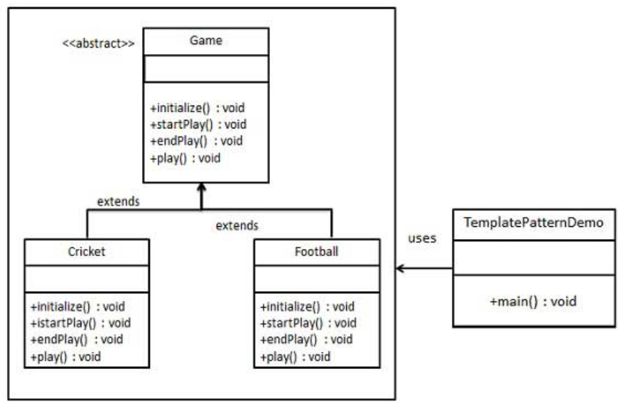

模板模式
---
1. 模板模式中，一个抽象类公开定义了执行它的方法的方法/模板。属于行为型模式。
2. 其子类可以按需重写方法实现，但调用将以抽象类中定义的方式进行。

<!-- TOC -->

- [1. 模板模式](#1-模板模式)
  - [1.1. 优点](#11-优点)
  - [1.2. 缺点](#12-缺点)
  - [1.3. 应用场景](#13-应用场景)
  - [1.4. 注意点](#14-注意点)
- [2. 代码示例](#2-代码示例)
  - [2.1. 例子一:Game](#21-例子一game)
    - [2.1.1. 类图](#211-类图)
    - [2.1.2. 代码实现](#212-代码实现)

<!-- /TOC -->

# 1. 模板模式
- 意图:定义一个操作的算法的骨架，将步骤延迟到子类中。
- 解决问题:一些方法通用，但是每一个子类都重写了这一方法。

## 1.1. 优点
1. 1、封装不变部分，扩展可变部分。
2. 提取公共代码，便于维护。
3. 行为由父类控制，子类实现。 

## 1.2. 缺点
- 每一个不同的实现都需要一个子类来实现，导致类的个数增加，使得系统更加庞大。

## 1.3. 应用场景
1. 有多个子类共有的方法，且逻辑相同。
2. 重要的、复杂的方法，可以考虑作为模板方法。

## 1.4. 注意点
- 为防止恶意操作，一般模板方法都加上 final 关键词。

# 2. 代码示例

## 2.1. 例子一:Game
- 我们将创建一个定义操作的 Game 抽象类，其中，模板方法设置为 final，这样它就不会被重写。Cricket 和 Football 是扩展了 Game 的实体类，它们重写了抽象类的方法。
- TemplatePatternDemo，我们的演示类使用 Game 来演示模板模式的用法。

### 2.1.1. 类图


### 2.1.2. 代码实现
1. 创建一个抽象类，它的模板方法被设置为 final。
```java
public abstract class Game {
    abstract void initialize();
    abstract void startPlay();
    abstract void endPlay();
    //模板
    public final void play(){
        //初始化游戏
        initialize();
        //开始游戏
        startPlay();
        //结束游戏
        endPlay();
    }
}
```
2. 创建扩展了上述类的实体类。
```java
public class Cricket extends Game {
    @Override
    void endPlay() {
        System.out.println("Cricket Game Finished!");
    }
    @Override
    void initialize() {
        System.out.println("Cricket Game Initialized! Start playing.");
    }
    @Override
    void startPlay() {
        System.out.println("Cricket Game Started. Enjoy the game!");
    }
}
public class Football extends Game {
    @Override
    void endPlay() {
        System.out.println("Football Game Finished!");
    }
    @Override
    void initialize() {
        System.out.println("Football Game Initialized! Start playing.");
    }
    @Override
    void startPlay() {
        System.out.println("Football Game Started. Enjoy the game!");
    }
}
```
3. 使用 Game 的模板方法 play() 来演示游戏的定义方式。
```java
public class TemplatePatternDemo {
    public static void main(String[] args) {
        Game game = new Cricket();
        game.play();
        System.out.println();
        game = new Football();
        game.play();      
    }
}
```