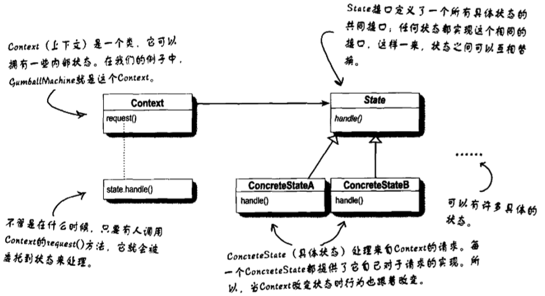
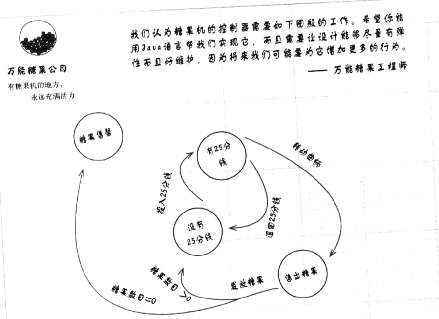
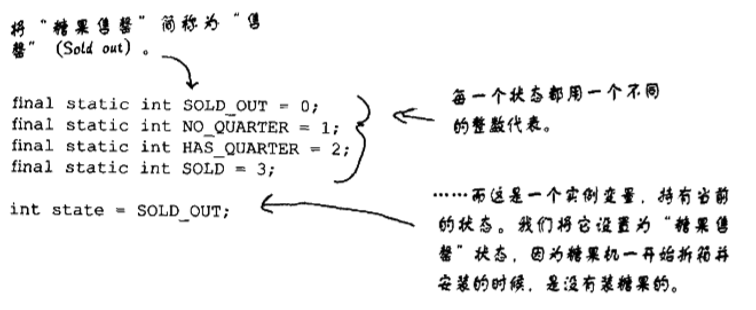
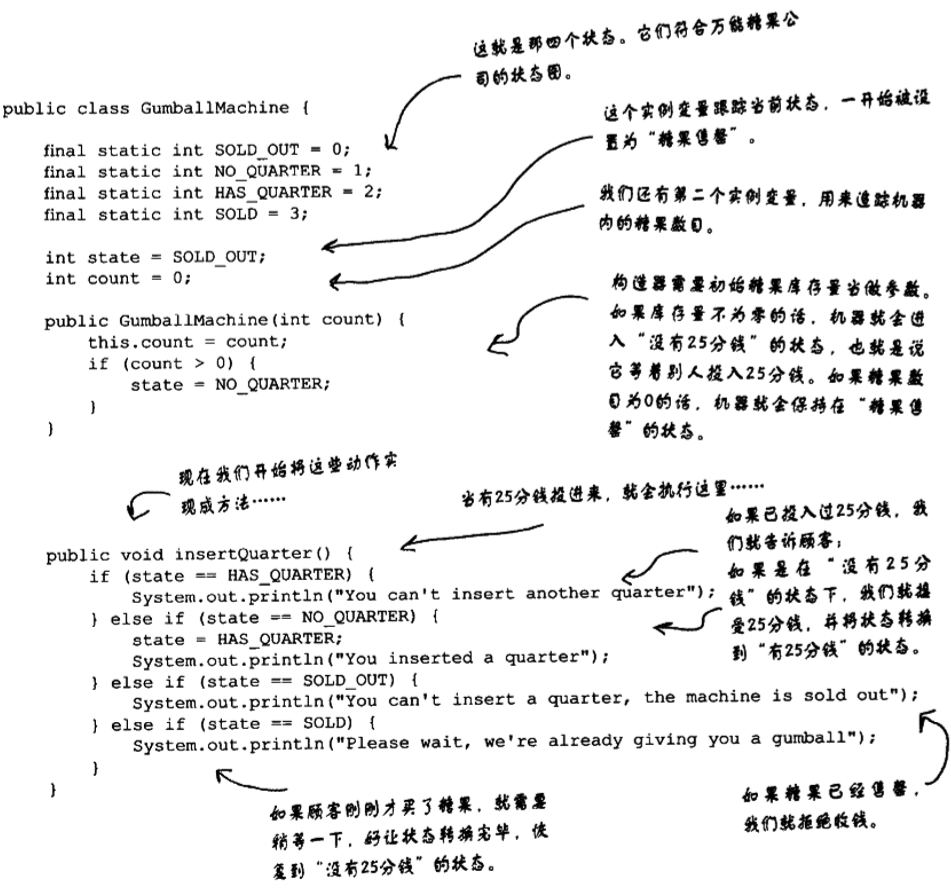
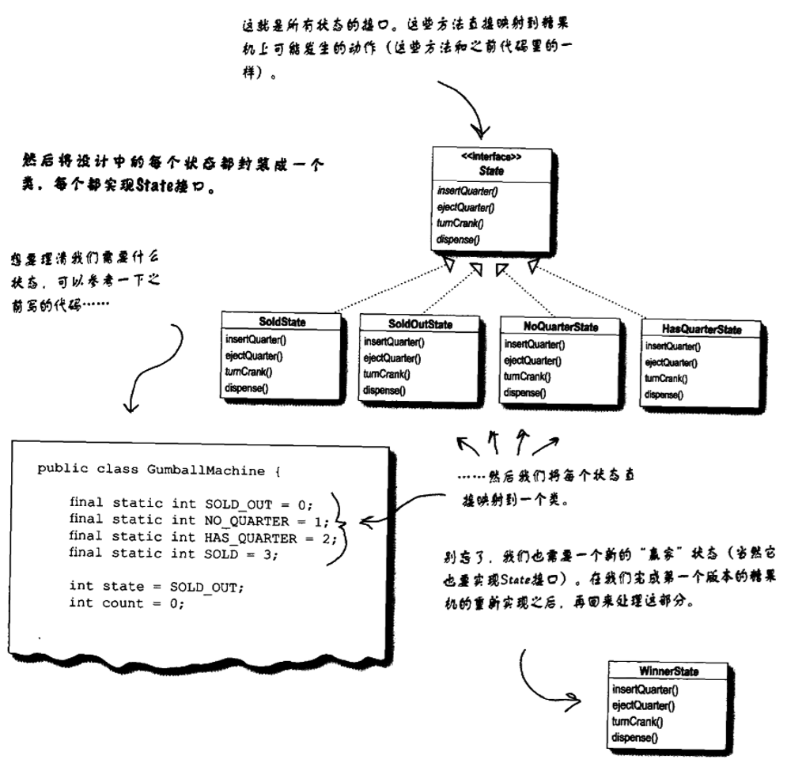
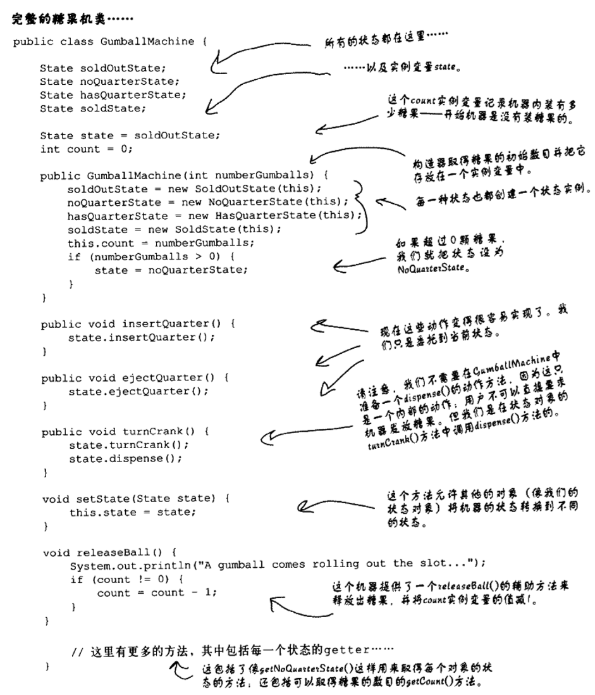
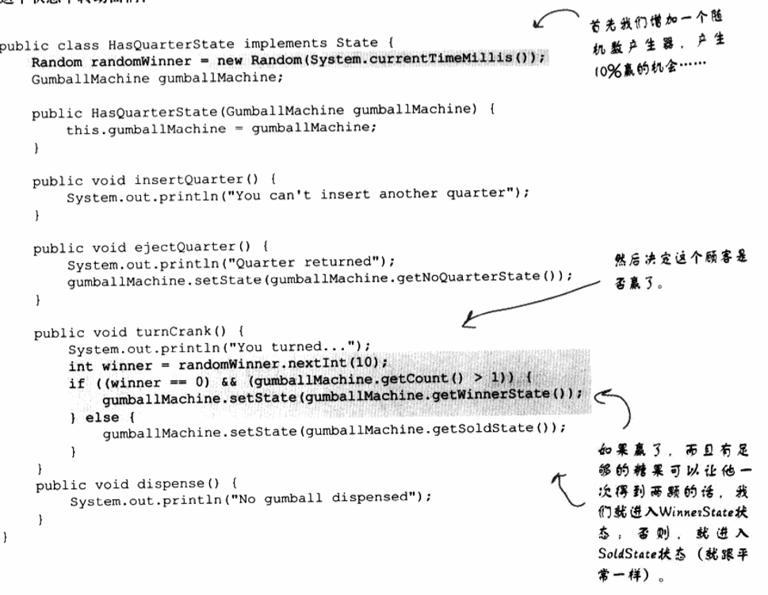
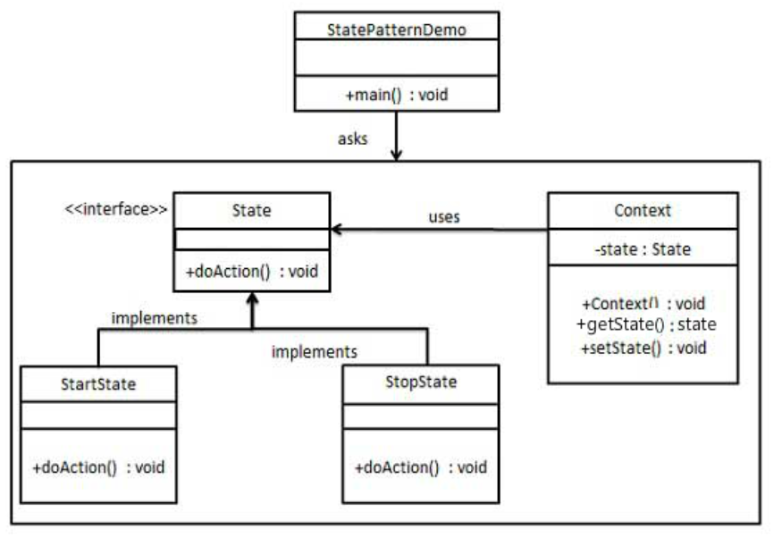

状态模式
---
1. 在状态模式中，类的行为是基于它的状态改变的。属于行为型模式。

<!-- TOC -->

- [1. 状态模式](#1-状态模式)
  - [1.1. 定义状态模式](#11-定义状态模式)
  - [1.2. 关键代码](#12-关键代码)
  - [1.3. 优点](#13-优点)
  - [1.4. 缺点](#14-缺点)
  - [1.5. 状态模式的类图](#15-状态模式的类图)
  - [1.6. 关于状态模式的一些问题](#16-关于状态模式的一些问题)
  - [1.7. 策略模式和状态模式的区别](#17-策略模式和状态模式的区别)
    - [1.7.1. 策略模式](#171-策略模式)
    - [1.7.2. 状态模式](#172-状态模式)
- [2. 状态模式的真实例子](#2-状态模式的真实例子)
  - [2.1. 例子一:糖果售卖机](#21-例子一糖果售卖机)
    - [2.1.1. 糖果售卖机状态图](#211-糖果售卖机状态图)
    - [2.1.2. 代码实现](#212-代码实现)
    - [2.1.3. 问题:if-else导致的扩展性的问题](#213-问题if-else导致的扩展性的问题)
    - [2.1.4. 问题解决:新的设计](#214-问题解决新的设计)
    - [2.1.5. 定义状态接口和类](#215-定义状态接口和类)
    - [2.1.6. 实现状态类](#216-实现状态类)
  - [2.2. 例子二:完成十中一的游戏](#22-例子二完成十中一的游戏)
  - [2.3. 例子三:ICC机的实现](#23-例子三icc机的实现)
  - [2.4. 例子五:简单抽象实现](#24-例子五简单抽象实现)
    - [2.4.1. 类图](#241-类图)
    - [2.4.2. 代码实现](#242-代码实现)

<!-- /TOC -->

# 1. 状态模式

## 1.1. 定义状态模式
1. 状态模式:允许对象在内部状态改变时改变它的行为，对象看起来好像修改了它的类。

## 1.2. 关键代码
- 通常命令模式的接口中只有一个方法。而状态模式的接口中有一个或者多个方法。而且，状态模式的实现类的方法，一般返回值，或者是改变实例变量的值。也就是说，状态模式一般和对象的状态有关。实现类的方法有不同的功能，覆盖接口中的方法。状态模式和命令模式一样，也可以用于消除 if...else 等条件选择语句。

## 1.3. 优点
1. 封装了转换规则。
2. 枚举可能的状态，在枚举状态之前需要确定状态种类。
3. 将所有与某个状态有关的行为放到一个类中，并且可以方便地增加新的状态，只需要改变对象状态即可改变对象的行为。
4. 允许状态转换逻辑与状态对象合成一体，而不是某一个巨大的条件语句块。
5. 可以让多个环境对象共享一个状态对象，从而减少系统中对象的个数。 
   
## 1.4. 缺点
1. 状态模式的使用必然会增加系统类和对象的个数。
2. 状态模式的结构与实现都较为复杂，如果使用不当将导致程序结构和代码的混乱。
3. 状态模式对"开闭原则"的支持并不太好，对于可以切换状态的状态模式，增加新的状态类需要修改那些负责状态转换的源代码，否则无法切换到新增状态，而且修改某个状态类的行为也需修改对应类的源代码。 

## 1.5. 状态模式的类图



1. 和策略模式的类图十分的相似，
    
2. 我们更多的把策略模式想成除了继承以外的一种弹性替代方案。

## 1.6. 关于状态模式的一些问题
1. 在状态模式中，决定下一个状态是什么的应该是什么？
    + Context未必决定下一个状态是什么，还可以决定下一个状态的流向。
    + 将状态转换放置到状态类中，相当于让各个状态类之间产生了依赖。
2. 客户会直接和状态交互吗？不会
3. 如果我的程序中的Context有很多的实例，这些实例之间可以共享状态对象吗？
    + 可以的，但是前提是状态对象不能持有自己的内部状态
    + 而你仅仅需要的是把每个状态都指定到静态的实例变量中。
4. 为什么我们使用的是接口而不是抽象类？
    + 因为我们没有共同的功能可以放进抽象类中。

## 1.7. 策略模式和状态模式的区别

### 1.7.1. 策略模式
1. 围绕可以互换的算法来创建成功业务。
2. 客户通常主动指定Context所要组合的策略对象是哪一个。

### 1.7.2. 状态模式
1. 状态模式是通过改变对象内部的状态来帮助对象控制自己的行为。
2. 状态模式是我们把一群行为封装到状态对象中，context的行为可随时委托给那些状态对象中的一个。

# 2. 状态模式的真实例子

## 2.1. 例子一:糖果售卖机

### 2.1.1. 糖果售卖机状态图


### 2.1.2. 代码实现
1. 找到所有状态，并且用一个实例变量来持有所有的状态。



1. 我们使用一个类来整合所有的状态，并且对于每一个状态都有对应的处理。
2. 我们还需要添加一个变量count来表示机器中糖果的数量。



### 2.1.3. 问题:if-else导致的扩展性的问题
1. 如果按照if-else语句，我们在变更请求的时候，使用一种考虑周详的方法写出来的糖果机的代码并不一定意味着这份代码就容易扩展。

### 2.1.4. 问题解决:新的设计
1. 我们考虑将变化进行封装，将每个状态的行为都放到各自的类中，那么每个状态主要实现相应部分的修改即可。
2. 新的设计内容:
    1. 首先，我们定义一个State接口。在这个接口内，糖果机的每个动作都对应一个方法
    2. 然后为机器中的每个状态实现状态类。这些类将负责在对应的状态下进行机器的行为。
    3. 最后，我们要摆脱旧的条件代码，取而代之的方法是，将动作委托到状态类。

### 2.1.5. 定义状态接口和类




### 2.1.6. 实现状态类
1. 我们需要将每一个状态类实现具体的状态。
2. 改进:不用整形来表示状态，转换成使用枚举变量来完成。
3. 完整的糖果机类如下:



## 2.2. 例子二:完成十中一的游戏



1. 我们使用random函数来保证有生成10%的概率(随机数)
2. 为什么需要用WinnerState而不是仅仅在SoldState里面发放两颗糖果？因为这样子会将两个状态封装到一个状态内，

## 2.3. 例子三:ICC机的实现
```java
public class ControlUnit {
    private static int ICC = 0;  //control unit
    //状态机
    private static Instruction instruction;
    private static int currentOpcode = -1;

    public static Object exec() {
        ICC = 0;
        int len = -1;
        while (ICC != 3) {
            //3是中断
            switch (ICC) {
                //fetch instruction
                case 0:
                    // 先取出opcode
                    currentOpcode = CPU.instrFetch(CPU_State.eip.read(), 1);
                    // 根据opcode产生正确的指令
                    ControlUnit.instruction = InstrFactory.getInstr(currentOpcode);
                    // 再由具体的指令取出剩下的部分
                    ControlUnit.instruction.fetchInstr(CPU_State.eip.read(), currentOpcode);

                    assert ControlUnit.instruction != null;
                    if (ControlUnit.instruction.isIndirectAddressing()) {
                        ICC = 1;
                    } else {
                        ICC = 2;
                    }
                    break;
                //indirect addressing
                case 1:
                    ControlUnit.instruction.fetchOperand();
                    ICC = 2;
                    break;
                //execute according to opcode
                case 2:
                    len = ControlUnit.instruction.exec(currentOpcode);
                    if(len == -1) {
                        ICC = 3;//停机
                        break;
                    }
                    ((EIP)CPU_State.eip).plus(len);
                    ICC = 0;
                    break;
            }
        }
        return len;
    }
}
```

## 2.4. 例子五:简单抽象实现
- 我们将创建一个 State 接口和实现了 State 接口的实体状态类。Context 是一个带有某个状态的类。
- StatePatternDemo，我们的演示类使用 Context 和状态对象来演示 Context 在状态改变时的行为变化。

### 2.4.1. 类图


### 2.4.2. 代码实现
1. 创建一个接口。
```java
public interface State {
    public void doAction(Context context);
}
```
2. 创建实现接口的实体类。
```java
public class StartState implements State {
    public void doAction(Context context) {
        System.out.println("Player is in start state");
        context.setState(this); 
    }
    public String toString(){
        return "Start State";
    }
}
public class StopState implements State {
    public void doAction(Context context) {
        System.out.println("Player is in stop state");
        context.setState(this); 
    }
    public String toString(){
        return "Stop State";
    }
}
```
3. 创建 Context 类。
```java
public class Context {
    private State state;
    public Context(){
        state = null;
    }
    public void setState(State state){
        this.state = state;     
    }
    public State getState(){
        return state;
    }
}
```
4. 使用 Context 来查看当状态 State 改变时的行为变化。
```java
public class StatePatternDemo {
    public static void main(String[] args) {
        Context context = new Context();
        StartState startState = new StartState();
        startState.doAction(context);
        System.out.println(context.getState().toString());
    
        StopState stopState = new StopState();
        stopState.doAction(context);
        System.out.println(context.getState().toString());
    }
}
```