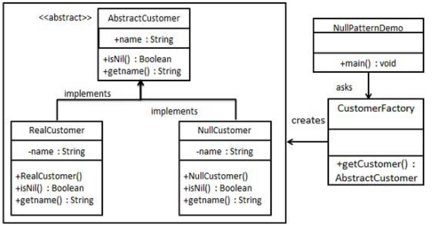

空对象模式
---

<!-- TOC -->

- [1. 什么是空对象模式](#1-什么是空对象模式)
- [2. 示例](#2-示例)
  - [2.1. 例子一:](#21-例子一)
    - [2.1.1. 类图](#211-类图)
    - [2.1.2. 代码实现](#212-代码实现)

<!-- /TOC -->

# 1. 什么是空对象模式
1. 在空对象模式（Null Object Pattern）中，一个空对象取代 NULL 对象实例的检查。Null 对象不是检查空值，而是反应一个不做任何动作的关系。这样的 Null 对象也可以在数据不可用的时候提供默认的行为。
2. 在空对象模式中，我们创建一个指定各种要执行的操作的抽象类和扩展该类的实体类，还创建一个未对该类做任何实现的空对象类，该空对象类将无缝地使用在需要检查空值的地方。

# 2. 示例

## 2.1. 例子一:
- 我们将创建一个定义操作（在这里，是客户的名称）的 AbstractCustomer 抽象类，和扩展了 AbstractCustomer 类的实体类。工厂类 CustomerFactory 基于客户传递的名字来返回 RealCustomer 或 NullCustomer 对象。
- NullPatternDemo，我们的演示类使用 CustomerFactory 来演示空对象模式的用法。

### 2.1.1. 类图


### 2.1.2. 代码实现
1. 创建一个抽象类。
```java
public abstract class AbstractCustomer {
    protected String name;
    public abstract boolean isNil();
    public abstract String getName();
}
```
2. 创建扩展了上述类的实体类。
```java
public class RealCustomer extends AbstractCustomer {
    public RealCustomer(String name) {
        this.name = name;    
    }
    @Override
    public String getName() {
        return name;
    }
    @Override
    public boolean isNil() {
        return false;
    }
}
public class RealCustomer extends AbstractCustomer {
    public RealCustomer(String name) {
        this.name = name;    
    }
    @Override
    public String getName() {
        return name;
    }
    @Override
    public boolean isNil() {
        return false;
    }
}
```
3. 创建 CustomerFactory 类。
```java

public class CustomerFactory {
    public static final String[] names = {"Rob", "Joe", "Julie"};
    public static AbstractCustomer getCustomer(String name){
        for (int i = 0; i < names.length; i++) {
            if (names[i].equalsIgnoreCase(name)){
                return new RealCustomer(name);
            }
        }
        return new NullCustomer();
    }
}
```
4. 使用 CustomerFactory，基于客户传递的名字，来获取 RealCustomer 或 NullCustomer 对象。
```java
public class NullPatternDemo {
    public static void main(String[] args) {
        AbstractCustomer customer1 = CustomerFactory.getCustomer("Rob");
        AbstractCustomer customer2 = CustomerFactory.getCustomer("Bob");
        AbstractCustomer customer3 = CustomerFactory.getCustomer("Julie");
        AbstractCustomer customer4 = CustomerFactory.getCustomer("Laura");
    
        System.out.println("Customers");
        System.out.println(customer1.getName());
        System.out.println(customer2.getName());
        System.out.println(customer3.getName());
        System.out.println(customer4.getName());
    }
}
```