策略模式
---
1. 在策略模式中，一个类的行为或其算法都可以在运行时改变。属**行为型模式**。
2. 在策略模式中，我们创建表示各种策略的对象和一个行为随着策略对象改变而改变的context对象。策略独享改变context对象的执行算法.


<!-- TOC -->

- [1. 策略模式介绍](#1-策略模式介绍)
- [2. 策略模式的例子](#2-策略模式的例子)
  - [2.1. 策略模式例一:加减乘除](#21-策略模式例一加减乘除)
    - [2.1.1. 策略模式类图](#211-策略模式类图)
    - [2.1.2. 代码实现](#212-代码实现)
  - [2.2. 策略模式例二:大规模连锁超市](#22-策略模式例二大规模连锁超市)
    - [2.2.1. 大规模连锁超市中潜在的变化](#221-大规模连锁超市中潜在的变化)
    - [2.2.2. 设计分析 -1](#222-设计分析--1)
    - [2.2.3. 组合还是继承？](#223-组合还是继承)
    - [2.2.4. 类图实现](#224-类图实现)
    - [2.2.5. 代码实现](#225-代码实现)
  - [2.3. 策略模式设计原则](#23-策略模式设计原则)
  - [2.4. 策略模式类图](#24-策略模式类图)
    - [2.4.1. 参与者](#241-参与者)
    - [2.4.2. 协作](#242-协作)
    - [2.4.3. 应用场景](#243-应用场景)
    - [2.4.4. 注意点](#244-注意点)

<!-- /TOC -->
# 1. 策略模式介绍
1. 解决的问题:在有多种算法相似的情况下，避免使用if...else...所带来的复杂和难以维护。
2. 使用情况:一个类有很多类，而区分这些类的只是他们直接的行为。
3. 关键代码:实现同一个接口，另一个需要持有这些策略的类中存储这些策略(如果需要持有多个策略，可以是使用ArrayList)
4. 模式优点:
   1. 算法可以自由切换
   2. 避免使用多重条件判断
   3. 扩展性好
5. 模式确定:
   1. 策略类会增多
   2. 所有策略类都需要对外暴露

# 2. 策略模式的例子

## 2.1. 策略模式例一:加减乘除

### 2.1.1. 策略模式类图
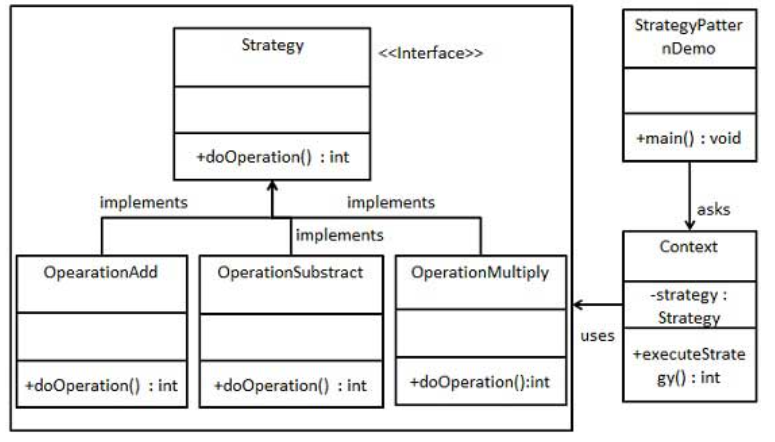

### 2.1.2. 代码实现
```java
//Strategy.java
public interface Strategy {
   public int doOperation(int num1, int num2);
}
//OperationAdd.java
public class OperationAdd implements Strategy{
   @Override
   public int doOperation(int num1, int num2) {
      return num1 + num2;
   }
}
//OperationSubject.java
public class OperationSubstract implements Strategy{
   @Override
   public int doOperation(int num1, int num2) {
      return num1 - num2;
   }
}
//OperationMultiply.java
public class OperationMultiply implements Strategy{
   @Override
   public int doOperation(int num1, int num2) {
      return num1 * num2;
   }
}
//创建Context.java类
public class Context {
   private Strategy strategy;
   public Context(Strategy strategy){
      this.strategy = strategy;
   }
   public int executeStrategy(int num1, int num2){
      return strategy.doOperation(num1, num2);
   }
}
```

## 2.2. 策略模式例二:大规模连锁超市
1. 在一个大规模的连锁超市中雇员的薪水支付可以分为很多种。其中雇员的薪酬支付方式和支付频率就有好几种：
   1. 有些雇员是钟点工，按时薪来支付。薪水 = 时薪*工作小时数。每周三支付。
   2. 有些雇员按月薪支付。薪水 = 固定月薪。每月21日支付。
   3. 有些雇员是提成制。薪水 = 销售额 * 提成比率。每隔一周的周三支付。

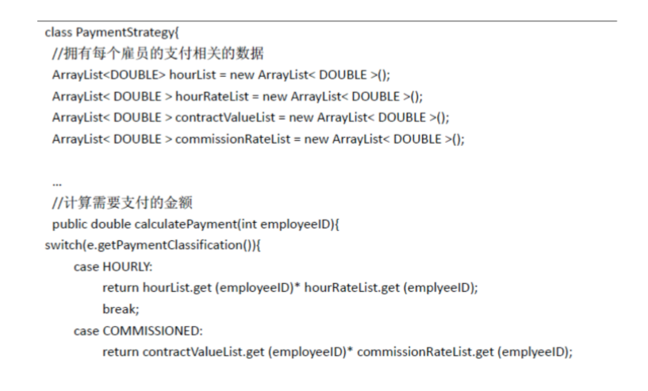

- 最简单的是通过Switch来进行解决

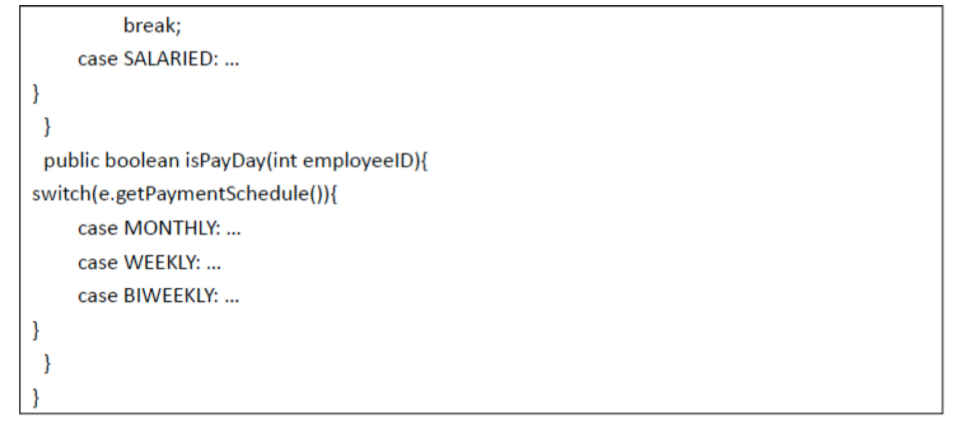

### 2.2.1. 大规模连锁超市中潜在的变化
1. 钟点工可能两星期支付一次：(M)实现的可修改性
2. 现在是时薪以后可能会变为月薪：(C)实现的灵活性
3. 也有可能出现新的薪水支付方式和支付频率：(E)实现的可扩展性

### 2.2.2. 设计分析 -1
1. 首先，可以把上下文和策略分割为不同的类实现不同的职责。上下文Context类负责通过执行策略实现自己职责；而策略类Strategy只负责复杂策略的实现。
2. 接口和实现要不要分离？要

### 2.2.3. 组合还是继承？
1. 其次，上下文类和策略类之间的关系是用**组合**比**继承**更加合适。
   1. 组合使得上下文类和策略类之间的接口之间的耦合性会很低；
   2. 策略类的接口和实现的修改都相对比较容易；
   3. 此外，如果是继承关系，则上下文类只能在行为的n种实现里面n选一（对象创建时就选定了策略），而如果是组合关系，上下文类则可以维护一个策略队列，实现n选多，从而达到动态的配置。
2. 最后，各种策略则在**具体策略类**（ConcreteStrategy）中提供，而向**上下文类**提供统一的策略接口。
   1. 由于策略和上下文独立开来，策略的增减、策略 实现的修改都不会影响上下文和使用上下文的客户。
   2. 当出现新的促销策略或现有的促销策略发生变化时，只需要实现新的具体策略类（实现策略的接口），由客户使用。

### 2.2.4. 类图实现
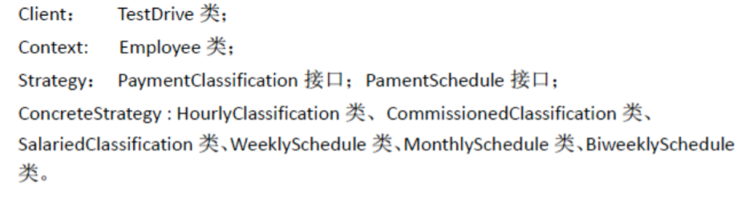
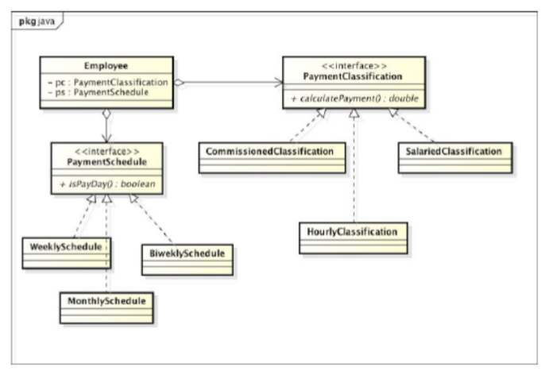

### 2.2.5. 代码实现

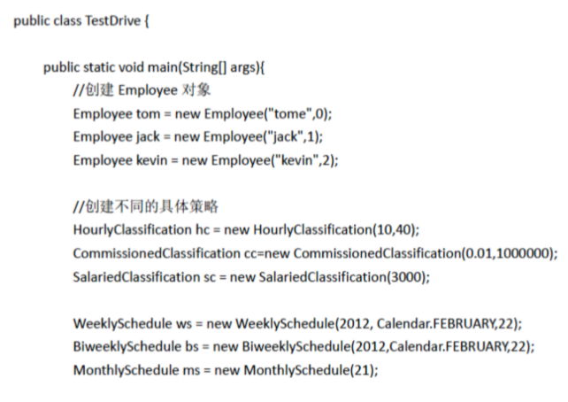
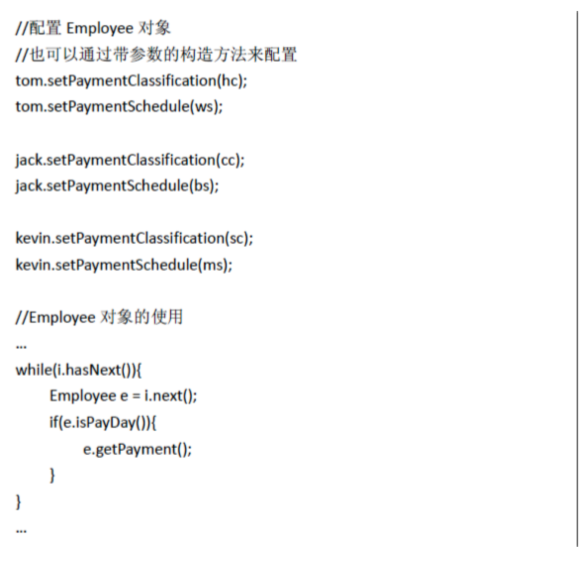
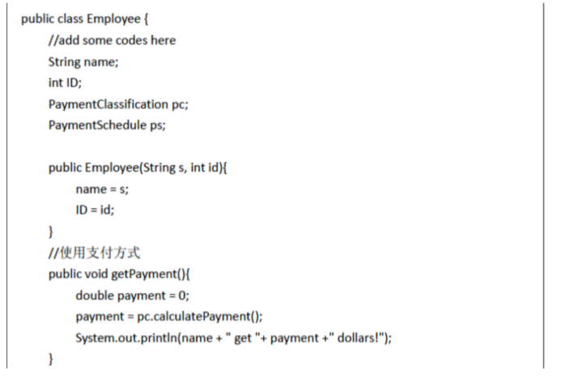
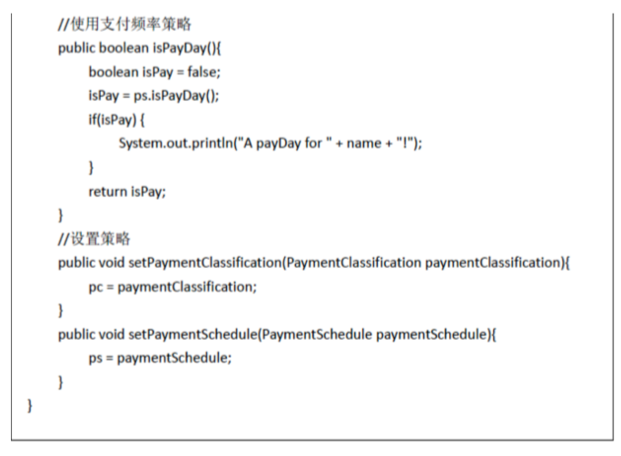
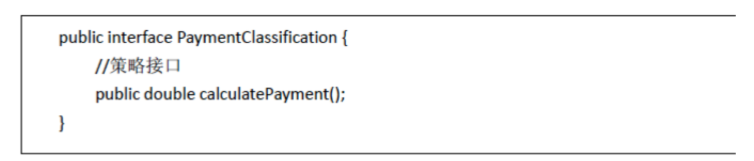
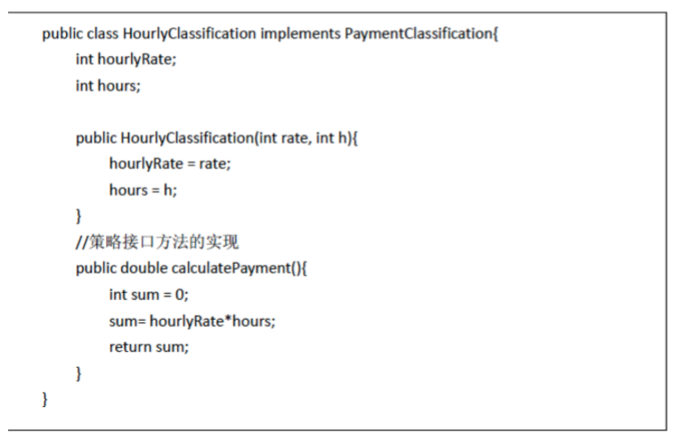

## 2.3. 策略模式设计原则
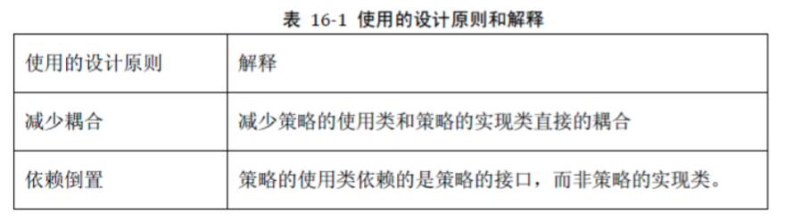

1. 减少耦合:减少策略的使用类和策略实现类直接的耦合。
2. 依赖倒置:策略的使用类依赖的是策略的**接口类**，而非策略的实现类。

## 2.4. 策略模式类图
1. 策略模式：定义了算法族，分别封装起来，让他们之间可以互相替换，此模式让算法的变化独立于使用算法的客户。

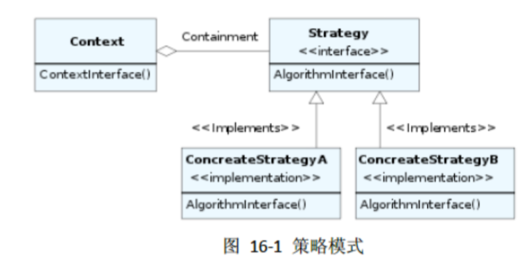

### 2.4.1. 参与者
1. 上下文（Context）
   1. 被配置了具体策略ConcreteStrategy
   2. 拥有Strategy对象的一个引用
   3. 实现了一些方法以供Strategy访问其数据。
2. 策略（Strategy）:声明了所支持策略的接口。 Context利用这些被ConcreteStrategy定义的接口。
3. 具体策略（ConcreteStrategy）:实现了Strategy声明的接口，给出了具体的实现。

### 2.4.2. 协作
1. 上下文Context和Strategy的相互协作完成整个算法。Context可能会通过提供方法让Strategy访问其数据；甚至将自身的引用传给Strategy，供其访问其数据。Strategy会在需要的时候访问Context的成员变量。
2. 上下文Context将一些对他的请求转发给策略类来实现，客户（Client）通常创建ConcreteStrategy的对象，然后传递给Context来灵活配置Strategy接口的具体实现；这样Client就有可以拥有一个Strategy接口的策略族，其中包含多种ConcreteStrategy的实现。

### 2.4.3. 应用场景
1. 当很多相关类只在它们的行为的实现上不一样。策略模式提供了一个很好的方式来配置某个类，让其具有上述多种实现之一。
2. 当我们需要同一个行为的**不同实现（变体）**的时候。策略模式可以用作实现这些变体。
3. 算法需要用到一些数据，而这些数据不应该被客户知道。我们可以通过策略模式隐藏**复杂的算法和数据接口**。
4. 一个类定义了很多行为，这些行为作为一个switch选择语句的分支执行部分。策略模式可以消除这些分支选择。

### 2.4.4. 注意点
1. Strategy可以是接口，也可以是类。如果是类，则可以抽象所有具体算法中公共的实现部分。
2. 当然，我们也可以直接通过Context的子类来实现不同的Context实现。不过这样算法的具体实现，就和算法的利用的实现项目交织在一起，不利于理解和维护。
3. 策略模式消除了类似根据策略类型的Switch语句。
4. 可以动态选择不同的策略。
5. 客户必须提前知晓各自不同的策略。
6. Context和Strategy之间的通讯是有代价的。Context提供了对其成员变量的访问方式。可以有时候，对于某些具体的策略的实现ConcreteStrategy可能并不需要全部的访问，这会存在一定的隐患。
7. 策略模式会创建出较多的对象。