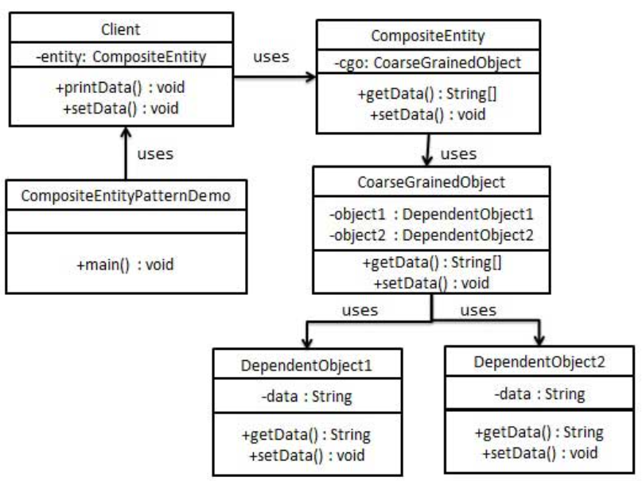

组合实体模式
---

<!-- TOC -->

- [1. 组合实体模式](#1-组合实体模式)
  - [1.1. 实体Bean的参与者](#11-实体bean的参与者)
- [2. 代码实现](#2-代码实现)
  - [2.1. 类图](#21-类图)
  - [2.2. 代码实现](#22-代码实现)

<!-- /TOC -->

# 1. 组合实体模式
- 组合实体模式（Composite Entity Pattern）用在 EJB 持久化机制中。一个组合实体是一个 EJB 实体 bean，代表了对象的图解。当更新一个组合实体时，内部依赖对象 beans 会自动更新，因为它们是由 EJB 实体 bean 管理的。以下是组合实体 bean 的参与者。

## 1.1. 实体Bean的参与者
1. 组合实体（Composite Entity）:它是主要的实体 bean。它可以是粗粒的，或者可以包含一个粗粒度对象，用于持续生命周期。
2. 粗粒度对象（Coarse-Grained Object）:该对象包含依赖对象。它有自己的生命周期，也能管理依赖对象的生命周期。
3. 依赖对象（Dependent Object）:依赖对象是一个持续生命周期依赖于粗粒度对象的对象。
4. 策略（Strategies）:策略表示如何实现组合实体

# 2. 代码实现
- 我们将创建作为组合实体的 CompositeEntity 对象。CoarseGrainedObject 是一个包含依赖对象的类。
- CompositeEntityPatternDemo，我们的演示类使用 Client 类来演示组合实体模式的用法。

## 2.1. 类图


## 2.2. 代码实现
1. 创建依赖对象。
```java
public class DependentObject1 {
    private String data;
    public void setData(String data){
        this.data = data; 
    }
    public String getData(){
        return data;
    }
}
public class DependentObject2 {
    private String data;
    public void setData(String data){
        this.data = data; 
    } 
    public String getData(){
        return data;
    }
}
```
2. 创建粗粒度对象。
```java
public class CoarseGrainedObject {
    DependentObject1 do1 = new DependentObject1();
    DependentObject2 do2 = new DependentObject2();
    public void setData(String data1, String data2){
        do1.setData(data1);
        do2.setData(data2);
    }
    public String[] getData(){
        return new String[] {do1.getData(),do2.getData()};
    }
}
```
3. 创建组合实体。
```java
public class CompositeEntity {
    private CoarseGrainedObject cgo = new CoarseGrainedObject();
    public void setData(String data1, String data2){
        cgo.setData(data1, data2);
    }
    public String[] getData(){
        return cgo.getData();
    }
}
```
4. 创建使用组合实体的客户端类。
```java
public class Client {
    private CompositeEntity compositeEntity = new CompositeEntity();
    public void printData(){
        for (int i = 0; i < compositeEntity.getData().length; i++) {
            System.out.println("Data: " + compositeEntity.getData()[i]);
        }
    }
    public void setData(String data1, String data2){
        compositeEntity.setData(data1, data2);
    }
}
```
5. 使用 Client 来演示组合实体设计模式的用法。
```java
public class CompositeEntityPatternDemo {
    public static void main(String[] args) {
        Client client = new Client();
        client.setData("Test", "Data");
        client.printData();
        client.setData("Second Test", "Data1");
        client.printData();
    }
}
```