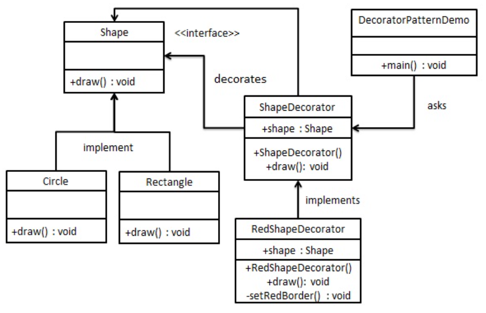

装饰器模式
---
1. 通过使用对象组合的方法，做到在运行时装饰类。
2. 通过组合来完成在运行时动态的组合形成对应部分。

<!-- TOC -->

- [1. 认识装饰者模式](#1-认识装饰者模式)
  - [1.1. 装饰者模式的整体结构](#11-装饰者模式的整体结构)
- [2. 装饰者模式](#2-装饰者模式)
  - [2.1. 装饰者模式的定义](#21-装饰者模式的定义)
  - [2.2. 装饰者模式的优点](#22-装饰者模式的优点)
  - [2.3. 装饰者模式的缺点](#23-装饰者模式的缺点)
  - [2.4. 装饰者模式的关键代码](#24-装饰者模式的关键代码)
  - [2.5. 应用实例](#25-应用实例)
  - [2.6. 使用场景](#26-使用场景)
- [3. 具体实例](#3-具体实例)
  - [3.1. 实例一:Mapping](#31-实例一mapping)
  - [3.2. 实例二:Shape](#32-实例二shape)
    - [3.2.1. shape类图](#321-shape类图)
    - [3.2.2. 具体代码实现](#322-具体代码实现)
  - [3.3. 真实世界的装饰者——java I/O](#33-真实世界的装饰者java-io)

<!-- /TOC -->

# 1. 认识装饰者模式
1. 装饰器模式允许向一个现有的对象添加新的功能，同时又不改变其结构。属于结构型模式。
2. 这种模式使用了一个装饰类，用来包装原有的类，并在保持类方法签名完成的前提下，提供了额外的功能。
3. 对象可以在任何时候被装饰，所以可以在运行时动态地、不限量地使用你喜欢的装饰者来装饰对象。

## 1.1. 装饰者模式的整体结构
1. 本质对象在最内部
2. 然后用更加具体的对象来包裹它，添加
3. 计算时从外向内调用cost方法

# 2. 装饰者模式

## 2.1. 装饰者模式的定义
1. 定义:动态地将责任附加到对象上，若要扩展功能，装饰者提供了比继承更有弹性的替代方案。
2. 更多的是通过继承完成类型匹配而不是行为继承。
3. 真正的装饰者模式的使用应当是针对抽象组件进行编程，防止造成类型转变
4. 装饰者该做的事情，就是增加行为到被包装对象上，当需要窥视装饰者链中的每一个装饰者就已经超出了他们本身的能力范围了。

## 2.2. 装饰者模式的优点
- 保证整个软件系统的弹性
- 装饰类和被装饰类可以独立发展，不会相互耦合，装饰模式是继承的一个替代模式，装饰模式可以动态扩展一个实现类的功能。

## 2.3. 装饰者模式的缺点
- 多层装饰比较复杂。

## 2.4. 装饰者模式的关键代码
1. Component类:抽象角色，不应该被具体实现
2. 修饰类引用和继承Compomemt类，具体扩展类重新父类方法

## 2.5. 应用实例
1. 孙悟空有 72 变，当他变成"庙宇"后，他的根本还是一只猴子，但是他又有了庙宇的功能。
2. 不论一幅画有没有画框都可以挂在墙上，但是通常都是有画框的，并且实际上是画框被挂在墙上。在挂在墙上之前，画可以被蒙上玻璃，装到框子里；这时画、玻璃和画框形成了一个物体。 

## 2.6. 使用场景
1. 扩展一个类的功能
2. 动态增加功能、动态撤销

# 3. 具体实例

## 3.1. 实例一:Mapping
1. 比如cache中的映射模式的使用的思考，可以使用装饰者模式在运行中完成装配。
```java
//装配具体的策略
public abstract class MappingStrategy {
	protected ReplacementStrategy replacementStrategy;
	public void setReplacementStrategy(ReplacementStrategy replacementStrategy) {
		this.replacementStrategy = replacementStrategy;
	}
	/**
	 * 根据块号，结合具体的映射策略，计算数据块在Cache行中的Tag
	 * @param blockNO
	 * @return 长度为22
	 */
	public abstract char[] getTag(int blockNO);
	/**
	 * 根据目标数据内存地址前22位的int表示，进行映射与替换
	 * @param blockNO
	 * @return 返回cache中所对应的行，-1表示未命中
	 */
	public abstract int map(int blockNO);
	/**
	 * 未命中的情况下，将内存读取出的input数据写入cache
	 * @param blockNO
	 * @return 返回cache中所对应的行
	 */
	public abstract int writeCache(int blockNO);
}
public abstract class ReplacementStrategy {
    /**
     * 在start-end范围内查找是否命中
     * @param start 起始行
     * @param end 结束行 闭区间
     */
    public abstract int isHit(int start, int end, char[] addrTag);

    /**
     * 在未命中的情况下将内存中的数写入cache
     * @param start 起始行
     * @param end 结束行 闭区间
     * @param addrTag tag
     * @param input  数据
     * @return
     */
    public abstract int writeCache(int start, int end, char[] addrTag, char[] input);
}
//Cache 装配模式
public void setStrategy(MappingStrategy mappingStrategy, ReplacementStrategy replacementStrategy) {
		this.mappingStrategy = mappingStrategy;
		this.mappingStrategy.setReplacementStrategy(replacementStrategy);
}
```

## 3.2. 实例二:Shape
- 我们将创建一个 Shape 接口和实现了 Shape 接口的实体类。然后我们创建一个实现了 Shape 接口的抽象装饰类 ShapeDecorator，并把 Shape 对象作为它的实例变量。
- RedShapeDecorator 是实现了 ShapeDecorator 的实体类。
- DecoratorPatternDemo，我们的演示类使用 RedShapeDecorator 来装饰 Shape 对象。

### 3.2.1. shape类图


### 3.2.2. 具体代码实现
1. 创建一个接口
```java
public interface Shape {
    void draw();
}
```
2. 创建实现接口的实体类
```java
public class Rectangle implements Shape {
    @Override
    public void draw() {
        System.out.println("Shape: Rectangle");
    }
}
public class Circle implements Shape {
    @Override
    public void draw() {
        System.out.println("Shape: Circle");
    }
}
```
3. 创建实现了 Shape 接口的抽象装饰类
```java
public abstract class ShapeDecorator implements Shape {
    protected Shape decoratedShape;
    public ShapeDecorator(Shape decoratedShape){
        this.decoratedShape = decoratedShape;
    }
    public void draw(){
        decoratedShape.draw();
    }
}
```
4. 创建扩展了 ShapeDecorator 类的实体装饰类
```java
public class RedShapeDecorator extends ShapeDecorator {
    public RedShapeDecorator(Shape decoratedShape) {
        super(decoratedShape);     
    }
    @Override
    public void draw() {
        decoratedShape.draw();         
        setRedBorder(decoratedShape);
    }
    private void setRedBorder(Shape decoratedShape){
        System.out.println("Border Color: Red");
    }
}
```
5. 使用 RedShapeDecorator 来装饰 Shape 对象
```java
public class DecoratorPatternDemo {
    public static void main(String[] args) {
        Shape circle = new Circle();
        ShapeDecorator redCircle = new RedShapeDecorator(new Circle());
        ShapeDecorator redRectangle = new RedShapeDecorator(new Rectangle());
        //Shape redCircle = new RedShapeDecorator(new Circle());
        //Shape redRectangle = new RedShapeDecorator(new Rectangle());
        System.out.println("Circle with normal border");
        circle.draw();
    
        System.out.println("\nCircle of red border");
        redCircle.draw();
    
        System.out.println("\nRectangle of red border");
        redRectangle.draw();
    }
}
```


## 3.3. 真实世界的装饰者——java I/O
1. java.io包中的类很多，其中很多类的对象组合都使用了装饰者模式。
2. 例子:
    1. fileInputStream是被装饰的组件
    2. BufferedInputStream是一个具体的装饰者，其添加了缓冲输入的方式来提高改进性能，并且添加了readLine()的方法来增强接口。
    3. LineNumberInputStream也是一个具体的装饰者，它添加上了计算行数的能力
    4. LineNumberInputStream => 包含 BufferedInputStream => 包含 FileInputStream.
3. InputStream作为基类，被很多对象修饰后逐渐装饰成了相应的类，但是容易造成相应API比较庞大。
4. 编写自己的java I/O的装饰者:
```java
public class LowerCaseInputStream extends FilterInputStream{
    public LowerCaseInputStream(InputStream in){
        super(in);
    }
    public int read() throw IOEception{
        int c = super.read();
        return (c == -1?c:Character.toLowerCase((char)c));
    }
    public int read(byte[] b,int offset,int len) throws IOException{
        int result = super.read(b,offset,len);
        for (int i = offset;i<offset + result;i++){
            b[i] = (byte)Character.toLowerCase((char)b[i]);
        }
        return result;
    }
}
```
