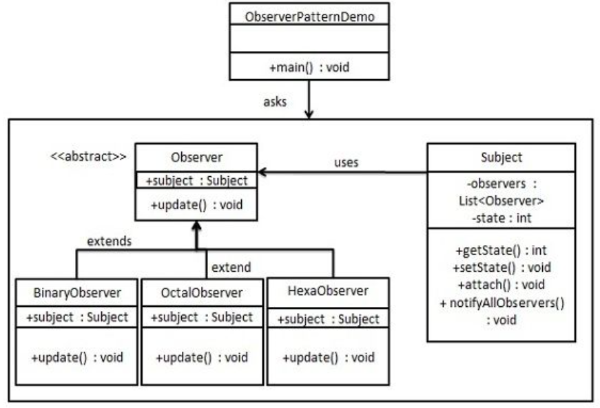

观察者模式
---

<!-- TOC -->

- [1. 观察者模式](#1-观察者模式)
  - [1.1. 关键代码](#11-关键代码)
  - [1.2. 优点](#12-优点)
  - [1.3. 缺点](#13-缺点)
  - [1.4. 使用场景](#14-使用场景)
  - [1.5. 注意事项](#15-注意事项)
- [2. 代码实现](#2-代码实现)
  - [2.1. 示例一：简单的观察模式](#21-示例一简单的观察模式)
    - [2.1.1. 类图](#211-类图)
    - [2.1.2. 代码实现](#212-代码实现)
  - [2.2. 使用java内置的观察者模式](#22-使用java内置的观察者模式)
    - [2.2.1. java内置的观察者模式的运行方式](#221-java内置的观察者模式的运行方式)
    - [2.2.2. 关于changed方法](#222-关于changed方法)

<!-- /TOC -->

# 1. 观察者模式
1. 观察者模式定义了对象之间的一对多依赖，当一个对象改变状态时，它的所有的依赖着都会受到通知并自动更新。属于行为型模式。
2. 解决问题:一个对象状态改变给其他对象通知，并且要考虑到易用和低耦合，保证高度的协作。

## 1.1. 关键代码
1. 在抽象类里有一个ArrayList存放观察者们。

## 1.2. 优点
1. 观察者和被观察者是抽象耦合的。
2. 建立一套触发机制。

## 1.3. 缺点
1. 如果一个被观察者对象有很多直接或间接的观察者，会导致所有的观察者都通知到需要花费时间。
2. 如果观察者和观察对象之间存在循环依赖的话，可能会导致系统崩溃

## 1.4. 使用场景
1. 一个抽象模型有两个方面，其中一个方面依赖于另一个方面。将这些方面封装在独立的对象中使它们可以各自独立地改变和复用。
2. 一个对象的改变将导致其他一个或多个对象也发生改变，而不知道具体有多少对象将发生改变，可以降低对象之间的耦合度。
3. 一个对象必须通知其他对象，而并不知道这些对象是谁。
4. 需要在系统中创建一个触发链，A对象的行为将影响B对象，B对象的行为将影响C对象……，可以使用观察者模式创建一种链式触发机制。

## 1.5. 注意事项
1. JAVA 中已经有了对观察者模式的支持类。
2. 避免循环引用。
3. 如果顺序执行，某一观察者错误会导致系统卡壳，一般采用异步方式。 

# 2. 代码实现

## 2.1. 示例一：简单的观察模式
- 观察者模式使用三个类 Subject、Observer 和 Client。Subject 对象带有绑定观察者到 Client 对象和从 Client 对象解绑观察者的方法。我们创建 Subject 类、Observer 抽象类和扩展了抽象类 Observer 的实体类。
- ObserverPatternDemo，我们的演示类使用 Subject 和实体类对象来演示观察者模式。

### 2.1.1. 类图


### 2.1.2. 代码实现
1. 创建 Subject 类。
```java
import java.util.ArrayList;
import java.util.List;
public class Subject {
    private List<Observer> observers = new ArrayList<Observer>();
    private int state;
    
    public int getState() {
        return state;
    }
    public void setState(int state) {
        this.state = state;
        notifyAllObservers();
    }
    public void attach(Observer observer){
        observers.add(observer);      
    }
    public void notifyAllObservers(){
        for (Observer observer : observers) {
            observer.update();
        }
    }  
}
```
2. 创建 Observer 类。
```java
public abstract class Observer {
    protected Subject subject;
    public abstract void update();
}
```
3. 创建实体观察者类。
```java
public class BinaryObserver extends Observer{
    public BinaryObserver(Subject subject){
        this.subject = subject;
        this.subject.attach(this);
    }
    @Override
    public void update() {
        System.out.println( "Binary String: " 
        + Integer.toBinaryString( subject.getState() ) ); 
    }
}
public class OctalObserver extends Observer{
    public OctalObserver(Subject subject){
        this.subject = subject;
        this.subject.attach(this);
    }
    @Override
    public void update() {
        System.out.println( "Octal String: " 
        + Integer.toOctalString( subject.getState() ) ); 
    }
}
public class HexaObserver extends Observer{
    public HexaObserver(Subject subject){
        this.subject = subject;
        this.subject.attach(this);
    }
    @Override
    public void update() {
        System.out.println( "Hex String: " 
        + Integer.toHexString( subject.getState() ).toUpperCase() ); 
    }
}
```
4. 使用 Subject 和实体观察者对象。
```java
public class ObserverPatternDemo {
    public static void main(String[] args) {
        Subject subject = new Subject();
        new HexaObserver(subject);
        new OctalObserver(subject);
        new BinaryObserver(subject);
        System.out.println("First state change: 15");   
        subject.setState(15);
        System.out.println("Second state change: 10");  
        subject.setState(10);
    }
}
```

## 2.2. 使用java内置的观察者模式
1. 到目前为止，java的API中已经内置了Observer接口与Observable类，甚至可以直接使用push和pull的方式来传送数据。
2. 内置的观察者模式是有问题的，只有Observable类，不符合面向接口编程。

### 2.2.1. java内置的观察者模式的运行方式
1. 将对象变化为观察者:调用任何Observable的addObserver()方法，不想当观察者只需要deleteOberver()。
2. 观察者送出通知:利用扩展java.util.Observable接口产生相关观察者类
    1. 调用setChanged()方法,标记状态已经改变的事实
    2. 然后调用两种notifyObserver()的一种:notifyObserver()||notifyObserver(Object arg)
3. 更新方法:update(Oberservable o, Object arg)

### 2.2.2. 关于changed方法
1. setChanged():设置改变
    + 可以主要变化就通知，也可以改变到一定程度再通知
2. clearChanged():消除change位上的true
3. hasChanged():告诉我现在changed标志的符号