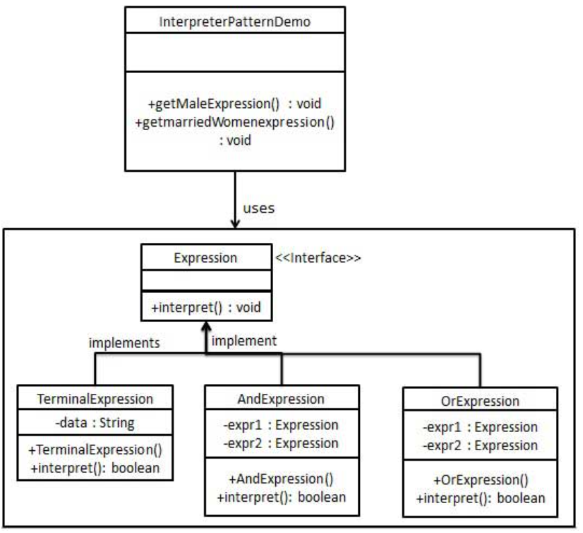

解释器模式
---
1. 解释器模式（Interpreter Pattern）提供了评估语言的语法或表达式的方式，它属于行为型模式。
2. 这种模式实现了一个表达式接口，该接口解释一个特定的上下文。这种模式被用在 SQL 解析、符号处理引擎等。

<!-- TOC -->

- [1. 解释器模式](#1-解释器模式)
  - [1.1. 关键代码](#11-关键代码)
  - [1.2. 优点](#12-优点)
  - [1.3. 缺点](#13-缺点)
  - [1.4. 用途](#14-用途)
- [2. 示例](#2-示例)
  - [2.1. 示例一](#21-示例一)
    - [2.1.1. 类图](#211-类图)
    - [2.1.2. 代码实现](#212-代码实现)

<!-- /TOC -->

# 1. 解释器模式
1. 意图:给定一个语言，定义它的文法表示，并定义一个解释器，这个解释器使用该表示来解释语言中的句子
2. 解决的问题:用一些固定的文法来解释一个句子的解释器
3. 使用场景:如果一种特定类型的问题发生的频率足够高，那么可能就值得将该问题的各个实例表述为一个简单语言中的句子。这样就可以构建一个解释器，该解释器通过解释这些句子来解决该问题。
4. 解决方法:构建语法树，定义终结符与非终结符。

## 1.1. 关键代码
- 构建环境类，包含解释器之外的一些全局信息，一般是HashMap

## 1.2. 优点
1. 可扩展性比较好，灵活。
2. 增加了新的解释表达式的方式。
3. 易于实现简单文法。

## 1.3. 缺点
1. 可利用场景比较少。
2. 对于复杂的文法比较难维护。
3. 解释器模式会引起类膨胀。
4. 解释器模式采用递归调用方法。

## 1.4. 用途
1. 当你实现一个简单的语言时，使用解释器。
2. 当你有一个简单的语法，并且简单比效率重要时，使用解释齐全。
3. 处理脚本语言和编程语言。

# 2. 示例

## 2.1. 示例一
- 我们将创建一个接口 Expression 和实现了 Expression 接口的实体类。定义作为上下文中主要解释器的 TerminalExpression 类。其他的类 OrExpression、AndExpression 用于创建组合式表达式。
- InterpreterPatternDemo，我们的演示类使用 Expression 类创建规则和演示表达式的解析。

### 2.1.1. 类图


### 2.1.2. 代码实现
1. 创建一个表达式接口。
```java
public interface Expression {
    public boolean interpret(String context);
}
```
2. 创建实现了上述接口的实体类。
```java
public class TerminalExpression implements Expression {
    private String data;
    public TerminalExpression(String data){
        this.data = data; 
    }
    @Override
    public boolean interpret(String context) {
        if(context.contains(data)){
            return true;
        }
        return false;
    }
}
public class OrExpression implements Expression {
    private Expression expr1 = null;
    private Expression expr2 = null;
    public OrExpression(Expression expr1, Expression expr2) { 
        this.expr1 = expr1;
        this.expr2 = expr2;
    }
    @Override
    public boolean interpret(String context) {      
        return expr1.interpret(context) || expr2.interpret(context);
    }
}
public class AndExpression implements Expression {
    private Expression expr1 = null;
    private Expression expr2 = null;
    public AndExpression(Expression expr1, Expression expr2) { 
        this.expr1 = expr1;
        this.expr2 = expr2;
    }
    @Override
    public boolean interpret(String context) {      
        return expr1.interpret(context) && expr2.interpret(context);
    }
}
```
3. InterpreterPatternDemo 使用 Expression 类来创建规则，并解析它们。
```java
public class InterpreterPatternDemo {
    //规则：Robert 和 John 是男性
    public static Expression getMaleExpression(){
        Expression robert = new TerminalExpression("Robert");
        Expression john = new TerminalExpression("John");
        return new OrExpression(robert, john);    
    }
    //规则：Julie 是一个已婚的女性
    public static Expression getMarriedWomanExpression(){
        Expression julie = new TerminalExpression("Julie");
        Expression married = new TerminalExpression("Married");
        return new AndExpression(julie, married);    
    }
    public static void main(String[] args) {
        Expression isMale = getMaleExpression();
        Expression isMarriedWoman = getMarriedWomanExpression();
    
        System.out.println("John is male? " + isMale.interpret("John"));
        System.out.println("Julie is a married women? " 
        + isMarriedWoman.interpret("Married Julie"));
    }
}
```