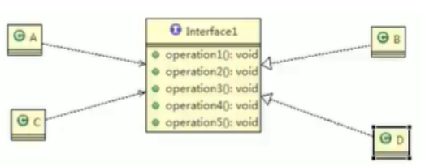
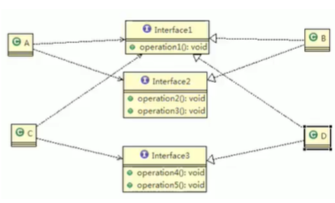

接口隔离原则
---

# 1. 接口隔离原则的内容
1. 客户端不应依赖它不需要的接口
2. 类间的依赖关系应该建立在最小的接口上
3. 不要在一个接口里面放很多的方法。
4. 接口应该尽量细化，一个接口对应一个功能模块，同时接口里面的方法应该尽可能的少，使接口更加灵活轻便。

# 2. 接口隔离原则和单一职责原则的不同
1. 单一职责原则是在业务逻辑上的划分，注重的是职责。
2. 接口隔离原则是基于接口设计考虑。例如一个接口的职责包含10个方法，这10个方法都放在同一接口中，并且提供给多个模块调用，但不同模块需要依赖的方法是不一样的，这时**模块为了实现自己的功能就不得不实现一些对其没有意义的方法**，这样的设计是不符合接口隔离原则的。
3. 接口隔离原则要求"尽量使用多个专门的接口"专门提供给不同的模块。

# 3. 例子

## 3.1. 解决鸭子问题
1. 在Duck类中加入两个实例变量
    1. 两个接口类型的变量
    2. 同时包含有两个具体实现这个两个行为的方法，在具体的鸭子类中。
        1. 通过之前的接口来实现
2. 在Duck的子类中，我们在构造方法中完成相应的具体的实例化
3. 具有动态行为的鸭子：
    1. 在鸭子子类中通过“设定方法”来设定鸭子的行为，而不是在鸭子的构造器内实例化。
    2. 在Duck类中加入两个新方法
    3. 建立一个鸭子模型：模型鸭：一开始是不会飞的
    4. 建立一个新的FlyBehavior类型：其中包含有相应的飞行的行为
