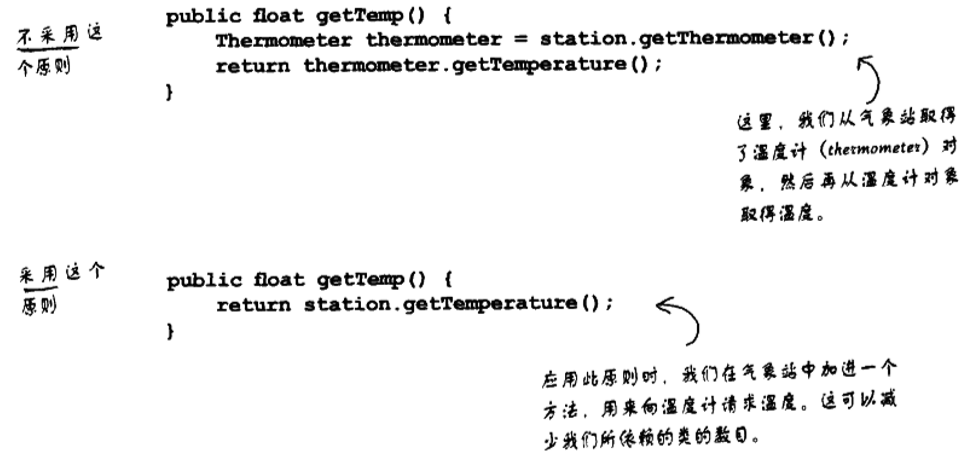

迪米特原则
---

# 1. 迪米特法则(LOD，最少知识原则)
1. 迪米特法则的定义是只与你的直接朋友交谈，不与"陌生人"说话。
2. 如果两个软件实体无须直接通信，那么就不应当发生直接的相互调用，可以通过**第三方**转发该应用。
3. 其目的是降低类之间的耦合度，提高模块的相对独立性。

## 1.1. 迪米特法则中的朋友
1. 当前对象本身
2. 当前对象的成员对象
3. 当前对象所创建的对象
4. 当前对象的方法参数等

## 1.2. 迪米特法则的关系
- 上述这些对象存在关联、聚合或组合关系，可以直接访问这些对象的方法。

## 1.3. 迪米特法则的优点
1. 降低类之间的耦合度，提高模块的相对独立性。
2. 由于亲和度降低，从而提高了类的可复用率和系统的扩展性。

## 1.4. 迪米特法则的缺点
- 过度使用迪米特法则会使系统产生大量的中介类，从而增加系统的复杂性，使模块之间的通信效率降低。所以，在釆用迪米特法则时需要反复权衡，确保高内聚和低耦合的同时，保证系统的结构清晰。

## 1.5. 迪米特法则的注意
1. 在类的划分上，应该创建**弱耦合**的类。类与类之间的耦合越弱，就越有利于实现可复用的目标。
2. 在类的结构设计上，尽量**降低**类成员的访问权限。
3. 在类的设计上，优先考虑将一个类设置成不变类。
4. 在对其他类的引用上，将引用其他对象的次数降到最低。
5. 不暴露类的属性成员，而应该提供相应的访问器（set 和 get 方法）。
6. 谨慎使用序列化（Serializable）功能。

# 2. 具体代码的实现

## 2.1. 实例:经纪人
```java
public class Program{
    private static void Main(string[] args){
        Agent agent = new Agent();
        agent.setStar(new Star("蔡徐坤"));
        agent.setFans(new Fans("小明"));
        agent.setCompany(new Company("**公司"));
        agent.meeting();
        agent.business();
    }
}
public class Agent{
    private Star myStar;
    private Fans myFans;
    private Company myCompany;

    public void setStar(Star myStar){this.myStar = myStar;}
    public void setFans(Fans myFans){this.myFans = myFans;}
    public void setCompany(Company myCompany){this.myCompany = myCompany;}
    public void meeting(){System.out.println(myFans.getName() + "与明星" + myStar.getName() + "见面了。");}
    public void business(){System.out.println(myCompany.getName() +"与明星" + myStar.getName() +"洽谈业务。")}
}
public class Star{
    private string name;
    public Star(string name){this.name = name;}
    public string getName(){return this.name;}
}
public class Company{
    private string name;
    public Company(string name){this.name = name;}
    public string getName(){return this.name;}
}
public class Fans{
    private string name;
    public Fans(string name){this.name = name;}
    public string getName(){return this.name;}
}
```
## 2.2. 例子:对比不同的两种情况


# 3. 最少知识原则弊端
1. 虽然这个原则有力的减少了对象之间的依赖，但是这个原则依旧会导致软件“包装”类的增加。