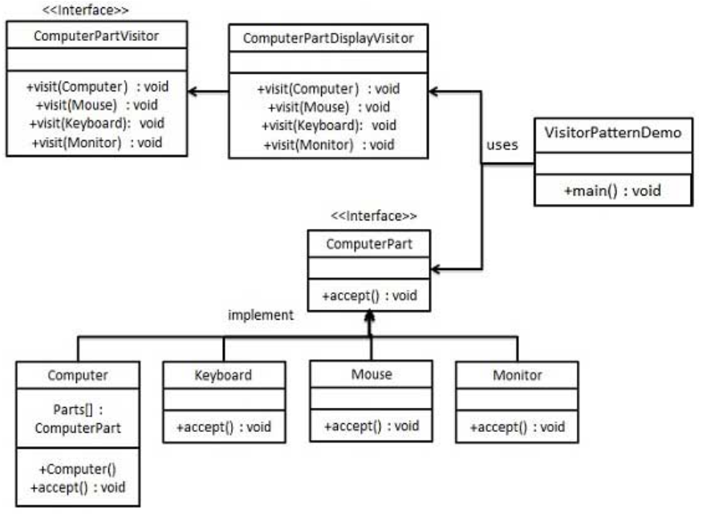

访问者模式
---
1. 当你想要为一个对象的组合增加新的能力，且**封装并不重要**时，就使用访问者模式。
2. 我们使用了一个访问者类，它改变了元素类的执行算法。通过这种方式，元素的执行算法可以随着访问者改变而改变。这种类型的设计模式属于行为型模式。
3. 根据模式，元素对象已接受访问者对象，这样访问者对象就可以处理元素对象上的操作。

<!-- TOC -->

- [1. 访问者模式](#1-访问者模式)
  - [1.1. 如何解决以及关键代码](#11-如何解决以及关键代码)
  - [1.2. 优点](#12-优点)
  - [1.3. 缺点:](#13-缺点)
  - [1.4. 使用场景和实例](#14-使用场景和实例)
  - [1.5. 注意事项](#15-注意事项)
- [2. 示例](#2-示例)
  - [2.1. 实例一:UI](#21-实例一ui)
    - [2.1.1. 类图](#211-类图)
    - [2.1.2. 代码实现](#212-代码实现)

<!-- /TOC -->

# 1. 访问者模式
- 意图:主要将数据结构与数据操作分离。
- 解决的问题:稳定的数据结构和易变的操作耦合问题。
- 使用场景:需要对一个对象结构中的对象进行很多不同的并且不相关的操作，而需要避免让这些操作"污染"这些对象的类，使用访问者模式将这些封装到类中。

## 1.1. 如何解决以及关键代码
- 如何解决:在被访问的类的内部添加一个对外部提供接待访问者的接口
- 关键代码:在数据基础类里面有一个方法接受受访者，将自身引用传入访问者

## 1.2. 优点
1. 灵活性
2. 可扩展性
3. 符合单一职责原则

## 1.3. 缺点:
1. 因为游走的功能牵涉其中，所以对组合结构的改变就更加困难。
2. 当采用访问者模式的时候，就会打破组合类的封装，违反迪米特原则。
3. 违反依赖倒置原则。

## 1.4. 使用场景和实例
- 实例:您在朋友家做客，您是访问者，朋友接受您的访问，您通过朋友的描述，然后对朋友的描述做出一个判断，这就是访问者模式。
- 使用场景
  1. 对象结构中对象对应的类很少改变，但经常需要在此对象结构上定义新的操作。
  2. 需要对一个对象结构中的对象进行很多不同的并且不相关的操作，而需要避免让这些操作"污染"这些对象的类，也不希望在增加新操作时修改这些类。

## 1.5. 注意事项
- 访问者可以对功能进行统一，可以做报表、UI、拦截器与过滤器。

# 2. 示例

## 2.1. 实例一:UI
- 我们将创建一个定义接受操作的 ComputerPart 接口。Keyboard、Mouse、Monitor 和 Computer 是实现了 ComputerPart 接口的实体类。我们将定义另一个接口 ComputerPartVisitor，它定义了访问者类的操作。Computer 使用实体访问者来执行相应的动作。
- VisitorPatternDemo，我们的演示类使用 Computer、ComputerPartVisitor 类来演示访问者模式的用法。

### 2.1.1. 类图


### 2.1.2. 代码实现
1. 定义一个表示元素的接口。
```java
public interface ComputerPart {
    public void accept(ComputerPartVisitor computerPartVisitor);
}
```
2. 创建扩展了上述类的实体类。
```java
public class Keyboard  implements ComputerPart {
    @Override
    public void accept(ComputerPartVisitor computerPartVisitor) {
        computerPartVisitor.visit(this);
    }
}
public class Monitor  implements ComputerPart {
    @Override
    public void accept(ComputerPartVisitor computerPartVisitor) {
        computerPartVisitor.visit(this);
    }
}
public class Mouse  implements ComputerPart {
    @Override
    public void accept(ComputerPartVisitor computerPartVisitor) {
        computerPartVisitor.visit(this);
    }
}
public class Computer implements ComputerPart {
    ComputerPart[] parts;
    public Computer(){
        parts = new ComputerPart[] {new Mouse(), new Keyboard(), new Monitor()};      
    } 
    
    @Override
    public void accept(ComputerPartVisitor computerPartVisitor) {
        for (int i = 0; i < parts.length; i++) {
            parts[i].accept(computerPartVisitor);
        }
        computerPartVisitor.visit(this);
    }
}
```
3. 定义一个表示访问者的接口。
```java
public interface ComputerPartVisitor {
    public void visit(Computer computer);
    public void visit(Mouse mouse);
    public void visit(Keyboard keyboard);
    public void visit(Monitor monitor);
}
```
4. 创建实现了上述类的实体访问者。
```java
public class ComputerPartDisplayVisitor implements ComputerPartVisitor {
    @Override
    public void visit(Computer computer) {
        System.out.println("Displaying Computer.");
    }
    @Override
    public void visit(Mouse mouse) {
        System.out.println("Displaying Mouse.");
    }
    @Override
    public void visit(Keyboard keyboard) {
        System.out.println("Displaying Keyboard.");
    }
    @Override
    public void visit(Monitor monitor) {
        System.out.println("Displaying Monitor.");
    }
}
```
5. 使用 ComputerPartDisplayVisitor 来显示 Computer 的组成部分。
```java
public class VisitorPatternDemo {
    public static void main(String[] args) {
        ComputerPart computer = new Computer();
        computer.accept(new ComputerPartDisplayVisitor());
    }
}
```