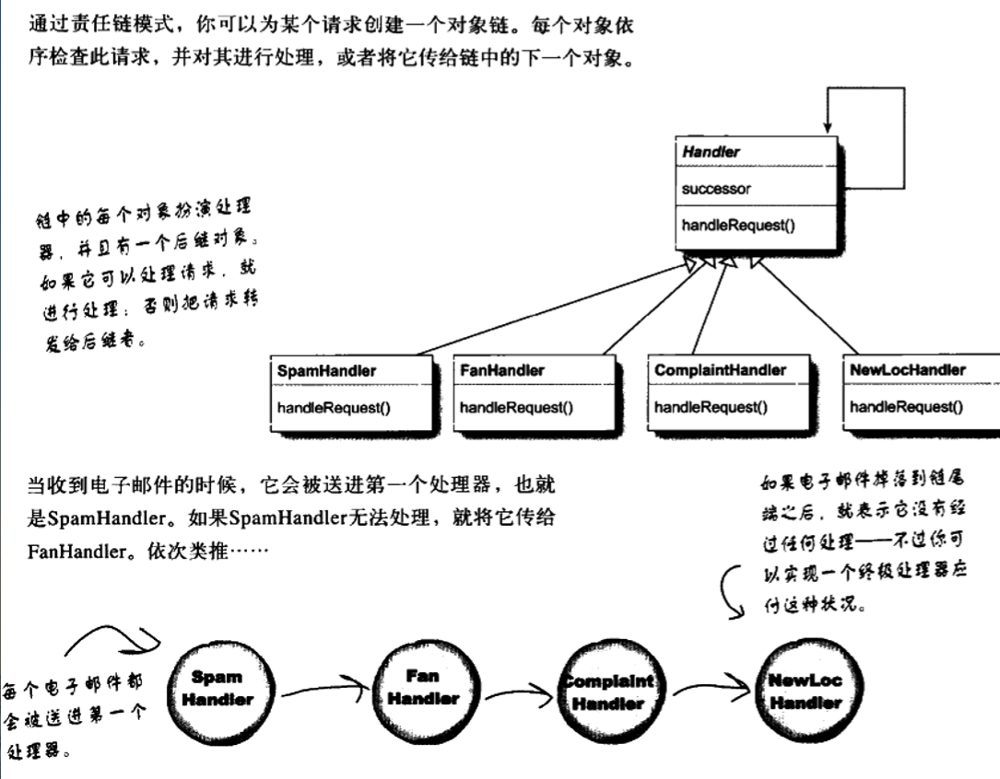
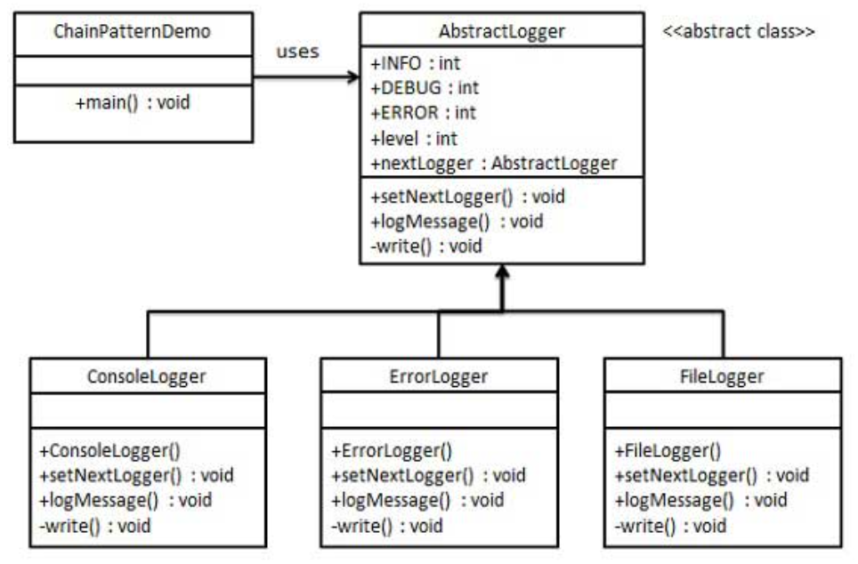

责任链模式
---
1. 将相应的对象传入处理器，如果这个处理器不能处理，那么传入下一个处理器。

<!-- TOC -->

- [1. 责任链模式](#1-责任链模式)
  - [1.1. 责任链模式定义](#11-责任链模式定义)
  - [1.2. 解决方案](#12-解决方案)
  - [1.3. 关键代码](#13-关键代码)
  - [1.4. 应用实例](#14-应用实例)
  - [1.5. 优点](#15-优点)
  - [1.6. 缺点](#16-缺点)
  - [1.7. 用途](#17-用途)
- [2. 类图](#2-类图)
- [3. 代码实现](#3-代码实现)
  - [3.1. 类图](#31-类图)
  - [3.2. 实现过程](#32-实现过程)

<!-- /TOC -->

# 1. 责任链模式
- 避免请求发送者与接受者耦合在一起，让多个对象都有可能接受请求，让这些对象连接成一条链，并且沿着这条链请求。属于行为型模式。
- 基于请求的类型，对请求的发送者和接受者进行解耦。

## 1.1. 责任链模式定义
1. 意图：避免请求发送者与接受者耦合在一起，让多个对象都有可能接受请求，将这些对象连接成为一条链，并且沿着这条链传递请求，直到有对象处理它为止。
2. 解决问题:将请求顺序(具体实现)和行为解耦，调用者只要交给处理者就行。
3. 何时使用:处理信息时多道过滤

## 1.2. 解决方案
- 拦截的类都实现统一接口。

## 1.3. 关键代码
- Handler里面聚合它自己，在HandlerRequest里判断是否合适，如果为满足条件则向下传递，

## 1.4. 应用实例
1. JS的事件冒泡
2. Java Web中Apache Tomcat对Encoding的处理，Struts2的拦截器，jsp servlet的Filter

## 1.5. 优点
1. 将请求的发出者和接收者解耦。
2. 可以简化对象，因为它不需要知道链的结构。
3. 通过改变链内的成员或调动它们的次序，允许你动态地新增或者删除责任。

## 1.6. 缺点
1. 并不保证请求一定会被执行。
2. 可能不容易观察运行时的特点，有碍于除错。
3. 系统性能受到一定影响，并且代码调试时不太方便。

## 1.7. 用途
1. 经常用于在窗口系统中，处理鼠标和键盘之类的事情。

# 2. 类图


# 3. 代码实现
- 我们创建抽象类 AbstractLogger，带有详细的日志记录级别。然后我们创建三种类型的记录器，都扩展了 AbstractLogger。每个记录器消息的级别是否属于自己的级别，如果是则相应地打印出来，否则将不打印并把消息传给下一个记录器。

## 3.1. 类图


## 3.2. 实现过程
1. 创建抽象的记录器类。
```java
public abstract class AbstractLogger {
    public static int INFO = 1;
    public static int DEBUG = 2;
    public static int ERROR = 3;
    protected int level;
    //责任链中的下一个元素
    protected AbstractLogger nextLogger;
    public void setNextLogger(AbstractLogger nextLogger){
        this.nextLogger = nextLogger;
    }
    public void logMessage(int level, String message){
        if(this.level <= level){
            write(message);
        }
        if(nextLogger !=null){
            nextLogger.logMessage(level, message);
        }
    }
    abstract protected void write(String message);
}
```
2. 创建扩展了该记录器类的实体类。
```java
public class ConsoleLogger extends AbstractLogger {
    public ConsoleLogger(int level){
        this.level = level;
    }
    @Override
    protected void write(String message) {    
        System.out.println("Standard Console::Logger: " + message);
    }
}
public class ErrorLogger extends AbstractLogger {
    public ErrorLogger(int level){
        this.level = level;
    }
    @Override
    protected void write(String message) {    
        System.out.println("Error Console::Logger: " + message);
    }
}
public class FileLogger extends AbstractLogger {
    public FileLogger(int level){
        this.level = level;
    }
    @Override
    protected void write(String message) {    
        System.out.println("File::Logger: " + message);
    }
}
```
3. 创建不同类型的记录器。赋予它们不同的错误级别，并在每个记录器中设置下一个记录器。每个记录器中的下一个记录器代表的是链的一部分。
```java
public class ChainPatternDemo {
    private static AbstractLogger getChainOfLoggers(){
        AbstractLogger errorLogger = new ErrorLogger(AbstractLogger.ERROR);
        AbstractLogger fileLogger = new FileLogger(AbstractLogger.DEBUG);
        AbstractLogger consoleLogger = new ConsoleLogger(AbstractLogger.INFO);
        errorLogger.setNextLogger(fileLogger);
        fileLogger.setNextLogger(consoleLogger);
        return errorLogger;  
    }
    public static void main(String[] args) {
        AbstractLogger loggerChain = getChainOfLoggers();
        loggerChain.logMessage(AbstractLogger.INFO, "This is an information.");
        loggerChain.logMessage(AbstractLogger.DEBUG, 
            "This is a debug level information.");
        loggerChain.logMessage(AbstractLogger.ERROR, 
            "This is an error information.");
    }
}
```