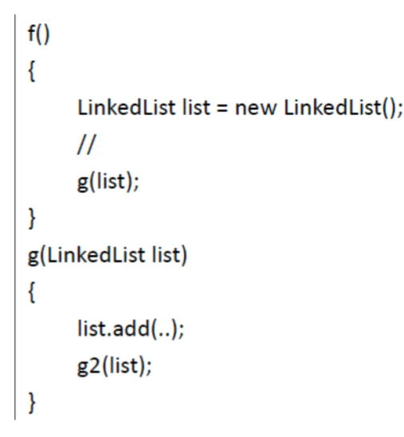
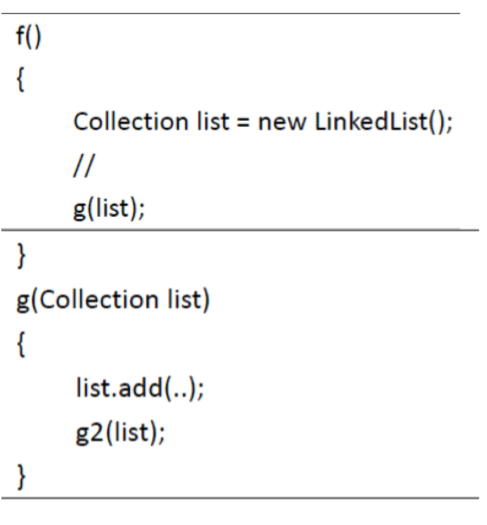
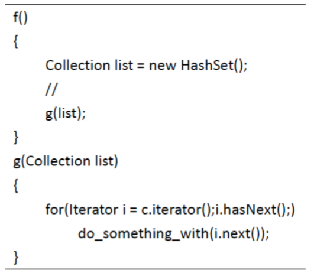
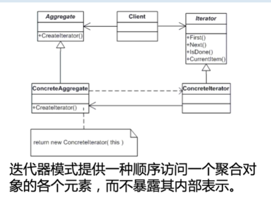
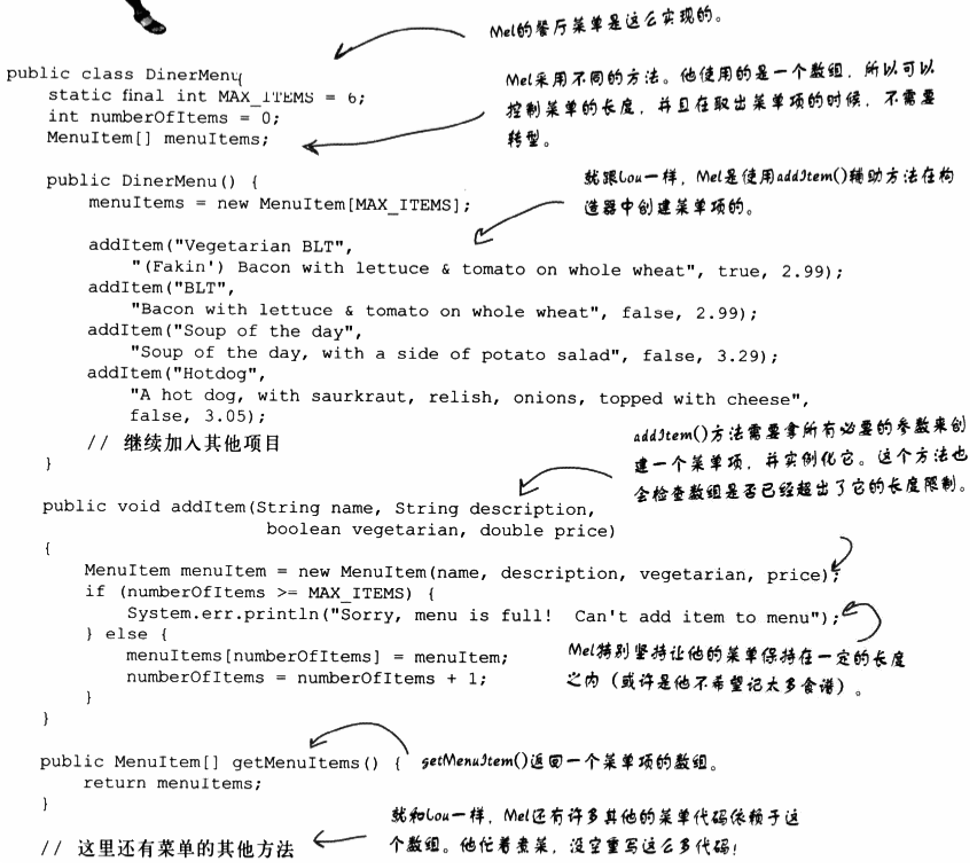
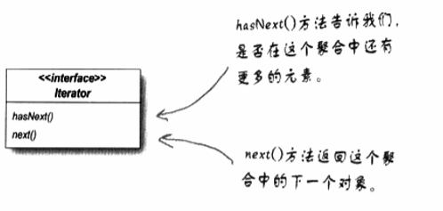
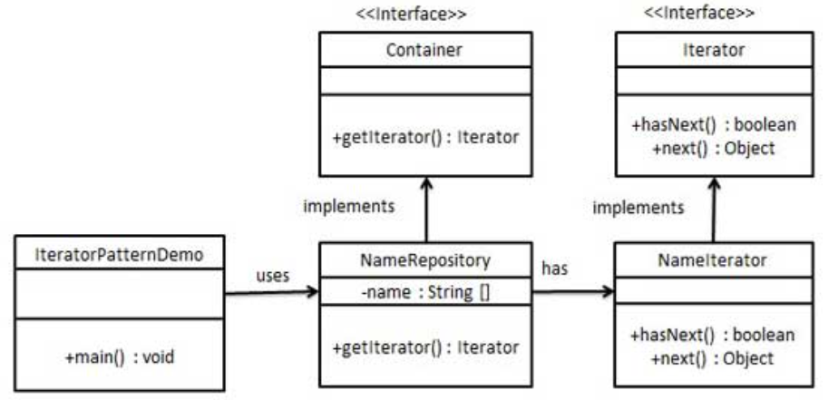
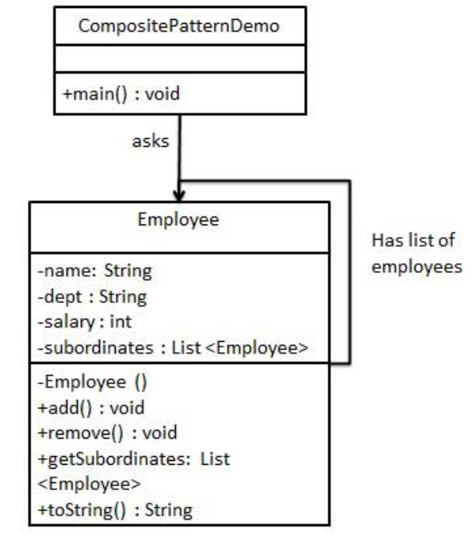

迭代器与组合模式
---
1. 迭代器与组合模式:用来管理对象的集合的封装。
2. 集合形式:数组、堆栈、列表或者散列表。

<!-- TOC -->

- [1. 迭代器引入](#1-迭代器引入)
  - [1.1. 典型问题一:我们需要对链表进行操作](#11-典型问题一我们需要对链表进行操作)
  - [1.2. 典型问题二:我们需要快速访问集合元素](#12-典型问题二我们需要快速访问集合元素)
  - [1.3. 典型问题三:替换成散列表](#13-典型问题三替换成散列表)
  - [1.4. 典型问题四:我们希望隐藏内部的具体实现](#14-典型问题四我们希望隐藏内部的具体实现)
  - [1.5. 设计分析](#15-设计分析)
  - [1.6. HeadFirst的迭代器模式的引入](#16-headfirst的迭代器模式的引入)
    - [1.6.1. 问题的内容](#161-问题的内容)
    - [1.6.2. 问题的解决:封装遍历](#162-问题的解决封装遍历)
- [2. 迭代器模式](#2-迭代器模式)
  - [2.1. 优点](#21-优点)
  - [2.2. 缺点](#22-缺点)
  - [2.3. 设计原则](#23-设计原则)
  - [2.4. 参与者](#24-参与者)
- [3. 迭代器模式示例](#3-迭代器模式示例)
  - [3.1. 实例一:菜单的实现](#31-实例一菜单的实现)
    - [3.1.1. 制造一个迭代器](#311-制造一个迭代器)
    - [3.1.2. 更新女招待菜单](#312-更新女招待菜单)
    - [3.1.3. 进一步优化迭代器模式](#313-进一步优化迭代器模式)
    - [3.1.4. 迭代器注意操作](#314-迭代器注意操作)
    - [3.1.5. 菜单的最终优化](#315-菜单的最终优化)
  - [3.2. 迭代器模式实例二:导航栏的实现](#32-迭代器模式实例二导航栏的实现)
    - [3.2.1. 导航栏类图](#321-导航栏类图)
    - [3.2.2. 导航栏代码实现](#322-导航栏代码实现)
- [4. 定义:迭代器模式](#4-定义迭代器模式)
  - [4.1. 迭代器的不同类型](#41-迭代器的不同类型)
    - [4.1.1. 内部的迭代器](#411-内部的迭代器)
    - [4.1.2. 外部的迭代器](#412-外部的迭代器)
  - [4.2. 迭代器的扩展使用方法](#42-迭代器的扩展使用方法)
  - [4.3. 迭代器与集合](#43-迭代器与集合)
  - [4.4. java5新特性:for语句](#44-java5新特性for语句)
- [5. 组合模式的引入](#5-组合模式的引入)
  - [5.1. 时机到了:我们要重构，目标是什么？](#51-时机到了我们要重构目标是什么)
  - [5.2. 如何具体进行重构呢？](#52-如何具体进行重构呢)
    - [5.2.1. 菜单符合组合模式的结构的类图](#521-菜单符合组合模式的结构的类图)
- [6. 组合模式(部分整体模式)](#6-组合模式部分整体模式)
  - [6.1. 组合模式关键代码的实现](#61-组合模式关键代码的实现)
  - [6.2. 组合模式的特点](#62-组合模式的特点)
  - [6.3. 组合模式的使用场景](#63-组合模式的使用场景)
  - [6.4. 组合模式应用实例](#64-组合模式应用实例)
  - [6.5. 组合模式的类图](#65-组合模式的类图)
  - [6.6. 组合模式注意点](#66-组合模式注意点)
  - [6.7. 问题:单一职责问题](#67-问题单一职责问题)
  - [6.8. 组合与迭代器](#68-组合与迭代器)
    - [6.8.1. CompositeIterator是什么？](#681-compositeiterator是什么)
  - [6.9. 空迭代器的实现](#69-空迭代器的实现)
    - [6.9.1. 空迭代器的实现](#691-空迭代器的实现)
    - [6.9.2. 确保女招待可以确切地告诉我们哪些项目是素食的方法。](#692-确保女招待可以确切地告诉我们哪些项目是素食的方法)
  - [6.10. 组合模式究竟实现了什么呢？](#610-组合模式究竟实现了什么呢)
  - [6.11. 具体的实例](#611-具体的实例)
    - [6.11.1. 代码实现](#6111-代码实现)

<!-- /TOC -->

# 1. 迭代器引入

## 1.1. 典型问题一:我们需要对链表进行操作


1. 在这样一个场景中，对于某个方法f()，可能需要调用g()。
2. g()有参数是一个链表集合的引用，并且完成对一个链表集合的操作。

## 1.2. 典型问题二:我们需要快速访问集合元素
1. 如果我们的需求发生改变，需要对这个集合进行快速的查询，这个时候用链表就不太合适了，用散列集合就更加合适。
2. g()的参数如果是某个具体的集合类型，灵活性就不足。所以，我们可以改为一个抽象的类型，比如Collection。



## 1.3. 典型问题三:替换成散列表
1. 如下所示，就可以很方便的替换为散列表。



## 1.4. 典型问题四:我们希望隐藏内部的具体实现
1. 对于g()的来说，往往可能只是希望挨个访问某个聚合结构。而且我们往往并不希望让g()知道到底是什么样的聚合结构，是LinkedList还是HashSet，是Collection还是Map。这个时候，迭代器模式就可以帮我们。
2. 此外，对于集合类型作为参数，我们可以对集合类的修改会直接修改原集合，从而使得我们通常意义上的所向往的“值传递”失效，所以，大大增强了耦合性。而这个问题，迭代器也可以帮我们解决。

## 1.5. 设计分析
1. 为了满足前面说的需求，其实我们只需要对遍历操作进行抽象。而对于遍历这件事情来说，主要有两个行为(抽象)
   1. 是否有下一个元素
   2. 得到下一个元素。所以，我们设计迭代器接口hasNext()和next()，分别对应与前面两个行为。有了这两个接口，就可以完成遍历操作。这样，g()的参数转换为一个迭代器的引用之后，就会具有更大的灵活性。
2. 迭代器提供的方法只提供了对集合的访问的方法，却屏蔽了对集合修改的方法，这样就对我们把集合作为参数可以做到对集合的“值传递”的效果。



## 1.6. HeadFirst的迭代器模式的引入
1. 不同类型的对象的集合如何通过封装内部结构进行管理？
2. 场景:很多代码依赖不同结构的数据存储
3. Lou的菜单实现(ArrayList的储存)


4. Mel的菜单实现(Array的实现)



### 1.6.1. 问题的内容
- ArrayList和Array之间不兼容
- 封装内部实现，实现无差异遍历。

### 1.6.2. 问题的解决:封装遍历
1. 变化:由不同的集合类型所造成的遍历，能不能够被我们封装。
2. 那么我们创建一个对象:将它称为迭代器，利用它来封装“遍历集合内的每个对象的过程”。
    + `Iterator iterator = breakfastMenu.createIterator();`
    + `while(iterator.hasNext()){MenuItem menuItem = (MenuItem)iterator.next()}`
3. 实现不同，但是外部暴露的迭代器是一致的。

# 2. 迭代器模式
1. 意图:提供一种方法顺序访问一个聚合对象中各个元素，而又无须暴露该对象的内部实现。属于行为型模式。
2. 解决思路:把在元素之间游走的责任交给迭代器，而不是聚合对象。
3. 迭代器的代码实现:



1. 所有具体的迭代器都实现了迭代器接口。
2. 使用场景:需要遍历一个一个不同类型的聚合对象。

## 2.1. 优点
1. 它支持以不同的方式遍历一个聚合对象。
2. 迭代器简化了聚合类。
3. 在同一个聚合上可以用多个遍历。
4. 在迭代器模式中，增加新的聚合类和迭代器类都很方便，无须修改原有代码。

## 2.2. 缺点
1. 由于迭代器模式将存储数据和遍历数据的职责分离，增加新的聚合类需要对应增加新的迭代器类，类的个数成对增加，这在一定程度上增加系统的复杂度。

## 2.3. 设计原则


使用的设计原则|解释
--|--
减少耦合|减少遍历的使用类和遍历的实现类直接的耦合
依赖倒置|遍历的使用类依赖的是策略的接口，而非遍历的实现类。

## 2.4. 参与者
1. 迭代器（Iterator）：迭代器定义访问和遍历元素的接口
2. 具体迭代器（ConcreteIterator）：具体迭代器实现迭代器接口。对该聚合遍历时跟踪当前位置。
3. 聚合（Aggregate）：聚合定义创建相应迭代器对象的接口。
4. 具体聚合（ConcreteAggregate）：具体聚合实现创建相应迭代器的接口，该操作返回ConcreteIterator的一个适当的实例。

# 3. 迭代器模式示例

## 3.1. 实例一:菜单的实现

### 3.1.1. 制造一个迭代器
1. 首先定义迭代器接口


2. 实现相应的具体迭代器


3. 使用迭代器改写餐厅菜单


### 3.1.2. 更新女招待菜单
1. 修改其构造方法


2. 同时还进行封装，使用对外接口和对内接口的重载，防止信息泄露。


### 3.1.3. 进一步优化迭代器模式
1. 我们可以将煎饼屋菜单迭代器和餐厅菜单迭代器所扩展的接口，由我们自己的迭代器模式更新成java.util的迭代器或者ArrayList的迭代器。
2. 使用相应的对象的Iterator操作:并且改写部分remove操作


### 3.1.4. 迭代器注意操作
1. 同时在迭代器中的remove()也是可以被禁用。
2. **注意**:多个迭代器引用同一个对象集合，在多线程中的后果是难以预料的。

### 3.1.5. 菜单的最终优化
1. 我们将具体的菜单改成Menu接口


2. 相应的菜单类都实现了Menu接口，女接待可以利用接口(而不是具体类)引用每一个菜单对象。


## 3.2. 迭代器模式实例二:导航栏的实现
- 我们将创建一个叙述导航方法的 Iterator 接口和一个返回迭代器的 Container 接口。实现了 Container 接口的实体类将负责实现 Iterator 接口。
- IteratorPatternDemo，我们的演示类使用实体类 NamesRepository 来打印 NamesRepository 中存储为集合的 Names。

### 3.2.1. 导航栏类图


### 3.2.2. 导航栏代码实现
1. 创建接口
```java
public interface Iterator {
   public boolean hasNext();
   public Object next();
}
public interface Container {
   public Iterator getIterator();
}
```
2. 创建实现了 Container 接口的实体类。该类有实现了 Iterator 接口的内部类 NameIterator。
```java
public class NameRepository implements Container {
    public String names[] = {"Robert" , "John" ,"Julie" , "Lora"};
    @Override
    public Iterator getIterator() {
            return new NameIterator();
    }
    private class NameIterator implements Iterator {
        int index;
        @Override
        public boolean hasNext() {
            if(index < names.length){
                return true;
            }
            return false;
        }
        @Override
        public Object next() {
            if(this.hasNext()){
                return names[index++];
            }
            return null;
        }     
    }
}
```
3. 使用 NameRepository 来获取迭代器，并打印名字。
```java
public class IteratorPatternDemo {
    public static void main(String[] args) {
        NameRepository namesRepository = new NameRepository();
    
        for(Iterator iter = namesRepository.getIterator(); iter.hasNext();){
            String name = (String)iter.next();
            System.out.println("Name : " + name);
        }  
    }
}
```

# 4. 定义:迭代器模式
1. **迭代器模式**提供一种方法顺序访问一个聚合对象中的各个元素，而又不暴露其内部的表示。
2. 把游走的任务放在迭代器上，而不是聚合上，这样简化了聚合的接口和实现，也让责任各得其所。

## 4.1. 迭代器的不同类型

### 4.1.1. 内部的迭代器
1. 内部的迭代器是由迭代器自己控制进行游走。

### 4.1.2. 外部的迭代器
1. 外部的迭代器是由客户控制迭代过程。

## 4.2. 迭代器的扩展使用方法
1. 迭代器不仅仅可以向后遍历，还可以向前遍历。
2. 对于散列表也是可以进行存取，因为迭代器没有先后顺序只是取得所有元素而已。
3. Enumeration(枚举)接口实现了迭代器:枚举接口是一个有次序的迭代器实现。大多数的java类都是支持迭代器的。

## 4.3. 迭代器与集合
1. 我们所使用的这些类都属于`Java Collection Framework`的一部分，这其中的`Framework`中指的是一群类和接口，其中包括了`ArrayList`等很多具体的类。
2. 除此以外上面的所有类，都实现了`java.Collection`类。

## 4.4. java5新特性:for语句
1. `for(<T> x:m)`直接避免了我们显式地使用遍历器。
2. 但是我们需要使用java 5的泛型来保证for/in的类型安全。

# 5. 组合模式的引入
1. 女招待重复的调用Print等语句实在是过于繁琐。所以我们想要将其进行解耦。
2. 那么我们可以把整套操作封装到原来获取迭代器的部分上，但是接下来我们如果想要添加子菜单就没有办法。

## 5.1. 时机到了:我们要重构，目标是什么？
1. 我们需要某种树形结构能够容纳菜单、子菜单和菜单项。
2. 我们需要确定能够在每个菜单的各个项之间游走，而且至少像现在使用迭代器一样方便。
3. 我们也需要能够更有弹性地在菜单项之间游走。

## 5.2. 如何具体进行重构呢？

### 5.2.1. 菜单符合组合模式的结构的类图


1. 那么我们怎么修正print方法呢?使用print()操作，用递归的方法完成。


# 6. 组合模式(部分整体模式)
1. 用来把一组相似的对象当做一个单一的对象。使用统一修改的方式进行修改。
2. 组合模式根据树形结构来组合对象，用来表示部分以及整体层次，这种类型部分以及整体层次。属于结构型模式，创建了对象组的树形结构。
3. 模式创建了一个包含自己对象组的类，这个类包含修改相同对象组的方式。

## 6.1. 组合模式关键代码的实现
1. 树枝内部组合该接口
2. 接口有内部属性List，里面放Component

## 6.2. 组合模式的特点
1. 组合模式让我们能用树形方式来创建对象的结构，树里面包含了组合以及个别对象。
2. 使用组合结构在大多数情况下，我们可以忽略对象组合和个别对象之间的差别。

## 6.3. 组合模式的使用场景
1. 表示对象的部分-整体(树形结构)
2. 希望用户忽略组合对象与单个对象的不同，用户将统一的使用组合结构中的所有对象。

## 6.4. 组合模式应用实例
1. 算术表达式包括操作数、操作符和另一个操作数，其中，另一个操作符也可以是操作数、操作符和另一个操作数。
2. 在 JAVA AWT 和 SWING 中，对于 Button 和 Checkbox 是树叶，Container 是树枝。 

## 6.5. 组合模式的类图


## 6.6. 组合模式注意点
1. 组件、组合、树:
    + 组合包含组件
    + 组件有两种:组合、叶节点。
2. 如果有些从接口中继承的方法不得不实现，但是有不应该被具体实现，我们可以考虑抛出运行时异常:`UnsupportedOperationException`

## 6.7. 问题:单一职责问题
1. 为什么组合模式不仅仅需要管理层次结构，还要执行菜单的操作,这是否不符合单一责任原则？
- 组合模式以单一设计原则换取透明性。透明性是指通过让组件的接口同时包含一些子节点和叶节点的操作。
- 这是设计原则和具体实现之间一个折衷的抉择

## 6.8. 组合与迭代器
1. 我们的目的是想要实现一个组合迭代器，那么我们需要为每个组件都加上createIterator()方法。


### 6.8.1. CompositeIterator是什么？
1. CompositeIterator是一个不可小觑的迭代器，其工作是遍历组件内的菜单项，并且确保所有的子菜单都被包括进来。
2. 使用栈空间来保存各组件的Iterator


1. 上面的迭代器是外部迭代器，所以有许多需要追踪的事情，外部迭代器必须维护它在遍历中的位置，以便于外部客户可以通过相应的方法来访问它。

## 6.9. 空迭代器的实现
1. 菜单项中没什么可以遍历的，那么我们返回什么呢？
    + 选项一:null，但是这就需要在客户代码中处理这个问题
    + 选项二:返回一个迭代器，而这个迭代器的hasNext()永远返回false，那么这个迭代器我们称为空迭代器。

### 6.9.1. 空迭代器的实现


### 6.9.2. 确保女招待可以确切地告诉我们哪些项目是素食的方法。


1. 但是有人认为try/catch是一种错误处理的方法而不是程序逻辑的方法，那么如果不这么做的话，我们还有哪些选择呢？
    + 在调用is()方法前，使用instanceOf来检查菜单组件的运行时类型，来确定具体类型。

## 6.10. 组合模式究竟实现了什么呢？
1. 实现了管理有数个对象的集合，它们彼此之间有"整体/部分"的关系。
2. 组件会有一个指向父亲的指针，保证在游走的时候更容易。
3. 要考虑孩子的次序，就需要用更加复杂的又游走方式来进行。
4. 考虑缓存，当组合结构很复杂，或者遍历的代价太高，那么实现组合节点的缓存就很有帮助。

## 6.11. 具体的实例
- 我们有一个类 Employee，该类被当作组合模型类。CompositePatternDemo，我们的演示类使用 Employee 类来添加部门层次结构，并打印所有员工。



### 6.11.1. 代码实现
1. 创建 Employee 类，该类带有 Employee 对象的列表。
```java
import java.util.ArrayList;
import java.util.List;
public class Employee {
    private String name;
    private String dept;
    private int salary;
    private List<Employee> subordinates;
    //构造函数
    public Employee(String name,String dept, int sal) {
        this.name = name;
        this.dept = dept;
        this.salary = sal;
        subordinates = new ArrayList<Employee>();
    }
    public void add(Employee e) {
        subordinates.add(e);
    }
    public void remove(Employee e) {
        subordinates.remove(e);
    }
    public List<Employee> getSubordinates(){
        return subordinates;
    }
    public String toString(){
        return ("Employee :[ Name : "+ name 
        +", dept : "+ dept + ", salary :"
        + salary+" ]");
    }   
}
```
2. 使用 Employee 类来创建和打印员工的层次结构。
```java
public class CompositePatternDemo {
    public static void main(String[] args) {
        Employee CEO = new Employee("John","CEO", 30000);
    
        Employee headSales = new Employee("Robert","Head Sales", 20000);
    
        Employee headMarketing = new Employee("Michel","Head Marketing", 20000);
    
        Employee clerk1 = new Employee("Laura","Marketing", 10000);
        Employee clerk2 = new Employee("Bob","Marketing", 10000);
    
        Employee salesExecutive1 = new Employee("Richard","Sales", 10000);
        Employee salesExecutive2 = new Employee("Rob","Sales", 10000);
    
        CEO.add(headSales);
        CEO.add(headMarketing);
    
        headSales.add(salesExecutive1);
        headSales.add(salesExecutive2);
    
        headMarketing.add(clerk1);
        headMarketing.add(clerk2);
    
        //打印该组织的所有员工
        System.out.println(CEO); 
        for (Employee headEmployee : CEO.getSubordinates()) {
            System.out.println(headEmployee);
            for (Employee employee : headEmployee.getSubordinates()) {
                System.out.println(employee);
            }
        }        
    }
}
```